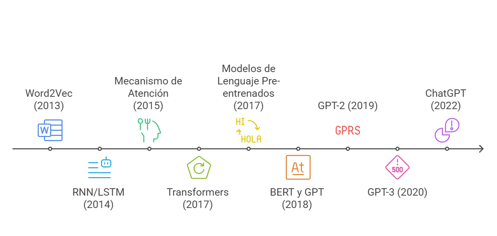

##  {background-color="#0F2044" background-image="images/blocks/portada.png" background-opacity="0.18" data-state="no-logo"}

::: {style="display: flex; justify-content: center; align-items: center; height: 70vh; flex-direction: column; text-align: center;"}
[Programa de Talleres de Inteligencia Artificial Generativa]{style="font-size: 0.9em; color: #4A9FD4; text-transform: uppercase;"}

[Fundamentos de IA Generativa y su Aplicación a la Docencia]{style="font-size: 2.1em; font-weight: bold; color: white; line-height: 1.15; max-width: 1200px;"}

[ChatGPT · Claude · Prompting · Diseño instruccional · Evaluación · Retroalimentación]{style="font-size: 0.95em; color: #C9A84C; margin-top: 1em;"}

[Martes 25 de agosto · 14:30 a 16:30]{style="font-size: 0.8em; color: #D9E2EC; margin-top: 1.4em;"}
:::

------------------------------------------------------------------------

## Con qué se va a ir de aquí

<br>

Este taller es **de trabajo**, no de exposición. Al final de las dos horas usted tendrá cinco productos propios, escritos por usted, sobre su asignatura real.

```{=html}
<div style="display:grid; grid-template-columns:repeat(5,1fr); gap:0.8rem; margin-top:1.2rem;">
  <div class="kit-card"><span class="kit-num">1</span><strong>Prompt maestro</strong>Su plantilla personal de prompting, reutilizable en cualquier tarea docente.</div>
  <div class="kit-card"><span class="kit-num">2</span><strong>Meta + actividad</strong>Un resultado de aprendizaje observable con su evidencia de logro.</div>
  <div class="kit-card"><span class="kit-num">3</span><strong>Rúbrica borrador</strong>Un instrumento evaluativo con criterios y niveles revisados por usted.</div>
  <div class="kit-card"><span class="kit-num">4</span><strong>Retroalimentación</strong>Un comentario formativo auditado, sin invenciones.</div>
  <div class="kit-card kit-card--grupo"><span class="kit-num">5</span><strong>Lienzo de alineación</strong>Construido en grupo: la cadena completa de una unidad.</div>
</div>
```

::: callout-note
Traiga a mano una asignatura, unidad o evaluación concreta. Todas las actividades se hacen sobre ese material.
:::

------------------------------------------------------------------------

## Ruta de dos horas

| Hora | Bloque | Qué hacemos | Producto |
|---|---|---|---|
| 14:30 · 10 min | **0 · Encuadre** | Acuerdo de trabajo y uso responsable | Criterios mínimos |
| 14:40 · 15 min | **1 · Fundamentos** | Cómo funciona un modelo; ChatGPT y Claude | Elegir herramienta según tarea |
| 14:55 · 25 min | **2 · Prompting** | Anatomía del prompt + **Actividad 1** | Prompt maestro |
| 15:20 · 5 min | *Pausa* | | |
| 15:25 · 15 min | **3 · Diseño instruccional** | Alineación constructiva + **Actividad 2** | Meta observable |
| 15:40 · 15 min | **4 · Evaluación** | Rúbricas y rediseño de tareas + **Actividad 3** | Rúbrica borrador |
| 15:55 · 10 min | **5 · Retroalimentación** | Demostración guiada en vivo | Comentario formativo |
| 16:05 · 20 min | **6 · Clínica en grupo** | **Actividad colectiva** y revisión cruzada | Lienzo de alineación |
| 16:25 · 5 min | **Cierre** | Kit del taller y siguiente paso | Los 5 productos |

::: callout-tip
Al final hay un **anexo** con material de profundización: glosario, texto modelo de política de curso, errores frecuentes y prompts adicionales. No se revisa en la sesión; queda para después.
:::

------------------------------------------------------------------------

##  {background-color="#0F2044" background-image="images/blocks/bloque0-encuadre.png" background-opacity="0.20" data-state="no-logo"}

::: {style="display:flex; justify-content:center; align-items:center; height:70vh; flex-direction:column; text-align:center;"}
[Bloque 0 · 10 minutos]{style="font-size:0.9em; color:#4A9FD4; text-transform:uppercase; letter-spacing:0.1em;"}

[Encuadre y uso responsable]{style="font-size:2.2em; font-weight:bold; color:white; margin-top:0.4em;"}

[¿Bajo qué reglas vamos a trabajar hoy?]{style="font-size:0.95em; color:#C9A84C; margin-top:1.2em;"}
:::

------------------------------------------------------------------------

## Propósito del programa

::::: columns
::: {.column width="58%"}
<br>

Fortalecer en la comunidad académica de la UTFSM el uso **efectivo y responsable** de herramientas de inteligencia artificial generativa.

El foco está en desarrollar competencias de:

- **prompting** para formular mejores instrucciones;
- **análisis** para revisar, comparar y mejorar respuestas;
- **automatización** para apoyar tareas docentes, investigativas y de productividad;
- **uso responsable** alineado con los lineamientos institucionales.
:::

::: {.column width="42%"}
<br>

```{=html}
<div style="background:#0F2044; border-radius:10px; padding:1.4rem; color:white; font-size:0.78em;">
  <div style="color:#C9A84C; font-size:1.1em; margin-bottom:1rem; text-align:center;">Marco del taller</div>
  <div style="background:#1A3A6B; padding:0.65rem; border-radius:6px; margin-bottom:0.55rem;">Docencia <span style="color:#C9A84C;">← hoy</span></div>
  <div style="background:#1A3A6B; padding:0.65rem; border-radius:6px; margin-bottom:0.55rem;">Investigación</div>
  <div style="background:#1A3A6B; padding:0.65rem; border-radius:6px; margin-bottom:0.55rem;">Productividad diaria</div>
  <div style="background:#274C77; padding:0.65rem; border-radius:6px; color:#C9A84C;">Uso responsable y criterio académico</div>
</div>
```
:::
:::::

------------------------------------------------------------------------

## Objetivo del taller

<br>

Comprender los fundamentos del funcionamiento de los modelos de lenguaje, como **ChatGPT** y **Claude**, y desarrollar habilidades de **prompting efectivo** aplicadas a:

::::: columns
::: {.column width="55%"}
- diseño instruccional;
- definición de metas de aprendizaje;
- evaluación para el aprendizaje;
- retroalimentación a estudiantes;
- uso responsable de IA generativa en contextos universitarios.
:::

::: {.column width="45%"}
{width="62%" fig-align="center"}
:::
:::::

::: callout-note
La IA no reemplaza el juicio docente. Amplifica la capacidad de diseñar, contrastar, adaptar y revisar materiales cuando se usa con propósito claro.
:::

------------------------------------------------------------------------

## Acuerdo de trabajo

<br>

Durante el taller vamos a usar IA generativa como **copiloto**, no como autoridad final.

::::: columns
::: {.column width="50%"}
### Sí

- Pedir borradores y alternativas.
- Comparar enfoques.
- Adaptar lenguaje a distintos públicos.
- Mejorar claridad, coherencia y criterios.
- Revisar sesgos, vacíos o ambigüedades.
:::

::: {.column width="50%"}
### Cuidado

- Subir datos personales o sensibles.
- Delegar decisiones académicas críticas.
- Aceptar respuestas sin verificar.
- Usar rúbricas o feedback genérico.
- Ocultar uso cuando corresponde transparentarlo.
:::
:::::

------------------------------------------------------------------------

## Cuatro preguntas antes de usar IA

<br>

::::: columns
::: {.column width="25%"}
### Datos

¿Estoy compartiendo información sensible, personal o evaluativa?
:::

::: {.column width="25%"}
### Transparencia

¿Debo declarar que usé IA o pedir que estudiantes lo declaren?
:::

::: {.column width="25%"}
### Verificación

¿Cómo comprobaré exactitud, pertinencia y sesgos?
:::

::: {.column width="25%"}
### Propósito

¿La IA mejora el aprendizaje o solo acelera una tarea?
:::
:::::

<br>

::: callout-important
Regla práctica para hoy: **nada de nombres, notas, correos ni informes de estudiantes reales** en las herramientas. Trabaje con casos anonimizados o inventados.
:::

------------------------------------------------------------------------

## Discusión inicial · 3 minutos

::::: columns
::: {.column width="60%"}
<br>

Converse con quien tenga al lado:

1. ¿Ha usado IA generativa en alguna tarea docente este semestre?
2. ¿Qué resultado le sirvió y qué resultado tuvo que descartar?
3. ¿Cuál es hoy su principal duda o reparo?

<br>

Recogemos dos o tres respuestas en voz alta antes de continuar.
:::

::: {.column width="40%"}
{width="85%" fig-align="center"}
:::
:::::

------------------------------------------------------------------------

##  {background-color="#0F2044" background-image="images/blocks/bloque1-fundamentos.png" background-opacity="0.20" data-state="no-logo"}

::: {style="display:flex; justify-content:center; align-items:center; height:70vh; flex-direction:column; text-align:center;"}
[Bloque 1 · 15 minutos]{style="font-size:0.9em; color:#4A9FD4; text-transform:uppercase; letter-spacing:0.1em;"}

[Fundamentos de IA generativa]{style="font-size:2.2em; font-weight:bold; color:white; margin-top:0.4em;"}

[¿Qué hace realmente un modelo de lenguaje?]{style="font-size:0.95em; color:#C9A84C; margin-top:1.2em;"}
:::

------------------------------------------------------------------------

## ¿Qué es la IA generativa?

::::: columns
::: {.column width="58%"}
<br>

La IA generativa **crea contenido nuevo** a partir de patrones aprendidos en grandes volúmenes de datos.

En docencia, eso se traduce en borradores de:

- planificaciones y secuencias de clase;
- preguntas, casos y ejercicios;
- rúbricas y criterios de evaluación;
- retroalimentación para estudiantes;
- explicaciones adaptadas a distintos niveles.
:::

::: {.column width="42%"}
<br>

```{=html}
<div style="background:#0F2044; border-radius:10px; padding:1.4rem; color:white; font-size:0.78em;">
  <div style="color:#4A9FD4; margin-bottom:0.8rem;">Entrada</div>
  <div style="background:#1A3A6B; padding:0.65rem; border-radius:6px;">"Diseña una actividad para enseñar derivadas..."</div>
  <div style="text-align:center; color:#C9A84C; margin:0.8rem;">↓</div>
  <div style="color:#4A9FD4; margin-bottom:0.8rem;">Modelo de lenguaje</div>
  <div style="background:#1A3A6B; padding:0.65rem; border-radius:6px;">Predice una respuesta probable según el contexto.</div>
  <div style="text-align:center; color:#C9A84C; margin:0.8rem;">↓</div>
  <div style="background:#274C77; padding:0.65rem; border-radius:6px;">Propuesta editable, <strong>no verdad final</strong>.</div>
</div>
```
:::
:::::

------------------------------------------------------------------------

## No apareció de la nada

{width="80%" fig-align="center"}

::: callout-note
Detrás de ChatGPT y Claude hay una década de investigación en procesamiento de lenguaje. Lo nuevo no es la tecnología: es que hoy se usa escribiendo en español, sin programar.
:::

------------------------------------------------------------------------

## Cómo funcionan los modelos de lenguaje

::::: columns
::: {.column width="60%"}
<br>

Un modelo de lenguaje no "sabe" en el sentido humano. Aprende patrones y **predice la continuación más plausible** de un texto.

- Divide el texto en **tokens**.
- Usa el contexto para estimar qué token sigue.
- Produce respuestas coherentes porque aprendió regularidades del lenguaje.
- Puede equivocarse con seguridad aparente.
- Su calidad depende de la instrucción, el contexto y la verificación posterior.
:::

::: {.column width="40%"}
<br>

{width="80%" fig-align="center"}
:::
:::::

::: callout-important
La respuesta de un modelo debe leerse como un **borrador sofisticado**. El criterio académico sigue siendo humano.
:::

------------------------------------------------------------------------

## Tres consecuencias prácticas

<br>

::::: columns
::: {.column width="33%"}
### Alucina

Puede inventar citas, autores, normas o datos con total naturalidad.

**Qué hacer:** pedir que distinga entre lo que sabe y lo que infiere; verificar todo dato duro.
:::

::: {.column width="33%"}
### Depende del contexto

Sin contexto responde al promedio: genérico, plano, aplicable a cualquiera.

**Qué hacer:** entregar curso, nivel, duración, restricciones y ejemplos propios.
:::

::: {.column width="33%"}
### No tiene criterio

No sabe qué es relevante para *su* asignatura ni para *sus* estudiantes.

**Qué hacer:** definir usted los criterios y usar la IA para desarrollarlos, no para elegirlos.
:::
:::::

------------------------------------------------------------------------

## Cómo se ve una alucinación en docencia

<br>

No aparecen como errores evidentes. Aparecen como texto correcto, bien redactado y falso.

| Lo que usted pide | Lo que puede recibir | Cómo detectarlo |
|---|---|---|
| "Cita tres estudios sobre aprendizaje activo en ingeniería" | Autores reales, título verosímil, revista real, artículo inexistente | Buscar el título entre comillas; verificar el DOI |
| "¿Qué dice el reglamento de evaluación de la Universidad?" | Un resumen plausible de un reglamento genérico | Contrastar con el documento institucional real |
| "Resume este paper" (sin adjuntarlo) | Un resumen del *tema*, no del texto | Adjuntar el archivo y pedir cita textual por afirmación |
| "¿Cuántos estudiantes reprueban Cálculo I?" | Una cifra concreta e inventada | Ninguna cifra institucional debe venir del modelo |

::: callout-warning
La señal de alerta no es que la respuesta suene rara. Es que suene **demasiado bien** para algo que usted no le entregó.
:::

------------------------------------------------------------------------

## La ventana de contexto

::::: columns
::: {.column width="58%"}
<br>

El modelo solo "ve" lo que está en la conversación actual: sus mensajes, sus archivos adjuntos y sus respuestas previas.

Consecuencias prácticas:

- **Una conversación por tarea.** Mezclar temas degrada las respuestas.
- **Lo importante, al principio y al final** del mensaje: es donde mejor lo atiende.
- **Las conversaciones muy largas se degradan**: conviene resumir y reabrir.
- **No aprende de usted entre sesiones**, salvo que la herramienta tenga memoria activada y usted haya revisado qué guarda.
:::

::: {.column width="42%"}
<br>

```{=html}
<div style="background:#0F2044; border-radius:10px; padding:1.3rem; color:white; font-size:0.74em;">
  <div style="color:#C9A84C; text-align:center; margin-bottom:0.9rem;">Qué entra en la respuesta</div>
  <div style="background:#1A3A6B; padding:0.6rem; border-radius:6px; margin-bottom:0.5rem;">Su instrucción de ahora</div>
  <div style="background:#1A3A6B; padding:0.6rem; border-radius:6px; margin-bottom:0.5rem;">Los archivos que adjuntó</div>
  <div style="background:#1A3A6B; padding:0.6rem; border-radius:6px; margin-bottom:0.5rem;">El historial de esta conversación</div>
  <div style="background:#1A3A6B; padding:0.6rem; border-radius:6px; margin-bottom:0.5rem;">Patrones aprendidos en su entrenamiento</div>
  <div style="background:#7A2E2E; padding:0.6rem; border-radius:6px;">✗ Su syllabus, si no lo adjuntó</div>
</div>
```
:::
:::::

------------------------------------------------------------------------

## La misma pregunta, dos respuestas distintas

::::: columns
::: {.column width="55%"}
<br>

Los modelos son **probabilísticos**: la misma instrucción puede producir respuestas diferentes en dos ejecuciones.

Esto tiene tres implicancias directas en docencia:

- **No sirve como corrector automático**: dos estudiantes equivalentes podrían recibir juicios distintos.
- **Sí sirve para explorar**: ejecutar dos o tres veces le muestra el espacio de opciones.
- **Obliga a fijar criterios propios**: si el criterio lo pone usted, la variabilidad deja de ser un problema.
:::

::: {.column width="45%"}
<br>

::: callout-tip
Técnica útil: ejecute el mismo prompt **tres veces** y quédese con lo que aparece en las tres. Eso suele ser lo robusto; el resto es ruido o invención.
:::

::: callout-note
Y al revés: si necesita reproducibilidad exacta (una rúbrica estable, un formato fijo), no dependa del modelo. Fije el texto y guárdelo.
:::
:::
:::::

------------------------------------------------------------------------

## ChatGPT y Claude

::::: columns
::: {.column width="50%"}
{width="14%" fig-align="left"}

### ChatGPT

- Bueno para ideación, síntesis y explicación.
- Útil para iterar prompts y transformar formatos.
- Muy práctico para tareas estructuradas.
- Puede apoyar análisis, escritura y programación.
:::

::: {.column width="50%"}
{width="14%" fig-align="left"}

### Claude

- Fuerte en lectura y trabajo con documentos extensos.
- Buen estilo para redacción, revisión y argumentación.
- Útil para comparar criterios y detectar inconsistencias.
- Suele ser cómodo para trabajo reflexivo y académico.
:::
:::::

::: callout-note
La elección no parte por la herramienta. Parte por la tarea: ¿quiero explorar, diseñar, evaluar, resumir, transformar o revisar?
:::

------------------------------------------------------------------------

## Qué herramienta para qué tarea docente

| Tarea docente | Punto de partida sugerido | Por qué |
|---|---|---|
| Lluvia de ideas para una actividad | ChatGPT | Genera variedad rápido |
| Revisar un programa o syllabus extenso | Claude | Maneja bien documentos largos |
| Redactar una rúbrica desde cero | Cualquiera | Depende más del prompt que del modelo |
| Reescribir retroalimentación con mejor tono | Claude | Buen control de registro y matiz |
| Convertir apuntes en tabla o pauta | ChatGPT | Transformación de formatos |
| Contrastar dos versiones de un instrumento | Claude | Detecta inconsistencias entre textos |

::: callout-tip
Práctica recomendada: para decisiones importantes, haga la **misma** pregunta en ambas y compare. Las diferencias entre respuestas suelen mostrarle qué estaba mal especificado en su prompt.
:::

------------------------------------------------------------------------

##  {background-color="#0F2044" background-image="images/blocks/bloque2-prompting.png" background-opacity="0.20" data-state="no-logo"}

::: {style="display:flex; justify-content:center; align-items:center; height:70vh; flex-direction:column; text-align:center;"}
[Bloque 2 · 25 minutos]{style="font-size:0.9em; color:#4A9FD4; text-transform:uppercase; letter-spacing:0.1em;"}

[Prompting efectivo]{style="font-size:2.2em; font-weight:bold; color:white; margin-top:0.4em;"}

[Producto de este bloque: su prompt maestro]{style="font-size:0.95em; color:#C9A84C; margin-top:1.2em;"}
:::

------------------------------------------------------------------------

## Anatomía de un buen prompt

<br>

Un prompt efectivo **reduce ambigüedad**. Cuatro piezas ayudan mucho:

::::: columns
::: {.column width="25%"}
### Contexto

Curso, nivel, público, restricciones, materiales disponibles.
:::

::: {.column width="25%"}
### Rol

Qué perspectiva debe adoptar la IA: docente, revisor, diseñador instruccional.
:::

::: {.column width="25%"}
### Tarea

Qué debe producir o resolver, con límites claros.
:::

::: {.column width="25%"}
### Formato

Tabla, lista, rúbrica, pauta, correo, guía o matriz.
:::
:::::

<br>

::: callout-tip
Si tuviera que quedarse con una sola: **contexto**. Es la diferencia entre una respuesta para "un docente cualquiera" y una respuesta para su curso.
:::

------------------------------------------------------------------------

## Prompt débil vs. prompt útil

::::: columns
::: {.column width="45%"}
### Débil

```text
Haz una clase sobre aprendizaje activo.
```

Problemas:

- no define público;
- no define duración;
- no define resultado;
- no pide evidencia de alineación;
- no especifica formato.
:::

::: {.column width="55%"}
### Útil

```text
Actúa como diseñador instruccional universitario.
Necesito planificar una clase de 90 minutos para estudiantes
de primer año de ingeniería sobre aprendizaje activo.

Propón una secuencia con apertura, actividad central,
cierre y evaluación formativa. Incluye tiempos, propósito
pedagógico, instrucciones para estudiantes y criterios
para observar participación.

Entrega la respuesta en una tabla.
```
:::
:::::

------------------------------------------------------------------------

## Plantilla base de prompting {.prompt-slide}

```text
Actúa como [rol].

Contexto:
- Curso:
- Nivel de estudiantes:
- Duración:
- Tema:
- Restricciones:

Tarea:
Necesito que [acción concreta].

Criterios:
- Debe estar alineado con [meta / resultado].
- Debe ser aplicable en [modalidad].
- Debe considerar [condición relevante].

Formato de salida:
Entrega [tabla / lista / rúbrica / pauta] con [columnas o secciones].

Antes de responder, pregunta si falta información crítica.
```

------------------------------------------------------------------------

## Cuatro movimientos que suben la calidad

<br>

Un prompt no se escribe: se **itera**. Estas cuatro frases funcionan casi siempre:

::::: columns
::: {.column width="50%"}
### 1 · Pedir preguntas antes de la respuesta

```text
Antes de responder, hazme las 3 preguntas
cuya respuesta más cambiaría tu propuesta.
```

### 2 · Pedir alternativas contrastantes

```text
Dame 3 versiones con enfoques distintos
y explica en una línea cuándo conviene cada una.
```
:::

::: {.column width="50%"}
### 3 · Pedir autocrítica

```text
Revisa tu propia propuesta: ¿qué supuestos hiciste,
qué podría fallar con estudiantes reales
y qué le falta para ser aplicable el lunes?
```

### 4 · Pedir el rastro de decisiones

```text
Marca qué partes provienen de mi contexto
y cuáles inventaste o asumiste.
```
:::
:::::

------------------------------------------------------------------------

## Mostrar el estándar, no solo describirlo

::::: columns
::: {.column width="50%"}
<br>

Describir lo que quiere funciona. **Mostrar un ejemplo** funciona mucho mejor: el modelo imita estructura, extensión, tono y nivel de detalle.

Sirve especialmente cuando usted ya tiene material que le gusta:

- una pregunta de examen bien redactada;
- un criterio de rúbrica que sí discrimina;
- un comentario de retroalimentación modelo;
- una guía de laboratorio con el formato del departamento.
:::

::: {.column width="50%"}
```text
Voy a mostrarte un ejemplo del estilo que necesito.

EJEMPLO (así deben verse los resultados):
"Calcula el momento flector máximo de una viga
simplemente apoyada, justificando el método elegido
y comparando el resultado con una estimación previa."

Ahora genera 5 preguntas equivalentes para la unidad
de [tema], manteniendo:
- el mismo nivel de exigencia cognitiva;
- la misma extensión;
- la estructura "acción + justificación + contraste".

No cambies el formato del ejemplo.
```
:::
:::::

------------------------------------------------------------------------

## Errores frecuentes de prompting

| Síntoma en la respuesta | Causa probable | Cómo se arregla |
|---|---|---|
| Suena bien pero es genérica | Falta contexto de curso y nivel | Agregar asignatura, año, tamaño, restricciones |
| No sirve para su realidad | Faltan las restricciones reales | Declarar sala, tiempo, recursos, conocimientos previos |
| Demasiado larga e inmanejable | No se fijó extensión ni formato | Pedir tabla, número de filas y límite de palabras |
| Inventa datos o normas | Se pidió información que usted no entregó | Adjuntar la fuente o prohibir explícitamente inferir |
| Cada intento cambia todo | Prompt ambiguo, muchos grados de libertad | Fijar estructura y dar un ejemplo del formato |
| Correcta pero superficial | No se pidió profundidad ni justificación | Pedir supuestos, criterios y autocrítica |

------------------------------------------------------------------------

## Actividad 1 · su prompt maestro

::::: columns
::: {.column width="62%"}
[**12 minutos** · individual o en parejas]{.tiempo}

1. Elija **una tarea docente real** de las próximas dos semanas. *(1 min)*
2. Escriba un prompt inicial, como le salga. *(2 min)*
3. Reescríbalo con la plantilla: rol, contexto, tarea, criterios, formato. *(4 min)*
4. Ejecútelo en ChatGPT o Claude. *(2 min)*
5. Aplique **un** movimiento de mejora y vuelva a ejecutar. *(2 min)*
6. Marque en la respuesta: qué **acepta**, qué **edita**, qué **descarta**. *(1 min)*

::: callout-tip
La mejora no está en que la IA responda "bonito". Está en que la respuesta sea usable, revisable y alineada con su intención docente.
:::
:::

::: {.column width="38%"}
```{=html}
<div class="producto-box">
  <div class="producto-titulo">Producto 1</div>
  <p><strong>Prompt maestro personal</strong></p>
  <p>Guárdelo en un documento de texto. Va a reutilizarlo en las actividades siguientes, en la clínica grupal y en el Taller 2.</p>
  <hr>
  <div class="producto-titulo">Criterio de logro</div>
  <p>Otra persona de su departamento debería poder ejecutar su prompt y obtener algo utilizable, sin explicaciones adicionales.</p>
</div>
```
:::
:::::

------------------------------------------------------------------------

## Puesta en común · 3 minutos

<br>

Dos o tres participantes comparten:

- la tarea docente elegida;
- **qué cambió** entre la primera y la segunda respuesta;
- qué tuvieron que descartar y por qué.

<br>

::: callout-note
Lo que descartamos es tan informativo como lo que aceptamos: muestra dónde el modelo no tiene contexto suficiente sobre nuestro curso.
:::

------------------------------------------------------------------------

##  {background-color="#0F2044" background-image="images/blocks/pausa.png" background-opacity="0.22" data-state="no-logo"}

::: {style="display:flex; justify-content:center; align-items:center; height:70vh; flex-direction:column; text-align:center;"}
[Pausa · 5 minutos]{style="font-size:0.9em; color:#4A9FD4; text-transform:uppercase; letter-spacing:0.1em;"}

[15:20]{style="font-size:3.2em; font-weight:bold; color:white; margin-top:0.3em;"}

[Al volver: de los prompts al diseño de la unidad.]{style="font-size:0.9em; color:#C9A84C; margin-top:1.2em;"}
:::

------------------------------------------------------------------------

##  {background-color="#0F2044" background-image="images/blocks/bloque3-diseno.png" background-opacity="0.20" data-state="no-logo"}

::: {style="display:flex; justify-content:center; align-items:center; height:70vh; flex-direction:column; text-align:center;"}
[Bloque 3 · 15 minutos]{style="font-size:0.9em; color:#4A9FD4; text-transform:uppercase; letter-spacing:0.1em;"}

[Diseño instruccional con IA]{style="font-size:2.2em; font-weight:bold; color:white; margin-top:0.4em;"}

[De la meta de aprendizaje a la experiencia de aprendizaje]{style="font-size:0.95em; color:#C9A84C; margin-top:1.2em;"}
:::

------------------------------------------------------------------------

## El marco: alineación constructiva

::::: columns
::: {.column width="52%"}
<br>

Un diseño está **alineado** cuando lo que el estudiante hace, lo que se le pide demostrar y lo que se le califica apuntan al mismo resultado.

La IA es muy buena generando piezas sueltas y muy mala notando cuándo esas piezas dejaron de conversar entre sí. Por eso el orden importa:

**resultado → evidencia → actividad → criterio → retroalimentación**

Ese encadenamiento es exactamente el lienzo que construiremos en grupo al final del taller.
:::

::: {.column width="48%"}
```{=html}
<div style="background:#0F2044; border-radius:10px; padding:1.2rem; color:white; font-size:0.72em;">
  <div style="color:#C9A84C; text-align:center; margin-bottom:0.8rem; font-size:1.15em;">La cadena de alineación</div>
  <div style="background:#1A3A6B; padding:0.55rem; border-radius:6px;"><strong>Resultado</strong> · qué debe ser capaz de hacer</div>
  <div style="text-align:center; color:#4A9FD4;">↓</div>
  <div style="background:#1A3A6B; padding:0.55rem; border-radius:6px;"><strong>Evidencia</strong> · qué me lo demostraría</div>
  <div style="text-align:center; color:#4A9FD4;">↓</div>
  <div style="background:#1A3A6B; padding:0.55rem; border-radius:6px;"><strong>Actividad</strong> · qué hace para producirla</div>
  <div style="text-align:center; color:#4A9FD4;">↓</div>
  <div style="background:#1A3A6B; padding:0.55rem; border-radius:6px;"><strong>Criterio</strong> · con qué la juzgo</div>
  <div style="text-align:center; color:#4A9FD4;">↓</div>
  <div style="background:#274C77; padding:0.55rem; border-radius:6px; color:#C9A84C;"><strong>Retroalimentación</strong> · qué hace después</div>
</div>
```
:::
:::::

------------------------------------------------------------------------

## El flujo, y dónde entra la IA

::::: columns
::: {.column width="48%"}
<br>

La IA ayuda a pasar de una idea general a una experiencia organizada. Pero el orden importa: **primero la meta, después la actividad**.

1. Definir resultado o meta de aprendizaje.
2. Identificar evidencia de logro.
3. Diseñar actividad o experiencia.
4. Preparar instrucciones para estudiantes.
5. Crear criterios de evaluación.
6. Revisar coherencia entre todo lo anterior.
:::

::: {.column width="52%"}
```{=html}
<div style="background:#0F2044; border-radius:10px; padding:1.3rem; color:white; font-size:0.72em;">
  <div style="color:#C9A84C; text-align:center; margin-bottom:0.9rem; font-size:1.15em;">Quién hace qué</div>
  <table style="width:100%; border-collapse:collapse;">
    <tr><td style="padding:0.4rem 0.3rem; border-bottom:1px solid #274C77;">Decidir la meta</td><td style="padding:0.4rem; border-bottom:1px solid #274C77; color:#C9A84C;">Docente</td></tr>
    <tr><td style="padding:0.4rem 0.3rem; border-bottom:1px solid #274C77;">Redactarla de forma observable</td><td style="padding:0.4rem; border-bottom:1px solid #274C77; color:#4A9FD4;">IA + revisión</td></tr>
    <tr><td style="padding:0.4rem 0.3rem; border-bottom:1px solid #274C77;">Generar opciones de actividad</td><td style="padding:0.4rem; border-bottom:1px solid #274C77; color:#4A9FD4;">IA</td></tr>
    <tr><td style="padding:0.4rem 0.3rem; border-bottom:1px solid #274C77;">Elegir la actividad</td><td style="padding:0.4rem; border-bottom:1px solid #274C77; color:#C9A84C;">Docente</td></tr>
    <tr><td style="padding:0.4rem 0.3rem; border-bottom:1px solid #274C77;">Redactar instrucciones</td><td style="padding:0.4rem; border-bottom:1px solid #274C77; color:#4A9FD4;">IA + revisión</td></tr>
    <tr><td style="padding:0.4rem 0.3rem;">Validar coherencia final</td><td style="padding:0.4rem; color:#C9A84C;">Docente</td></tr>
  </table>
</div>
```
:::
:::::

------------------------------------------------------------------------

## De metas a experiencias

::::: columns
::: {.column width="48%"}
### Meta poco observable

> Comprender la ética de la inteligencia artificial.

*No se puede observar "comprender". No indica qué haría el estudiante para demostrarlo.*

### Meta más observable

> Analizar un caso de uso de IA identificando riesgos, actores afectados y medidas de mitigación.

*Verbo observable, objeto definido, evidencia implícita.*
:::

::: {.column width="52%"}
### Prompt de apoyo

```text
Actúa como diseñador instruccional universitario.

Transforma esta meta general en tres resultados de
aprendizaje observables para estudiantes de [nivel]
en [asignatura].

Meta:
"Comprender la ética de la inteligencia artificial".

Para cada resultado indica:
- verbo observable (evita "conocer", "comprender");
- evidencia de logro concreta;
- actividad breve que la produzca;
- error común que debo prevenir;
- cómo un estudiante podría "aprobar sin aprender".

Formato: tabla. Al final, señala cuál de los tres
resultados es más exigente y por qué.
```
:::
:::::

------------------------------------------------------------------------

## Verbos: el detalle que decide todo

<br>

::::: columns
::: {.column width="50%"}
### Evite

*No describen una conducta observable.*

- conocer, comprender, saber
- apreciar, valorar (sin producto asociado)
- familiarizarse con
- tener nociones de
- internalizar
:::

::: {.column width="50%"}
### Prefiera

*Producen evidencia que se puede recoger y juzgar.*

- identificar, clasificar, calcular
- comparar, contrastar, priorizar
- justificar, argumentar, refutar
- diseñar, modelar, implementar
- evaluar según criterio, decidir y defender
:::
:::::

::: callout-tip
Prueba rápida: si no puede completar la frase *"lo sabré porque el estudiante entregará, hará o mostrará…"*, el verbo todavía no sirve.
:::

------------------------------------------------------------------------

## Prompt reutilizable · secuencia de clase {.prompt-slide}

```text
Actúa como diseñador instruccional universitario con experiencia en ingeniería.

Contexto:
- Asignatura: [nombre] · Nivel: [año] · Tamaño del curso: [n]
- Modalidad: [presencial / híbrida / online] · Duración del bloque: [min]
- Resultado de aprendizaje: "[resultado observable]"
- Conocimientos previos reales de mis estudiantes: [lo que sí y lo que no dominan]
- Restricciones: [sala fija, sin laboratorio, sin internet, etc.]

Tarea:
Diseña la secuencia del bloque con apertura, desarrollo, cierre y evaluación formativa.

Para cada momento entrega: tiempo, qué hace el docente, qué hacen los estudiantes,
propósito pedagógico y evidencia observable de que está funcionando.

Criterios:
- Al menos dos momentos deben ser de trabajo activo del estudiante.
- Incluye un "plan B" si la actividad central toma más tiempo del previsto.
- Indica en qué punto un estudiante podría resolver la tarea con IA sin aprender,
  y cómo rediseñar ese punto.

Formato: tabla. Antes de responder, hazme las preguntas que falten para no asumir.
```

------------------------------------------------------------------------

## Actividad 2 · rediseñar una meta

::::: columns
::: {.column width="62%"}
[**8 minutos** · con su asignatura real]{.tiempo}

Tome una meta, contenido o unidad de su asignatura y, con apoyo de IA, produzca:

1. un **resultado de aprendizaje observable**;
2. la **evidencia de logro** que recogería;
3. una **actividad breve** que la produzca;
4. un **riesgo de mal uso de IA** en esa actividad.

Cierre revisando manualmente: *¿la actividad permite observar realmente el aprendizaje esperado?*

::: callout-note
Guarde esto: es uno de los insumos posibles para el trabajo grupal del último bloque.
:::
:::

::: {.column width="38%"}
```{=html}
<div class="producto-box">
  <div class="producto-titulo">Producto 2</div>
  <p><strong>Meta observable + evidencia + actividad</strong></p>
  <hr>
  <div class="producto-titulo">Chequeo rápido</div>
  <p>Si la evidencia de logro puede generarse completa con IA en dos minutos, la actividad necesita rediseño, no vigilancia.</p>
</div>
```
:::
:::::

------------------------------------------------------------------------

##  {background-color="#0F2044" background-image="images/blocks/bloque4-evaluacion.png" background-opacity="0.20" data-state="no-logo"}

::: {style="display:flex; justify-content:center; align-items:center; height:70vh; flex-direction:column; text-align:center;"}
[Bloque 4 · 15 minutos]{style="font-size:0.9em; color:#4A9FD4; text-transform:uppercase; letter-spacing:0.1em;"}

[Evaluación para el aprendizaje]{style="font-size:2.2em; font-weight:bold; color:white; margin-top:0.4em;"}

[Instrumentos y rúbricas con apoyo de IA]{style="font-size:0.95em; color:#C9A84C; margin-top:1.2em;"}
:::

------------------------------------------------------------------------

## Dónde ayuda y dónde no

::::: columns
::: {.column width="50%"}
### Sí ayuda

- Generar versiones iniciales de instrumentos.
- Redactar criterios y descriptores de rúbrica.
- Anticipar respuestas esperadas y errores típicos.
- Crear ejemplos de desempeño por nivel.
- Revisar si la evaluación mide lo que declara medir.
- Adaptar instrumentos a distintos niveles.
:::

::: {.column width="50%"}
### No conviene

- Calificar automáticamente sin supervisión.
- Decidir la aprobación o reprobación.
- Procesar entregas con datos identificables.
- Usar descriptores genéricos sin revisar.
- Delegar la ponderación de criterios.
:::
:::::

::: callout-warning
No conviene usar IA para calificar de forma automática sin supervisión, trazabilidad ni criterio docente.
:::

------------------------------------------------------------------------

## Rediseñar la tarea, antes que vigilarla

<br>

Si una IA resuelve la evaluación completa en dos minutos, el problema no es el estudiante: es el diseño de la tarea. Tres salidas que sí funcionan:

::::: columns
::: {.column width="33%"}
### Exigir proceso

Evaluar borradores, bitácoras, decisiones descartadas y versiones intermedias, no solo el producto final.

*Bajo costo, alta efectividad.*
:::

::: {.column width="33%"}
### Anclar al contexto local

Datos del propio laboratorio, del semestre en curso, de la ciudad, del proyecto del grupo.

*La IA no tiene ese material.*
:::

::: {.column width="33%"}
### Pedir defensa

Preguntas orales breves sobre el propio trabajo, o la fundamentación en clase de una decisión tomada.

*Distingue autoría real en minutos.*
:::
:::::

::: callout-tip
Cuarta vía, complementaria: **permitir la IA y evaluar su uso** — pedir el registro de prompts, la crítica de la respuesta y qué se corrigió. Se evalúa criterio, no obediencia.
:::

------------------------------------------------------------------------

## Prompt reutilizable · rúbrica analítica {.prompt-slide}

```text
Actúa como especialista en evaluación para el aprendizaje en educación superior.

Contexto:
- Instrumento: [presentación oral de 8 min / informe / proyecto / examen]
- Asignatura y nivel: [ ]
- Resultado de aprendizaje evaluado:
  "Comunicar una propuesta basada en evidencia, con argumento claro
   y uso adecuado de fuentes".
- Peso en la nota final: [ ] · Tiempo del que dispongo para corregir: [ ]

Tarea:
Diseña una rúbrica analítica de 4 criterios y 4 niveles de desempeño.

Condiciones:
- Cada descriptor debe ser observable: describe qué hace o produce el estudiante.
- Prohibido usar "bueno", "excelente", "adecuado" sin conducta observable asociada.
- La diferencia entre niveles debe estar en la evidencia, no en adverbios.
- Agrega una columna con una frase de retroalimentación tipo por nivel.

Control de calidad (inclúyelo al final):
1. ¿Qué criterio se solapa con otro y podría fusionarse?
2. ¿Qué aspecto del resultado de aprendizaje quedó sin evaluar?
3. ¿Qué sesgo podría introducir esta rúbrica contra algún perfil de estudiante?

Formato: tabla + las tres respuestas del control de calidad.
```

------------------------------------------------------------------------

## Actividad 3 · su instrumento evaluativo

::::: columns
::: {.column width="62%"}
[**8 minutos** · sobre una evaluación real]{.tiempo}

Elija una evaluación existente o futura y, con apoyo de IA:

1. redacte o mejore los **criterios**;
2. pida **ejemplos de desempeño** por nivel;
3. solicite una **revisión de alineación** con el resultado de aprendizaje;
4. identifique una posible **fuente de sesgo o ambigüedad**;
5. ajuste **manualmente** la versión final.

::: callout-tip
Truco de validación: pida a la IA que aplique su propia rúbrica a dos respuestas ficticias, una buena y una mediocre. Si no logra distinguirlas, los descriptores todavía no son observables.
:::
:::

::: {.column width="38%"}
```{=html}
<div class="producto-box">
  <div class="producto-titulo">Producto 3</div>
  <p><strong>Rúbrica borrador revisada</strong></p>
  <p>Con al menos un criterio reescrito por usted, no por la IA.</p>
  <hr>
  <div class="producto-titulo">Recordatorio</div>
  <p>Una rúbrica que usted no puede explicar en clase en dos minutos, tampoco le sirve al estudiante.</p>
</div>
```
:::
:::::

------------------------------------------------------------------------

##  {background-color="#0F2044" background-image="images/blocks/bloque5-retroalimentacion.png" background-opacity="0.20" data-state="no-logo"}

::: {style="display:flex; justify-content:center; align-items:center; height:70vh; flex-direction:column; text-align:center;"}
[Bloque 5 · 10 minutos]{style="font-size:0.9em; color:#4A9FD4; text-transform:uppercase; letter-spacing:0.1em;"}

[Retroalimentación del aprendizaje]{style="font-size:2.2em; font-weight:bold; color:white; margin-top:0.4em;"}

[Demostración guiada: la hacemos juntos en pantalla]{style="font-size:0.95em; color:#C9A84C; margin-top:1.2em;"}
:::

------------------------------------------------------------------------

## Qué hace útil a un comentario

::::: columns
::: {.column width="55%"}
<br>

Una buena retroalimentación no solo corrige. Le dice al estudiante **qué hacer después**.

La IA puede apoyar en:

- transformar observaciones sueltas en comentarios claros;
- ajustar tono y extensión;
- generar preguntas de mejora;
- separar fortalezas, brechas y próximos pasos;
- construir feedback para grupos con patrones comunes.
:::

::: {.column width="45%"}
<br>

```{=html}
<div style="background:#0F2044; border-radius:10px; padding:1.3rem; color:white; font-size:0.78em;">
  <div style="color:#C9A84C; text-align:center; margin-bottom:0.9rem;">La regla de oro</div>
  <div style="background:#1A3A6B; padding:0.7rem; border-radius:6px; margin-bottom:0.5rem;">Las <strong>observaciones</strong> las pone usted.</div>
  <div style="text-align:center; color:#4A9FD4; margin:0.5rem;">↓</div>
  <div style="background:#1A3A6B; padding:0.7rem; border-radius:6px; margin-bottom:0.5rem;">La <strong>redacción</strong> la apoya la IA.</div>
  <div style="text-align:center; color:#4A9FD4; margin:0.5rem;">↓</div>
  <div style="background:#274C77; padding:0.7rem; border-radius:6px; color:#C9A84C;">La <strong>revisión final</strong> vuelve a usted.</div>
</div>
```
:::
:::::

::: callout-warning
Si la IA agrega una observación que usted no hizo, es una invención sobre el trabajo de un estudiante. Elimínela.
:::

------------------------------------------------------------------------

## Prompt reutilizable · retroalimentación {.prompt-slide}

```text
Actúa como docente universitario que entrega retroalimentación formativa,
clara y respetuosa.

Contexto:
El estudiante entregó [tipo de trabajo] en [asignatura, nivel].
Es su [primera / segunda] entrega del semestre.

Mis observaciones (usa SOLO estas, no agregues nada):
- buena estructura general;
- falta justificar la elección metodológica;
- hay citas sin conexión con el argumento;
- la conclusión repite resultados, pero no interpreta.

Tarea:
Redacta una retroalimentación de máximo 180 palabras.

Condiciones:
- Tono constructivo, dirigido al trabajo y no a la persona.
- 2 fortalezas concretas y 3 acciones de mejora accionables antes de la próxima entrega.
- Cierra con una pregunta que invite al estudiante a revisar su propio razonamiento.
- No inventes información que no esté en mis observaciones.
- Marca con [!] cualquier punto donde te falte información mía.
```

------------------------------------------------------------------------

## Retroalimentación para el curso completo

::::: columns
::: {.column width="48%"}
<br>

Corregir 60 entregas y escribir 60 comentarios distintos no es sostenible. Pero los errores **se repiten**.

Estrategia de dos capas:

- un **comentario general** al curso, con los tres patrones más frecuentes y cómo corregirlos;
- un **comentario breve e individual**, de dos o tres líneas, con lo específico de cada trabajo.

La IA es especialmente útil en la primera capa.
:::

::: {.column width="52%"}
```text
Actúa como docente universitario.

Te entrego la lista de observaciones que anoté
al corregir 40 informes, sin nombres ni datos
de estudiantes:

[pegar lista de observaciones]

Tarea:
1. Agrupa las observaciones en los 3 patrones
   de error más frecuentes.
2. Para cada patrón redacta: en qué consiste,
   por qué ocurre y qué hacer distinto.
3. Propón un ejercicio de 10 minutos para
   trabajar el patrón más grave en la próxima clase.

Condiciones: no identifiques a nadie, ni siquiera
de forma indirecta. Máximo 400 palabras.
```
:::
:::::

------------------------------------------------------------------------

## Demostración guiada · en pantalla

<br>

Lo hacemos juntos, con un caso anónimo aportado por el grupo:

1. **Recolectamos** cuatro observaciones reales sobre un trabajo tipo. *(2 min)*
2. **Ejecutamos** el prompt de retroalimentación en pantalla. *(2 min)*
3. **Auditamos** la respuesta línea por línea: ¿qué afirmación no venía de las observaciones? *(3 min)*
4. **Reescribimos** dos frases a mano, en voz alta. *(3 min)*

::: callout-note
Producto 4 del kit: cada participante adapta este comentario a un estudiante propio después del taller.
:::

------------------------------------------------------------------------

##  {background-color="#0F2044" background-image="images/blocks/bloque6-clinica.png" background-opacity="0.20" data-state="no-logo"}

::: {style="display:flex; justify-content:center; align-items:center; height:70vh; flex-direction:column; text-align:center;"}
[Bloque 6 · 20 minutos]{style="font-size:0.9em; color:#4A9FD4; text-transform:uppercase; letter-spacing:0.1em;"}

[Clínica de alineación]{style="font-size:2.2em; font-weight:bold; color:white; margin-top:0.4em;"}

[Actividad colectiva · grupos de 4 o 5 personas]{style="font-size:0.95em; color:#C9A84C; margin-top:1.2em;"}

[Aquí se junta todo lo del taller en un solo producto.]{style="font-size:0.8em; color:#D9E2EC; margin-top:0.8em;"}
:::

------------------------------------------------------------------------

## Actividad colectiva · en qué consiste

::::: columns
::: {.column width="60%"}
[**20 minutos** · grupos de 4 o 5]{.tiempo}

Cada grupo toma **una unidad o evaluación real** —la de un integrante, elegida por el grupo— y construye con apoyo de IA la **cadena completa de alineación**: del resultado de aprendizaje hasta la frase de retroalimentación.

**Fases**

- **3 min** · organizarse, repartir roles y elegir el caso.
- **12 min** · producir el lienzo con ChatGPT o Claude, auditando cada pieza.
- **5 min** · puesta en común: dos grupos exponen 90 segundos y reciben revisión cruzada.

::: callout-important
Regla del ejercicio: **ninguna casilla del lienzo se acepta tal como la escribió la IA**. Todas pasan por una decisión explícita del grupo.
:::
:::

::: {.column width="40%"}
```{=html}
<div class="producto-box">
  <div class="producto-titulo">Producto 5 · grupal</div>
  <p><strong>Lienzo de alineación</strong></p>
  <p>Una unidad completa y coherente: resultado, evidencia, actividad, criterio y retroalimentación.</p>
  <hr>
  <div class="producto-titulo">Por qué en grupo</div>
  <p>La incoherencia entre piezas casi nunca la ve quien las escribió. La ve quien llega de afuera y pregunta: "¿y esto mide eso?".</p>
</div>
```
:::
:::::

------------------------------------------------------------------------

## Roles dentro del grupo

<br>

```{=html}
<div style="display:grid; grid-template-columns:repeat(5,1fr); gap:0.8rem;">
  <div class="kit-card"><span class="kit-num">A</span><strong>Conductor</strong>Escribe y ejecuta los prompts. Es el único que teclea en la herramienta.</div>
  <div class="kit-card"><span class="kit-num">B</span><strong>Escriba</strong>Completa el lienzo con lo que el grupo <em>decide</em>, no con lo que la IA responde.</div>
  <div class="kit-card"><span class="kit-num">C</span><strong>Auditor</strong>Marca toda afirmación que la IA no puede justificar con el contexto entregado.</div>
  <div class="kit-card"><span class="kit-num">D</span><strong>Abogado del estudiante</strong>Pregunta sin parar: "¿cómo apruebo esto con IA sin aprender nada?".</div>
  <div class="kit-card"><span class="kit-num">E</span><strong>Vocero</strong>Prepara 90 segundos: caso, cadena y la decisión más discutida del grupo.</div>
</div>
```

<br>

::: callout-tip
Si el grupo es de cuatro, el **Conductor** asume también el rol de **Vocero**. El **Abogado del estudiante** no se elimina nunca: es el rol que hace valioso el ejercicio.
:::

------------------------------------------------------------------------

## El lienzo · qué hay que completar

<br>

```{=html}
<table style="width:100%; font-size:0.72em; border-collapse:collapse;">
  <tr style="background:#0F2044; color:white;">
    <th style="padding:0.5rem; text-align:left; width:20%;">Casilla</th>
    <th style="padding:0.5rem; text-align:left; width:44%;">Qué escribir</th>
    <th style="padding:0.5rem; text-align:left; width:36%;">Prueba que debe pasar</th>
  </tr>
  <tr><td style="padding:0.45rem; border-bottom:1px solid #D5DCE4;"><strong>1 · Resultado</strong></td><td style="padding:0.45rem; border-bottom:1px solid #D5DCE4;">Una frase con verbo observable, objeto y condición.</td><td style="padding:0.45rem; border-bottom:1px solid #D5DCE4;">¿Se puede observar? ¿Se puede recoger?</td></tr>
  <tr style="background:#F0F4F8;"><td style="padding:0.45rem; border-bottom:1px solid #D5DCE4;"><strong>2 · Evidencia</strong></td><td style="padding:0.45rem; border-bottom:1px solid #D5DCE4;">Qué entrega, hace o muestra el estudiante.</td><td style="padding:0.45rem; border-bottom:1px solid #D5DCE4;">¿Demuestra el resultado 1, y no otra cosa?</td></tr>
  <tr><td style="padding:0.45rem; border-bottom:1px solid #D5DCE4;"><strong>3 · Actividad</strong></td><td style="padding:0.45rem; border-bottom:1px solid #D5DCE4;">Qué hacen en clase o fuera para producir la evidencia.</td><td style="padding:0.45rem; border-bottom:1px solid #D5DCE4;">¿Cabe en el tiempo real disponible?</td></tr>
  <tr style="background:#F0F4F8;"><td style="padding:0.45rem; border-bottom:1px solid #D5DCE4;"><strong>4 · Criterio</strong></td><td style="padding:0.45rem; border-bottom:1px solid #D5DCE4;">Dos o tres criterios observables con niveles.</td><td style="padding:0.45rem; border-bottom:1px solid #D5DCE4;">¿Distingue un trabajo bueno de uno regular?</td></tr>
  <tr><td style="padding:0.45rem; border-bottom:1px solid #D5DCE4;"><strong>5 · Retroalimentación</strong></td><td style="padding:0.45rem; border-bottom:1px solid #D5DCE4;">Una frase modelo que el estudiante pueda accionar.</td><td style="padding:0.45rem; border-bottom:1px solid #D5DCE4;">¿Dice qué hacer después, no solo qué falló?</td></tr>
  <tr style="background:#FDEDEC;"><td style="padding:0.45rem;"><strong>6 · Riesgo IA</strong></td><td style="padding:0.45rem;">Cómo se resolvería esto con IA sin aprender, y el rediseño.</td><td style="padding:0.45rem;">¿El rediseño es realista para el próximo semestre?</td></tr>
</table>
```

------------------------------------------------------------------------

## Casos disponibles, si prefieren no usar uno propio

<br>

::::: columns
::: {.column width="50%"}
### Caso A · Informe de laboratorio

Primer año, 120 estudiantes, tres ayudantes. Los informes se parecen mucho entre sí y la discusión de resultados suele ser copia del manual.

### Caso B · Ensayo argumentativo

Asignatura de formación general. 1500 palabras sobre un dilema tecnológico. Este semestre aparecieron textos impecables y sin voz propia.
:::

::: {.column width="50%"}
### Caso C · Proyecto semestral en grupo

Grupos de cinco, entrega final más presentación. Difícil distinguir el aporte individual y la nota grupal genera reclamos.

### Caso D · Serie de ejercicios semanales

Cálculo o programación. Se entregan resueltos, con desarrollo correcto, pero el rendimiento en la prueba presencial no acompaña.
:::
:::::

::: callout-note
Los cuatro casos comparten el mismo síntoma: la evidencia dejó de informar sobre el aprendizaje. El lienzo sirve justamente para atacar eso.
:::

------------------------------------------------------------------------

## Prompt de apoyo para la clínica {.prompt-slide}

```text
Actúa como asesor de diseño instruccional. Trabajamos en grupo y vamos a
construir una cadena de alineación completa. No avances a la siguiente
casilla hasta que yo confirme la anterior.

Contexto del caso:
- Asignatura y nivel: [ ]
- N.º de estudiantes y recursos disponibles: [ ]
- Unidad o evaluación: [ ]
- Problema real que queremos resolver: [ ]

Procedimiento:
1. Propón 3 versiones del resultado de aprendizaje y pregúntame cuál elijo.
2. Con el elegido, propón la evidencia de logro y adviérteme si no lo demuestra.
3. Diseña la actividad que produce esa evidencia, con tiempos realistas.
4. Redacta 3 criterios observables con 3 niveles cada uno.
5. Escribe una frase modelo de retroalimentación de nivel intermedio.
6. Indica cómo un estudiante resolvería todo esto con IA sin aprender,
   y propón dos rediseños posibles.

Reglas:
- Marca con [SUPUESTO] cada cosa que asumas y que yo no te haya dicho.
- No uses adjetivos evaluativos sin conducta observable asociada.
- Si una casilla deja de conversar con la anterior, dilo de inmediato.
```

------------------------------------------------------------------------

## Puesta en común · revisión cruzada

<br>

Dos grupos exponen **90 segundos** cada uno: caso, cadena completa y la decisión más discutida.

El resto del auditorio revisa con tres preguntas, en este orden:

::::: columns
::: {.column width="33%"}
### 1 · Coherencia

¿La evidencia demuestra el resultado declarado, o mide otra cosa más cómoda de corregir?
:::

::: {.column width="33%"}
### 2 · Viabilidad

¿Esto se puede aplicar con el número real de estudiantes y el tiempo real de corrección?
:::

::: {.column width="33%"}
### 3 · Robustez

¿Qué pasa si el estudiante usa IA? ¿La tarea se derrumba o sigue teniendo sentido?
:::
:::::

<br>

::: callout-tip
Los lienzos que no alcanzaron a exponerse no se pierden: quedan como material del grupo y son un buen insumo para una discusión de departamento.
:::

------------------------------------------------------------------------

## Cierre · el kit del taller

<br>

```{=html}
<div style="display:grid; grid-template-columns:repeat(5,1fr); gap:0.8rem;">
  <div class="kit-card"><span class="kit-num">1</span><strong>Prompt maestro</strong>Plantilla propia con rol, contexto, tarea, criterios y formato.</div>
  <div class="kit-card"><span class="kit-num">2</span><strong>Meta + actividad</strong>Resultado observable, evidencia y actividad.</div>
  <div class="kit-card"><span class="kit-num">3</span><strong>Rúbrica borrador</strong>Criterios observables, con al menos uno reescrito a mano.</div>
  <div class="kit-card"><span class="kit-num">4</span><strong>Retroalimentación</strong>Comentario formativo auditado y sin invenciones.</div>
  <div class="kit-card kit-card--grupo"><span class="kit-num">5</span><strong>Lienzo de alineación</strong>La cadena completa, revisada por otro grupo.</div>
</div>
```

<br>

::: callout-tip
Guarde los cinco en **un solo documento**. Es el punto de partida del Taller 2 y la base de su repositorio personal de prompts.
:::

------------------------------------------------------------------------

## Aprendizaje esperado

<br>

Al finalizar este taller, los participantes serán capaces de:

- construir prompts efectivos usando contexto, rol, tarea y formato;
- incorporar IA generativa en el diseño instruccional;
- formular metas de aprendizaje más observables;
- apoyar el diseño de instrumentos de evaluación y rúbricas;
- redactar retroalimentación formativa con apoyo de IA;
- aplicar criterios de uso responsable definidos por la Universidad.

------------------------------------------------------------------------

##  {background-color="#0F2044" background-image="images/blocks/anuncio-taller2.png" background-opacity="0.18" data-state="no-logo"}

::: {style="display:flex; justify-content:center; align-items:center; height:72vh; flex-direction:column; text-align:center;"}
[Jueves 27 de agosto · 14:30 a 16:30]{style="font-size:0.85em; color:#4A9FD4; text-transform:uppercase; letter-spacing:0.1em;"}

[Taller 2: IA Generativa Aplicada a la Investigación y la Productividad]{style="font-size:1.9em; font-weight:bold; color:white; margin-top:0.5em; max-width:1150px; line-height:1.2;"}

[Traiga su kit de hoy: partiremos desde ahí hacia literatura científica, análisis de datos, redacción académica y automatización.]{style="font-size:0.85em; color:#D9E2EC; margin-top:1.6em; max-width:950px;"}

[Las siguientes láminas son material de profundización para consultar después.]{style="font-size:0.8em; color:#C9A84C; margin-top:1.6em;"}
:::

------------------------------------------------------------------------

##  {background-color="#1A3A6B" background-image="images/blocks/anexo.png" background-opacity="0.15" data-state="no-logo"}

::: {style="display:flex; justify-content:center; align-items:center; height:70vh; flex-direction:column; text-align:center;"}
[Anexo]{style="font-size:0.9em; color:#C9A84C; text-transform:uppercase; letter-spacing:0.15em;"}

[Material de profundización]{style="font-size:2.2em; font-weight:bold; color:white; margin-top:0.4em;"}

[Glosario · política de curso · errores frecuentes · prompts adicionales]{style="font-size:0.9em; color:#D9E2EC; margin-top:1.2em;"}
:::

------------------------------------------------------------------------

## Anexo · glosario mínimo

| Término | Qué significa en la práctica |
|---|---|
| **Modelo de lenguaje (LLM)** | Sistema que predice texto plausible a partir de patrones aprendidos |
| **Prompt** | La instrucción que usted escribe; la variable que más controla el resultado |
| **Token** | Fragmento de texto que el modelo procesa; determina límites y costos |
| **Ventana de contexto** | Todo lo que el modelo "ve" en esta conversación; fuera de ella no existe |
| **Alucinación** | Afirmación falsa presentada con seguridad, típicamente citas y cifras |
| **Few-shot** | Dar ejemplos del resultado deseado para fijar formato y estándar |
| **Temperatura** | Grado de variabilidad de la respuesta; por eso dos ejecuciones difieren |
| **Memoria** | Función que guarda datos suyos entre conversaciones; revise qué almacena |

------------------------------------------------------------------------

## Anexo · política de IA para su programa de curso {.prompt-slide}

Texto modelo para adaptar. Conviene declararlo el primer día de clases, no cuando aparece el problema.

```text
USO DE INTELIGENCIA ARTIFICIAL EN ESTA ASIGNATURA

1. Uso permitido sin declaración
   Corrección ortográfica y de estilo, traducción de material de estudio,
   generación de ejercicios adicionales para practicar.

2. Uso permitido con declaración
   Apoyo en la generación de ideas, estructuración de textos, depuración de
   código y explicación de conceptos. Debe indicarse al final del trabajo:
   qué herramienta se usó, para qué, y qué se modificó de la respuesta.

3. Uso no permitido
   Generar la entrega completa o sustancial y presentarla como propia.
   Producir datos, resultados o referencias que no fueron verificados.
   Utilizar IA en evaluaciones presenciales o de ejecución individual.

4. Sobre la verificación
   El estudiante es responsable de todo lo que entrega, incluidas las
   afirmaciones o citas generadas por IA. Una referencia inexistente se
   evalúa como cualquier otro error de fuente.

5. Sobre la defensa del trabajo
   El equipo docente puede solicitar una explicación oral breve de las
   decisiones tomadas en cualquier entrega.
```

------------------------------------------------------------------------

## Anexo · cinco errores frecuentes

<br>

::::: columns
::: {.column width="50%"}
**1 · Pedir el producto final de una vez**
Funciona mucho mejor por partes, confirmando cada una.

**2 · No entregar material propio**
Sin su syllabus, su rúbrica o sus apuntes, la IA responde el promedio de internet.

**3 · Aceptar la primera respuesta**
Casi siempre es la más genérica de todas las posibles.
:::

::: {.column width="50%"}
**4 · Usar IA para decidir, no para desarrollar**
La ponderación, el nivel de exigencia y el corte de aprobación son decisiones docentes.

**5 · No guardar lo que funcionó**
Sin repositorio, cada semana se empieza de cero. El valor está en la acumulación.
:::
:::::

::: callout-note
El sexto error, más silencioso: usar IA para producir más material del que sus estudiantes pueden efectivamente procesar. Más contenido no es más aprendizaje.
:::

------------------------------------------------------------------------

## Anexo · tres prompts adicionales

::::: columns
::: {.column width="33%"}
### Explicar un concepto difícil

```text
Explica [concepto] de tres formas:
una analogía cotidiana, una
definición formal y un
contraejemplo típico.

Público: estudiantes de [nivel]
que ya saben [previo] pero
suelen confundirlo con [error].

Máximo 120 palabras cada una.
```
:::

::: {.column width="33%"}
### Revisar una guía o prueba

```text
Revisa esta prueba como si
fueras un estudiante promedio
de [nivel].

Para cada pregunta indica:
- qué entendiste que se pedía;
- qué es ambiguo;
- cuánto tiempo te tomaría;
- si se puede responder sin
  haber estudiado la unidad.
```
:::

::: {.column width="33%"}
### Adaptar material a otro nivel

```text
Adapta este material para
estudiantes de [nivel destino].

Mantén el rigor conceptual y
ajusta solo el andamiaje:
vocabulario, ejemplos y pasos
intermedios.

Marca qué simplificaciones
podrían generar errores
conceptuales más adelante.
```
:::
:::::

------------------------------------------------------------------------

##  {background-color="#0F2044" background-image="images/blocks/gracias.png" background-opacity="0.18" data-state="no-logo"}

::: {style="display:flex; justify-content:center; align-items:center; height:72vh; flex-direction:column; text-align:center;"}
[Programa de Talleres de Inteligencia Artificial Generativa]{style="font-size:0.85em; color:#4A9FD4; text-transform:uppercase; letter-spacing:0.1em;"}

[Gracias]{style="font-size:2.6em; font-weight:bold; color:white; margin-top:0.4em;"}

[Lo que se lleva no es una herramienta: es un método para diseñar, contrastar y decidir con criterio propio.]{style="font-size:0.85em; color:#D9E2EC; margin-top:1.4em; max-width:1000px;"}

[Universidad Técnica Federico Santa María · Agosto 2026]{style="font-size:0.75em; color:#C9A84C; margin-top:1.8em;"}
:::
