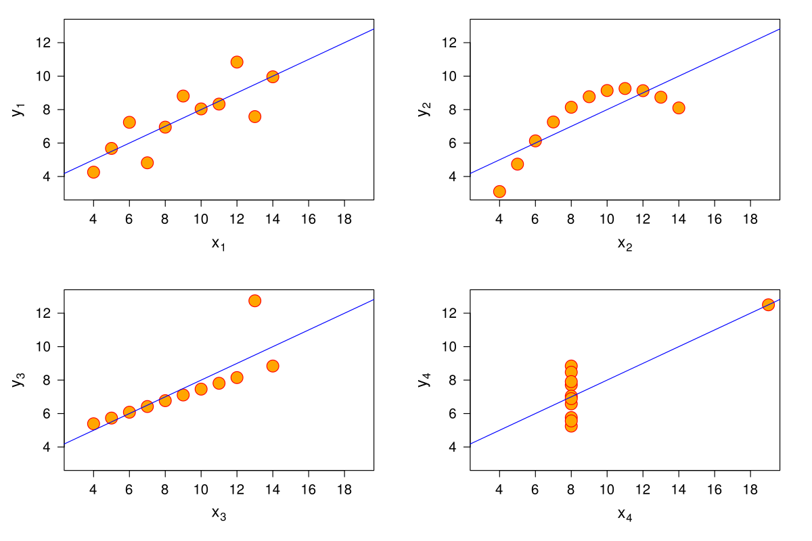

##  {background-color="#0F2044" data-state="no-logo"}

::: {style="display: flex; justify-content: center; align-items: center; height: 70vh; flex-direction: column; text-align: center;"}
[Programa de Talleres de Inteligencia Artificial Generativa]{style="font-size: 0.9em; color: #4A9FD4; text-transform: uppercase;"}

[IA Generativa Aplicada a la Investigación y la Productividad]{style="font-size: 2.1em; font-weight: bold; color: white; line-height: 1.15; max-width: 1200px;"}

[Literatura científica · Datos · Redacción académica · Automatización · Plantillas reutilizables]{style="font-size: 0.95em; color: #C9A84C; margin-top: 1em;"}

[Jueves 27 de agosto · 14:30 a 16:30]{style="font-size: 0.8em; color: #D9E2EC; margin-top: 1.4em;"}
:::

------------------------------------------------------------------------

## Dónde quedamos y hacia dónde vamos

::::: columns
::: {.column width="50%"}
### Taller 1 · Docencia

Aprendimos a construir prompts con **rol, contexto, tarea, criterios y formato**, y los aplicamos al diseño instruccional, la evaluación y la retroalimentación.

Si tiene su **prompt maestro** del taller anterior, téngalo abierto: hoy lo vamos a especializar.
:::

::: {.column width="50%"}
### Taller 2 · Investigación y gestión

Hoy el prompt deja de ser un ejercicio y pasa a ser **infraestructura de trabajo**: plantillas que usted va a reutilizar cada semana.

Cambia también el nivel de exigencia: aquí las fuentes, los datos y la autoría **se verifican siempre**.
:::
:::::

::: callout-note
Si no participó en el Taller 1, no hay problema: cada plantilla de hoy es autocontenida y viene explicada pieza por pieza.
:::

------------------------------------------------------------------------

## Con qué se va a ir de aquí

<br>

```{=html}
<div style="display:grid; grid-template-columns:repeat(5,1fr); gap:0.8rem; margin-top:0.6rem;">
  <div class="kit-card"><span class="kit-num">1</span><strong>Matriz de literatura</strong>Comparación verificable de 2 o 3 textos reales de su área.</div>
  <div class="kit-card"><span class="kit-num">2</span><strong>Plan de análisis</strong>Preguntas exploratorias, visualizaciones y cautelas de interpretación.</div>
  <div class="kit-card"><span class="kit-num">3</span><strong>Abstract + checklist</strong>Un resumen de 150–250 palabras con su lista de verificación previa al envío.</div>
  <div class="kit-card"><span class="kit-num">4</span><strong>Plantilla reutilizable</strong>Un prompt maestro para una tarea que usted repite cada semana.</div>
  <div class="kit-card kit-card--grupo"><span class="kit-num">5</span><strong>Plantilla v2</strong>Construida en grupo y corregida por otro grupo que intentó romperla.</div>
</div>
```

::: callout-tip
Traiga material real: dos o tres abstracts de su área, una descripción de variables de algún dato con el que trabaje, y un correo o informe que redacte con frecuencia.
:::

------------------------------------------------------------------------

## Ruta de dos horas

| Hora | Bloque | Qué hacemos | Producto |
|---|---|---|---|
| 14:30 · 10 min | **0 · Encuadre** | Resguardos: integridad, fuentes, datos, autoría | Criterios mínimos |
| 14:40 · 20 min | **1 · Literatura** | Buscar, sintetizar y organizar + **Actividad 1** | Matriz de literatura |
| 15:00 · 20 min | **2 · Datos** | Análisis exploratorio e interpretación + **Actividad 2** | Plan de análisis |
| 15:20 · 5 min | *Pausa* | | |
| 15:25 · 20 min | **3 · Redacción** | Papers, resúmenes y abstracts + **Actividad 3** | Abstract + checklist |
| 15:45 · 20 min | **4 · Automatización** | Correos, informes y plantillas + **Actividad 4** | Plantilla reutilizable |
| 16:05 · 20 min | **5 · Taller en grupo** | **Actividad colectiva**: prueba cruzada de plantillas | Plantilla v2 |
| 16:25 · 5 min | **Cierre** | Repositorio personal y siguientes pasos | Los 5 productos |

::: callout-tip
Al final hay un **anexo** con material de profundización: verificación de referencias, declaración de uso de IA, clasificación de datos y prompts adicionales. Queda para consultar después.
:::

------------------------------------------------------------------------

##  {background-color="#0F2044" data-state="no-logo"}

::: {style="display:flex; justify-content:center; align-items:center; height:70vh; flex-direction:column; text-align:center;"}
[Bloque 0 · 10 minutos]{style="font-size:0.9em; color:#4A9FD4; text-transform:uppercase; letter-spacing:0.1em;"}

[Encuadre y resguardos]{style="font-size:2.2em; font-weight:bold; color:white; margin-top:0.4em;"}

[Integridad académica, fuentes, datos y autoría]{style="font-size:0.95em; color:#C9A84C; margin-top:1.2em;"}
:::

------------------------------------------------------------------------

## Objetivo del taller

::::: columns
::: {.column width="58%"}
<br>

Desarrollar competencias para utilizar IA generativa como apoyo en el **proceso investigativo** y en la **automatización de tareas administrativas y académicas repetitivas**.

El uso debe resguardar:

- integridad académica;
- propiedad intelectual;
- protección de información institucional;
- trazabilidad de fuentes y decisiones;
- criterio profesional en la revisión de resultados.
:::

::: {.column width="42%"}
<br>

```{=html}
<div style="background:#0F2044; border-radius:10px; padding:1.4rem; color:white; font-size:0.78em;">
  <div style="color:#C9A84C; font-size:1.1em; margin-bottom:1rem; text-align:center;">Flujo del taller</div>
  <div style="background:#1A3A6B; padding:0.65rem; border-radius:6px; margin-bottom:0.55rem;">Explorar literatura</div>
  <div style="background:#1A3A6B; padding:0.65rem; border-radius:6px; margin-bottom:0.55rem;">Analizar información</div>
  <div style="background:#1A3A6B; padding:0.65rem; border-radius:6px; margin-bottom:0.55rem;">Redactar y revisar</div>
  <div style="background:#274C77; padding:0.65rem; border-radius:6px; color:#C9A84C;">Automatizar con responsabilidad</div>
</div>
```
:::
:::::

::: callout-note
La IA puede acelerar partes del flujo de trabajo, pero no reemplaza la responsabilidad académica sobre el método, las fuentes, los datos ni las conclusiones.
:::

------------------------------------------------------------------------

## Acuerdo de trabajo

<br>

Durante el taller vamos a usar IA como **asistente de proceso**, no como fuente incuestionable.

::::: columns
::: {.column width="50%"}
### Sí

- Usar IA para ordenar ideas y borradores.
- Pedir matrices comparativas de literatura.
- Revisar claridad de argumentos.
- Generar plantillas para tareas repetitivas.
- Pedir chequeos de consistencia y posibles sesgos.
:::

::: {.column width="50%"}
### Cuidado

- Inventar citas o referencias.
- Subir datos sensibles o identificables.
- Delegar análisis metodológico crítico.
- Usar texto generado sin revisión ni atribución.
- Confundir síntesis automática con revisión sistemática.
:::
:::::

------------------------------------------------------------------------

## IA en el flujo investigativo

<br>

La IA puede apoyar distintas etapas, pero cada una exige controles distintos.

| Etapa | Apoyo posible | Control humano | Riesgo si se omite |
|---|---|---|---|
| Exploración | Mapear temas, conceptos y palabras clave | Verificar fuentes y alcance | Sesgo de cobertura |
| Lectura | Resumir artículos y extraer argumentos | Revisar fidelidad al texto | Atribución incorrecta |
| Organización | Crear matrices y mapas conceptuales | Ajustar categorías teóricas | Categorías vacías |
| Análisis | Formular hipótesis y contrastes | Validar método y evidencia | Conclusiones infundadas |
| Escritura | Estructurar secciones y mejorar claridad | Cuidar autoría, citas y tono | Problemas de integridad |

------------------------------------------------------------------------

## Antes de escribir el primer prompt

<br>

::::: columns
::: {.column width="25%"}
### Integridad

¿Estoy declarando uso de IA cuando corresponde?
:::

::: {.column width="25%"}
### Fuentes

¿Cada cita, DOI o dato fue verificado en el original?
:::

::: {.column width="25%"}
### Información

¿Evité subir datos personales, sensibles o institucionales?
:::

::: {.column width="25%"}
### Autoría

¿El argumento y las decisiones académicas siguen siendo humanas?
:::
:::::

<br>

::: callout-important
Regla operativa para hoy: si un dato permitiría identificar a una persona, o si el documento es confidencial de la Universidad, **no entra a la herramienta**. Use un extracto anonimizado o un caso equivalente.
:::

------------------------------------------------------------------------

## Qué se puede subir y qué no

| Tipo de información | Ejemplos | Regla práctica |
|---|---|---|
| **Pública** | Papers publicados, normativa pública, sus propias presentaciones | Sin restricción |
| **Propia no publicada** | Borradores, notas, código propio, ideas de proyecto | Permitido; revise la política de privacidad de la herramienta |
| **De terceros con licencia** | PDFs de revistas suscritas | Uso personal de lectura; no redistribuya el texto generado como si fuera el original |
| **Institucional interna** | Actas, presupuestos, informes de gestión | Solo con autorización; preferir versiones resumidas y anonimizadas |
| **Personal o sensible** | Nombres, RUT, notas, correos, datos de salud | **No se sube.** Sin excepciones prácticas |

::: callout-tip
Si duda, aplique la prueba del titular: *¿me incomodaría que este contenido apareciera mañana asociado a mi nombre?* Si la respuesta es sí, no lo suba.
:::

------------------------------------------------------------------------

## Discusión inicial · 3 minutos

<br>

Converse con quien tenga al lado:

1. ¿Cuál es la tarea de investigación o gestión que más tiempo le consume cada semana?
2. ¿Cuánto de esa tarea es **criterio profesional** y cuánto es **trabajo mecánico**?
3. Si pudiera automatizar solo una cosa este semestre, ¿cuál sería?

<br>

::: callout-note
La respuesta a la pregunta 3 es, muy probablemente, su Producto 4 del día, y el insumo de su grupo en la actividad colectiva. Anótela.
:::

------------------------------------------------------------------------

##  {background-color="#0F2044" data-state="no-logo"}

::: {style="display:flex; justify-content:center; align-items:center; height:70vh; flex-direction:column; text-align:center;"}
[Bloque 1 · 20 minutos]{style="font-size:0.9em; color:#4A9FD4; text-transform:uppercase; letter-spacing:0.1em;"}

[Literatura científica]{style="font-size:2.2em; font-weight:bold; color:white; margin-top:0.4em;"}

[Buscar, sintetizar y organizar antecedentes]{style="font-size:0.95em; color:#C9A84C; margin-top:1.2em;"}
:::

------------------------------------------------------------------------

## De "tengo muchos textos" a "entiendo el mapa"

::::: columns
::: {.column width="52%"}
<br>

La IA es útil para ordenar lo que ya leyó o ya descargó. Puede ayudar a:

- proponer términos y sinónimos de búsqueda;
- resumir artículos **cargados por usted**;
- comparar enfoques metodológicos;
- extraer conceptos, preguntas y vacíos;
- organizar antecedentes en matrices;
- transformar notas dispersas en síntesis.
:::

::: {.column width="48%"}
<br>

::: callout-warning
No use IA como única fuente bibliográfica. Los modelos pueden producir referencias falsas, mezclar autores o atribuir ideas de forma incorrecta.
:::

::: callout-tip
Trabaje con PDFs, DOIs, citas reales o fragmentos verificables. Pida siempre separar **lo que el texto dice** de **lo que la IA infiere**.
:::
:::
:::::

------------------------------------------------------------------------

## Dos formas de usar IA con literatura

::::: columns
::: {.column width="50%"}
```{=html}
<div style="background:#FDEDEC; border-left:4px solid #E74C3C; border-radius:6px; padding:1rem 1.2rem; font-size:0.78em;">
  <div style="color:#0F2044; font-weight:bold; margin-bottom:0.5rem;">Modo riesgoso · "Dime qué se ha publicado sobre X"</div>
  El modelo responde de memoria. Puede inventar títulos, años, autores y DOIs que parecen correctos.
  <br><br>
  Resultado: bibliografía imposible de verificar.
</div>
```
:::

::: {.column width="50%"}
```{=html}
<div style="background:#EAFAF1; border-left:4px solid #27AE60; border-radius:6px; padding:1rem 1.2rem; font-size:0.78em;">
  <div style="color:#0F2044; font-weight:bold; margin-bottom:0.5rem;">Modo seguro · "Aquí están los textos: organízalos"</div>
  Usted aporta PDFs, abstracts o fragmentos. El modelo compara, categoriza y sintetiza sobre material real.
  <br><br>
  Resultado: síntesis trazable a la fuente.
</div>
```
:::
:::::

<br>

::::: columns
::: {.column width="20%"}
{width="34%" fig-align="center"}
:::
::: {.column width="20%"}
{width="34%" fig-align="center"}
:::
::: {.column width="20%"}
{width="34%" fig-align="center"}
:::
::: {.column width="40%"}
[Para trabajo con documentos propios, las tres funcionan cargando archivos. La diferencia relevante no es el modelo: es si el material lo aporta usted o lo inventa la herramienta.]{style="font-size:0.62em; color:#6B7A8D;"}
:::
:::::

<!-- Imagen sugerida (por crear): captura anonimizada de una sesión con 3 PDFs cargados
     y la respuesta citando página/sección de cada uno → images/ia/literatura_pdfs.png -->

------------------------------------------------------------------------

## Lo que la IA no es

<br>

::::: columns
::: {.column width="50%"}
### Una búsqueda bibliográfica

Un chat no reemplaza a Scopus, Web of Science o el catálogo institucional. No tiene cobertura sistemática, no documenta su estrategia de búsqueda y no es reproducible.

**Sí sirve** para preparar la búsqueda: sinónimos, términos en inglés, operadores, conceptos límite.
:::

::: {.column width="50%"}
### Una revisión sistemática

Una revisión sistemática exige protocolo, criterios de inclusión y exclusión, cribado documentado y, muchas veces, doble revisor.

**Sí sirve** dentro del protocolo: extraer datos de artículos ya seleccionados a una matriz común.
:::
:::::

::: callout-important
La distinción práctica: la IA puede ayudar a **procesar** lo que usted encontró; no a **encontrarlo** ni a certificar que la cobertura fue completa.
:::

------------------------------------------------------------------------

## Prompt reutilizable · matriz de literatura {.prompt-slide}

```text
Actúa como asistente de investigación metodológicamente riguroso.

Contexto:
Estoy revisando literatura sobre [tema] en [disciplina].
Te entregaré resúmenes o fragmentos de artículos. Mi proyecto busca [objetivo].

Tarea:
Construye una matriz de síntesis para comparar los textos.

Criterios (no negociables):
- No inventes información que no esté en los fragmentos.
- Distingue explícitamente hallazgos reportados, metodología, limitaciones e inferencias tuyas.
- Marca "no indicado" cuando falte información: nunca completes por plausibilidad.
- Cita para cada celda la frase o sección del fragmento que la respalda.

Formato:
Tabla con columnas: autor/año · objetivo · método · muestra o datos ·
hallazgos · limitaciones · relación con mi proyecto · evidencia textual.

Al cerrar, agrega tres listas breves:
1. Coincidencias entre los textos.
2. Contradicciones o tensiones.
3. Vacíos que ninguno cubre y que mi proyecto podría abordar.
```

------------------------------------------------------------------------

## Actividad 1 · su matriz de literatura

::::: columns
::: {.column width="62%"}
[**10 minutos** · con material real de su área]{.tiempo}

1. Elija **dos o tres** abstracts, fragmentos o notas bibliográficas. *(1 min)*
2. Ejecute el prompt anterior en ChatGPT o Claude. *(3 min)*
3. Pida que identifique similitudes, diferencias y vacíos. *(1 min)*
4. **Audite**: revise si cada afirmación está respaldada por el texto. Marque las que no. *(4 min)*
5. Ajuste la matriz para que sea útil en su proyecto real. *(1 min)*

::: callout-note
Una buena matriz no reemplaza la lectura. La hace más visible, ordenada y discutible.
:::
:::

::: {.column width="38%"}
```{=html}
<div class="producto-box">
  <div class="producto-titulo">Producto 1</div>
  <p><strong>Matriz de literatura verificada</strong></p>
  <p>Con al menos una celda corregida por usted tras revisar la fuente original.</p>
  <hr>
  <div class="producto-titulo">Dato para discutir</div>
  <p>¿Cuántas afirmaciones tuvo que corregir? Ese número es su tasa personal de verificación necesaria.</p>
</div>
```
:::
:::::

------------------------------------------------------------------------

##  {background-color="#0F2044" data-state="no-logo"}

::: {style="display:flex; justify-content:center; align-items:center; height:70vh; flex-direction:column; text-align:center;"}
[Bloque 2 · 20 minutos]{style="font-size:0.9em; color:#4A9FD4; text-transform:uppercase; letter-spacing:0.1em;"}

[Análisis exploratorio de datos]{style="font-size:2.2em; font-weight:bold; color:white; margin-top:0.4em;"}

[Mejores preguntas, no respuestas automáticas]{style="font-size:0.95em; color:#C9A84C; margin-top:1.2em;"}
:::

------------------------------------------------------------------------

## Por qué el resumen no basta

::::: columns
::: {.column width="52%"}
<br>

Los cuatro conjuntos del **cuarteto de Anscombe** tienen la misma media, la misma varianza, la misma correlación y la misma recta de regresión.

Son radicalmente distintos.

Una IA que solo recibe estadísticos descriptivos los describiría igual. Una que recibe el gráfico, o una persona que lo mira, no.
:::

::: {.column width="48%"}
{width="94%" fig-align="center"}
:::
:::::

::: callout-important
La IA apoya la **interpretación**; no reemplaza mirar los datos ni validar el método.
:::

------------------------------------------------------------------------

## Dónde ayuda con datos

::::: columns
::: {.column width="50%"}
### Sí ayuda

- Sugerir variables y cruces a revisar.
- Proponer visualizaciones adecuadas.
- Escribir o depurar código de análisis.
- Detectar posibles inconsistencias.
- Redactar conclusiones cautelosas.
- Explicar resultados a audiencias no técnicas.
:::

::: {.column width="50%"}
### No conviene

- Subir bases con datos personales o institucionales.
- Aceptar interpretaciones causales sin diseño que las sustente.
- Delegar la elección del método.
- Reportar cifras que no volvió a calcular usted.
:::
:::::

::: callout-important
No suba bases con datos personales, sensibles o institucionales sin autorización y resguardos adecuados. En la mayoría de los casos basta con **describir las variables**, no con entregar los datos.
:::

------------------------------------------------------------------------

## Pida el código, no el resultado

::::: columns
::: {.column width="48%"}
<br>

La forma más segura y más reproducible de usar IA con datos: **no le entregue los datos, pídale el código** que usted ejecuta localmente.

Ventajas:

- los datos nunca salen de su equipo;
- el análisis queda documentado y repetible;
- usted ve exactamente qué se calculó;
- el error, si aparece, es inspeccionable.
:::

::: {.column width="52%"}
```text
Actúa como analista de datos. Escribe código en
[Python con pandas / R con tidyverse] que yo
ejecutaré localmente. No necesitas ver los datos.

Estructura del archivo:
- [columna]: [tipo y descripción]
- [columna]: [tipo y descripción]

Tarea:
Genera un análisis exploratorio que incluya:
1. revisión de valores faltantes y fuera de rango;
2. estadísticos descriptivos por grupo;
3. tres gráficos pertinentes, con el motivo de cada uno.

Condiciones:
- Comenta cada bloque explicando qué revisar en la salida.
- Advierte qué supuestos estás haciendo sobre los datos.
- No uses librerías que requieran instalación adicional.
```
:::
:::::

------------------------------------------------------------------------

## Prompt reutilizable · plan de análisis exploratorio {.prompt-slide}

```text
Actúa como analista de datos académico, cauteloso con la inferencia.

Contexto:
Tengo una base de datos sobre [tema]. NO te entrego los datos, solo su estructura.
- Unidad de observación: [ ] · N aproximado: [ ] · Período: [ ]
- [variable 1]: [tipo, escala, descripción]
- [variable 2]: [tipo, escala, descripción]
- [variable 3]: [tipo, escala, descripción]
Mi pregunta de investigación es: [ ]

Tarea:
Propón un plan de análisis exploratorio inicial.

Condiciones:
- No asumas causalidad; señala cuándo una lectura causal sería tentadora pero indebida.
- Indica la visualización recomendada para cada pregunta y por qué esa y no otra.
- Señala posibles problemas de calidad de datos y cómo detectarlos.
- Sugiere preguntas interpretativas para discutir con el equipo.

Formato:
Tabla con: pregunta · variables · gráfico sugerido · qué observar · cautela interpretativa.

Al final, lista los tres supuestos que estás haciendo sobre mis datos
y que yo debería confirmar antes de usar este plan.
```

------------------------------------------------------------------------

## Actividad 2 · preguntas para sus datos

::::: columns
::: {.column width="62%"}
[**10 minutos** · con datos reales anonimizados o un caso propio]{.tiempo}

Con apoyo de IA:

1. genere **cinco preguntas exploratorias**; *(2 min)*
2. pida la **visualización** adecuada para cada una; *(2 min)*
3. solicite los **riesgos de interpretación** de cada gráfico; *(2 min)*
4. identifique qué **información adicional** sería necesaria; *(2 min)*
5. redacte una **conclusión preliminar prudente**. *(2 min)*

::: callout-tip
Prueba de estrés: pida a la IA que argumente la interpretación **contraria** a la que le propuso. Si ambas suenan igual de convincentes, todavía no tiene evidencia suficiente.
:::
:::

::: {.column width="38%"}
```{=html}
<div class="producto-box">
  <div class="producto-titulo">Producto 2</div>
  <p><strong>Plan de análisis exploratorio</strong></p>
  <p>Cinco preguntas, sus gráficos y una cautela interpretativa por cada una.</p>
  <hr>
  <div class="producto-titulo">Nota</div>
  <p>Este plan se discute con el equipo antes de ejecutarse. Ese es exactamente su valor.</p>
</div>
```
:::
:::::

------------------------------------------------------------------------

##  {background-color="#0F2044" data-state="no-logo"}

::: {style="display:flex; justify-content:center; align-items:center; height:70vh; flex-direction:column; text-align:center;"}
[Pausa · 5 minutos]{style="font-size:0.9em; color:#4A9FD4; text-transform:uppercase; letter-spacing:0.1em;"}

[15:20]{style="font-size:3.2em; font-weight:bold; color:white; margin-top:0.3em;"}

[Al volver: de los datos al texto.]{style="font-size:0.9em; color:#C9A84C; margin-top:1.2em;"}
:::

------------------------------------------------------------------------

##  {background-color="#0F2044" data-state="no-logo"}

::: {style="display:flex; justify-content:center; align-items:center; height:70vh; flex-direction:column; text-align:center;"}
[Bloque 3 · 20 minutos]{style="font-size:0.9em; color:#4A9FD4; text-transform:uppercase; letter-spacing:0.1em;"}

[Redacción académica]{style="font-size:2.2em; font-weight:bold; color:white; margin-top:0.4em;"}

[Estructurar papers, resúmenes y abstracts]{style="font-size:0.95em; color:#C9A84C; margin-top:1.2em;"}
:::

------------------------------------------------------------------------

## Escribir con IA sin dejar de ser el autor

::::: columns
::: {.column width="55%"}
<br>

La IA mejora el proceso de escritura cuando se usa para **estructurar, revisar y clarificar**:

- convertir notas en esquema;
- revisar coherencia entre secciones;
- proponer títulos y subtítulos;
- ajustar tono académico;
- acortar resúmenes;
- traducir ideas manteniendo el sentido;
- detectar saltos argumentales.
:::

::: {.column width="45%"}
```{=html}
<div style="background:#0F2044; border-radius:10px; padding:1.3rem; color:white; font-size:0.76em;">
  <div style="color:#C9A84C; text-align:center; margin-bottom:0.9rem;">Dónde está la línea</div>
  <div style="background:#1A3A6B; padding:0.7rem; border-radius:6px; margin-bottom:0.5rem;">El <strong>argumento</strong> es suyo.</div>
  <div style="background:#1A3A6B; padding:0.7rem; border-radius:6px; margin-bottom:0.5rem;">Las <strong>decisiones teóricas</strong> son suyas.</div>
  <div style="background:#1A3A6B; padding:0.7rem; border-radius:6px; margin-bottom:0.5rem;">Las <strong>conclusiones</strong> son suyas.</div>
  <div style="background:#274C77; padding:0.7rem; border-radius:6px; color:#C9A84C;">La <strong>forma</strong> se puede trabajar con apoyo.</div>
</div>
```
:::
:::::

::: callout-warning
No delegue la autoría intelectual. Revise además la política de uso de IA de la revista, congreso o fondo al que vaya a postular: varía y suele exigir declaración explícita.
:::

------------------------------------------------------------------------

## Dónde ayuda, sección por sección

| Sección | Apoyo que sí conviene | Lo que debe seguir siendo suyo |
|---|---|---|
| **Introducción** | Ordenar el embudo: campo, brecha, pregunta | La brecha que usted afirma que existe |
| **Marco teórico** | Agrupar autores por enfoque, detectar repeticiones | La posición teórica adoptada |
| **Método** | Redactar con precisión lo que ya decidió | Todas las decisiones metodológicas |
| **Resultados** | Convertir tablas en prosa, revisar consistencia numérica | Las cifras, verificadas por usted |
| **Discusión** | Contrastar sus hallazgos con la literatura que le entregó | La interpretación y sus límites |
| **Conclusión** | Acortar, eliminar redundancia | Qué se concluye y qué no |

::: callout-note
La regla se sostiene sola: la IA ayuda con **lo que ya decidió**; nunca con lo que aún falta decidir.
:::

------------------------------------------------------------------------

## Prompt reutilizable · abstract {.prompt-slide}

```text
Actúa como editor académico exigente de una revista indexada de [disciplina].

Contexto:
Estoy preparando un abstract para [artículo / ponencia / postulación a fondo].
Revista o congreso de destino: [ ] · Límite de palabras: [ ]

Información base (usa SOLO esto):
- Problema:
- Objetivo:
- Método:
- Datos o muestra:
- Resultados principales:
- Contribución:

Tarea:
Redacta un abstract de máximo [250] palabras.

Condiciones:
- Tono académico claro; una idea por oración.
- No agregues resultados, cifras ni implicancias que no estén en la información base.
- Entrega además una versión de 150 palabras.
- Propón tres títulos alternativos: uno descriptivo, uno con el hallazgo, uno con la contribución.

Control de calidad (inclúyelo al final):
1. Tres puntos que debería verificar antes de enviar.
2. Qué información falta en mi insumo y debilita el abstract.
3. La pregunta más incómoda que haría un revisor al leerlo.
```

------------------------------------------------------------------------

## Actividad 3 · resumen o abstract

::::: columns
::: {.column width="62%"}
[**10 minutos** · con un trabajo propio, aunque esté en curso]{.tiempo}

Sobre una idea de artículo, proyecto, informe o ponencia, produzca:

1. un **esquema de secciones**; *(2 min)*
2. un **resumen** de 150 a 250 palabras; *(3 min)*
3. **tres títulos** posibles; *(1 min)*
4. una lista de **elementos faltantes**; *(2 min)*
5. una **revisión de coherencia** entre objetivo, método y resultado. *(2 min)*

::: callout-note
Lea el abstract en voz alta. Si hay una frase que usted no defendería frente a un comité, reescríbala a mano antes de guardarla.
:::
:::

::: {.column width="38%"}
```{=html}
<div class="producto-box">
  <div class="producto-titulo">Producto 3</div>
  <p><strong>Abstract + checklist de verificación</strong></p>
  <p>Dos versiones, tres títulos y su lista de tres cosas por verificar antes de enviar.</p>
  <hr>
  <div class="producto-titulo">Advertencia</div>
  <p>Un abstract que suena bien y no dice qué se hizo es el error más frecuente al escribir con IA.</p>
</div>
```
:::
:::::

------------------------------------------------------------------------

##  {background-color="#0F2044" data-state="no-logo"}

::: {style="display:flex; justify-content:center; align-items:center; height:70vh; flex-direction:column; text-align:center;"}
[Bloque 4 · 20 minutos]{style="font-size:0.9em; color:#4A9FD4; text-transform:uppercase; letter-spacing:0.1em;"}

[Automatización de tareas recurrentes]{style="font-size:2.2em; font-weight:bold; color:white; margin-top:0.4em;"}

[Correos, informes y documentos de cada semana]{style="font-size:0.95em; color:#C9A84C; margin-top:1.2em;"}
:::

------------------------------------------------------------------------

## De tarea repetida a plantilla revisable

::::: columns
::: {.column width="55%"}
<br>

Muchas tareas académicas no son difíciles, pero consumen atención:

- correos recurrentes;
- minutas y actas;
- informes breves;
- respuestas a solicitudes;
- pautas de reunión;
- cronogramas;
- documentos con estructura estable.

La clave es convertir la tarea repetida en una **plantilla revisable**, no escribir el mismo prompt otra vez.
:::

::: {.column width="45%"}
<br>

{width="55%" fig-align="center"}

[Escribir el prompt una vez · reutilizarlo siempre · mejorarlo cuando falla]{style="font-size:0.62em; color:#6B7A8D; display:block; text-align:center;"}
:::
:::::

------------------------------------------------------------------------

## Cuándo vale la pena automatizar

<br>

| Frecuencia | Estructura | ¿Plantilla? | Ejemplo |
|---|---|---|---|
| Semanal o más | Estable | **Sí, prioritario** | Correo de coordinación, minuta de reunión |
| Mensual | Estable | Sí | Informe de avance, reporte a comité |
| Ocasional | Estable | Conviene | Carta de recomendación, respuesta a solicitud |
| Frecuente | Muy variable | Plantilla parcial | Respuestas a estudiantes |
| Única | Variable | No | Documento excepcional |

::: callout-tip
Criterio simple: si en los últimos dos meses escribió **tres veces** algo parecido, es candidato a plantilla.
:::

------------------------------------------------------------------------

## Anatomía de un prompt reutilizable

<br>

Un prompt reutilizable debe funcionar más de una vez sin depender de memoria o improvisación.

| Elemento | Pregunta que responde | Señal de que falta |
|---|---|---|
| Propósito | ¿Para qué tarea recurrente sirve? | Lo usa una vez y lo olvida |
| Insumos | ¿Qué información debo completar siempre? | Cada vez improvisa el contexto |
| Criterios | ¿Qué reglas no debe romper? | La respuesta inventa o se desvía |
| Salida | ¿En qué formato necesito el resultado? | Reformatea a mano cada vez |
| Revisión | ¿Qué debe preguntarme o advertirme antes de cerrar? | Descubre los errores al final |

------------------------------------------------------------------------

## Prompt reutilizable · correo o informe {.prompt-slide}

```text
Actúa como asistente administrativo académico.

Contexto:
Necesito redactar [correo / informe breve / minuta] para [destinatario y su rol]
sobre [tema]. Relación previa: [formal / cercana]. Urgencia: [ ].

Información obligatoria (si falta alguna, pregúntame antes de redactar):
- Propósito:
- Fecha límite:
- Documentos adjuntos:
- Acción esperada del destinatario:
- Tono:

Tarea:
Redacta el texto de forma clara, breve y formal.

Condiciones:
- No inventes datos, fechas, cargos ni compromisos.
- Incluye asunto y una versión más breve (máximo 5 líneas).
- Deja entre [corchetes] cualquier dato que yo deba completar.
- Señala si falta información crítica antes de enviarlo.
- Si el mensaje comunica una negativa o un plazo incómodo, dilo con claridad
  en las primeras dos líneas: no lo entierres al final.
```

------------------------------------------------------------------------

## Actividad 4 · su plantilla de productividad

::::: columns
::: {.column width="62%"}
[**10 minutos** · sobre la tarea que anotó al inicio]{.tiempo}

1. Tome la tarea que identificó en la discusión inicial. *(1 min)*
2. Escriba la plantilla con la estructura de cinco elementos. *(3 min)*
3. **Pruébela** con un caso real o simulado. *(2 min)*
4. Anote qué falló y **corrija la plantilla**, no la respuesta. *(3 min)*
5. Guárdela con un nombre que le permita encontrarla en tres meses. *(1 min)*

::: callout-important
El paso 4 es el que la mayoría se salta y el que convierte un prompt en herramienta. Corregir la respuesta ahorra cinco minutos; corregir la plantilla ahorra cinco horas.
:::
:::

::: {.column width="38%"}
```{=html}
<div class="producto-box">
  <div class="producto-titulo">Producto 4</div>
  <p><strong>Plantilla reutilizable probada</strong></p>
  <p>Con al menos una iteración de corrección después de probarla.</p>
  <hr>
  <div class="producto-titulo">Meta realista</div>
  <p>Tres plantillas bien hechas cubren buena parte del trabajo administrativo de un semestre.</p>
</div>
```
:::
:::::

------------------------------------------------------------------------

##  {background-color="#0F2044" data-state="no-logo"}

::: {style="display:flex; justify-content:center; align-items:center; height:70vh; flex-direction:column; text-align:center;"}
[Bloque 5 · 20 minutos]{style="font-size:0.9em; color:#4A9FD4; text-transform:uppercase; letter-spacing:0.1em;"}

[Prueba cruzada de plantillas]{style="font-size:2.2em; font-weight:bold; color:white; margin-top:0.4em;"}

[Actividad colectiva · grupos de 4 o 5 personas]{style="font-size:0.95em; color:#C9A84C; margin-top:1.2em;"}

[Una plantilla sirve cuando funciona en manos de otro.]{style="font-size:0.8em; color:#D9E2EC; margin-top:0.8em;"}
:::

------------------------------------------------------------------------

## Actividad colectiva · en qué consiste

::::: columns
::: {.column width="60%"}
[**20 minutos** · grupos de 4 o 5, de preferencia por unidad o afinidad de tarea]{.tiempo}

Cada grupo construye una plantilla para una tarea recurrente compartida. Luego la **intercambia** con otro grupo, que la ejecuta con un caso propio e intenta hacerla fallar.

**Fases**

- **7 min** · **Construir.** El grupo redacta la plantilla con los cinco elementos.
- **7 min** · **Romper.** Intercambio: cada grupo ejecuta la plantilla ajena con un caso distinto y anota dónde falla.
- **6 min** · **Devolver y cerrar.** Cada grupo recibe su plantilla con dos mejoras concretas y produce la versión 2.

::: callout-important
No se trata de criticar la redacción. Se trata de encontrar **el caso que la plantilla no previó**: el dato que faltaba, el formato que no sirve, la invención que nadie pidió.
:::
:::

::: {.column width="40%"}
```{=html}
<div class="producto-box">
  <div class="producto-titulo">Producto 5 · grupal</div>
  <p><strong>Plantilla v2</strong></p>
  <p>Una plantilla compartida, probada por gente que no la escribió y corregida con esa evidencia.</p>
  <hr>
  <div class="producto-titulo">Por qué cruzada</div>
  <p>Quien escribe una plantilla conoce el contexto que omitió. Quien la recibe, no: por eso encuentra en dos minutos lo que el autor no vería en un mes.</p>
</div>
```
:::
:::::

------------------------------------------------------------------------

## Roles dentro del grupo

<br>

```{=html}
<div style="display:grid; grid-template-columns:repeat(4,1fr); gap:1rem;">
  <div class="kit-card"><span class="kit-num">A</span><strong>Redactor</strong>Escribe la plantilla con los cinco elementos y la deja legible para otro grupo.</div>
  <div class="kit-card"><span class="kit-num">B</span><strong>Ejecutor</strong>En la fase de ruptura, corre la plantilla ajena con un caso real del propio grupo.</div>
  <div class="kit-card"><span class="kit-num">C</span><strong>Auditor de riesgos</strong>Revisa datos sensibles, invenciones y afirmaciones sin respaldo. Tiene derecho a veto.</div>
  <div class="kit-card"><span class="kit-num">D</span><strong>Vocero</strong>Reporta en 60 segundos: qué falló en la plantilla ajena y qué mejora propone.</div>
</div>
```

<br>

::: callout-tip
Con cinco integrantes, el quinto rol es el más divertido: **usuario apurado**. Ejecuta la plantilla sin leerla completa, tal como se usará un martes a las 8 de la mañana. Si sobrevive a eso, sirve.
:::

------------------------------------------------------------------------

## Fase 1 · qué debe contener la plantilla

<br>

```{=html}
<table style="width:100%; font-size:0.72em; border-collapse:collapse;">
  <tr style="background:#0F2044; color:white;">
    <th style="padding:0.5rem; text-align:left; width:18%;">Elemento</th>
    <th style="padding:0.5rem; text-align:left; width:46%;">Qué escribir</th>
    <th style="padding:0.5rem; text-align:left; width:36%;">Error típico</th>
  </tr>
  <tr><td style="padding:0.45rem; border-bottom:1px solid #D5DCE4;"><strong>Propósito</strong></td><td style="padding:0.45rem; border-bottom:1px solid #D5DCE4;">La tarea recurrente, en una línea, con su frecuencia.</td><td style="padding:0.45rem; border-bottom:1px solid #D5DCE4;">Tan amplio que sirve para todo y para nada.</td></tr>
  <tr style="background:#F0F4F8;"><td style="padding:0.45rem; border-bottom:1px solid #D5DCE4;"><strong>Insumos</strong></td><td style="padding:0.45rem; border-bottom:1px solid #D5DCE4;">Los campos que siempre hay que completar, con ejemplo.</td><td style="padding:0.45rem; border-bottom:1px solid #D5DCE4;">Faltan los que el autor completa "de memoria".</td></tr>
  <tr><td style="padding:0.45rem; border-bottom:1px solid #D5DCE4;"><strong>Criterios</strong></td><td style="padding:0.45rem; border-bottom:1px solid #D5DCE4;">Las reglas que no puede romper, incluida la de no inventar.</td><td style="padding:0.45rem; border-bottom:1px solid #D5DCE4;">Se asume el tono institucional sin declararlo.</td></tr>
  <tr style="background:#F0F4F8;"><td style="padding:0.45rem; border-bottom:1px solid #D5DCE4;"><strong>Salida</strong></td><td style="padding:0.45rem; border-bottom:1px solid #D5DCE4;">Formato exacto, extensión y secciones.</td><td style="padding:0.45rem; border-bottom:1px solid #D5DCE4;">"Que quede bien redactado".</td></tr>
  <tr><td style="padding:0.45rem;"><strong>Revisión</strong></td><td style="padding:0.45rem;">Qué debe preguntar o advertir antes de cerrar.</td><td style="padding:0.45rem;">No se pide nada: los vacíos se rellenan solos.</td></tr>
</table>
```

::: callout-note
Tareas candidatas: minuta de reunión de unidad · informe de avance de proyecto · respuesta a solicitud de estudiantes · convocatoria y acta de comité · resumen ejecutivo para autoridades · reporte mensual de indicadores.
:::

------------------------------------------------------------------------

## Fase 2 · cómo romper una plantilla ajena

<br>

Ejecútela con un caso **suyo**, no con el que imaginó el autor. Busque estos cinco puntos de quiebre:

::::: columns
::: {.column width="50%"}
**1 · El insumo que no existe**
Un campo obligatorio que en su realidad nadie tiene a mano.

**2 · El supuesto oculto**
Contexto que el autor daba por evidente y usted no comparte.

**3 · La invención**
Cualquier dato, fecha o compromiso que el modelo agregó por su cuenta.
:::

::: {.column width="50%"}
**4 · El formato que no sirve**
La salida es correcta pero hay que reformatearla igual antes de usarla.

**5 · El riesgo no advertido**
La plantilla induce a pegar información sensible sin decir nada al respecto.
:::
:::::

<br>

::: callout-tip
Anote los hallazgos como **frases que faltaban en la plantilla**, no como críticas. La devolución debe poder pegarse directamente en el prompt.
:::

------------------------------------------------------------------------

## Fase 3 · devolución y versión 2

<br>

Cada grupo recibe su plantilla de vuelta y, en voz alta, el vocero del otro grupo entrega:

::::: columns
::: {.column width="33%"}
### 1 · Dónde falló

El caso concreto que la plantilla no resistió, sin rodeos.
:::

::: {.column width="33%"}
### 2 · Qué línea agregar

Una frase exacta, lista para pegar en el prompt.
:::

::: {.column width="33%"}
### 3 · Qué conservar

Lo que funcionó bien y no debería tocarse en la versión 2.
:::
:::::

<br>

::: callout-note
Con eso, cada grupo escribe la **versión 2** y la guarda. Es el único producto del taller que fue probado por alguien distinto de quien lo escribió, y por eso es el más sólido.
:::

------------------------------------------------------------------------

## Prompt maestro reutilizable {.prompt-slide}

Base para la fase 1. Complételo con el contexto del grupo.

```text
Actúa como [rol experto].

Voy a usar este prompt de forma recurrente para [tarea], con frecuencia [ ].

Insumos que entregaré:
- [insumo 1]
- [insumo 2]
- [insumo 3]

Tu tarea:
[acción concreta].

Reglas:
- No inventes información.
- Si falta un dato esencial, pregunta antes de responder.
- Separa hechos, inferencias y recomendaciones.
- Mantén confidencialidad: no solicites datos personales innecesarios.
- Deja entre [corchetes] todo lo que yo deba completar o verificar.

Formato:
[tabla / correo / informe / lista / plantilla], con [secciones y extensión].

Control de calidad:
Al final incluye una lista breve de aspectos que debo revisar manualmente
antes de usar este resultado.
```

------------------------------------------------------------------------

##  {background-color="#0F2044" data-state="no-logo"}

::: {style="display:flex; justify-content:center; align-items:center; height:70vh; flex-direction:column; text-align:center;"}
[Cierre · 5 minutos]{style="font-size:0.9em; color:#4A9FD4; text-transform:uppercase; letter-spacing:0.1em;"}

[Su repositorio de prompts]{style="font-size:2.2em; font-weight:bold; color:white; margin-top:0.4em;"}

[Cómo convertir cinco productos en un sistema de trabajo]{style="font-size:0.95em; color:#C9A84C; margin-top:1.2em;"}
:::

------------------------------------------------------------------------

## Cómo organizarlo para que sobreviva al semestre

::::: columns
::: {.column width="50%"}
<br>

**Un solo documento**, con una sección por tarea:

```text
01_literatura_matriz
02_analisis_exploratorio
03_abstract
04_correo_coordinacion
05_informe_avance
```

Para cada uno anote tres cosas:

- **cuándo** lo usa;
- **qué falló** la última vez;
- **qué versión** es la buena.
:::

::: {.column width="50%"}
<br>

::: callout-tip
Regla de mantención: cada vez que tenga que corregir mucho una respuesta, vuelva a la plantilla y agregue una línea de criterio. En dos o tres iteraciones el prompt deja de fallar en ese punto.
:::

::: callout-note
Si su equipo o unidad repite las mismas tareas, compartir el repositorio multiplica el efecto y homogeniza la calidad de lo que se produce. La actividad de hoy fue exactamente el ensayo de eso.
:::
:::
:::::

------------------------------------------------------------------------

## Reflexión final · 3 minutos

<br>

::::: columns
::: {.column width="60%"}
Discutan brevemente:

1. ¿Qué tarea de su semana quedó realmente resuelta con lo de hoy?
2. ¿Dónde decidió **no** usar IA, y por qué esa decisión también es un resultado?
3. ¿Qué necesitaría su unidad para que esto sea práctica compartida y no esfuerzo individual?

<br>

::: callout-note
El objetivo no es usar IA para todo. Es diseñar flujos donde la IA aporte velocidad, estructura y claridad sin sacrificar rigor.
:::
:::

::: {.column width="40%"}
{width="82%" fig-align="center"}
:::
:::::

------------------------------------------------------------------------

## Cierre · el kit del taller

<br>

```{=html}
<div style="display:grid; grid-template-columns:repeat(5,1fr); gap:0.8rem;">
  <div class="kit-card"><span class="kit-num">1</span><strong>Matriz de literatura</strong>Verificada contra las fuentes originales.</div>
  <div class="kit-card"><span class="kit-num">2</span><strong>Plan de análisis</strong>Preguntas, gráficos y cautelas interpretativas.</div>
  <div class="kit-card"><span class="kit-num">3</span><strong>Abstract + checklist</strong>Dos versiones y su lista previa al envío.</div>
  <div class="kit-card"><span class="kit-num">4</span><strong>Plantilla reutilizable</strong>Probada y corregida al menos una vez.</div>
  <div class="kit-card kit-card--grupo"><span class="kit-num">5</span><strong>Plantilla v2</strong>Rota y reparada por otro grupo.</div>
</div>
```

<br>

::: callout-tip
Súmelos al documento del Taller 1: junto con el prompt maestro, la meta observable, la rúbrica, la retroalimentación y el lienzo de alineación, ya tiene **diez piezas** de un flujo de trabajo propio.
:::

------------------------------------------------------------------------

## Aprendizaje esperado

<br>

Al finalizar este taller, los participantes serán capaces de:

- integrar IA generativa en su flujo de trabajo investigativo;
- organizar literatura científica mediante matrices verificables;
- apoyar análisis exploratorio de datos sin perder cautela metodológica;
- estructurar papers, resúmenes y abstracts;
- automatizar correos, informes y documentos recurrentes;
- crear plantillas y prompts reutilizables para tareas frecuentes;
- optimizar tiempo y calidad con criterios de uso responsable.

------------------------------------------------------------------------

##  {background-color="#1A3A6B" data-state="no-logo"}

::: {style="display:flex; justify-content:center; align-items:center; height:70vh; flex-direction:column; text-align:center;"}
[Anexo]{style="font-size:0.9em; color:#C9A84C; text-transform:uppercase; letter-spacing:0.15em;"}

[Material de profundización]{style="font-size:2.2em; font-weight:bold; color:white; margin-top:0.4em;"}

[Verificación de fuentes · declaración de uso · prompts adicionales]{style="font-size:0.9em; color:#D9E2EC; margin-top:1.2em;"}
:::

------------------------------------------------------------------------

## Anexo · verificar una referencia en 60 segundos

<br>

::::: columns
::: {.column width="55%"}
Cuatro pasos, en este orden. Si falla el primero, no siga: la referencia no existe.

1. **Título entre comillas** en el buscador académico. Si no aparece exacto, sospeche.
2. **DOI** en `doi.org`. Un DOI inventado no resuelve o lleva a otro artículo.
3. **Revista y año**: verifique que el volumen y número existan y correspondan.
4. **Contenido**: abra el artículo y confirme que dice lo que la IA afirmó que dice.
:::

::: {.column width="45%"}
<br>

::: callout-warning
El error más costoso no es la referencia inventada: es la **referencia real que no dice lo que se le atribuye**. Pasa los tres primeros filtros y solo se detecta leyendo.
:::

::: callout-tip
Gestione todo en su gestor bibliográfico. Si una referencia no puede importarse desde la fuente, todavía no está verificada.
:::
:::
:::::

------------------------------------------------------------------------

## Anexo · declaración de uso de IA {.prompt-slide}

Formulaciones para adaptar según lo que exija la revista, el congreso o el fondo.

```text
USO ACOTADO A LA FORMA
"Durante la preparación de este trabajo se utilizó [herramienta] para
apoyar la edición de estilo y la revisión de redacción. Los autores
revisaron y editaron el contenido y asumen plena responsabilidad por
el contenido de la publicación."

USO EN ORGANIZACIÓN DE MATERIAL
"Se utilizó [herramienta] para apoyar la organización y síntesis de la
literatura previamente seleccionada por los autores. Todas las fuentes
citadas fueron verificadas en su versión original. El análisis, la
interpretación y las conclusiones son responsabilidad de los autores."

USO EN CÓDIGO O ANÁLISIS
"Se utilizó [herramienta] como apoyo en la escritura y depuración del
código de análisis. Los resultados fueron reproducidos y validados por
los autores. Los datos no fueron compartidos con la herramienta."

NOTA
La IA generativa no puede figurar como autora: no puede asumir
responsabilidad sobre el contenido ni aprobar la versión final.
```

------------------------------------------------------------------------

## Anexo · errores frecuentes en investigación

<br>

::::: columns
::: {.column width="50%"}
**1 · Pedir bibliografía en vez de aportarla**
Es la vía más rápida a una referencia inventada.

**2 · Confundir resumen con lectura**
El resumen es un mapa. Las decisiones metodológicas se toman leyendo.

**3 · Subir la base "solo para probar"**
Una vez subida, no se puede deshacer.
:::

::: {.column width="50%"}
**4 · Aceptar el lenguaje causal**
"Se asocia con" y "produce" no son lo mismo, y el modelo desliza el segundo con facilidad.

**5 · No declarar cuando correspondía**
Es más fácil declarar de más que explicar después por qué no se declaró.
:::
:::::

::: callout-note
El error transversal: usar IA para producir más texto, cuando el problema real casi siempre es tener más claro el argumento.
:::

------------------------------------------------------------------------

## Anexo · tres prompts adicionales

::::: columns
::: {.column width="33%"}
### Revisor adversarial

```text
Actúa como revisor par escéptico
de [revista/disciplina].

Lee este texto y escribe las 5
objeciones más fuertes que harías,
ordenadas por gravedad.

Para cada una indica qué evidencia
adicional la desactivaría.

No hagas elogios.
```
:::

::: {.column width="33%"}
### Resumen para no expertos

```text
Explica este resultado a
[autoridad / estudiante / prensa].

Condiciones:
- máximo 150 palabras;
- sin tecnicismos sin definir;
- una analogía concreta;
- señala explícitamente qué NO
  se puede concluir.
```
:::

::: {.column width="33%"}
### Minuta de reunión

```text
Convierte estas notas en minuta:

[pegar notas]

Formato:
- acuerdos (con responsable y plazo);
- temas pendientes;
- decisiones que requieren
  aprobación superior.

Marca [!] donde falte responsable
o plazo. No inventes ninguno.
```
:::
:::::

------------------------------------------------------------------------

##  {background-color="#0F2044" data-state="no-logo"}

::: {style="display:flex; justify-content:center; align-items:center; height:72vh; flex-direction:column; text-align:center;"}
[Programa de Talleres de Inteligencia Artificial Generativa]{style="font-size:0.85em; color:#4A9FD4; text-transform:uppercase; letter-spacing:0.1em;"}

[Gracias]{style="font-size:2.6em; font-weight:bold; color:white; margin-top:0.4em;"}

[El siguiente paso no es aprender más herramientas. Es usar tres plantillas durante un mes y corregirlas cuando fallen.]{style="font-size:0.85em; color:#D9E2EC; margin-top:1.4em; max-width:1000px;"}

[Universidad Técnica Federico Santa María · Agosto 2026]{style="font-size:0.75em; color:#C9A84C; margin-top:1.8em;"}
:::
