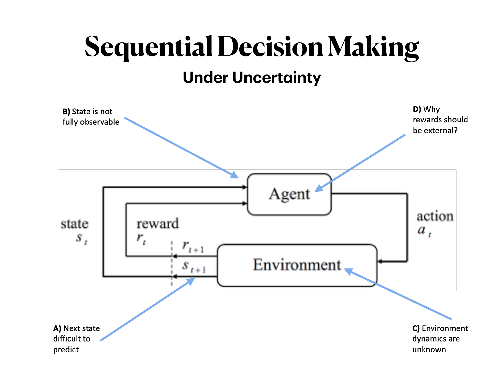
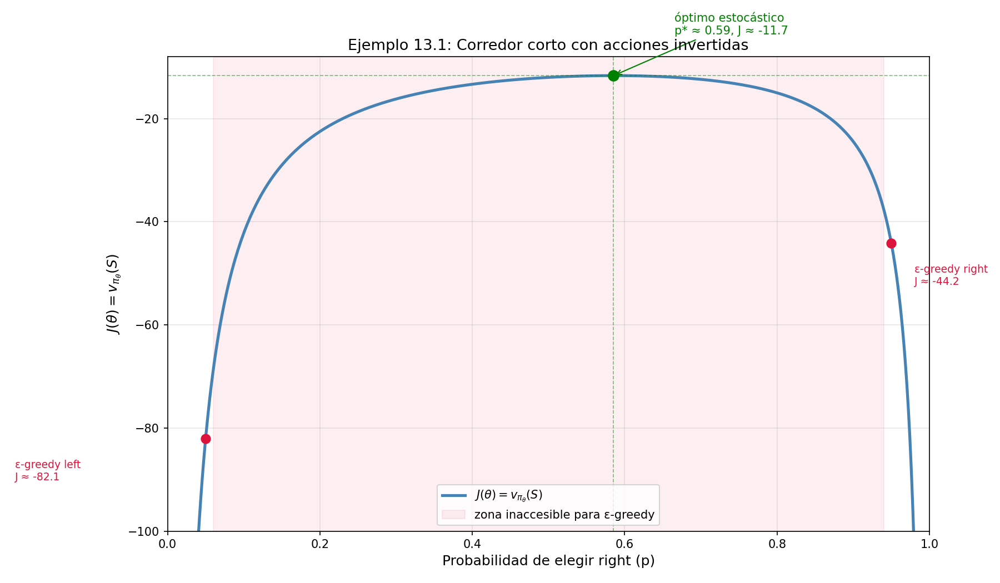
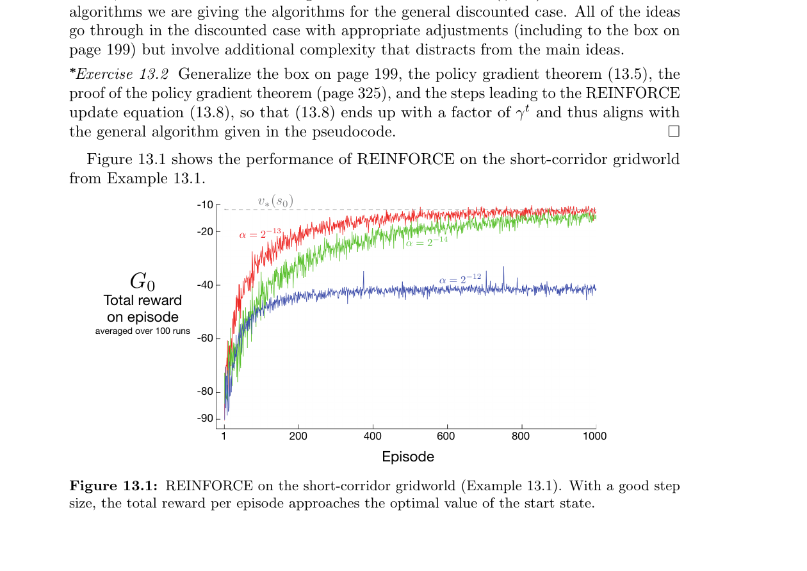
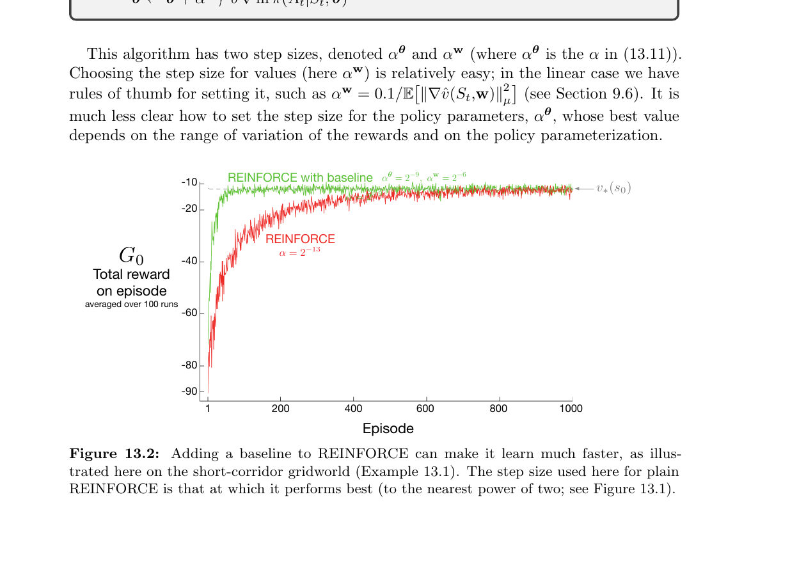
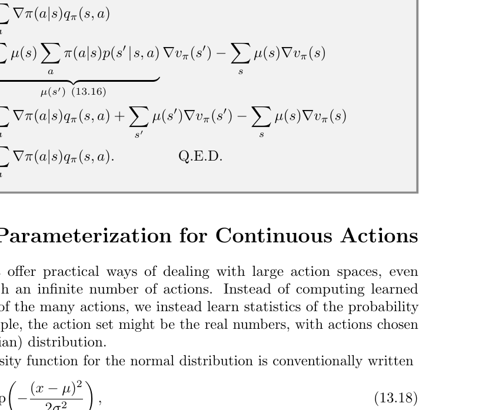

##  {.title-slide background-color="#0F2044"}

::: title-block
**Más allá de los valores**

Aprender directamente la política
:::

::: subtitle-block
Capítulo 13 — *Policy Gradient Methods*\
Sutton & Barto · Reinforcement Learning: An Introduction (2nd ed.)
:::

::: author-block
Francisco Alfaro\
Ingeniero Matemático · UTFSM\
Seminario Avanzado TIC · 2026
:::

------------------------------------------------------------------------

## El problema que motiva este capítulo

::: columns
::: {.column width="45%"}
El curso plantea cuatro fuentes de incertidumbre en el modelo agente–entorno:

| Problema | Descripción                                  | Estado                 |
| -------- | -------------------------------------------- | ---------------------- |
| **A**    | Siguiente estado difícil de predecir         | MDP → resuelto         |
| **B**    | Estado no completamente observable           | POMDP → difícil        |
| **C**    | Dinámica del entorno desconocida             | **RL →  capítulo**     |
| **D**    | ¿Recompensas deben ser externas?             | Intrinsic RL           |

:::

::: {.column width="55%"}



:::
:::

::: fragment
::: {.callout-important icon="false"}
## Cap. 13 en este mapa: Cuando la **dinámica es desconocida** (C)

Aprender directamente $\pi$ es más natural que aprender $Q$ primero. Y cuando el óptimo es **estocástico** (B, D), es la única forma matemáticamente correcta.
:::
:::

------------------------------------------------------------------------

## ¿Dónde estamos en el libro?

::: columns
::: {.column width="60%"}
**Hoja de ruta: S&B capítulos 2 → 13**

| Capítulos | Enfoque             | Política      |
| --------- | ------------------- | ------------- |
| 2–4       | Bandits, MDP        | implícita     |
| 5–7       | MC, TD, Q-learning  | implícita     |
| 8–12      | Aprox. de función   | implícita     |
| **13**    | **Policy Gradient** | **explícita** |

:::

::: {.column width="40%"}
<br>

::: {.callout-note icon="false"}
## La pregunta clave

En los capítulos anteriores, aprendemos $Q(s,a)$ y la política *emerge* como subproducto.

¿Qué pasa si aprendemos $\pi$ **directamente**?
:::
:::
:::

::: fragment
> **Única excepción anterior:** *gradient bandit algorithms* (Sec. 2.8) — el caso de un solo estado, sin transiciones, sin futuro. El Cap. 13 es su **generalización completa al MDP**. Si entendiste ese algoritmo, ya tienes la maquinaria central.
:::

------------------------------------------------------------------------

## Punto de partida: el Bandit de gradiente (Cap. 2.8)

::: columns
::: {.column width="55%"}
**El caso más simple posible:** $k$ acciones, 1 estado, sin futuro.

Se definen **preferencias** $H_t(a) \in \mathbb{R}$ y una política softmax:

$$\pi_t(a) = \frac{e^{H_t(a)}}{\sum_b e^{H_t(b)}}$$

**Objetivo:** maximizar $J = \mathbb{E}[R_t] = \sum_x \pi_t(x)\, q_*(x)$

**Actualización (ascenso de gradiente):**

$$H_{t+1}(a) = H_t(a) + \alpha\underbrace{(R_t - \bar{R}_t)}_{\text{señal}} \underbrace{(\mathbb{1}_{a=A_t} - \pi_t(a))}_{\text{eligibility}}$$
:::

::: {.column width="45%"}
::: {.callout-tip icon="false"}
## Los 3 ingredientes que se repiten en Cap. 13

1. **Softmax** sobre preferencias → política diferenciable
2. **Baseline** ($\bar{R}_t$) → no sesga el gradiente, reduce varianza
3. **Truco del log-gradiente**: $\frac{\nabla\pi}{\pi} = \nabla\ln\pi$

Estos tres ingredientes aparecen **idénticos** en REINFORCE y Actor–Crítico. Solo cambia la "señal".
:::
:::
:::

------------------------------------------------------------------------

## Por qué el baseline no sesga el gradiente

Este es el resultado matemático más importante del Cap. 2.8 — y es la base de todo lo que sigue.

::: columns
::: {.column width="55%"}
**La clave:** la suma de derivadas de $\pi$ sobre todas las acciones es siempre cero.

$$\sum_x \frac{\partial \pi_t(x)}{\partial H_t(a)} = \frac{\partial}{\partial H_t(a)} \underbrace{\sum_x \pi_t(x)}_{=\;1} = 0$$

Por lo tanto, para cualquier escalar $B_t$ que no dependa de $x$:

$$\frac{\partial J}{\partial H_t(a)} = \sum_x \underbrace{(q_*(x) - B_t)}_{\text{señal centrada}} \frac{\partial \pi_t(x)}{\partial H_t(a)}$$
:::

::: {.column width="45%"}
::: {.callout-important icon="false"}
## Consecuencia directa en Cap. 13

La misma identidad justifica restar $\hat{v}(S_t, w)$ en REINFORCE:

$$\sum_a b(s)\, \nabla_\theta \pi(a|s,\theta) = b(s)\underbrace{\nabla_\theta \sum_a \pi(a|s,\theta)}_{= \nabla_\theta 1 = 0} = 0$$

El baseline **nunca** introduce sesgo. Solo reduce varianza.
:::
:::
:::

------------------------------------------------------------------------

## La idea central del Cap. 13

::: columns
::: {.column width="55%"}
**Política parametrizada:**

$$\pi(a \mid s, \theta) = \Pr\{A_t = a \mid S_t = s, \theta_t = \theta\}$$

**Objetivo: maximizar** $J(\theta)$ via ascenso de gradiente:

$$\theta_{t+1} = \theta_t + \alpha \widehat{\nabla J(\theta_t)}$$
:::

::: {.column width="45%"}
::: {.callout-tip icon="false"}
## Analogía con Deep Learning

| DL                 | Policy Gradient         |
| ------------------ | ----------------------- |
| pesos $w$          | parámetros $\theta$     |
| loss $\mathcal{L}$ | $-J(\theta)$            |
| backprop           | policy gradient theorem |
:::
:::
:::

::: fragment
::: {.callout-important icon="false"}
## Dos familias de métodos

-   **Solo política** (*policy-only*): $\theta$ es lo único que se aprende
-   **Actor–Crítico**: aprende $\theta$ (política) **y** $w$ (función de valor)
:::
:::

------------------------------------------------------------------------

## Definiciones fundamentales: $G_t$ y $\nabla$

Antes de continuar, dos objetos que aparecen en cada ecuación:

::: columns
::: {.column width="50%"}
**El retorno $G_t$** — suma de recompensas futuras descontadas:

$$G_t := \sum_{k=0}^{\infty} \gamma^k R_{t+k+1}$$

- $\gamma \in [0,1]$: factor de descuento
- $\gamma = 0$: solo importa $R_{t+1}$ (miope)
- $\gamma = 1$: visión infinita (caso del Cap. 13)

**Recursión clave:**

$$G_t = R_{t+1} + \gamma G_{t+1}$$

En el Bandit: $G_t = R_t$ (no hay futuro).
:::

::: {.column width="50%"}
**El operador $\nabla_\theta$** — vector de derivadas parciales:

$$\nabla_\theta f(\theta) = \begin{pmatrix} \partial f/\partial \theta_1 \\ \partial f/\partial \theta_2 \\ \vdots \\ \partial f/\partial \theta_d \end{pmatrix} \in \mathbb{R}^d$$

Apunta en la **dirección de mayor crecimiento** de $f$.

En el Bandit, $\theta$ era un escalar por acción. En el Cap. 13, $\theta$ puede tener millones de componentes (red neuronal). La estructura matemática es **idéntica**.
:::
:::

------------------------------------------------------------------------

## Parametrización: softmax en preferencias

::: columns
::: {.column width="50%"}
Para espacios de acción **discretos**:

$$\pi(a \mid s, \theta) \doteq \frac{e^{h(s,a,\theta)}}{\sum_b e^{h(s,b,\theta)}}$$

donde $h(s,a,\theta)$ son **preferencias**, no valores.

Las preferencias pueden ser:

-   Lineales: $h(s,a,\theta) = \theta^\top \mathbf{x}(s,a)$
-   Red neuronal profunda (ej. AlphaGo)
:::

::: {.column width="50%"}
**Comparación crítica:**

|                    | $\varepsilon$-greedy | Softmax      |
| ------------------ | -------------------- | ------------ |
| Política límite    | estocástica          | determinista |
| Óptimo estocástico | ✗ difícil           | ✓ natural   |
| Tipo               | implícita            | explícita    |

::: {.callout-note icon="false"}
## La diferencia clave

Las preferencias son **libres de crecer sin ancla**. Los valores $Q(s,a)$ convergen a valores específicos y la política nunca puede hacerse determinista con softmax sobre ellos.
:::
:::
:::

------------------------------------------------------------------------

## ⚠️ ¿Por qué no softmax sobre $Q$?

::: columns
::: {.column width="50%"}
**Intuición tentadora:** tomar softmax sobre $\hat{Q}(s,a)$

**Problema concreto:**

Supón $Q(s,a_1) = 10$, $Q(s,a_2) = 9$

$$\text{softmax} \Rightarrow \pi(a_1) \approx 0.73, \; \pi(a_2) \approx 0.27$$

Los valores convergen a cantidades fijas → las probabilidades **nunca llegan a 0 o 1**.
:::

::: {.column width="50%"}
**Con preferencias** $h(s,a,\theta)$:

-   No representan valores absolutos
-   Libres de crecer sin ancla
-   Si el óptimo es determinista → $h^* \to +\infty$
-   Si el óptimo es estocástico → converge a las proporciones correctas

::: {.callout-note icon="false"}
## Clave

Con preferencias, el gradiente **empuja** $h(s, a^*)$ hacia $+\infty$ si $a^*$ es la mejor acción — algo imposible con estimaciones de $Q$.
:::
:::
:::

------------------------------------------------------------------------

## Ejemplo 13.1: El corredor corto {.smaller}

::: columns
::: {.column width="40%"}
**El entorno — 4 estados en línea:**


S → s₂ → s₃ → G


| Estado | `right` | `left` |
|--------|---------|--------|
| S      | → s₂    | → S (no mueve) |
| **s₂** | **→ S** | **→ s₃** (¡invertido!) |
| s₃     | → G     | → s₂ |

- Recompensa: $-1$ por paso
- Todos los estados tienen la **misma representación**:
  $\mathbf{x}(s,\text{right}) = [1,0]^\top$,
  $\mathbf{x}(s,\text{left}) = [0,1]^\top$

::: {.callout-warning icon="false"}
## Por qué ε-greedy falla

Como todos los estados se ven **idénticos**, el agente aplica la misma política en todos. Solo puede alcanzar dos puntos:

- ε-greedy right: $J \approx -44$
- ε-greedy left:  $J \approx -82$

El óptimo en $p^* \approx 0.59$ está en el **interior** — inaccesible por construcción.
:::
:::

::: {.column width="60%" }





:::
:::

------------------------------------------------------------------------

## Ejercicio 13.1: ¿Por qué $p^* \approx 0.59$? {.smaller}

::: columns
::: {.column width="50%"}
**Setup:** política $\pi(right) = p$ en todos los estados (representación idéntica).

Definiendo $v_i$ = valor del estado $i$ bajo la política $p$:

$$v_S = -1 + p\,v_{s_2} + (1-p)\,v_S$$

$$v_{s_2} = -1 + p\,v_S + (1-p)\,v_{s_3}$$

$$v_{s_3} = -1 + p\,v_G + (1-p)\,v_{s_2} = -1 + (1-p)\,v_{s_2}$$

donde $v_G = 0$. Resolviendo el sistema ($\gamma = 1$):

$$J(p) = v_S = -\frac{1}{1-p} - \frac{2}{p}$$

**Maximizando:** $\frac{dJ}{dp} = -\frac{1}{(1-p)^2} + \frac{2}{p^2} = 0$

$$p^2 = 2(1-p)^2 \implies p = \frac{\sqrt{2}}{1+\sqrt{2}} \approx 0.586$$
:::

::: {.column width="50%"}

::: {.callout-important icon="false"}
## Lo que revela la derivación

El óptimo **no está en $p = 1$** (ir siempre a la derecha) porque en $s_2$ ir a la derecha lleva de vuelta a $S$. Hay un tradeoff: demasiado $p$ alto castiga en $s_2$, demasiado bajo en $s_3$.

$$J(p) = -\frac{1}{1-p} - \frac{2}{p}$$

Esta función tiene exactamente la forma de la curva que vimos — cóncava, con un máximo interior.
:::

::: {.callout-note icon="false"}
## Implicación para Policy Gradient

$\varepsilon$-greedy solo puede evaluar $p \approx 0.05$ o $p \approx 0.95$. REINFORCE encuentra el interior de la curva porque $\theta$ varía continuamente. El gradiente $\frac{dJ}{dp}$ guía exactamente hacia $p^*$.
:::
:::
:::


------------------------------------------------------------------------

## La ecuación de Bellman (fundamento de la prueba)

Antes del teorema, recordar la recursión que lo hace posible:

$$v_\pi(s) = \sum_a \pi(a|s) \sum_{s',r} p(s',r \mid s,a)\left[r + \gamma\, v_\pi(s')\right]$$

::: columns
::: {.column width="55%"}
**Lectura directa:** el valor de estar en $s$ es la recompensa inmediata esperada más el valor descontado del estado siguiente, promediado sobre todas las acciones y transiciones posibles.

**La relación entre $v_\pi$ y $q_\pi$:**

$$v_\pi(s) = \sum_a \pi(a|s)\, q_\pi(s,a)$$

$$q_\pi(s,a) = \sum_{s'} p(s'|s,a)\left[r + \gamma\, v_\pi(s')\right]$$
:::

::: {.column width="45%"}
::: {.callout-important icon="false"}
## Por qué importa aquí

La prueba del Policy Gradient Theorem empieza exactamente con:

$$\nabla v_\pi(s) = \nabla\left[\sum_a \pi(a|s)\, q_\pi(s,a)\right]$$

y aplica recursión de Bellman sobre $\nabla q_\pi(s,a)$ para desenrollar la dependencia en $s'$, $s''$, etc. La ecuación de Bellman **es** el motor de la prueba.
:::
:::
:::

------------------------------------------------------------------------

## El Teorema del Gradiente de la Política

::: columns
::: {.column width="60%"}
**El problema:** $J(\theta) = v_\pi(s_0)$ depende de la distribución de estados $\mu(s)$, que cambia con $\theta$ a través de las transiciones del entorno — **desconocidas**.

Para calcular $\nabla J$ necesitaríamos $\nabla \mu(s)$, que involucra la dinámica $p(s'|s,a)$.

**La solución (caso episódico):**

$$\boxed{\nabla J(\theta) \propto \sum_s \mu(s) \sum_a q_\pi(s,a) \nabla_\theta\pi(a|s,\theta)}$$

donde $\mu(s) = \sum_{k=0}^{\infty} \Pr(s_0 \to s,\, k,\, \pi)$ es la distribución on-policy.
:::

::: {.column width="40%"}
**Anatomía del teorema:**

$$\underbrace{\mu(s)}_{\substack{\text{fracción del} \\ \text{tiempo en } s}} \cdot \underbrace{q_\pi(s,a)}_{\substack{\text{valor de} \\ \text{la acción}}} \cdot \underbrace{\nabla_\theta\pi}_{\substack{\text{dirección} \\ \text{de mejora}}}$$

::: {.callout-important icon="false"}
## Lo no obvio

$\nabla J(\theta)$ **no involucra** $\nabla\mu(s)$.

Podemos estimar el gradiente de desempeño sin conocer la dinámica del entorno.
:::
:::
:::

------------------------------------------------------------------------

## ⚠️ Estructura de la prueba (caso continuo)

::: columns
::: {.column width="60%"}
**Paso 1 — Regla del producto sobre Bellman:**
$$\nabla v_\pi(s) = \sum_a \Big[\nabla\pi(a|s)\, q_\pi(s,a) + \pi(a|s)\, \nabla q_\pi(s,a)\Big]$$

**Paso 2 — Expandir $\nabla q_\pi$ con Bellman:**
$$\nabla q_\pi(s,a) = \sum_{s'} p(s'|s,a)\, \nabla v_\pi(s')$$

**Paso 3 — Desenrollar recursivamente:**
$$\nabla v_\pi(s) = \sum_{x \in \mathcal{S}} \sum_{k=0}^{\infty} \Pr(s \to x, k, \pi) \sum_a \nabla\pi(a|x)\, q_\pi(x,a)$$

**Paso 4 — $\mu(s)$ emerge como coeficiente:**
$$\nabla J(\theta) \propto \sum_s \mu(s) \sum_a \nabla\pi(a|s)\, q_\pi(s,a) \quad \square$$
:::

::: {.column width="40%"}
<br>

::: {.callout-tip icon="false"}
## Intuición del desenrollado

Es exactamente la misma idea que la ecuación de Bellman — recursión que acumula el futuro — pero aplicada al **gradiente**, no al valor.

$\nabla v_\pi(s)$ depende de $\nabla v_\pi(s')$, que depende de $\nabla v_\pi(s'')$, etc. Al desenrollar, la distribución $\mu(s)$ emerge como el peso de cuántas veces se visita cada estado.
:::

<br>

::: {.callout-note icon="false"}
## En el caso continuo

La prueba es análoga pero parte de $\nabla J(\theta) = \nabla r(\pi)$ y usa la distribución estacionaria $\mu(s)$ (ergodic assumption). El resultado final es **idéntico**.
:::
:::
:::

------------------------------------------------------------------------

## REINFORCE: derivación paso a paso {.scrollable}

**Del teorema a una muestra sin sesgo:**

$$\nabla J(\theta) \propto \sum_s \mu(s) \sum_a q_\pi(s,a) \nabla\pi(a|s,\theta)$$

::: columns
::: {.column width="60%"}
**Paso 1** — La suma sobre $s$ ponderada por $\mu(s)$ es una esperanza:

$$= \mathbb{E}_\pi\!\left[\sum_a q_\pi(S_t, a)\, \nabla\pi(a|S_t,\theta)\right]$$

**Paso 2** — Multiplicar y dividir por $\pi(a|S_t,\theta)$:

$$= \mathbb{E}_\pi\!\left[q_\pi(S_t, A_t)\, \frac{\nabla\pi(A_t|S_t,\theta)}{\pi(A_t|S_t,\theta)}\right]$$

**Paso 3** — Identidad del log-gradiente: $\frac{\nabla f}{f} = \nabla\ln f$:

$$= \mathbb{E}_\pi\!\left[q_\pi(S_t, A_t)\, \nabla\ln\pi(A_t|S_t,\theta)\right]$$

**Paso 4** — Reemplazar $q_\pi(S_t,A_t)$ por la muestra $G_t$\
(válido porque $\mathbb{E}[G_t | S_t, A_t] = q_\pi(S_t, A_t)$):

$$\approx G_t\, \nabla\ln\pi(A_t|S_t,\theta)$$
:::

::: {.column width="40%"}

<br>

::: {.callout-important icon="false"}
## Regla de actualización final

$$\boxed{\theta_{t+1} = \theta_t + \alpha\, G_t\, \nabla_\theta\ln\pi(A_t|S_t,\theta_t)}$$

Componente a componente:

$$\theta_i \leftarrow \theta_i + \alpha \cdot \underbrace{G_t}_{\substack{\text{qué tan bueno} \\ \text{fue el futuro}}} \cdot \underbrace{\frac{\partial\ln\pi(A_t|S_t,\theta)}{\partial\theta_i}}_{\substack{\text{cómo afecta }\theta_i \\ \text{a la prob. de }A_t}}$$
:::

<br>

::: {.callout-note icon="false"}
## El mismo truco que en el Bandit

Paso 2 es idéntico al truco de $\pi_t(x)/\pi_t(x)$ del Cap. 2.8. La única diferencia: $R_t \to G_t$.
:::
:::
:::

------------------------------------------------------------------------

## ⚠️ Por qué aparece el logaritmo

::: columns
::: {.column width="50%"}
**La identidad matemática:**

$$\nabla \ln x = \frac{\nabla x}{x} \quad \Rightarrow \quad \frac{\nabla\pi}{\pi} = \nabla\ln\pi$$

**El vector** $\nabla\ln\pi$ se llama ***eligibility vector***.

Es lo **único** que depende de la parametrización específica.

**Ejemplo concreto (softmax lineal):**

$$h(s,a,\theta) = \theta^\top \mathbf{x}(s,a)$$

$$\nabla\ln\pi(a|s,\theta) = \mathbf{x}(s,a) - \sum_b \pi(b|s,\theta)\,\mathbf{x}(s,b)$$

> Feature de la acción tomada **menos** el promedio ponderado de features bajo la política actual.
:::

::: {.column width="50%"}
**Derivación explícita del eligibility para softmax:**

Aplicando regla del cociente a $\pi_t(x) = e^{H_t(x)}/Z$:

$$\frac{\partial\pi_t(x)}{\partial H_t(a)} = \pi_t(x)\left(\mathbb{1}_{a=x} - \pi_t(a)\right)$$

Por lo tanto:

$$\frac{\partial\ln\pi_t(x)}{\partial H_t(a)} = \mathbb{1}_{a=x} - \pi_t(a)$$

::: {.callout-tip icon="false"}
## Modularidad

Si cambias la red neuronal, solo cambia el *eligibility vector*. El resto del algoritmo es idéntico. Esto hace que REINFORCE sea un framework, no un algoritmo fijo.
:::
:::
:::

------------------------------------------------------------------------

## REINFORCE: pseudocódigo y convergencia

::: columns
::: {.column width="48%"}
**Pseudocódigo (S&B):**

```
Input: π(a|s,θ) diferenciable, α > 0
Inicializar θ ∈ ℝ^d′

Loop (cada episodio):
  Generar S₀,A₀,R₁,...,S_{T-1},A_{T-1},R_T ~ π(·|·,θ)
  Loop t = 0,...,T-1:
    G ← Σ_{k=t+1}^T γ^{k-t-1} R_k
    θ ← θ + α γ^t G ∇ln π(A_t|S_t,θ)
```

**Propiedades:**

-   ✅ Sin sesgo: $\mathbb{E}[\text{update}] \propto \nabla J$
-   ✅ Converge a óptimo local con $\alpha$ apropiado
-   ✗ Requiere **episodio completo** para calcular $G_t$
-   ✗ **Alta varianza** en $G_t$ → aprendizaje lento
:::

::: {.column width="52%"}

:::
:::

------------------------------------------------------------------------

## REINFORCE con Baseline {.scrollable}

**Generalización del teorema** — para cualquier $b(s)$ independiente de $a$:

$$\nabla J(\theta) \propto \sum_s \mu(s) \sum_a \big(q_\pi(s,a) - b(s)\big) \nabla\pi(a|s,\theta)$$

::: columns
::: {.column width="48%"}
**Actualización:**

$$\theta_{t+1} \doteq \theta_t + \alpha \underbrace{\big(G_t - \hat{v}(S_t, w)\big)}_{\delta_t:\;\text{error de predicción}} \nabla\ln\pi(A_t|S_t,\theta_t)$$

**Elección natural:** $b(S_t) = \hat{v}(S_t, w)$

**Interpretación de $\delta_t$:**

-   $G_t > \hat{v}$: acción mejor de lo esperado → reforzar
-   $G_t < \hat{v}$: peor de lo esperado → debilitar
-   **Sin sesgo** (como en el Bandit: el $B_t$ no cambia el gradiente esperado)
:::

::: {.column width="52%"}

:::
:::

------------------------------------------------------------------------

## Actor–Crítico: la distinción conceptual

::: columns
::: {.column width="50%"}
**REINFORCE con baseline** usa $\hat{v}(S_t, w)$ para estimar el valor del estado **antes** de la acción. No evalúa la acción en sí.

**Actor–Crítico** usa el critic para evaluar **la acción tomada** mediante bootstrapping:

$$\delta_t = \underbrace{R_{t+1} + \gamma\,\hat{v}(S_{t+1},w)}_{\text{estimación de }q_\pi(S_t,A_t)} - \hat{v}(S_t,w)$$


::: {.callout-note  icon=false}
## Pseudocódigo: One-step Actor-Critic

1. **Calcular error TD:** $\delta \leftarrow R + \gamma \hat{v}(S', \mathbf{w}) - \hat{v}(S, \mathbf{w})$

2. **Actualizar Crítico:** $\mathbf{w} \leftarrow \mathbf{w} + \alpha_{\mathbf{w}} \delta \nabla \hat{v}(S, \mathbf{w})$

3. **Actualizar Actor:** $\theta \leftarrow \theta + \alpha_{\theta} I \delta \nabla \ln \pi(A|S, \theta)$

4. **Actualizar traza:** $I \leftarrow \gamma I$
:::
:::

::: {.column width="50%"}
|          | REINFORCE + baseline   | Actor–Crítico           |
| -------- | ---------------------- | ----------------------- |
| Baseline | antes de la transición | después (bootstrapping) |
| Retorno  | $G_t$ (MC)             | $G_{t:t+1}$ (TD)        |
| Sesgo    | sin sesgo              | con sesgo               |
| Varianza | alta                   | baja                    |
| Online   | no (episodio completo) | **sí** (cada paso)      |

<br>

::: {.callout-note icon="false"}
## Analogía directa con capítulos anteriores

MC vs TD en funciones de valor\
= REINFORCE vs Actor–Crítico en política\
\
**Mismo tradeoff:** sin sesgo pero lento vs sesgado pero rápido.
:::
:::
:::

------------------------------------------------------------------------

## Las tres variantes Actor–Crítico

| Variante               | Señal $\delta$                           | Online? | Sesgo |
| ---------------------- | ---------------------------------------- | ------- | ----- |
| One-step               | $R + \gamma\hat{v}(S') - \hat{v}(S)$     | ✓      | bajo  |
| Con trazas (episódico) | $\lambda$-return                         | ✓      | medio |
| Continuo               | $R - \bar{R} + \hat{v}(S') - \hat{v}(S)$ | ✓      | bajo  |

::: fragment
::: {.callout-tip icon="false"}
## Principio unificador

En los tres casos la **estructura Actor–Crítico es idéntica** — solo cambia qué se usa como señal $\delta$.

El one-step es el caso más simple: fully online, incremental, sin trazas de elegibilidad. Es el análogo exacto de TD(0) en el espacio de políticas.
:::
:::

------------------------------------------------------------------------

## ⚠️ Caso continuo vs episódico

::: columns
::: {.column width="50%"}
**Caso episódico:** $$J(\theta) \doteq v_{\pi_\theta}(s_0)$$

**Caso continuo:** $$J(\theta) \doteq r(\pi) = \lim_{t\to\infty} \mathbb{E}[R_t \mid A_{0:t} \sim \pi]$$

**El retorno diferencial:** $$G_t \doteq \sum_{k=1}^{\infty}(R_{t+k} - r(\pi))$$
:::

::: {.column width="50%"}
::: {.callout-important icon="false"}
## La intuición clave

No descuentas el **tiempo** — descuentas la **desviación sobre la tasa promedio**.

Las recompensas por encima de $r(\pi)$ son positivas, las de abajo son negativas. Son esas desviaciones las que guían el aprendizaje.
:::

**Resultado notable:**

El Policy Gradient Theorem tiene la **misma forma** en ambos casos. La prueba es análoga usando la distribución estacionaria $\mu(s)$.
:::
:::

------------------------------------------------------------------------

## Políticas para acciones continuas

::: columns
::: {.column width="50%"}
En lugar de probabilidades discretas, aprender una **distribución Gaussiana**:

$$\pi(a|s,\theta) \doteq \frac{1}{\sigma(s,\theta)\sqrt{2\pi}} \exp\!\left(-\frac{(a-\mu(s,\theta))^2}{2\sigma(s,\theta)^2}\right)$$

**Lo que se aprende:** estadísticos de la distribución, no probabilidades directas.

$$\mu(s,\theta) = \theta_\mu^\top \mathbf{x}^\mu(s), \quad \sigma(s,\theta) = \exp\!\left(\theta_\sigma^\top \mathbf{x}^\sigma(s)\right)$$

::: {.callout-tip icon="false"}
## ¿Por qué $\exp$ para $\sigma$?

Garantiza positividad **sin restricciones** en la optimización. Se puede optimizar $\theta_\sigma$ libremente en $\mathbb{R}^d$.
:::
:::

::: {.column width="50%"}


**Eligibility vector Gaussiano** (dos partes):

$$\nabla\ln\pi(a|s,\theta_\mu) = \frac{a - \mu(s,\theta)}{\sigma(s,\theta)^2}\,\mathbf{x}^\mu(s)$$

$$\nabla\ln\pi(a|s,\theta_\sigma) = \left(\frac{(a-\mu)^2}{\sigma^2} - 1\right)\mathbf{x}^\sigma(s)$$
:::
:::

------------------------------------------------------------------------

## Tabla de analogías: Bandit → Policy Gradient

| Concepto      | Cap. 2.8 — Bandit                                   | Cap. 13 — Policy Gradient                              | Qué cambia              |
| ------------- | --------------------------------------------------- | ------------------------------------------------------ | ----------------------- |
| Parámetro     | $H_t(a) \in \mathbb{R}$ (escalar)                   | $\theta \in \mathbb{R}^d$ (vector)                     | escalar → vector        |
| Política      | $\pi_t(a) = \text{softmax}(H_t)$                    | $\pi(a\|s,\theta)$ condicionada al estado              | aparece $s$             |
| Desempeño     | $J = \mathbb{E}[R_t]$                               | $J(\theta) = v_\pi(s_0)$                               | depende de $\mu(s)$     |
| Señal         | $R_t$ (recompensa inmediata)                        | $G_t$ (retorno acumulado)                              | $G_t$ requiere episodio |
| Baseline      | $\bar{R}_t$ (promedio escalar)                      | $\hat{v}(S_t, w)$ (función del estado)                 | varía con $s$           |
| Eligibility   | $\mathbb{1}_{a=A_t} - \pi_t(a)$ (escalar)           | $\nabla\ln\pi(A_t\|S_t,\theta)$ (vector)               | escalar → vector        |
| Actualización | $H_{t+1}(a) = H_t(a) + \alpha\,\delta\,\text{elig}$ | $\theta \leftarrow \theta + \alpha\,G_t\,\nabla\ln\pi$ | misma estructura        |

::: fragment
> **El único ingrediente genuinamente nuevo del Cap. 13** es el Policy Gradient Theorem — que demuestra que $\nabla J$ es computable sin conocer la dinámica del entorno.
:::

------------------------------------------------------------------------

## Mapa del capítulo

```
Policy Gradient Theorem  [el resultado teórico central]
        │
        ├─── REINFORCE ──────────────────────────── sin sesgo · alta varianza
        │         │
        │         └─── + Baseline v̂(St,w) ──────── sin sesgo · menor varianza
        │                   │
        │                   └─── bootstrapping ──── Actor–Crítico
        │                               ├── One-step (TD error δ)
        │                               ├── n-step / λ-return con trazas
        │                               └── Continuo (tasa promedio r(π))
        │
        └─── Acciones continuas: distribución Gaussiana N(μ(s,θ), σ²(s,θ))
```

::: {.callout-note icon="false"}
## El hilo conductor

Siempre **ascenso de gradiente en** $J(\theta)$ — con distintos estimadores de la señal. La tensión central es el **tradeoff sesgo-varianza**: sin sesgo pero lento (Monte Carlo) vs sesgado pero rápido (bootstrapping). Es el mismo tradeoff que MC vs TD en capítulos anteriores, ahora aplicado a aprender la política.
:::

------------------------------------------------------------------------

## Comparación: Value-based vs Policy Gradient

| Dimensión           | Action-value                   | Policy Gradient                     |
| ------------------- | ------------------------------ | ----------------------------------- |
| Política            | implícita, derivada            | explícita, primer objeto            |
| Óptimo estocástico  | difícil de capturar            | natural                             |
| Espacios continuos  | problemático ($\max_a$)        | directo                             |
| Convergencia        | menos garantías                | garantías más sólidas               |
| Varianza            | menor (bootstrapping)          | mayor (Monte Carlo)                 |
| Sesgo               | posible                        | sin sesgo (REINFORCE)               |
| **¿Cuándo elegir?** | espacios discretos, $Q$ simple | política simple, acciones continuas |

::: fragment
> *"Today they are less well understood in some respects, but a subject of excitement and ongoing research."* — Sutton & Barto, Cap. 13
:::

------------------------------------------------------------------------

## Conexión con el estado del arte

| Algoritmo                  | Qué usa de Cap. 13                              | Año   |
| -------------------------- | ----------------------------------------------- | ----- |
| **A3C / A2C**              | Actor–Crítico one-step, múltiples agentes       | 2016  |
| **TRPO**                   | Gradiente natural de política + restricción KL  | 2015  |
| **PPO**                    | REINFORCE con baseline + clip del ratio $\pi$   | 2017  |
| **SAC**                    | Actor–Crítico continuo + entropía como baseline | 2018  |
| **RLHF** (ChatGPT, Claude) | Política = LLM, reward model = critic           | 2022+ |

::: fragment
::: {.callout-important icon="false"}
## La actualización de PPO en términos del Cap. 13

$$\theta \leftarrow \theta + \alpha \cdot \hat{\delta}_t \cdot \nabla_\theta\ln\pi(A_t|S_t,\theta)$$

Es exactamente REINFORCE con baseline (el $\delta_t$ estimado por el critic), con una restricción adicional: el ratio $\pi_\text{nuevo}(a|s) / \pi_\text{viejo}(a|s)$ se recorta para evitar pasos demasiado grandes. El **eligibility vector** $\nabla\ln\pi$ está en el corazón de todos estos sistemas.
:::
:::

------------------------------------------------------------------------

## Tres resultados para llevarse

::: columns
::: {.column width="33%"}
::: result-box
**1. Policy Gradient Theorem**

Resuelve el problema de la dependencia desconocida en $\mu(s)$.

$$\nabla J \propto \sum_s \mu(s) \sum_a q_\pi \nabla\pi$$

Sin él, el ascenso de gradiente no es viable.
:::
:::

::: {.column width="33%"}
::: result-box
**2. REINFORCE**

El método canónico: simple, sin sesgo, pero con alta varianza.

$$\theta \leftarrow \theta + \alpha G_t \nabla\ln\pi$$

Base de todos los algoritmos modernos de policy gradient.
:::
:::

::: {.column width="33%"}
::: result-box
**3. Actor–Crítico**

Cierra la brecha con TD: sesgo controlado a cambio de varianza reducida.

$$\delta_t = R + \gamma\hat{v}(S') - \hat{v}(S)$$

El framework dominante en Deep RL actual.
:::
:::
:::

::: fragment
::: {.callout-note icon="false"}
## La pregunta para tu proyecto

¿Cuándo en **tu problema** tiene más sentido aprender $\pi$ directamente que aprender $Q$ primero? ¿El óptimo podría ser estocástico? ¿El espacio de acciones es continuo?
:::
:::

------------------------------------------------------------------------

##  {.final-slide background-color="#0F2044"}

::: center-content
**¿Preguntas?**

------------------------------------------------------------------------

Francisco Alfaro\
Ingeniero Matemático · UTFSM

*Seminario Avanzado TIC · Aprendizaje por Refuerzo · 2026*
:::

```{=html}
<style>
.reveal .slide-logo {
   max-height: 2em !important;
}
</style>
```
