## Tipos de Aprendizaje

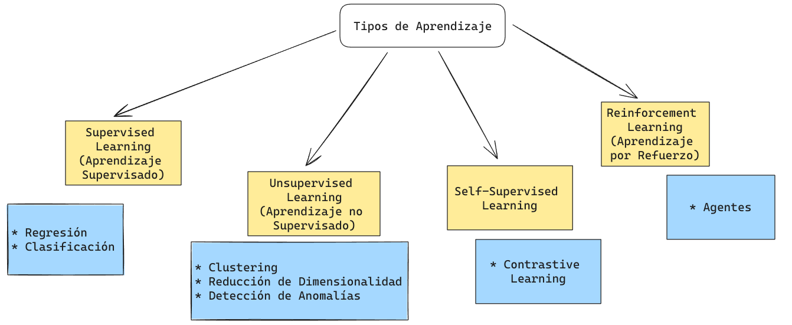{.lightbox}

## demo

``` html
<!DOCTYPE html>
<html lang="es">
<head>
<meta charset="UTF-8">
<meta name="viewport" content="width=device-width, initial-scale=1.0">
<title>Herramientas IA Generativa</title>
<link href="https://fonts.googleapis.com/css2?family=Syne:wght@400;700;800&family=DM+Sans:wght@300;400;500&display=swap" rel="stylesheet">
<style>
  *, *::before, *::after { box-sizing: border-box; margin: 0; padding: 0; }

  :root {
    --plagios:    #a78bfa;
    --pres:       #60a5fa;
    --av:         #34d399;
    --pdf:        #f472b6;
    --acad:       #fbbf24;
    --revision:   #fb923c;
    --datos:      #f87171;
    --escritura:  #818cf8;
    --bg: #0a0a1a;
    --card: #13132a;
  }

  body {
    background: var(--bg);
    font-family: 'DM Sans', sans-serif;
    color: #e2e8f0;
    min-height: 100vh;
    display: flex;
    flex-direction: column;
    align-items: center;
    padding: 40px 20px 60px;
    overflow-x: hidden;
  }

  h1 {
    font-family: 'Syne', sans-serif;
    font-size: clamp(1.4rem, 3vw, 2.2rem);
    font-weight: 800;
    text-align: center;
    letter-spacing: -0.02em;
    margin-bottom: 8px;
    background: linear-gradient(135deg, #e0e7ff, #a5b4fc, #818cf8);
    -webkit-background-clip: text;
    -webkit-text-fill-color: transparent;
  }

  .subtitle {
    font-size: 0.9rem;
    color: #64748b;
    margin-bottom: 50px;
    font-weight: 300;
    letter-spacing: 0.1em;
    text-transform: uppercase;
  }

  .wheel-wrapper {
    position: relative;
    width: min(700px, 92vw);
    height: min(700px, 92vw);
    margin-bottom: 60px;
  }

  .wheel-svg {
    width: 100%;
    height: 100%;
    filter: drop-shadow(0 0 40px rgba(99,102,241,0.3));
    animation: spin-in 1.2s cubic-bezier(0.34,1.56,0.64,1) both;
  }

  @keyframes spin-in {
    from { opacity: 0; transform: scale(0.7) rotate(-30deg); }
    to   { opacity: 1; transform: scale(1) rotate(0deg); }
  }

  .sector-path {
    cursor: pointer;
    transition: opacity 0.2s, filter 0.2s;
    opacity: 0.85;
  }
  .sector-path:hover {
    opacity: 1;
    filter: brightness(1.25) drop-shadow(0 0 12px currentColor);
  }
  .sector-path.dimmed { opacity: 0.2; }
  .sector-path.active  { opacity: 1; filter: brightness(1.3) drop-shadow(0 0 18px currentColor); }

  .center-circle {
    cursor: pointer;
  }

  /* Info panel */
  .info-panel {
    width: min(700px, 92vw);
    background: var(--card);
    border-radius: 20px;
    padding: 0;
    overflow: hidden;
    border: 1px solid rgba(255,255,255,0.06);
    box-shadow: 0 20px 60px rgba(0,0,0,0.4);
    transition: all 0.4s cubic-bezier(0.34,1.2,0.64,1);
    max-height: 0;
    opacity: 0;
  }
  .info-panel.visible {
    max-height: 500px;
    opacity: 1;
    margin-bottom: 40px;
  }

  .panel-header {
    display: flex;
    align-items: center;
    gap: 16px;
    padding: 24px 28px 20px;
    border-bottom: 1px solid rgba(255,255,255,0.06);
  }

  .panel-dot {
    width: 14px;
    height: 14px;
    border-radius: 50%;
    flex-shrink: 0;
  }

  .panel-title {
    font-family: 'Syne', sans-serif;
    font-size: 1.25rem;
    font-weight: 700;
  }

  .panel-emoji {
    font-size: 1.5rem;
    margin-left: auto;
  }

  .tools-grid {
    display: grid;
    grid-template-columns: repeat(auto-fill, minmax(140px, 1fr));
    gap: 12px;
    padding: 24px 28px;
  }

  .tool-card {
    background: rgba(255,255,255,0.04);
    border-radius: 12px;
    padding: 14px 16px;
    border: 1px solid rgba(255,255,255,0.07);
    transition: transform 0.2s, background 0.2s;
    animation: pop-in 0.3s cubic-bezier(0.34,1.56,0.64,1) both;
  }

  .tool-card:hover {
    transform: translateY(-3px);
    background: rgba(255,255,255,0.08);
  }

  @keyframes pop-in {
    from { opacity: 0; transform: scale(0.8) translateY(8px); }
    to   { opacity: 1; transform: scale(1) translateY(0); }
  }

  .tool-name {
    font-weight: 500;
    font-size: 0.9rem;
    color: #e2e8f0;
  }

  .tool-desc {
    font-size: 0.72rem;
    color: #64748b;
    margin-top: 3px;
    line-height: 1.4;
  }

  /* Legend */
  .legend {
    display: grid;
    grid-template-columns: repeat(auto-fill, minmax(200px, 1fr));
    gap: 10px;
    width: min(700px, 92vw);
    animation: fadeUp 0.8s 0.8s both;
  }

  @keyframes fadeUp {
    from { opacity: 0; transform: translateY(20px); }
    to   { opacity: 1; transform: translateY(0); }
  }

  .legend-item {
    display: flex;
    align-items: center;
    gap: 10px;
    padding: 10px 14px;
    background: var(--card);
    border-radius: 10px;
    cursor: pointer;
    border: 1px solid rgba(255,255,255,0.05);
    transition: background 0.2s, transform 0.2s;
  }
  .legend-item:hover { background: rgba(255,255,255,0.07); transform: translateX(4px); }

  .legend-dot {
    width: 10px;
    height: 10px;
    border-radius: 50%;
    flex-shrink: 0;
  }

  .legend-label {
    font-size: 0.82rem;
    font-weight: 500;
    color: #cbd5e1;
  }

  .hint {
    font-size: 0.78rem;
    color: #475569;
    text-align: center;
    margin-bottom: 24px;
    letter-spacing: 0.05em;
  }
</style>
</head>
<body>

<h1>Herramientas de Inteligencia Artificial Generativa</h1>
<p class="subtitle">Haz clic en cada sector para explorar las herramientas</p>

<div class="wheel-wrapper">
  <svg class="wheel-svg" viewBox="-10 -10 520 520" id="wheel">
    <defs>
      <filter id="glow">
        <feGaussianBlur stdDeviation="3" result="coloredBlur"/>
        <feMerge><feMergeNode in="coloredBlur"/><feMergeNode in="SourceGraphic"/></feMerge>
      </filter>
    </defs>
    <!-- Sectors drawn via JS -->
  </svg>
</div>

<div class="info-panel" id="infoPanel">
  <div class="panel-header">
    <div class="panel-dot" id="panelDot"></div>
    <div class="panel-title" id="panelTitle"></div>
    <div class="panel-emoji" id="panelEmoji"></div>
  </div>
  <div class="tools-grid" id="toolsGrid"></div>
</div>

<p class="hint">↑ Haz clic en un sector de la rueda o en la leyenda</p>

<div class="legend" id="legend"></div>

<script>
const CX = 250, CY = 250, R_OUTER = 240, R_INNER = 90, R_LABEL = 175, R_ICON = 210;

const sectors = [
  {
    id: "plagios",
    label: "Detectar\nPlagios",
    emoji: "🔍",
    color: "#a78bfa",
    tools: [
      {name:"Copyleaks", desc:"Detección avanzada de plagio y contenido IA"},
      {name:"ZeroGPT",   desc:"Identifica texto generado por IA"},
      {name:"GPTZero",   desc:"Analiza escritura humana vs IA"},
      {name:"Turnitin",  desc:"Estándar académico anti-plagio"},
    ]
  },
  {
    id: "pres",
    label: "Crear\nPresentaciones",
    emoji: "🎨",
    color: "#60a5fa",
    tools: [
      {name:"Gamma",    desc:"Presentaciones con IA en segundos"},
      {name:"SlidesAI", desc:"Convierte texto en slides"},
      {name:"Pixelcut", desc:"Diseño gráfico con IA"},
      {name:"Clipdrop", desc:"Edición de imágenes inteligente"},
      {name:"OpenArt",  desc:"Generación de arte con IA"},
    ]
  },
  {
    id: "av",
    label: "Crear Audio\ny Video",
    emoji: "🎬",
    color: "#34d399",
    tools: [
      {name:"Pictory",   desc:"Convierte texto a video"},
      {name:"HeyGen",    desc:"Avatares con IA para video"},
      {name:"D-ID",      desc:"Videos con presentadores digitales"},
      {name:"Vidyo.ai",  desc:"Recorta clips virales con IA"},
      {name:"CapCut",    desc:"Editor de video con IA integrada"},
      {name:"Runway",    desc:"Efectos y generación de video"},
      {name:"Synthesia", desc:"Video corporativo con avatares"},
      {name:"Soundraw",  desc:"Música generada por IA"},
    ]
  },
  {
    id: "pdf",
    label: "Extraer info\nde PDF",
    emoji: "📄",
    color: "#f472b6",
    tools: [
      {name:"Humata",   desc:"Pregunta sobre tus documentos"},
      {name:"ChatPDF",  desc:"Chatea con cualquier PDF"},
      {name:"ChatDOC",  desc:"Analiza documentos con IA"},
      {name:"AskYourPDF", desc:"Extrae respuestas de PDFs"},
    ]
  },
  {
    id: "acad",
    label: "Redacción\nAcadémica",
    emoji: "🎓",
    color: "#fbbf24",
    tools: [
      {name:"Trinka",  desc:"Corrección para ciencia y academia"},
      {name:"Jenni",   desc:"Asistente de escritura académica"},
      {name:"Elicit",  desc:"Busca y resume papers científicos"},
      {name:"Consensus",desc:"Respuestas basadas en evidencia"},
    ]
  },
  {
    id: "revision",
    label: "Edición y\nRevisión",
    emoji: "✏️",
    color: "#fb923c",
    tools: [
      {name:"Inger",     desc:"Corrección de textos científicos"},
      {name:"Wordvice",  desc:"Edición y paráfrasis con IA"},
      {name:"Paperpal",  desc:"Revisión académica en tiempo real"},
      {name:"Smodin",    desc:"Reescritura y paráfrasis"},
      {name:"Writefull", desc:"Revisión de lenguaje académico"},
    ]
  },
  {
    id: "datos",
    label: "Visualización\nde Datos",
    emoji: "📊",
    color: "#f87171",
    tools: [
      {name:"Akkio",      desc:"Análisis predictivo sin código"},
      {name:"Polymer",    desc:"Explora datos con IA"},
      {name:"MonkeyLearn",desc:"Text analytics automático"},
      {name:"Julius AI",  desc:"Analiza datos en lenguaje natural"},
    ]
  },
  {
    id: "escritura",
    label: "Escritura\nAsistida",
    emoji: "🖊️",
    color: "#818cf8",
    tools: [
      {name:"ChatGPT",   desc:"Asistente conversacional de OpenAI"},
      {name:"Jasper",    desc:"Copywriting y marketing con IA"},
      {name:"Otter.ai",  desc:"Transcripción automática de audio"},
      {name:"DeepL",     desc:"Traducción de alta calidad"},
      {name:"Reverso",   desc:"Traducción y conjugación"},
      {name:"Piktochart",desc:"Infografías con IA"},
    ]
  },
];

const n = sectors.length;
const angleStep = (2 * Math.PI) / n;
const startOffset = -Math.PI / 2;

function polarToXY(cx, cy, r, angle) {
  return [cx + r * Math.cos(angle), cy + r * Math.sin(angle)];
}

function sectorPath(i) {
  const a1 = startOffset + i * angleStep + 0.015;
  const a2 = startOffset + (i + 1) * angleStep - 0.015;
  const [x1, y1] = polarToXY(CX, CY, R_OUTER, a1);
  const [x2, y2] = polarToXY(CX, CY, R_OUTER, a2);
  const [x3, y3] = polarToXY(CX, CY, R_INNER, a2);
  const [x4, y4] = polarToXY(CX, CY, R_INNER, a1);
  return `M ${x1} ${y1} A ${R_OUTER} ${R_OUTER} 0 0 1 ${x2} ${y2} L ${x3} ${y3} A ${R_INNER} ${R_INNER} 0 0 0 ${x4} ${y4} Z`;
}

const svg = document.getElementById('wheel');
let activeIndex = null;

// Draw sectors
sectors.forEach((s, i) => {
  const midAngle = startOffset + (i + 0.5) * angleStep;

  // Sector path
  const path = document.createElementNS("http://www.w3.org/2000/svg","path");
  path.setAttribute("d", sectorPath(i));
  path.setAttribute("fill", s.color);
  path.setAttribute("class","sector-path");
  path.setAttribute("data-i", i);
  svg.appendChild(path);

  // Emoji icon
  const [ex, ey] = polarToXY(CX, CY, R_ICON, midAngle);
  const emojiEl = document.createElementNS("http://www.w3.org/2000/svg","text");
  emojiEl.setAttribute("x", ex);
  emojiEl.setAttribute("y", ey);
  emojiEl.setAttribute("text-anchor","middle");
  emojiEl.setAttribute("dominant-baseline","central");
  emojiEl.setAttribute("font-size","22");
  emojiEl.setAttribute("style","pointer-events:none;");
  emojiEl.textContent = s.emoji;
  svg.appendChild(emojiEl);

  // Label
  const [lx, ly] = polarToXY(CX, CY, R_LABEL, midAngle);
  const lines = s.label.split("\n");
  const text = document.createElementNS("http://www.w3.org/2000/svg","text");
  text.setAttribute("x", lx);
  text.setAttribute("y", ly);
  text.setAttribute("text-anchor","middle");
  text.setAttribute("dominant-baseline","central");
  text.setAttribute("font-family","Syne, sans-serif");
  text.setAttribute("font-weight","700");
  text.setAttribute("fill","#0a0a1a");
  text.setAttribute("style","pointer-events:none;");
  lines.forEach((line, li) => {
    const tspan = document.createElementNS("http://www.w3.org/2000/svg","tspan");
    tspan.setAttribute("x", lx);
    tspan.setAttribute("dy", li === 0 ? (lines.length > 1 ? "-0.55em" : "0") : "1.2em");
    tspan.setAttribute("font-size", lines[0].length > 8 ? "11" : "12");
    tspan.textContent = line;
    text.appendChild(tspan);
  });
  svg.appendChild(text);

  // Click
  path.addEventListener("click", () => toggleSector(i));
});

// Center circle
const centerGroup = document.createElementNS("http://www.w3.org/2000/svg","g");
centerGroup.setAttribute("class","center-circle");

const centerBg = document.createElementNS("http://www.w3.org/2000/svg","circle");
centerBg.setAttribute("cx", CX); centerBg.setAttribute("cy", CY);
centerBg.setAttribute("r", R_INNER - 4);
centerBg.setAttribute("fill","#0a0a1a");
centerBg.setAttribute("stroke","rgba(255,255,255,0.1)");
centerBg.setAttribute("stroke-width","2");

const centerGlow = document.createElementNS("http://www.w3.org/2000/svg","circle");
centerGlow.setAttribute("cx", CX); centerGlow.setAttribute("cy", CY);
centerGlow.setAttribute("r", R_INNER - 10);
centerGlow.setAttribute("fill","url(#cgradient)");
centerGlow.setAttribute("opacity","0.3");

const defs = document.createElementNS("http://www.w3.org/2000/svg","defs");
const cgradient = document.createElementNS("http://www.w3.org/2000/svg","radialGradient");
cgradient.setAttribute("id","cgradient");
const stop1 = document.createElementNS("http://www.w3.org/2000/svg","stop");
stop1.setAttribute("offset","0%"); stop1.setAttribute("stop-color","#818cf8");
const stop2 = document.createElementNS("http://www.w3.org/2000/svg","stop");
stop2.setAttribute("offset","100%"); stop2.setAttribute("stop-color","#0a0a1a");
cgradient.appendChild(stop1); cgradient.appendChild(stop2);
defs.appendChild(cgradient);
svg.insertBefore(defs, svg.firstChild);

const centerText1 = document.createElementNS("http://www.w3.org/2000/svg","text");
centerText1.setAttribute("x", CX); centerText1.setAttribute("y", CY - 12);
centerText1.setAttribute("text-anchor","middle");
centerText1.setAttribute("font-family","Syne, sans-serif");
centerText1.setAttribute("font-weight","800");
centerText1.setAttribute("font-size","13");
centerText1.setAttribute("fill","#e2e8f0");
centerText1.textContent = "Herramientas";

const centerText2 = document.createElementNS("http://www.w3.org/2000/svg","text");
centerText2.setAttribute("x", CX); centerText2.setAttribute("y", CY + 6);
centerText2.setAttribute("text-anchor","middle");
centerText2.setAttribute("font-family","Syne, sans-serif");
centerText2.setAttribute("font-weight","800");
centerText2.setAttribute("font-size","13");
centerText2.setAttribute("fill","#e2e8f0");
centerText2.textContent = "IA Generativa";

const centerEmoji = document.createElementNS("http://www.w3.org/2000/svg","text");
centerEmoji.setAttribute("x", CX); centerEmoji.setAttribute("y", CY + 28);
centerEmoji.setAttribute("text-anchor","middle");
centerEmoji.setAttribute("font-size","18");
centerEmoji.textContent = "🤖";

centerGroup.appendChild(centerBg);
centerGroup.appendChild(centerGlow);
centerGroup.appendChild(centerText1);
centerGroup.appendChild(centerText2);
centerGroup.appendChild(centerEmoji);
svg.appendChild(centerGroup);
centerGroup.addEventListener("click", () => closePanel());

// Legend
const legend = document.getElementById("legend");
sectors.forEach((s, i) => {
  const item = document.createElement("div");
  item.className = "legend-item";
  item.innerHTML = `<div class="legend-dot" style="background:${s.color}"></div><span class="legend-label">${s.emoji} ${s.label.replace("\n"," ")}</span>`;
  item.addEventListener("click", () => toggleSector(i));
  legend.appendChild(item);
});

// Panel logic
function toggleSector(i) {
  if (activeIndex === i) { closePanel(); return; }
  activeIndex = i;
  updateSectorStyles();
  showPanel(i);
}

function closePanel() {
  activeIndex = null;
  updateSectorStyles();
  const panel = document.getElementById("infoPanel");
  panel.classList.remove("visible");
}

function updateSectorStyles() {
  document.querySelectorAll(".sector-path").forEach(p => {
    const pi = parseInt(p.getAttribute("data-i"));
    p.classList.remove("active","dimmed");
    if (activeIndex !== null) {
      if (pi === activeIndex) p.classList.add("active");
      else p.classList.add("dimmed");
    }
  });
}

function showPanel(i) {
  const s = sectors[i];
  const panel = document.getElementById("infoPanel");
  const dot = document.getElementById("panelDot");
  const title = document.getElementById("panelTitle");
  const emoji = document.getElementById("panelEmoji");
  const grid = document.getElementById("toolsGrid");

  panel.style.borderTop = `3px solid ${s.color}`;
  dot.style.background = s.color;
  title.textContent = s.label.replace("\n"," ");
  title.style.color = s.color;
  emoji.textContent = s.emoji;

  grid.innerHTML = "";
  s.tools.forEach((t, ti) => {
    const card = document.createElement("div");
    card.className = "tool-card";
    card.style.animationDelay = `${ti * 0.05}s`;
    card.style.borderTop = `2px solid ${s.color}40`;
    card.innerHTML = `<div class="tool-name">${t.name}</div><div class="tool-desc">${t.desc}</div>`;
    grid.appendChild(card);
  });

  panel.classList.add("visible");
  panel.scrollIntoView({behavior:"smooth", block:"nearest"});
}
</script>
</body>
</html>
```

## Reinforcement Learning {.smaller}

::: columns
::: column
::: r-stack
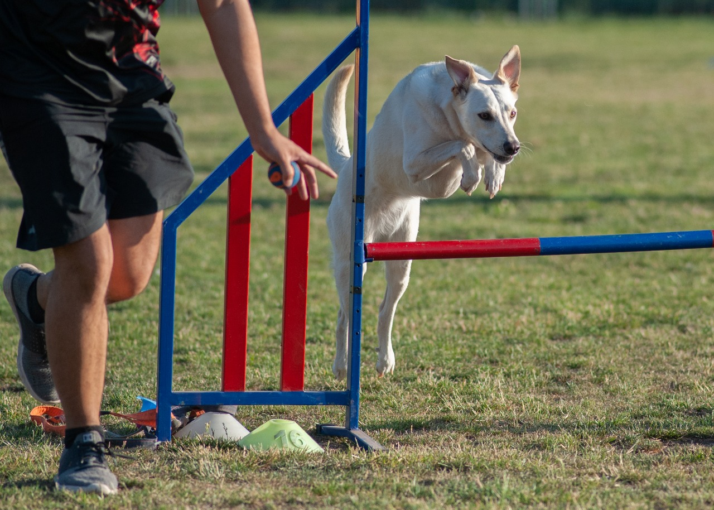{.lightbox .fragment width="50%" fig-align="center" fragment-index="1"}

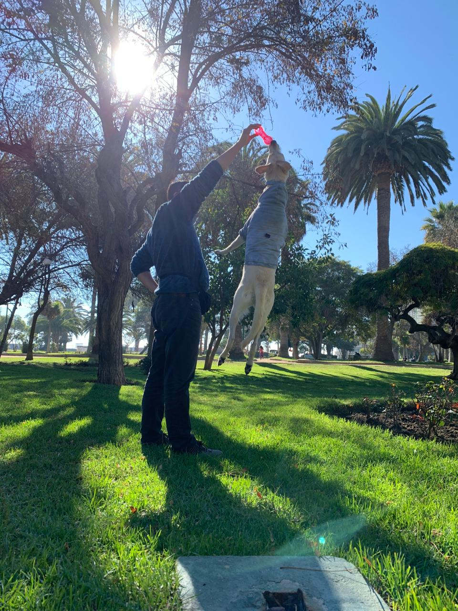{.lightbox .fragment width="50%" fig-align="center" fragment-index="2"}

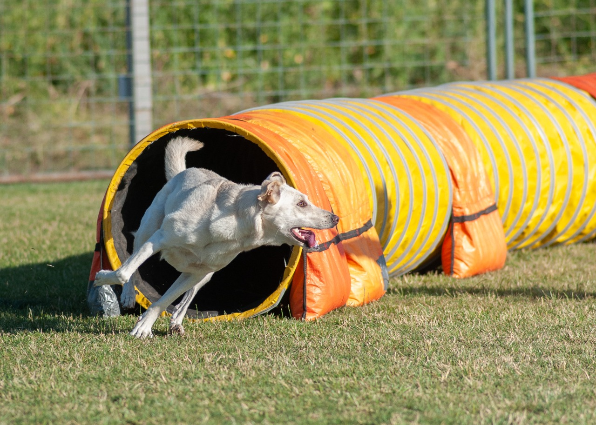{.lightbox .fragment width="50%" fig-align="center" fragment-index="3"}

{.lightbox .fragment width="50%" fig-align="center" fragment-index="4"}

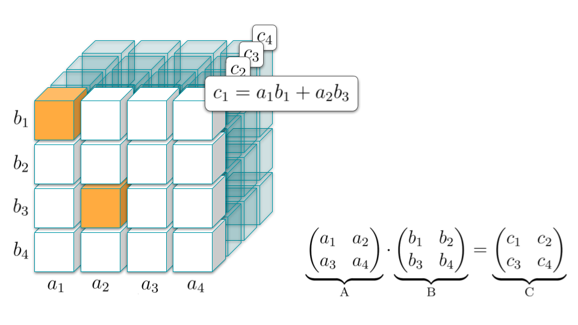{.lightbox .fragment fragment-index="5"}

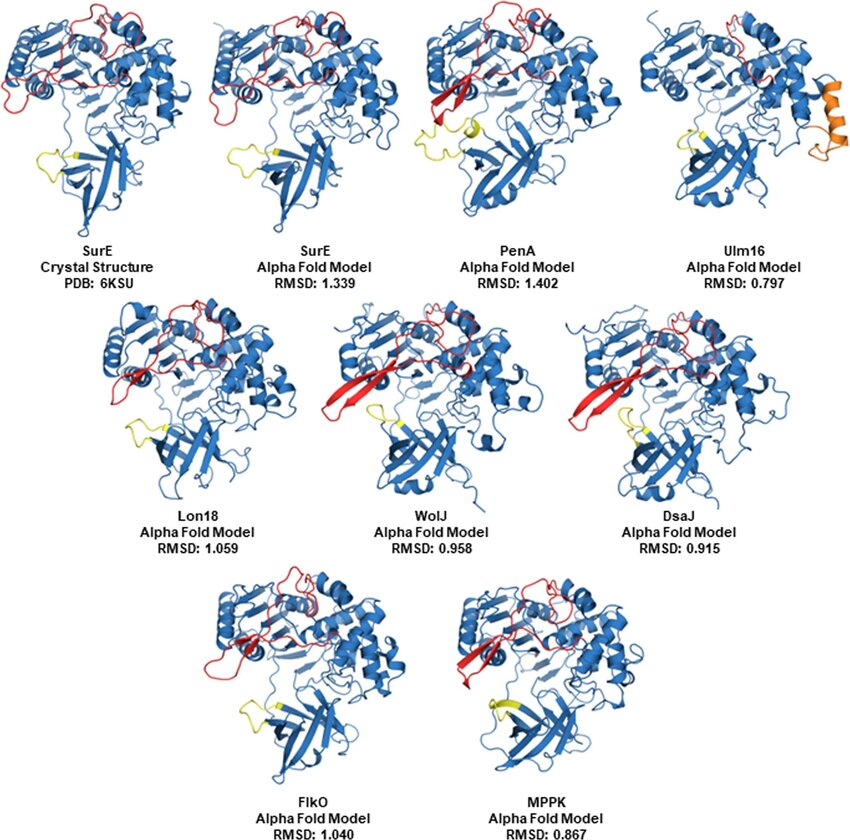{.lightbox .fragment fragment-index="6"}
:::
:::

::: column
::: {.callout-note .fragment fragment-index="1"}
En este tipo de aprendizaje se enseña por refuerzo. Es decir se da una recompensa si el sistema aprende lo que queremos.
:::

::: {.callout-tip .fragment fragment-index="2"}
Si el premio es mayor, se pueden obtener aprendizajes mayores.
:::

::: {.callout-important .fragment fragment-index="5"}
Un ejemplo de esto es **AlphaTensor** en el cual un modelo `aprendió` una nueva manera de multiplicar matrices que es más eficiente.
:::

::: {.callout-important .fragment fragment-index="6"}
Otro ejemplo es **AlphaFold** donde el modelo `aprendió/descubrió` cómo se doblan las proteínas cuando se vuelven aminoácidos.
:::
:::
:::

## Problemas Supervisados: Regresión y Clasificación {.smaller}

::: columns
::: {.column width="50%"}
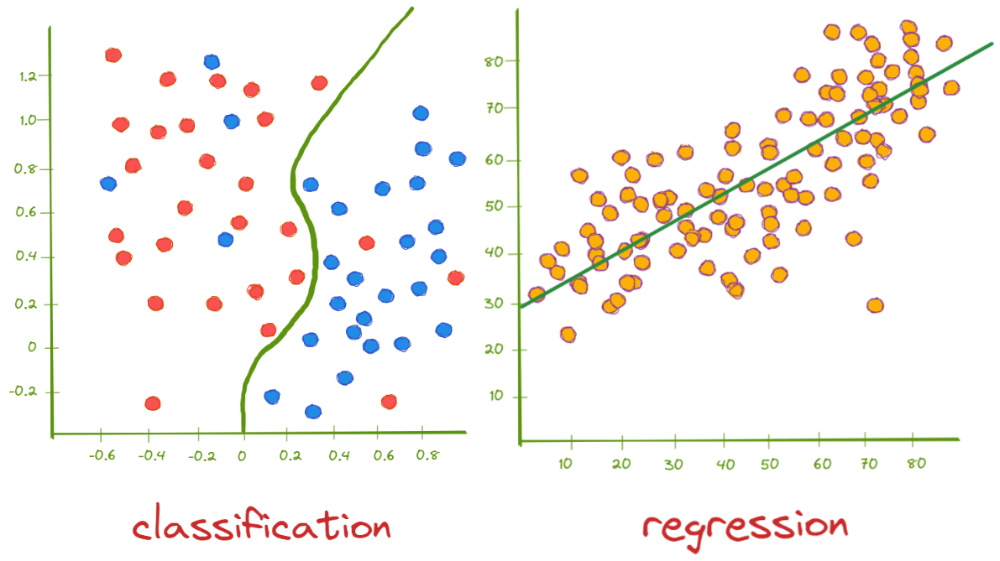{fig-align="center"}

::: {.callout-tip .fragment fragment-index="3"}
-   **Regresión**: Se busca estimar un valor continuo.
    -   `(Estimar el valor de una casa)`.
-   **Clasificación**: Se busca encontrar una categoría o un valor discreto.
    -   `(Clasificar una imagen como Perro o Gato)`.
:::

::: {.callout-important .fragment fragment-index="3"}
-   Para entrenar este tipo de modelos se necesitan `etiquetas`, es decir, la respuesta esperada del modelo.
:::
:::

::: {.column width="50%"}
{.fragment fragment-index="1" fig-align="center" width="60%"}

{.fragment fragment-index="2" fig-align="center" width="60%"}
:::
:::

::: notes
-   Ambos ejemplos se pueden realizar utilizando Largo (Eje Y) y Peso (Eje X).
:::

## Clustering {.smaller}

{.lightbox fig-align="center" width="60%"}

::: {.callout-tip .fragment}
-   **Clusters**: Una categoría en la que sus componentes son similares. Los clusters normalmente no tienen un nombre propio, sino que uno les asigna uno.
-   También se les llama segmentos. No usar la palabra `clase`.
:::

::: {.callout-caution .fragment}
-   No requiere de etiquetas, por lo tanto, no es posible evaluar su desempeño de manera 100% acertada.
:::

## Reducción de Dimensionalidad {.smaller}

{.lightbox fig-align="center" height="60%"}

::: callout-tip
-   **Reducción de la Dimensionalidad**: Eliminar complejidad sin perder información clave para poder entender su comportamiento.
:::

## Nuestro Sistema de ML {.smaller}

Creemos un Sistema de ML que sea capaz de ver una imágen y pronunciar correctamente el uso de la letra `C`.

::: callout-note
Vamos a `Entrenar` un Modelo.
:::

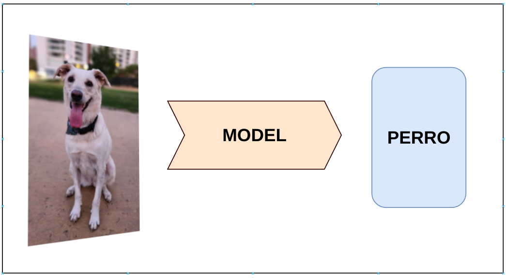{.fragment .lightbox fig-align="center" width="60%"}

## Nuestro Sistema de ML: Entrenamiento {.smaller}

::: {layout-ncol="3"}
{fig-align="center" width="70%"}

{fig-align="center" width="70%"}

{fig-align="center" width="70%"}
:::

::: fragment
::: callout-important
**¿Qué patrones está aprendiendo el modelo?**
:::
:::

Entrenamiento

:   Es el proceso en el cuál se permite al modelo aprender. En este proceso se le entregan ejemplos (`Train Set`) para que el modelo de manera `autónoma` pueda aprender `patrones` que le permitan resolver la tarea dada.

## Nuestro Sistema de ML: Inferencia {.smaller}

Inferencia/Predicción

:   Se refiere al proceso en el que el modelo tiene que demostrar cuál sería su decisión de acuerdo a los patrones aprendidos en el proceso de entrenamiento. Los ejemplos en los que se prueba se le denomina `Test Set`.

::: {layout-ncol="4"}
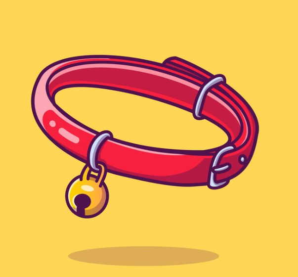{.fragment fig-align="center" width="50%" fragment-index="1"}

{.fragment fig-align="center" width="50%" fragment-index="3"}

{.fragment fig-align="center" width="50%" fragment-index="5"}

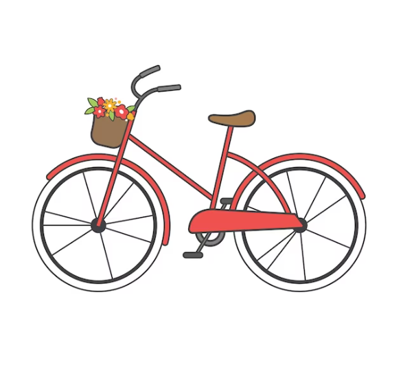{.fragment fig-align="center" width="50%" fragment-index="7"}
:::

::: {layout-ncol="4"}
::: {.fragment fragment-index="2"}
`K`ollar
:::

::: {.fragment fragment-index="4"}
`K`onejo
:::

::: {.fragment fragment-index="6"}
`K`u`k`illo
:::

::: {.fragment fragment-index="8"}
Bi`k`i`k`leta
:::
:::

::: {.fragment fragment-index="11"}

Generalización

:   Se le llama generalización a la capacidad del modelo de aplicar lo aprendido de manera correcta en ejemplos no vistos.
:::

## Nuestro Sistema de ML: Nuevas instancias de Entrenamiento

::: {layout-ncol="3"}
{.fragment .fade-out fig-align="center" width="70%" fragment-index="2"}

{fig-align="center" width="70%"}

{fig-align="center" width="70%"}
:::

::: {.callout-warning .fragment fragment-index="1"}
No es bueno entrenar con las mismas instancias de de `Test`, es decir, con las cuales se evalúa el modelo. **¿Por qué?**
:::

::: notes
Mencionar el caso de error de ImageNet.
:::

## Nuestro Sistema de ML: Reevaluemos nuestro Modelo {.smaller}

::: {layout-ncol="5"}
{.fragment fig-align="center" width="50%" fragment-index="1"}

{.fragment fig-align="center" width="50%" fragment-index="3"}

{.fragment fig-align="center" width="50%" fragment-index="5"}

{.fragment fig-align="center" width="50%" fragment-index="7"}
:::

::: {layout-ncol="4"}
::: {.fragment fragment-index="2"}
`K`ollar
:::

::: {.fragment fragment-index="4"}
`K`onejo
:::

::: {.fragment fragment-index="6"}
`K`u`ch`illo
:::

::: {.fragment fragment-index="8"}
Bi`s`i`k`leta
:::
:::

::: {.fragment fragment-index="9"}

Evaluación

:   Utilizar una métrica que permita `ponerle nota` al modelo.
:::

::: {.fragment fragment-index="10"}
-   1er Modelo: 2 correctas de 4, es decir **50%**.
:::

::: {.fragment fragment-index="11"}
-   2do Modelo: 4 correctas de 4, es decir **100%**.
:::

## Problemas del Aprendizaje {.smaller}

::: {.fragment fragment-index="1"}
Supongamos que queremos utilizar nuestro modelo para pronunciar palabras en otro idioma (otro `Test Set`).

**¿Qué problemas podemos encontrar?**
:::

::: columns
::: {.column .incremental}
-   Stomach $\rightarrow$ Stoma[k]{style="color:green;"}

-   Archer $\rightarrow$ Ar[ch]{style="color:green;"}er

-   Church $\rightarrow$ [Ch]{style="color:green;"}ur`k`

    -   [Ch]{style="color:green;"}ur[ch]{style="color:green;"}.

-   Archeology $\rightarrow$ Ar`ch`eology

    -   Ar[k]{style="color:green;"}eology.

-   Chicago $\rightarrow$ `Ch`icago

    -   [Sh]{style="color:green;"}icago.

-   Muscle $\rightarrow$ Mus`k`le

    -   Mus[\_]{style="color:green;"}le.

-   Ich mag Schweinefleisch $\rightarrow$ I`ch` mag S`ch`weinefleis`k`.

    -   I[j]{style="color:green;"} mag [Sh]{style="color:green;"}vaineflai[sh]{style="color:green;"}.
:::

::: column
::: {.callout-important .fragment}
Claramente tenemos un problema. **¿A qué se debe esto?**
:::
:::
:::

## Problemas del Aprendizaje: Definiciones {.smaller}

Overfitting (Sobreajuste)

:   Se refiere a cuando un modelo no es capaz de generalizar de manera correcta, porque se ajusta `demasiado` bien (llegando a `memorizar`) a los datos de entrenamiento. **¿Cómo se puede mitigar este problema?**

::: {.callout-caution .fragment}
Se le tiende a llamar `sobreentrenamiento`, pero no es del todo correcto para el caso de modelos de Machine Learning. Lo más correcto es que el `sobreentrenamiento` provoca overfitting.
:::

::: notes
Mostrar ejemplos en Pizarra de manera gráfica. Ejemplos típicos de Excel.
:::

::: fragment

Underfitting (Subajuste)

:   Se refiere a cuando un modelo no es capaz de generalizar de manera correcta, pero a diferencia del overfitting `no se ha ajustado` correctamente a los datos. **¿Cómo se vería el underfitting en nuestro ejemplo?**
:::

## Etapas del Modelamiento: Crisp-DM

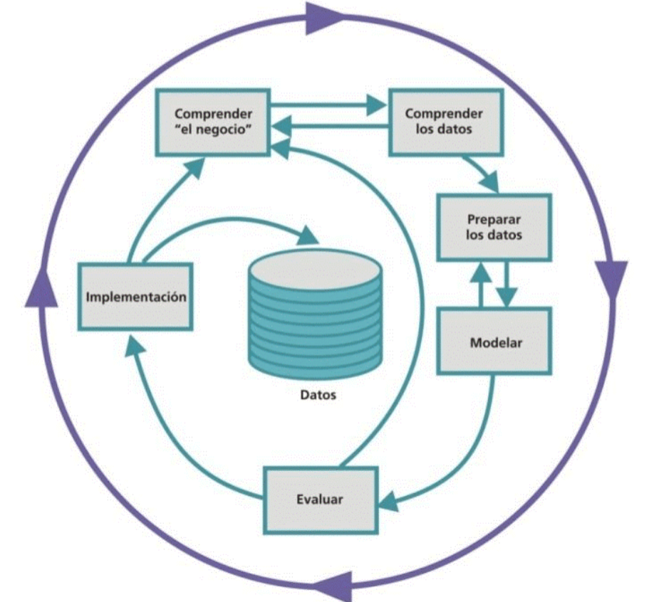{.lightbox width="50%" fig-align="center"}

## Etapas del Modelamiento: KDD

{.lightbox width="80%" fig-align="center"}

## Etapas del Modelamiento: Semma

{.lightbox width="60%" fig-align="center"}

## Etapas del Modelamiento: Metodología Propia

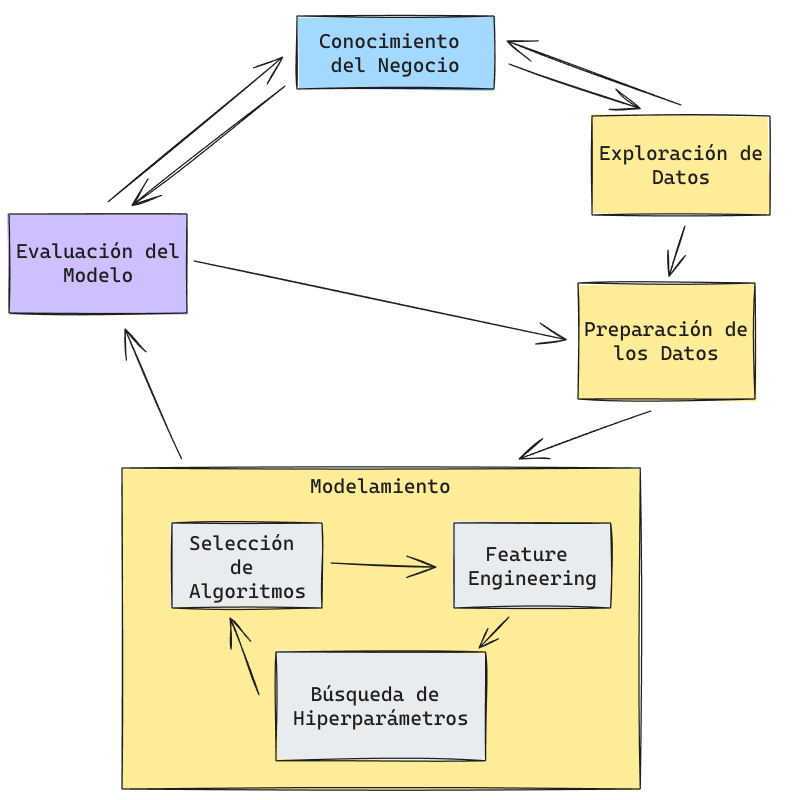{.lightbox width="50%" fig-align="center"}

## Preguntas para terminar

-   ¿Qué tipo de modelo debo implementar si quiero estimar la temperatura del día de mañana?
-   ¿Qué tipo de modelo debo implementar si es que quiero detectar barrios de acuerdo a su condición socio-economica?
-   Si mi modelo aprende a resolver ejercicios de matemática.
    -   ¿Cómo se vería el overfitting?
    -   ¿Cómo se vería el underfitting?

------------------------------------------------------------------------

## ¿Qué es Scikit-Learn? {.smaller}

::: columns
::: {.column width="30%"}

:::

::: {.column width="70%"}
-   `Scikit-Learn` (`sklearn` para los amigos) es una librería creada por David Cournapeau, como un Google Summer Code Project y luego Matthieu Brucher en su tesis.
-   En 2010 queda a cargo de [INRIA](https://www.inria.cl/es) y tiene un ciclo de actualización de 3 meses.
-   Es la librería más famosa y poderosa para hacer Machine Learning hoy en día.
-   Su API es tan famosa, que hoy se sabe que una librería es de `calidad` si sigue los estándares implementados por `Scikit-Learn`.
-   Para que un algoritmo sea parte de `Scikit-Learn` debe poseer 3 años desde su publicación y 200+ citaciones mostrando su utilidad y amplio uso (ver [acá](https://scikit-learn.org/stable/faq.html#new-algorithms-inclusion-criteria)).
-   Además es una librería que obliga a que sus algoritmos tengan la capacidad de generalizar.
:::
:::

## Diseño {.smaller}

-   `Scikit-Learn` sigue un patrón de `Programación Orientada a Objetos (POO)` basado en clases.

::: callout-note
-   En programación, una clase es un objeto que internamente contiene estados que pueden ir cambiando en el tiempo.
    -   Una clase posee:
        -   **Métodos**: Funciones que cambian el comportamiento de la clase.
        -   **Atributos**: Datos propios de la clase.
:::

::: {.incremental style="font-size: 90%;"}
`Scikit-Learn` sigue el siguiente estándar:

-   Todas las Clases se escriben en `CamelCase`: Ej: `KMeans`,`LogisticRegression`, `StandardScaler`.
-   Las clases en Scikit-Learn pueden representar algoritmos, o etapas de un preprocesamiento.
    -   Los algoritmos se denominan `Estimators`.
    -   Los preprocesamientos se denominan `Transformers`.
-   Las funciones se escriben como `snake_case` y permiten realizar algunas operaciones básicas en el proceso de modelamiento. Ej: `train_test_split()`, `cross_val_score()`.
-   Normalmente se utilizan letras mayúsculas para denotar `Matrices` o `DataFrames`, mientras que las letras minúsculas denotan `Vectores` o `Series`.
:::

## Estimadores No supervisados

``` {.python code-line-numbers="|1|2|3|5|7-8|"}
from sklearn.sub_modulo import Estimator 
model = Estimator(hp1=v1, hp2=v2,...) 
model.fit(X) 

y_pred = model.predict(X) 

## Opcionalmente se puede entrenar y predecir a la vez.
model.fit_predict(X) 
```

<br>

::: {style="font-size: 75%;"}
L1. Importar la clase a utilizar.

L2. `Instanciar` el modelo y sus `hiperparámetros`.

L3. `Entrenar` o ajustar el modelo (Requiere sólo de X).

L5. `Predecir`. Los modelos de clasificación tienen la capacidad de generar probabilidades.

L7-8. Este tipo de modelos permite entrenar y predecir en un sólo paso.
:::

## Estimadores Predictivos

``` {.python code-line-numbers="|1|2|3|5-6|8|"}
from sklearn.sub_modulo import Estimator 
model = Estimator(hp1=v1, hp2=v2,...) 
model.fit(X_train, y_train) 

y_pred = model.predict(X_test) 
y_pred_proba = model.predict_proba(X_test)

model.score(X_test,y_test) 
```

<br>

::: {style="font-size: 75%;"}
L1. Importar la clase a utilizar.

L2. `Instanciar` el modelo y sus `hiperparámetros`.

L3. `Entrenar` o ajustar el modelo (Ojo, requiere de `X` e `y`).

L5--6. `Predecir` en datos nuevos. (Algunos modelos pueden predecir probabilidades).

L8. `Evaluar` el modelo en los datos nuevos.
:::

## Output de un Modelo {.smaller}

-   Los modelos no entregan directamente un output sino que los dejan almacenados en su interior como un estado.
-   Los Estimators tienen dos estados:
    -   **Not Fitted**: Modelo antes de ser entrenado
    -   **Fitted**: Una vez que el modelo ya está entrenado. (Después de aplicar `.fit()`)

::: {.callout-tip .fragment}
Muchos modelos pueden entregar información sólo luego de ser entrenados (su atributo termina con un `_`).

Ej: `model.coef_`, `model.intercept_`.
:::

::: {.callout-note .fragment}
El modelo es una herramienta a la cual le entregamos datos (Input), y nos devuelve datos (Predicciones).
:::

## Transformers

::: {.callout-note style="font-size: 70%;"}
-   A diferencia de los `Estimators`, los `Transformers` no son modelos.
-   Su input y su output son datos.
-   Algunos `Transformers` permiten escalar los datos, transformar categorías en números, rellenar valores faltantes. (Veremos más acerca de esto en los `Preprocesamiento`).
:::

::: fragment
``` {.python code-line-numbers="|1|2|3|5|7-8|"}
from sklearn.preprocessing import Transformer 
tr = Transformer(hp1=v1, hp2=v2,...) 
tr.fit(X) 

X_new = tr.transform(X) 

## Opcionalmente
X_new = tr.fit_transform(X) 
```

::: {style="font-size: 65%;"}
L1. Importar la clase a utilizar (en este caso del submodulo `preprocessing`, aunque pueden haber otros como `impute`).

L2. `Instanciar` el Transformer y sus `hiperparámetros`.

L3. `Entrenar` o ajustar el Transformer.

L5. `Transformar` los datos.

L7-8. Adicionalmente se puede `entrenar` y `transformar` los datos en un sólo paso.
:::
:::

## Pipelines {.smaller}

-   En ocasiones un Dataset requiere más de un preprocesamiento.
-   Estas Transformaciones normalmente se hacen en serie de manera consecutiva.

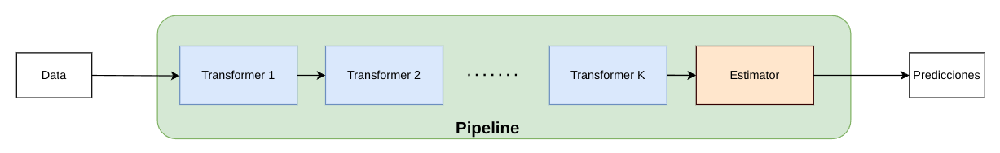{.lightbox fig-align="center"}

::: callout-tip
-   El Estimator es opcional, es decir, el Pipeline puede ser para combinar sólo `Transformers` o `Transformers + un Estimator`.
:::

::: callout-caution
Un Pipeline puede tener **sólo un Estimator**.
:::

## Pipelines: Código

``` {.python code-line-numbers="|1-2|3|5-9|11|12|14|"}
from sklearn.tree import DecisionTreeClassifier 
from sklearn.preprocessing import StandardScaler, OneHotEncoder 
from sklearn.pipeline import Pipeline 

pipe = Pipeline(steps=[ 
    ("ohe", OneHotEncoder()),
    ("sc", StandardScaler()),
    ("model", DecisionTreeClassifier())
])

pipe.fit(X_train, y_train) 
y_pred = pipe.predict(X_test) 

pipe.score(X_test, y_test) 
```

::: {style="font-size: 50%;"}
L1-2. Importo mi modelo y mis preprocesamientos

L3. Importo el `Pipeline`.

L5-9. Instancio un `Pipeline`.

L11. Entreno el `Pipeline`.

L12. Predigo utilizando el `Pipeline` entrenado.

L14. Evalúo el modelo en datos no vistos.
:::

## Documentación

> Probablemente `Scikit-Learn` tenga una de las mejores documentaciones existentes.

-   Veamos el caso de la Documentación del [One Hot Encoder](https://scikit-learn.org/stable/modules/generated/sklearn.preprocessing.OneHotEncoder.html#sklearn.preprocessing.OneHotEncoder)

{.lightbox fig-align="center"}

## Preguntas para terminar

-   ¿Cómo se importan las clases en Scikit-Learn?
-   ¿Cuál es la diferencia entre un Transformer y un Estimator?
-   ¿Cuándo es buena idea usar un Pipeline?

------------------------------------------------------------------------

## 🎉 ¡Gracias por Participar! {background-image="images/background.jpg" background-opacity="0.25"}

::: columns
::: {.column width="50%"}
<br>

❓¿Preguntas?

👏 Responder [encuesta](https://docs.google.com/forms/d/e/1FAIpQLSd2CseqhHUjdmvr46ZDb_Aa2iUYEjLAIE4MwLztled5ytRJvg/viewform?usp=dialog)

🥳 Disfrutar del Evento!
:::

::: {.column width="50%" align="center"}
{width="400"}
:::
:::

> 🔗 Nuestro Sitio Web: [sethnut.com/talks](https://sethnut.com/talks/)

```{=html}
<style>
/* Ajusta el tamaño del título y subtítulo */
.reveal .slides h1 {
  font-size: 2em; /* Tamaño más pequeño para el título */
}

.reveal .slides h2 {
  font-size: 1.5em; /* Tamaño más pequeño para el subtítulo */
}

/* Ajusta el tamaño del texto en los párrafos */
.reveal .slides p {
  font-size: 0.8em; /* Texto más pequeño */
}

/* Ajusta el tamaño de las tablas */
.reveal .slides table {
  font-size: 0.8em; /* Tamaño de fuente más pequeño en las tablas */
  width: 90%; /* Ajusta el ancho de la tabla */
  margin: 0 auto; /* Centra la tabla */
}

/* Ajusta el tamaño de los bullets */
.reveal .slides ul {
  font-size: 0.8em; /* Tamaño de fuente más pequeño en los bullets */
}

.reveal .slide-logo {
   max-height: 2em !important;
}
</style>
```