## 🤖 A.I. en el día a día {background-image="images/background.jpg" background-opacity="0.25"}

::: r-stack
<br>

{.fragment .fade-in-then-out fig-align="left"}

{.fragment .fade-in-then-out fig-align="center"}

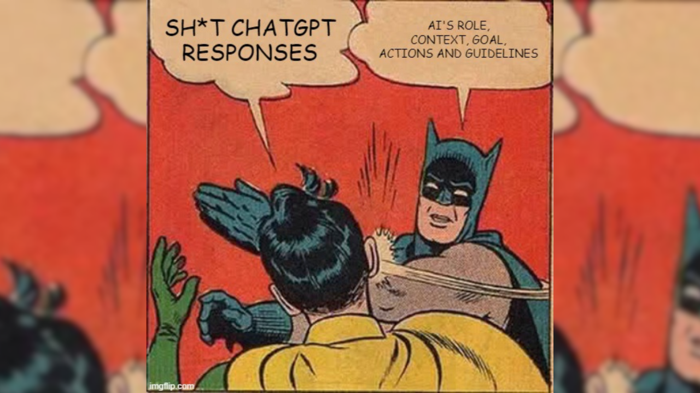{.fragment fig-align="right"}
:::

------------------------------------------------------------------------

## 🎯 Objetivos {background-image="images/background.jpg" background-opacity="0.25"}

::: columns
::: {.column width="40%"}
::: {style="text-align: center;"}
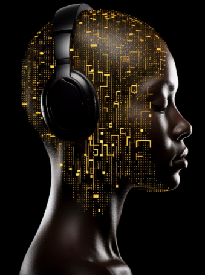
:::
:::

::: {.column .incremental width="60%"}
<br><br>

-   **Comprender los LLM**: Definición, funcionamiento y aplicaciones.\
-   **Asistentes Virtuales**: Uso, prompts y desafíos comunes.\
-   **Ética**: Consideraciones y buenas prácticas.
:::
:::

------------------------------------------------------------------------

##  {background-image="images/background_slides3.png" background-opacity="0.3"}

::: {style="display: flex; justify-content: center; align-items: center; height: 60vh; flex-direction: column; text-align: center;"}
[No es Magia, es Ciencia]{style="font-size: 1em"}

[¿ Qué son los LLM ?]{style="font-size: 2em"}
:::

------------------------------------------------------------------------

## 📖 Large language Model {background-image="images/background.jpg" background-opacity="0.25"}

::: columns
::: {.column .incremental width="60%"}
<br><br>

-   🧠 Los LLMs generan lenguaje natural tras entrenarse con grandes volúmenes de texto.
-   🤖 Se usan en chatbots, asistentes virtuales y tareas de procesamiento de lenguaje.
:::

::: {.column width="40%"}
::: {style="text-align: center;"}
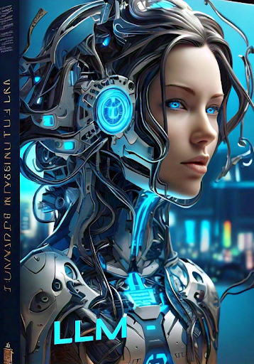
:::
:::
:::

------------------------------------------------------------------------

## 📖 Características LLM {background-image="images/background.jpg" background-opacity="0.25"}

::: columns
::: {.column .incremental width="50%"}
<br><br>

-   📦 Entrenados con billones de parámetros y textos masivos
-   🛠️ Adaptables a múltiples tareas (traducción, resumen, Q&A, etc.)
-   🌍 Aplicables en dominios diversos: salud, educación, negocios
:::

::: {.column width="50%"}
::: {style="text-align: center;"}
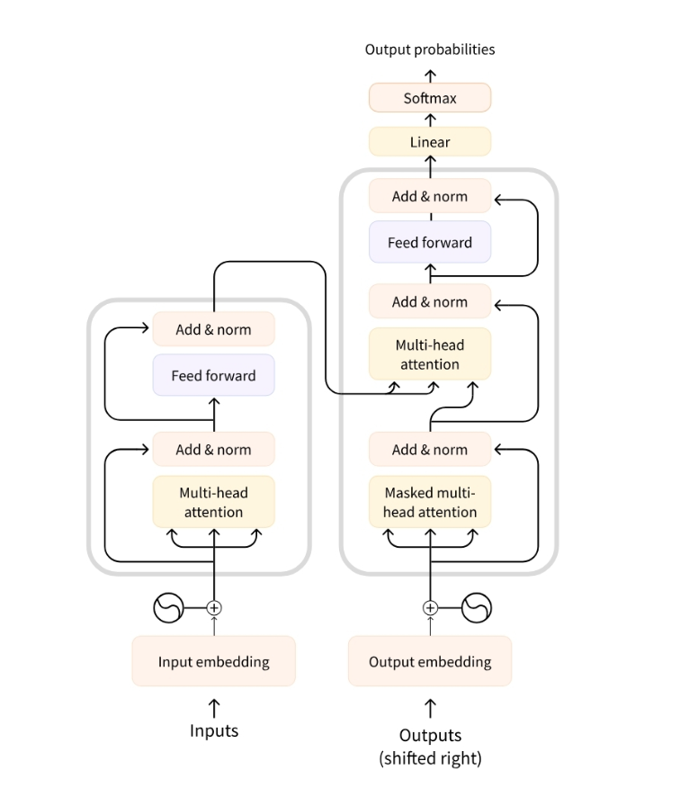
:::
:::
:::

------------------------------------------------------------------------

## ⏳ Historia de los LLM {background-image="images/background.jpg" background-opacity="0.25"}

::: r-stack
{.fragment fig-align="center"}

{.fragment fig-align="center"}
:::

------------------------------------------------------------------------

## 🔥 Desafío {background-image="images/background.jpg" background-opacity="0.25"}

<br><br>

¿Qué contiene la siguiente cadena de bits?

[00000000]{style="font-size: 80px; margin: 0px; color: white"} [00101010]{style="font-size: 80px; margin: 0px;"}

------------------------------------------------------------------------

##  {background-image="images/background.jpg" background-opacity="0.25"}

<br><br><br>

[00000000]{style="font-size: 80px; margin: 0px; color: white"} [00101010]{style="font-size: 80px; margin: 0px;"}

[Podría ser el número 42 escrito en binario...]{.fragment}

------------------------------------------------------------------------

##  {background-image="images/background.jpg" background-opacity="0.25"}

<br><br><br>

[00000000]{style="font-size: 80px; margin: 0px; color: white"} [00101010]{style="font-size: 80px; margin: 0px;"}

[Podría ser el carácter `*` en la convención ascii...]{.fragment}

------------------------------------------------------------------------

##  {background-image="images/background.jpg" background-opacity="0.25"}

<br><br><br>

[00000000]{style="font-size: 80px; margin: 0px; color:#D3D3D3"} [00101010]{style="font-size: 80px; margin: 0px;"} [00000101]{style="font-size: 80px; margin: 0px; color:#D3D3D3"} [00000101]{style="font-size: 80px; margin: 0px; color:#D3D3D3"} [00000101]{style="font-size: 80px; margin: 0px; color:#D3D3D3"} [00000101]{style="font-size: 80px; margin: 0px; color:#D3D3D3"}

[Podría ser parte de un número decimal, 0.4523 o $\pi$...]{.fragment}

------------------------------------------------------------------------

##  {background-image="images/background.jpg" background-opacity="0.25"}

<br><br>

[10000101]{style="font-size: 80px; margin: 0px; color:#D3D3D3"} [00100001]{style="font-size: 80px; margin: 0px; color:#D3D3D3"} [01000111]{style="font-size: 80px; margin: 0px; color:#D3D3D3"} [00001000]{style="font-size: 80px; margin: 0px; color:#D3D3D3"} [00101010]{style="font-size: 80px; margin: 0px;"} [01000101]{style="font-size: 80px; margin: 0px; color:#D3D3D3"} [11111111]{style="font-size: 80px; margin: 0px; color:#D3D3D3"} [11001101]{style="font-size: 80px; margin: 0px; color:#D3D3D3"} [01000111]{style="font-size: 80px; margin: 0px; color:#D3D3D3"} [00000101]{style="font-size: 80px; margin: 0px; color:#D3D3D3"} [00000101]{style="font-size: 80px; margin: 0px; color:#D3D3D3"} [01110111]{style="font-size: 80px; margin: 0px; color:#D3D3D3"}

[Podría ser parte de un archivo multimedia (video, imagen, audio, etc.)...]{.fragment}

------------------------------------------------------------------------

## Representación {background-image="images/background.jpg" background-opacity="0.25"}

::: columns
::: {.column .fragment width="60%"}
<br><br>

-   **TODO** en el computador son bits
-   `representación` `=` `bits` `+` `contexto`
:::

::: {.column width="40%"}
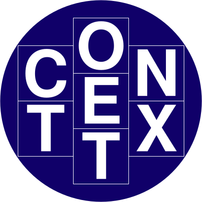{fig-align="center"}
:::
:::

------------------------------------------------------------------------

## ¿Cómo representar una palabra? {background-image="images/background.jpg" background-opacity="0.25"}

::: {.fragment style="text-align: center;"}
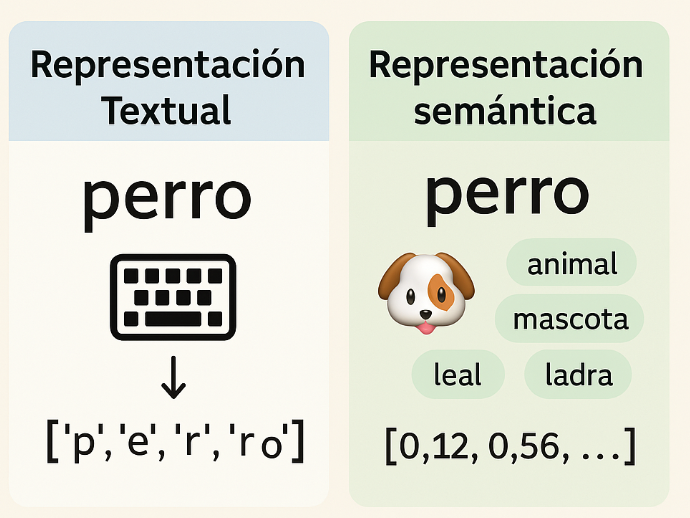
:::

------------------------------------------------------------------------

## 📝 Representación textual {background-image="images/background.jpg" background-opacity="0.25"}

Transcribir texto es guardar letras como bits.

::: panel-tabset
### ASCII

-   1 byte (8 bits)
-   128 caracteres
-   No incluye ñ ni tildes

### UTF-8

-   1 a 4 bytes
-   Compatible con ASCII
-   Incluye emojis 😁
:::

------------------------------------------------------------------------

## 🧠 Representación semántica {background-image="images/background.jpg" background-opacity="0.25"}

::: columns
::: {.column .fragment width="60%"}
<br><br>

-   **Semántica** significa **el sentido o significado** de las palabras.
-   Necesitamos guardarla como un **todo** o dividirla en **partes con sentido** (tokens).
:::

::: {.column width="40%"}
<br> {fig-align="center"}
:::
:::

------------------------------------------------------------------------

##  {background-image="images/background.jpg" background-opacity="0.25"}

::: {style="text-align: center;"}
<iframe src="https://agents-course-the-tokenizer-playground.static.hf.space" frameborder="0" width="950" height="650">

</iframe>
:::

------------------------------------------------------------------------

## 💡 Aprendizajes {background-image="images/background.jpg" background-opacity="0.25"}

<br>

-   Palabra ≠ Token
-   Cada **token** tiene un **ID único**\
-   En inglés, **100 tokens ≈ 75 palabras**\
-   Dos palabras **iguales** pueden tener **tokens distintos**, según el contexto

------------------------------------------------------------------------

## ⚙️ Diagrama técnico de un LLM {background-image="images/background.jpg" background-opacity="0.25"}

Diagrama de funcionamiento de un LLM que se filtró de OpenAI:

[**¡¡¡No difundir!!!**]{.fragment style="color: red;"}

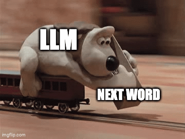{.fragment fig-align="center" height="500px"}

------------------------------------------------------------------------

## ⚙️ Diagrama técnico de un LLM {background-image="images/background.jpg" background-opacity="0.25"}

::: r-stack
<br>

{.fragment .fade-in-then-out fig-align="center"}

{.fragment fig-align="center"}
:::

------------------------------------------------------------------------

##  {background-image="images/background.jpg" background-opacity="0.25"}

::: {style="text-align: center;"}
<iframe src="https://agents-course-decoding-visualizer.hf.space" frameborder="0" width="950" height="650">

</iframe>
:::

------------------------------------------------------------------------

## 💡 Aprendizajes {background-image="images/background.jpg" background-opacity="0.25"}

<br>

-   El LLM **no reflexiona**, solo predice el **token más probable**.\
-   La predicción es **secuencial**, token por token.\
-   No tiene **memoria**: siempre parte desde cero.

------------------------------------------------------------------------

##  {background-image="images/background_slides3.png" background-opacity="0.3"}

::: {style="display: flex; justify-content: center; align-items: center; height: 60vh; flex-direction: column; text-align: center;"}
[No es Magia, es Ciencia]{style="font-size: 1em"}

[¿Qué son los Prompts?]{style="font-size: 1.5em"}
:::

------------------------------------------------------------------------

## 🤖 Asistentes Virtuales Inteligentes {background-image="images/background.jpg" background-opacity="0.25"}

<br><br>

Los **asistentes virtuales** impulsados por **IA** facilitan la comunicación, automatización y soporte en diversas industrias.

::: {style="text-align: center;"}

:::

------------------------------------------------------------------------

## 🤖 Asistentes Virtuales Inteligentes {background-image="images/background.jpg" background-opacity="0.25"}

::: columns
::: {.column .incremental width="60%"}
<br><br>

**Asistentes más destacados**:

-   [ChatGPT (OpenAI)](https://openai.com/chatgpt/)
-   [Gemini (Google DeepMind)](https://deepmind.google/gemini/)
-   [Meta AI (Meta)](https://ai.meta.com/)
-   [DeepSeek (DeepSeek)](https://chat.deepseek.com/)
:::

::: {.column width="40%"}
::: {style="text-align: center;"}
<br> 
:::
:::
:::

------------------------------------------------------------------------

## 📱¿Qué podemos hacer? {background-image="images/background.jpg" background-opacity="0.25"}

::: columns
::: {.column width="40%"}
::: {style="text-align: center;"}

:::
:::

::: {.column .incremental width="60%"}
<br>

-   🎓 **Educación**: Tutor virtual.\
-   🩺 **Salud**: Asistencia en consultas.\
-   📝 **Contenido**: Redacción y resumen.\
-   💻 **Software**: Generación/corrección código.\
-   💬 **Cliente**: Respuestas automáticas.
:::
:::

------------------------------------------------------------------------

## 📝 Prompts en ChatGPT {background-image="images/background.jpg" background-opacity="0.25"}

Los **prompts** son las **instrucciones** que se le dan a un modelo de lenguaje, como **ChatGPT**, para generar una **respuesta** o realizar una **tarea específica**. Pueden ser preguntas, frases o directrices que guían el modelo hacia el resultado deseado.

::: {style="text-align: center;"}
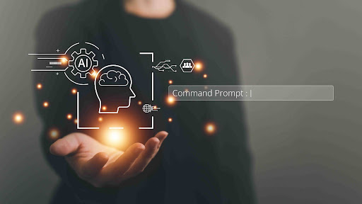
:::

------------------------------------------------------------------------

## 📝 Prompts en ChatGPT {background-image="images/background.jpg" background-opacity="0.25"}

**Pregunta directa**: "¿Qué es la inteligencia artificial?"

**Instrucción**: "Escribe una historia corta sobre un viaje al espacio."

**Comando**: "Genera un código Python para calcular el promedio de una lista."

::: {style="text-align: center;"}

:::

------------------------------------------------------------------------

## [🎯 Actividad: ¡Probemos algunos Prompts!]{style="font-size:0.8em;"} {background-image="images/background.jpg" background-opacity="0.25"}

<br>

::: columns
::: {.column width="40%"}
::: {style="text-align: center;"}

:::
:::

::: {.column .incremental width="60%"}
<br>

-   👩‍💻 **Paso 1:** Elige un asistente ( [ChatGPT](https://openai.com/chatgpt/), [Gemini](https://deepmind.google/gemini/), [Meta AI](https://ai.meta.com/), [DeepSeek](https://chat.deepseek.com/) )
-   📝 **Paso 2:** Escribe o copia un prompt
-   🔍 **Paso 3:** Observa la respuesta
-   🤔 **Paso 4:** Compara con otros asistentes
:::
:::

------------------------------------------------------------------------

## Estructura de un Buen Prompts {background-image="images/background.jpg" background-opacity="0.25"}

::: {style="text-align: center;"}

:::

------------------------------------------------------------------------

## 🧠 Estructura de un Buen Prompt {background-image="images/background.jpg" background-opacity="0.25"}

::: panel-tabset
## ❌ Prompt simple

> **Prompt:**
>
> ``` text
> Haz un código en Python para ordenar una lista.
> ```

<br>

👎 Resultado muy genérico, sin explicación ni opciones personalizadas.

## ✅ Prompt estructurado

> **Prompt:**
>
> ``` text
> Eres un profesor de programación enseñando a estudiantes principiantes.  
> Tu tarea es crear un ejemplo en Python para ordenar una lista de números.  
> Explica paso a paso el código, usando comentarios.  
> Usa dos métodos: el método `.sort()` y el algoritmo de burbuja.  
> Incluye ejemplos de entrada y salida.  
> El objetivo es ayudar a comprender el funcionamiento de ambos métodos.
> ```

<br>

👍 El resultado incluye: código claro, explicaciones y enfoque didáctico.

## ✨ ¿Qué lo hace mejor?

<br>

-   👨‍🏫 **Rol**: Define que el modelo actúe como *profesor*
-   📌 **Tarea**: Especifica *crear un ejemplo y explicar*
-   🧩 **Detalles**: Métodos `.sort()` y burbuja
-   🎓 **Contexto**: Enseñanza a estudiantes
-   📝 **Extras**: Comentarios y ejemplos de uso
:::

------------------------------------------------------------------------

## ♟️Técnicas para Mejorar los Prompts {background-image="images/background.jpg" background-opacity="0.25"}

<br>

::: {style="text-align: center;"}
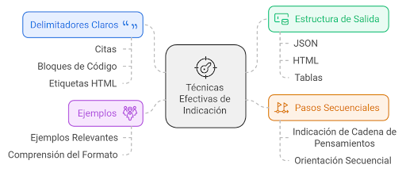
:::

------------------------------------------------------------------------

## ♟️Técnicas para Mejorar los Prompts {background-image="images/background.jpg" background-opacity="0.25"}

::: panel-tabset
## Zero-shot

**Definición:** Se da un **prompt sin ejemplos previos**, y se espera que el modelo genere una respuesta basada en su conocimiento previo.

::: columns
::: {.column width="50%"}
✨ **Ejemplo de prompt:**

> "¿Qué es la fotosíntesis?"
:::

::: {.column .incremental width="50%"}
✅ **Esperado:**

> "La fotosíntesis es el proceso por el cual las plantas convierten la luz solar en energía química utilizando dióxido de carbono y agua."
:::
:::

## ♟️ Few-shot

**Definición:** Se proporcionan **pocos ejemplos** en el prompt para ayudar al modelo a generar una respuesta más precisa.

::: columns
::: {.column width="50%"}
✨ **Ejemplo de prompt:**

> "Traduce las siguientes frases al francés:\
> - Hello → Bonjour\
> - Thank you → Merci\
> - Good morning → ?"
:::

::: {.column .incremental width="50%"}
✅ **Esperado:**

> "Good morning → Bonjour"
:::
:::

## ♟️ CoT

**Definición:** Se fomenta el **razonamiento paso a paso** (*Chain-of-Thought* ) para obtener respuestas más estructuradas y detalladas.

::: columns
::: {.column width="50%"}
✨ **Ejemplo de prompt:**

> "Si un tren viaja a 80 km/h y recorre 240 km, ¿cuánto tiempo tarda en llegar? Explica tu razonamiento."
:::

::: {.column .incremental width="50%"}
✅ **Esperado:**

> "El tren viaja a 80 km/h y debe recorrer 240 km. Para calcular el tiempo, usamos la fórmula:\
> **tiempo = distancia / velocidad**\
> **240 km ÷ 80 km/h = 3 horas.**\
> Por lo tanto, el tren tarda 3 horas en llegar."
:::
:::

## ♟️ Chaining

**Definición:** Se descompone una tarea compleja en **múltiples prompts encadenados**, donde la salida de un prompt se usa como entrada para el siguiente.

::: columns
::: {.column width="50%"}
✨ **Ejemplo de prompt:**

> **Paso 1:** "Resume en 3 frases la Revolución Industrial."\
> **Paso 2:** (Usando la respuesta del primer prompt) "Ahora expande cada frase en un párrafo detallado."
:::

::: {.column .incremental width="50%"}
✅ **Esperado:**

> **Paso 1:** "La Revolución Industrial marcó el inicio de la producción mecanizada, el crecimiento de las ciudades y el avance del transporte."\
> **Paso 2:** Se genera un desarrollo más detallado de cada punto.
:::
:::
:::

------------------------------------------------------------------------

##  {background-image="images/background_slides3.png" background-opacity="0.3"}

::: {style="display: flex; justify-content: center; align-items: center; height: 60vh; flex-direction: column; text-align: center;"}
[No es Magia, es Ciencia]{style="font-size: 1em"}

[Una mirada crítica a los LLMs]{style="font-size: 1.5em"}
:::

------------------------------------------------------------------------

## ⚠️ Problemas comunes con los LLM {background-image="images/background.jpg" background-opacity="0.25"}

::: {style="text-align: center;"}

:::

------------------------------------------------------------------------

## ⚠️ Problemas Comunes con los LLM {background-image="images/background.jpg" background-opacity="0.25"}

<br>

| 🚨 **Error**               | 💬 **Prompt**                           | ❌ **Respuesta Incorrecta**           |
|----------------------------|-----------------------------------------|---------------------------------------|
| **Información Incorrecta** | *¿Cuántos continentes hay?*             | *Hay 4 continentes.*                  |
| **Datos Obsoletos**        | *¿Quién es el presidente de Argentina?* | *Mauricio Macri.*                     |
| **Respuesta Ambigua**      | *¿País más grande?*                     | *Podría ser China o EE.UU.*           |
| **Sesgo o Estereotipo**    | *¿Quién programa mejor?*                | *Los hombres, por su lógica natural.* |

------------------------------------------------------------------------

## ⚖️ Ética en el Uso de la A.I. {background-image="images/background.jpg" background-opacity="0.25"}

::: r-stack
<br>

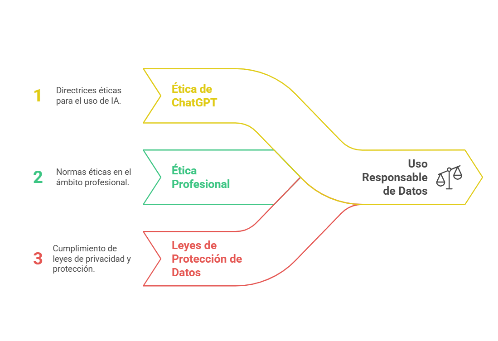{.fragment .fade-in-then-out fig-align="center" width="900"}

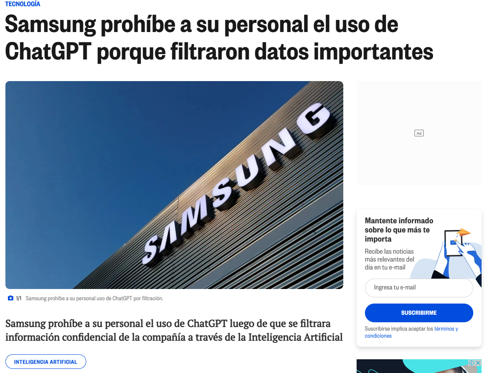{.fragment fig-align="center" width="800"}
:::

------------------------------------------------------------------------

## ⚖️ Ejemplos {background-image="images/background.jpg" background-opacity="0.25"}

::: panel-tabset
## ⚠️ Credenciales

**Definición:** Se debe evitar compartir información sensible como contraseñas, tokens de acceso o datos privados en prompts de IA.

::: columns
::: {.column width="50%"}
❌ **Mal prompt:**

> "Mi API key es `1234-5678`, y mi contraseña es `mypassword123`. ¿Puedes conectarte por mí?"
:::

::: {.column .incremental width="50%"}
✅ **Buen prompt:**

> "¿Cómo guardar credenciales en un archivo `.env` y cargarlas de forma segura en Python?"
:::
:::

## 🔒 Privacidad

**Definición:** Los prompts no deben solicitar ni exponer datos personales. Es esencial proteger la identidad y privacidad de las personas al interactuar con modelos de lenguaje.

::: columns
::: {.column width="50%"}
❌ **Prompt inadecuado:**

> "Tengo el RUT y dirección de una persona. ¿Puedes decirme su número de teléfono o redes sociales?"
:::

::: {.column .incremental width="50%"}
✅ **Prompt recomendado:**

> "Explícame cómo anonimizar datos sensibles correctamente."
:::
:::

## 📐 Tareas {background-image="images/background.jpg" background-opacity="0.25"}

**Definición:** Los prompts deben promover el **razonamiento y aprendizaje**, evitando solicitudes que generen respuestas incorrectas o superficiales.

::: columns
::: {.column width="50%"}
❌ **Prompt inadecuado:**

> **Paso 1:** "Resuelve esta ecuación sin explicaciones: \$x\^2 + 5x + 6 = 0\$."\
> **Paso 2:** "Solo quiero la respuesta final."
:::

::: {.column .incremental width="50%"}
✅ **Prompt recomendado:**

> **Paso 1:** "Resuelve paso a paso la ecuación \$x\^2 + 5x + 6 = 0\$ usando factorización."\
> **Paso 2:** "Explica por qué se eligen esos factores y sugiere otro método de resolución."
:::
:::
:::

------------------------------------------------------------------------

##  {background-image="images/background_slides3.png" background-opacity="0.3"}

::: {style="display: flex; justify-content: center; align-items: center; height: 60vh; flex-direction: column; text-align: center;"}
[No es Magia, es Ciencia]{style="font-size: 1em"}

[Actividad]{style="font-size: 1.5em"}
:::

------------------------------------------------------------------------

## 🤖 Actividad: ¡Crea tu chatbot! {background-image="images/background_slides3.png" background-opacity="0.3"}

::: panel-tabset
## 🎯 ¿Qué haremos?

<br>

Vamos a crear un chatbot divertido en [NUT-AI](https://cittripio-v2.streamlit.app/) que responda preguntas sobre un tema.

Ejemplos:

-   🧙 Un mago que enseña matemáticas
-   🧑‍🍳 Un chef que habla como robot
-   🦸 Un superhéroe que da consejos de salud

## 🛠️ Pasos

<br>

-   Júntate en grupo (2 a 4 personas)
-   Elige un tema
-   Escribe cómo debe hablar el bot
-   Prueba hacerle preguntas
-   Muestra tu bot a los demás 🎉

## 📦 Entrega

<br>

-   El texto que le da personalidad
-   5 preguntas + respuestas
-   Una imagen del bot funcionando
-   Una idea o reflexión (opcional)

## 🏆 Evaluación

<br>

| ✅ Qué se evalúa     | Puntos  |
|----------------------|---------|
| Creatividad 🎨       | 20      |
| Claridad 🧠          | 20      |
| Funciona bien ⚙️     | 20      |
| Buenas respuestas 💬 | 20      |
| Presentación 🎤      | 20      |
| **Total**            | **100** |
:::

------------------------------------------------------------------------

##  {background-image="images/background_slides3.png" background-opacity="0.3"}

::: {style="display: flex; justify-content: center; align-items: center; height: 60vh; flex-direction: column; text-align: center;"}
[No es Magia, es Ciencia]{style="font-size: 1em"}

[Conclusiones]{style="font-size: 1.5em"}
:::

------------------------------------------------------------------------

## 💡Conclusiones {background-image="images/background.jpg" background-opacity="0.25"}

<br>

-   🤔 **Entender la importancia de los prompts**: Un buen diseño de prompts es clave para obtener respuestas más precisas y útiles al interactuar con modelos de lenguaje como ChatGPT.

-   🌱 **Aplicaciones y uso responsable**: Los modelos de lenguaje tienen un gran potencial, pero es crucial utilizarlos de manera ética y responsable.

-   🚀 **Evolución y futuro de los LLM**: La IA conversacional sigue mejorando, y los avances esperados tendrán un gran impacto en cómo interactuamos con la tecnología en el futuro.

------------------------------------------------------------------------

## 🎉 ¡Gracias por Participar! {background-image="images/background.jpg" background-opacity="0.25"}

::: columns
::: {.column width="50%"}
<br>

❓¿Preguntas?

👏 Responder [encuesta](https://docs.google.com/forms/d/e/1FAIpQLSd2CseqhHUjdmvr46ZDb_Aa2iUYEjLAIE4MwLztled5ytRJvg/viewform?usp=dialog)

🥳 Disfrutar del Evento!
:::

::: {.column width="50%" align="center"}
{width="400"}
:::
:::

> 🔗 Nuestro Sitio Web: [sethnut.com/talks](https://sethnut.com/talks/)

```{=html}
<style>
/* Ajusta el tamaño del título y subtítulo */
.reveal .slides h1 {
  font-size: 2em; /* Tamaño más pequeño para el título */
}

.reveal .slides h2 {
  font-size: 1.5em; /* Tamaño más pequeño para el subtítulo */
}

/* Ajusta el tamaño del texto en los párrafos */
.reveal .slides p {
  font-size: 0.8em; /* Texto más pequeño */
}

/* Ajusta el tamaño de las tablas */
.reveal .slides table {
  font-size: 0.8em; /* Tamaño de fuente más pequeño en las tablas */
  width: 90%; /* Ajusta el ancho de la tabla */
  margin: 0 auto; /* Centra la tabla */
}

/* Ajusta el tamaño de los bullets */
.reveal .slides ul {
  font-size: 0.8em; /* Tamaño de fuente más pequeño en los bullets */
}

.reveal .slide-logo {
   max-height: 2em !important;
}
</style>
```