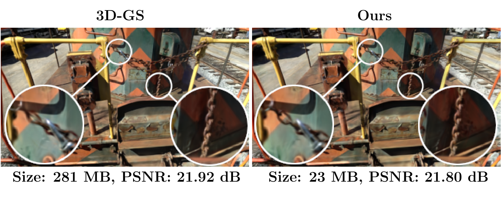
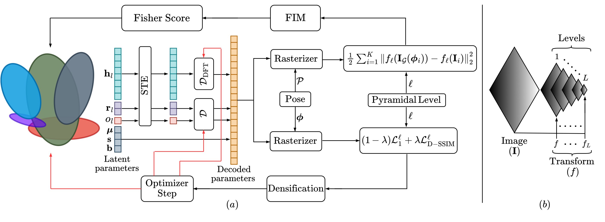
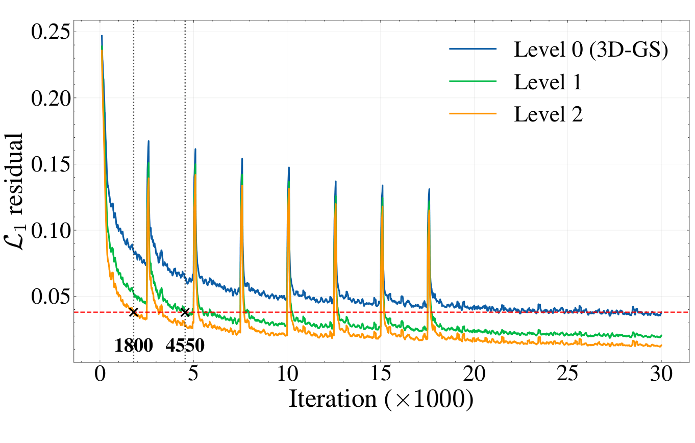
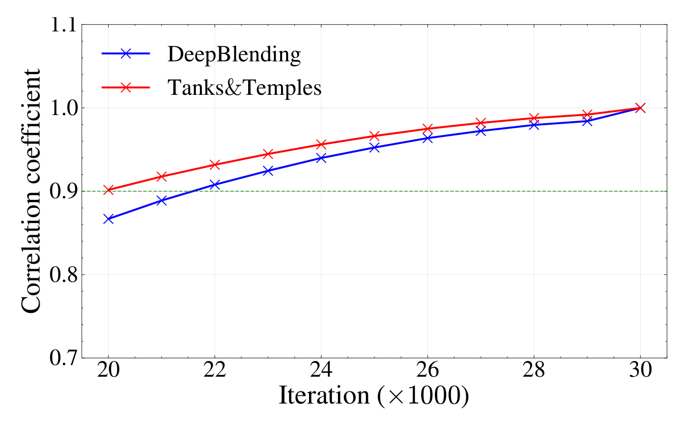

##  {.title-slide background-color="#0F2044"}

::: title-block
**Making Fisher Work: Train-Time Compression <br> for 3D Gaussian Splatting**

[Comprimir mientras se entrena, no después]{style="font-size: 0.45em; font-weight: normal; font-style: italic;"}
:::

::: subtitle-block
P G Arun Madhav · Chandra Sekhar Seelamantula\
Department of Electrical Engineering, Indian Institute of Science, Bangalore · ICIP 2026
:::

::: author-block
Presentación de paper — Francisco Alfaro Medina\
Doctorado en Ingeniería Electrónica · Universidad Técnica Federico Santa María
:::

::: notes
- Bienvenida. Presento "Making Fisher Work", de ICIP 2026, del Indian Institute of Science.
- La afirmación en una línea: **95% de reducción de almacenamiento** en 3D Gaussian Splatting, preservando la calidad de renderizado.
- La tesis del paper no es "cuantizar más": es **controlar cuándo se forma la redundancia** durante el entrenamiento.
- Voy a dedicar ~4 minutos al problema, ~5 al método y ~3 a la evidencia.
- Tiempo: 45 s.
:::

------------------------------------------------------------------------

## El problema: calidad en tiempo real, a un costo de almacenamiento enorme

::::: columns
:::: {.column width="54%"}
::: {.paper-figure}
{fig-align="center" width="100%"}
:::

::: caption
Escena *train* de Tanks&Temples: 281 MB → 23 MB, un **92,24 %** de compresión, con una caída de PSNR de apenas 0,12 dB (Fig. 1 del paper).
:::
::::

:::: {.column .incremental width="46%"}
<br>

-   3D-GS [1] logra síntesis de vistas nuevas de alta calidad con renderizado **en tiempo real**.
-   Pero una reconstrucción de calidad necesita **millones de primitivas gaussianas**.
-   El resultado: mucha memoria y una huella de almacenamiento enorme.
-   Es eficiente en inferencia y poco escalable en almacenamiento: ese es el cuello de botella para desplegarlo.
::::
:::::

::: notes
- 3D-GS reemplazó a los NeRF en velocidad: rasteriza en vez de trazar rayos, y eso le da tiempo real.
- El precio es la representación explícita: millones de primitivas, cada una con decenas de parámetros.
- La figura hace concreto el problema: la misma escena, 281 MB contra 23 MB, y los recuadros de zoom muestran que la cadena y el detalle fino se conservan.
- Nota honesta sobre la figura: el PSNR baja de 21,92 a 21,80 dB. No es gratis, pero es un costo mínimo.
- Tiempo: 60 s.
:::

------------------------------------------------------------------------

##  {background-image="../python-datos/images/background_slides3.png" background-opacity="0.3"}

::: {style="display: flex; justify-content: center; align-items: center; height: 60vh; flex-direction: column; text-align: center;"}
[El problema]{style="font-size: 2em"}

[La redundancia se forma durante el entrenamiento]{style="font-size: 2.5em"}
:::

------------------------------------------------------------------------

## Qué hay exactamente que comprimir

::::: columns
:::: {.column width="47%"}
Cada escena es un conjunto de primitivas gaussianas 3D:

::: equation-highlight
$$G = \{G_i = \{\mu_i, s_i, r_i, b_i, h_i, o_i\}\}_{i=1}^{N}$$
:::

| Parámetro | Dimensión | Rol |
|-----------------|-----------|-------------------------|
| $\mu_i$ | $\mathbb{R}^3$ | centro |
| $s_i$ | $\mathbb{R}^3$ | escala |
| $r_i$ | $\mathbb{R}^4$ | rotación |
| $b_i$ | $\mathbb{R}^3$ | color base |
| $h_i$ | $\mathbb{R}^{15\times 3}$ | armónicos esféricos (SH) |
| $o_i$ | $\mathbb{R}$ | opacidad |
::::

:::: {.column width="53%"}
Un rasterizador diferenciable proyecta las primitivas desde la pose $\phi$ y produce $I_G(\phi)$, optimizada con:

::: equation-highlight
$$L = (1-\lambda)\,L_1 + \lambda\,L_{\text{D-SSIM}}, \qquad \lambda = 0{,}2$$
:::

::: {.param-card}
**Geometría** — posición, escala y rotación ubican y orientan cada gaussiana anisotrópica en el espacio 3D.
:::

::: {.param-card}
**Apariencia** — el color base y los SH modelan la radiancia dependiente del punto de vista.
:::

::: {.callout-tip title="Dónde está el presupuesto"}
Con grado cúbico de SH, los coeficientes $h_i$ concentran **más del 80 %** del presupuesto de almacenamiento por gaussiana.
:::
::::
:::::

::: notes
- No hace falta entrar en el rasterizador; lo que importa son los grupos de parámetros y la pérdida.
- Subrayar el último recuadro: son 15 coeficientes por canal RGB, o sea 45 números por primitiva solo para la apariencia dependiente de la vista.
- Ese desbalance es la oportunidad estructural: los grupos de parámetros no son intercambiables, y tratarlos igual desperdicia capacidad.
- Ese dato justifica el decodificador DFT especializado que aparece más adelante.
- Tiempo: 60 s.
:::

------------------------------------------------------------------------

## Trabajo previo: por qué no basta

| Método | Idea principal | Limitación para comprimir en entrenamiento |
|------------------|------------------------|------------------------------|
| **Compact 3D-GS** [4] | Códigos latentes discretos aprendidos | Trata de forma genérica parámetros heterogéneos |
| **EAGLES** [5] | Representación multiescala + poda | No regula la introducción de detalle |
| **LightGaussian** [6] | Puntaje de significancia global + baja precisión | Poda y cuantiza *después* de que la redundancia se formó |
| **PUP 3D-GS** [7] | Puntaje de sensibilidad por Hessiano / Fisher | Principiado, pero **solo aplicable cerca de la convergencia** |

. . .

::: info-box
**La brecha.** Los métodos existentes preguntan *¿qué primitivas se pueden eliminar?*. Este trabajo agrega la pregunta que faltaba: *¿cuándo hay que dejar que aparezca la redundancia?* Podar temprano es inestable, porque la optimización temprana todavía no decidió qué primitivas son necesarias.
:::

::: notes
- PUP es la línea base conceptual más cercana y es el "método padre" del que parte este trabajo.
- El puntaje de PUP es teóricamente sólido, pero supone residual despreciable, lo que solo ocurre al converger. Entonces solo sirve como post-proceso.
- El aporte del paper es **fabricar** ese régimen de residual bajo mucho antes, usando pirámides de imagen.
- Transición: de ahí salen las tres piezas del diseño.
- Tiempo: 60 s.
:::

------------------------------------------------------------------------

##  {background-image="../python-datos/images/background_slides3.png" background-opacity="0.3"}

::: {style="display: flex; justify-content: center; align-items: center; height: 60vh; flex-direction: column; text-align: center;"}
[El método]{style="font-size: 2em"}

[Estabilizar, medir importancia, asignar bits]{style="font-size: 2.5em"}
:::

------------------------------------------------------------------------

## El framework en tres piezas

:::::: columns
:::: {.column width="32%"}
::: {.pillar .pillar-a}
**1 · Entrenamiento piramidal progresivo (PPT)**

Supervisar la escena de **grueso a fino**: la estructura global se estabiliza antes de que llegue el detalle de alta frecuencia.

Lleva la optimización a un régimen de **residual $L_1$ bajo** en los niveles gruesos.
:::
::::

:::: {.column width="32%"}
::: {.pillar .pillar-b}
**2 · Poda basada en la FIM**

Un puntaje de sensibilidad por gaussiana, derivado de la matriz de información de Fisher, ordena las primitivas por importancia.

El régimen de residual bajo es lo que vuelve **confiable** ese puntaje *durante* el entrenamiento.
:::
::::

:::: {.column width="32%"}
::: {.pillar .pillar-c}
**3 · Cuantización consciente de la correlación (CAQ)**

Decodificadores por grupo de parámetros: latentes escalares para los decorrelacionados, base DFT para los SH.

Gasta bits donde efectivamente hay estructura que explotar.
:::
::::
::::::

::: info-box
Las tres se combinan en un único lazo de entrenamiento y logran **95 % de reducción promedio de almacenamiento** preservando la calidad del renderizado.
:::

::: notes
- Presentar estas tres como las contribuciones que reclama el paper.
- Son complementarias, no alternativas: PPT controla *cuánta* redundancia se crea, la FIM decide *cuál* se elimina y CAQ reduce *los bits* de las que sobreviven.
- El orden importa: sin PPT, el puntaje de Fisher no es confiable y la poda temprana destruye primitivas necesarias.
- Tiempo: 50 s.
:::

------------------------------------------------------------------------

## El lazo de entrenamiento, de punta a punta

::: {.paper-figure}
{fig-align="center" width="92%"}
:::

::: caption
(a) Lazo que combina decodificación de latentes, rasterización, supervisión piramidal y puntaje de Fisher. (b) Formación de la pirámide con la transformación $f$ a lo largo de $L$ niveles (Fig. 2 del paper).
:::

::: notes
- Recorrer el panel (a) de izquierda a derecha: los parámetros latentes (h, r, o) pasan por el STE y sus decodificadores; μ, s y b van directo.
- Los parámetros decodificados entran al rasterizador, que renderiza según la pose φ.
- Arriba a la derecha: la pérdida L2 evaluada en el nivel piramidal ℓ alimenta la FIM y de ahí el puntaje de Fisher, que vuelve a la izquierda para podar.
- Abajo: la pérdida (1−λ)L₁ + λL_D-SSIM en el nivel ℓ gobierna la densificación y el paso del optimizador; las flechas rojas son el flujo de gradiente hacia los latentes.
- Panel (b): la pirámide es simplemente suavizado gaussiano más submuestreo, aplicado ℓ veces.
- Tiempo: 70 s.
:::

------------------------------------------------------------------------

## PPT: primero estabilizar, después el detalle

La pirámide se construye con suavizado gaussiano seguido de submuestreo:

::: equation-highlight
$$f: \mathbb{R}^{H\times W}\rightarrow\mathbb{R}^{\frac{H}{2}\times\frac{W}{2}}, \qquad f_\ell = \underbrace{f\circ f\circ\cdots\circ f}_{\ell\text{ veces}}, \qquad L_\ell = (1-\lambda)L_1^\ell + \lambda L_{\text{D-SSIM}}^\ell$$
:::

:::::: columns
:::: {.column width="33%"}
::: {.stage .stage-2}
**Nivel 2 · el más grueso**

Iteraciones 0 – 5.000

Estructura global, paisaje de pérdida suave, residual muy bajo.
:::
::::

:::: {.column width="33%"}
::: {.stage .stage-1}
**Nivel 1 · intermedio**

Iteraciones 5.000 – 10.000

Se introduce detalle intermedio de forma gradual.
:::
::::

:::: {.column width="33%"}
::: {.stage .stage-0}
**Nivel 0 · resolución completa**

Iteraciones 10.000 – 30.000

Detalle fino de apariencia sobre un conjunto ya depurado.
:::
::::
::::::

::: {.callout-tip title="Ojo con esto"}
La pirámide cambia **la supervisión**, no el objetivo final: el modelo se sigue evaluando a resolución completa.
:::

::: notes
- El 3D-GS estándar exige desde la iteración 0 que las primitivas expliquen variaciones de alta frecuencia. Eso genera un paisaje de pérdida complejo justo cuando la optimización es más inestable.
- La pirámide difiere esa exigencia: primero la estructura global, después el detalle.
- Las transiciones a 5.000 y 10.000 iteraciones son las del paper.
- Recalcar el callout: no se está renderizando en baja resolución, se está *supervisando* en baja resolución.
- Tiempo: 65 s.
:::

------------------------------------------------------------------------

## El residual bajo es lo que habilita todo

::::: columns
:::: {.column width="55%"}
::: {.paper-figure}
{fig-align="center" width="100%"}
:::

::: caption
Residual $L_1$ por iteración para los tres niveles. La línea roja punteada es el residual de un 3D-GS ya convergido (Fig. 3 del paper).
:::
::::

:::: {.column .incremental width="45%"}
<br>

-   El nivel 2 baja del residual del 3D-GS **convergido** en la iteración **1.800**; el nivel 1, en la **4.550**.
-   Es decir: el régimen que PUP solo alcanza al converger (30k iteraciones) aquí está disponible **casi desde el principio**.
-   Los picos periódicos son los eventos de **densificación**: cada uno inyecta primitivas nuevas y vuelve a subir el residual.
-   Con el residual bajo, los términos de segundo orden que dependen del residual se vuelven despreciables → la aproximación del Hessiano es utilizable.
::::
:::::

::: notes
- Esta es la diapositiva bisagra del paper: conecta el entrenamiento progresivo con la validez del puntaje de Fisher.
- Los marcadores 1800 y 4550 son el dato duro: no es una afirmación cualitativa, está medido sobre Tanks&Temples.
- Poner el contraste en voz alta: PUP necesita 30.000 iteraciones para poder puntuar; acá se puede puntuar desde la 1.800.
- Si preguntan por los picos: son las rondas de densificación propias del 3D-GS, no un artefacto del método.
- Tiempo: 70 s.
:::

------------------------------------------------------------------------

## De la sensibilidad de Fisher a un puntaje escalar

Derivando dos veces el error de reconstrucción $L_2$ bajo supervisión piramidal y aplicando la regla de la cadena, en el régimen de residual bajo el segundo término se anula:

::: equation-highlight
$$\nabla_G^2 L_2 \approx \sum_{i=1}^{K} J_{f_\ell}\,\nabla_G I_G(\phi_i)\,\nabla_G I_G(\phi_i)^\top J_{f_\ell}^{\top}$$
:::

Restringiendo al bloque diagonal de cada gaussiana $G_j$ y resumiéndolo con el log-determinante:

::: equation-highlight
$$H_j = \sum_{i=1}^{K} J_{f_\ell}\,\nabla_{G_j} I_G(\phi_i)\,\nabla_{G_j} I_G(\phi_i)^\top J_{f_\ell}^{\top}, \qquad U_j = \log|H_j|$$
:::

::::: columns
:::: {.column width="50%"}
::: {.result-box}
**$U_j$ alto** — las imágenes renderizadas son sensibles a perturbar $G_j$ → se conserva.
:::
::::

:::: {.column width="50%"}
::: {.result-box style="border-top-color: #C0392B; background: #FDEEEE;"}
**$U_j$ bajo** — la primitiva aporta poco bajo la supervisión actual → candidata a poda.
:::
::::
:::::

::: notes
- $J_{f_\ell}$ es el jacobiano de la transformación piramidal: es lo que distingue esta derivación de la de PUP.
- La matriz de Fisher captura qué tan fuerte responde la formación de imagen a perturbaciones de los parámetros.
- La aproximación bloque-diagonal es lo que hace tratable el cálculo: se ignoran las interacciones entre gaussianas distintas.
- El log-determinante reduce una matriz de sensibilidad a un único número ordenable.
- Si preguntan por qué log-determinante: es el volumen del elipsoide de sensibilidad, o sea cuánta información aporta esa primitiva en conjunto sobre todos sus parámetros.
- Tiempo: 70 s.
:::

------------------------------------------------------------------------

## Dos regímenes de poda

::::: columns
:::: {.column width="48%"}
### Poda piramidal

- Se puntúa bajo el nivel piramidal vigente y se eliminan las gaussianas de baja sensibilidad **antes** de pasar a supervisión más fina.
- Actúa como **mecanismo de regularización**: evita que la redundancia formada en niveles gruesos se propague y sesgue la optimización de escala fina.
- Al reducir el conjunto efectivo de optimización, también mejora la eficiencia del entrenamiento.

### Poda iterativa

- Cada **3.000 iteraciones**, entre la **21.000** y la **27.000**.
- Se apoya en la estabilidad temporal de los rankings cerca de la convergencia.
::::

:::: {.column width="52%"}
::: {.paper-figure}
{fig-align="center" width="100%"}
:::

::: caption
Correlación de rangos de Spearman entre el ranking de sensibilidad en cada iteración y el de un 3D-GS totalmente convergido (Fig. 4 del paper).
:::

::: {.callout-tip title="La idea clave"}
El puntaje no necesita ser perfecto en la iteración 0: necesita ser **confiable antes de cada decisión de poda**.
:::
::::
:::::

::: notes
- Leer la Fig. 4 con precisión: parte en ~0,87 para DeepBlending y ~0,90 para Tanks&Temples en la iteración 20k, y ambas llegan a 1,0 en la 30k.
- Ambas curvas cruzan 0,90 alrededor de la iteración 21.500, que es justo cuando arranca la poda iterativa (21k). Esa coincidencia es el argumento del cronograma.
- Distinguir los dos mecanismos: la poda piramidal es un regularizador por etapas; la iterativa es una compresión final aprovechando rankings ya estables.
- Tiempo: 65 s.
:::

------------------------------------------------------------------------

## CAQ: gastar bits donde hay estructura

::::: columns
:::: {.column width="42%"}
**El problema de la cuantización genérica**

Los parámetros de una gaussiana no comparten estadísticas. Un único cuantizador aplicado de forma uniforme desperdicia capacidad en grupos con estructuras de correlación distintas.

::: callout-important
Los coeficientes SH dominan el almacenamiento **y** exhiben fuerte correlación entre canales, inducida por su estructura en el dominio de la frecuencia.
:::
::::

:::: {.column width="58%"}
| Grupo | Decodificador | Justificación |
|----------------|----------------|-------------------------|
| Rotación $r$, opacidad $o$ | Lineal compacto $D$ | Están **decorrelacionados** → bastan latentes escalares |
| Coeficientes SH $h$ | Basado en DFT, $D_{\mathrm{DFT}}$ | La base de frecuencia explota la correlación entre canales |

::: equation-highlight
$$h = D_{\mathrm{DFT}}(\operatorname{STE}(h^\ell)), \qquad r, o = D(\operatorname{STE}(r^\ell, o^\ell))$$
:::

::: {.param-card}
El **estimador de paso directo (STE)** discretiza en el paso hacia adelante y preserva el flujo de gradiente hacia atrás: latentes y decodificadores se optimizan **junto con** el 3D-GS.
:::
::::
:::::

::: info-box
Después del entrenamiento: los latentes continuos se discretizan, se codifican por entropía y se almacenan junto con sus decodificadores.
:::

::: notes
- La clave es que la cuantización vive dentro del lazo de entrenamiento, así que el decodificador se adapta a la escena.
- El STE resuelve el problema de que la discretización tiene gradiente cero en casi todas partes.
- El decodificador DFT está dirigido específicamente a los SH; no es una transformada universal para todos los parámetros. Esa selectividad es justamente el aporte.
- Tiempo: 65 s.
:::

------------------------------------------------------------------------

##  {background-image="../python-datos/images/background_slides3.png" background-opacity="0.3"}

::: {style="display: flex; justify-content: center; align-items: center; height: 60vh; flex-direction: column; text-align: center;"}
[La evidencia]{style="font-size: 2em"}

[Tres benchmarks y una ablación]{style="font-size: 2.5em"}
:::

------------------------------------------------------------------------

## Resultados sobre tres benchmarks

::: wide-table
```{=html}
<table>
<thead>
<tr><th rowspan="2">Método</th><th colspan="4">Mip-NeRF 360</th><th colspan="4">Tanks&amp;Temples</th><th colspan="4">Deep Blending</th></tr>
<tr><th>PSNR↑</th><th>SSIM↑</th><th>LPIPS↓</th><th>MB↓</th><th>PSNR↑</th><th>SSIM↑</th><th>LPIPS↓</th><th>MB↓</th><th>PSNR↑</th><th>SSIM↑</th><th>LPIPS↓</th><th>MB↓</th></tr>
</thead>
<tbody>
<tr><td>3D-GS [1]</td><td><strong>27.44</strong></td><td><strong>0.813</strong></td><td>0.218</td><td>822.6</td><td><strong>23.67</strong></td><td><strong>0.844</strong></td><td><strong>0.179</strong></td><td>452.4</td><td>29.48</td><td>0.900</td><td>0.246</td><td>692.5</td></tr>
<tr><td>Compact [4]</td><td>26.95</td><td>0.797</td><td>0.244</td><td><strong>26.31</strong></td><td>23.33</td><td>0.831</td><td>0.202</td><td><strong>18.97</strong></td><td>29.71</td><td>0.901</td><td>0.257</td><td><strong>25.75</strong></td></tr>
<tr><td>EAGLES [5]</td><td>27.07</td><td>0.801</td><td>0.240</td><td>59.49</td><td>23.14</td><td>0.833</td><td>0.203</td><td>30.18</td><td>29.72</td><td>0.906</td><td>0.249</td><td>54.45</td></tr>
<tr><td>LightGaussian [6]</td><td>26.90</td><td>0.800</td><td>0.240</td><td>53.96</td><td>23.32</td><td>0.829</td><td>0.204</td><td>29.94</td><td>29.12</td><td>0.895</td><td>0.262</td><td>45.25</td></tr>
<tr><td>PUP [7]</td><td>26.67</td><td>0.786</td><td>0.271</td><td>74.65</td><td>22.72</td><td>0.801</td><td>0.244</td><td>43.37</td><td>28.85</td><td>0.881</td><td>0.301</td><td>69.98</td></tr>
<tr><td><strong>Propuesto</strong></td><td>27.01</td><td>0.801</td><td><strong>0.239</strong></td><td>32.78</td><td>23.38</td><td>0.837</td><td><strong>0.202</strong></td><td>23.93</td><td><strong>29.87</strong></td><td><strong>0.912</strong></td><td><strong>0.248</strong></td><td>30.07</td></tr>
</tbody>
</table>
```
:::

:::::: columns
:::: {.column width="32%"}
::: metric-row
[≈95 %]{.metric} [reducción promedio de almacenamiento]{.metric-label}
:::
::::

:::: {.column width="32%"}
::: metric-row
[+0,39 dB]{.metric} [PSNR en Deep Blending: supera al 3D-GS original]{.metric-label}
:::
::::

:::: {.column width="32%"}
::: metric-row
[25×]{.metric} [modelo más liviano que 3D-GS en Mip-NeRF 360]{.metric-label}
:::
::::
::::::

::: notes
- Empezar por el titular: ~95 % de reducción promedio, con calidad de renderizado preservada.
- Contra el 3D-GS base: 822,6 → 32,78 MB en Mip-360 (25×), 452,4 → 23,93 en T&T, 692,5 → 30,07 en Deep Blending.
- En Deep Blending el método **supera** al 3D-GS original en las tres métricas de calidad, no solo en tamaño. Probablemente porque la poda actúa como regularizador.
- Ser franco, porque es lo primero que va a preguntar el comité: **Compact 3D-GS logra modelos más chicos en los tres datasets** (26,31 / 18,97 / 25,75 MB). El argumento del paper no es ser el más chico, sino la mejor relación calidad-tamaño: el propuesto le gana a Compact en PSNR, SSIM y LPIPS en todos los datasets.
- PUP, el método padre, es el peor de la tabla en tamaño. Eso muestra cuánto aporta hacer la poda durante el entrenamiento en vez de después.
- Tiempo: 90 s.
:::

------------------------------------------------------------------------

## Ablación: qué aporta cada componente

::::: columns
:::: {.column width="55%"}
| Configuración | PSNR↑ | SSIM↑ | LPIPS↓ | Primitivas↓ | MB↓ |
|--------------------------|-------|-------|--------|-------------|--------|
| 3D-GS base | 32.25 | 0.946 | 0.181 | 1,25 M | 294.55 |
| + CAQ | 31.36 | 0.937 | 0.216 | 0,98 M | 44.22 |
| + PPT | 31.35 | 0.936 | 0.216 | 0,80 M | 36.82 |
| + Poda piramidal (PP) | 30.94 | 0.933 | 0.219 | 0,66 M | 30.88 |
| + Poda iterativa (IP) | 30.91 | 0.932 | 0.224 | 0,33 M | 15.24 |
| **Propuesto (completo)** | 30.92 | 0.932 | 0.224 | **0,33 M** | **15.28** |

::: caption
Ablación sobre la escena *bonsai* de Mip-NeRF 360 (Tabla 2 del paper).
:::
::::

:::: {.column .incremental width="45%"}
<br>

-   **CAQ** produce la primera gran caída: 294,55 → 44,22 MB (**85 %**) con un costo moderado de calidad.
-   **PPT** y las dos podas ya no atacan los bits por primitiva, sino **cuántas primitivas sobreviven**: 1,25 M → 0,33 M.
-   La **poda iterativa** es la que más primitivas elimina (0,66 M → 0,33 M) por apenas 0,03 dB de PSNR.
-   El modelo final conserva solo el **26,4 %** de las primitivas del base, con **19×** menos almacenamiento.
::::
:::::

::: notes
- Leer la ablación como una cadena causal, no como un ranking: CAQ cambia los bits por primitiva; PPT y las podas cambian cuántas primitivas hay.
- La caída de calidad es gradual y acotada: de 32,25 a 30,92 dB, o sea 1,33 dB en total, a cambio de 19× de compresión.
- La diferencia entre "+ IP" y "Propuesto" es de 0,04 MB: la combinación final preserva esencialmente la misma solución compacta.
- Una crítica justa: el orden de la ablación es acumulativo, así que no se puede aislar el aporte individual de PPT sin CAQ.
- Tiempo: 65 s.
:::

------------------------------------------------------------------------

## Conclusiones

::::: columns
:::: {.column .incremental width="50%"}
### Lo que el paper establece

-   La supervisión piramidal progresiva **crea** un régimen de residual bajo desde la iteración ~1.800, en vez de esperar la convergencia.
-   Eso vuelve confiables los puntajes de Fisher **durante** el entrenamiento, y con ellos la poda deja de ser un post-proceso.
-   Los decodificadores estructurados explotan las correlaciones distintas de SH, rotación y opacidad.
-   El framework unificado logra **≈95 % de reducción** preservando la calidad de renderizado.
::::

:::: {.column .incremental width="50%"}
### Límites y preguntas abiertas

-   **Limitación declarada**: se asume que la supervisión en niveles gruesos produce residuales suficientemente pequeños para que la aproximación FIM sea válida.
-   Los cronogramas (5k / 10k, poda cada 3k entre 21k y 27k) son **fijos y empíricos**: ¿pueden adaptarse al contenido?
-   ¿Qué bases aprendidas superarían al decodificador DFT?
-   No se reporta en el paper principal el efecto sobre **velocidad de renderizado** ni tiempo de entrenamiento (van al material suplementario).
::::
:::::

::: info-box
**Idea para llevarse:** la compresión confiable empieza por **moldear la trayectoria de optimización**, después medir importancia y recién entonces asignar bits según la estructura. El *cuándo* importa tanto como el operador de compresión.
:::

::: notes
- Resumir la lógica en una frase: estabilizar, puntuar, comprimir.
- El aporte metodológico que yo defendería: el momento de comprimir es tan importante como el operador de compresión. Eso es transferible más allá de 3D-GS.
- Mencionar la limitación tal como la declaran los autores, sin suavizarla.
- Invitar preguntas sobre cronogramas adaptativos, bases alternativas y despliegue.
- Tiempo: 75 s.
:::

------------------------------------------------------------------------

##  {.title-slide background-color="#0F2044"}

::: title-block
**Gracias**

[¿Preguntas?]{style="font-size: 0.45em; font-weight: normal; font-style: italic;"}
:::

::: subtitle-block
P. G. Arun Madhav y C. S. Seelamantula, "Making Fisher Work: Train-Time Compression for 3D Gaussian Splatting"\
IEEE ICIP 2026 · DOI 10.1109/ICIP61757.2026.11630029
:::

::: author-block
Francisco Alfaro Medina · Universidad Técnica Federico Santa María\
<https://github.com/fralfaro/talks>
:::

::: notes
- Dejar esta diapositiva durante la ronda de preguntas.
- Preguntas probables: por qué DFT y no una base aprendida; qué pasa si la escena no tolera supervisión gruesa (mucha textura de alta frecuencia); cómo se eligen las tasas de poda por escena (están en el material suplementario); si la poda mejora o empeora los FPS.
:::


```{=html}
<style>
.reveal .slides h2 {
  font-size: 1.3em;
}
.reveal .slides p {
  font-size: 0.95em;
}
.reveal .slides ul {
  font-size: 0.9em;
}
.reveal .slide-logo {
   max-height: 2.5em !important;
}
</style>
```
