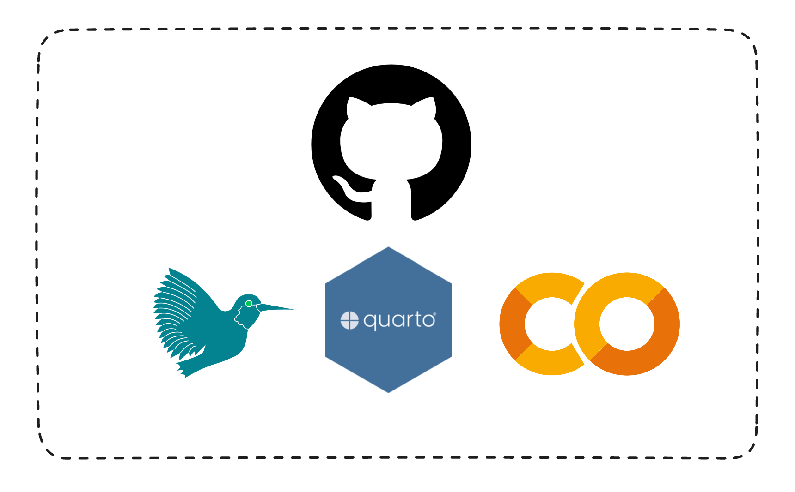
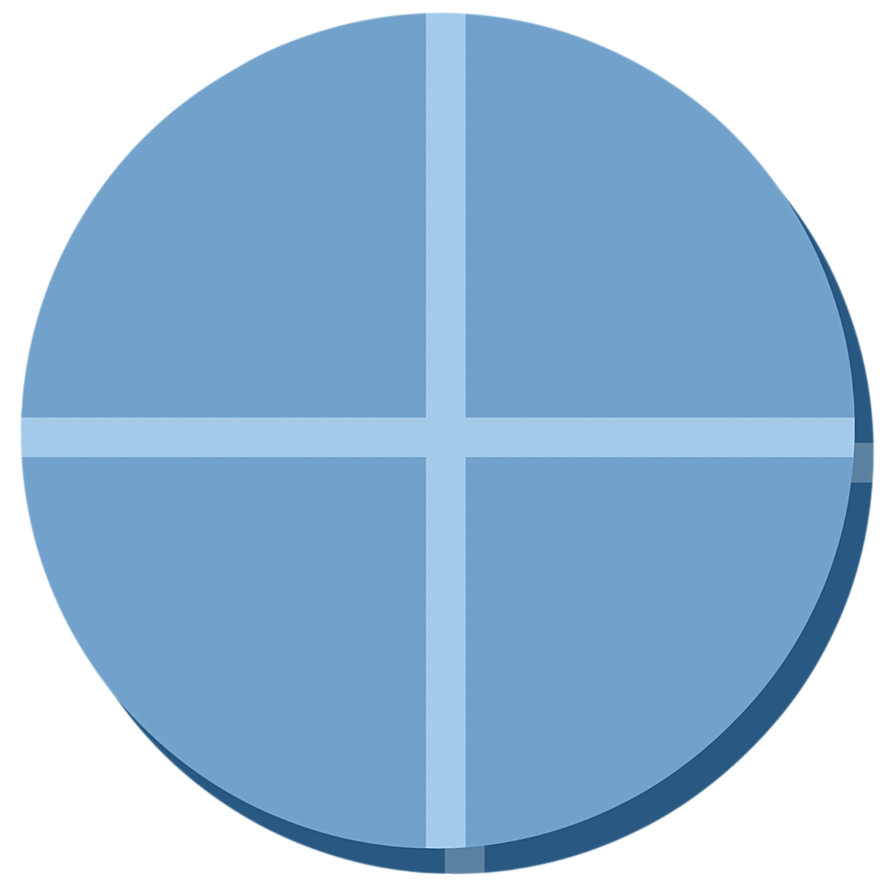
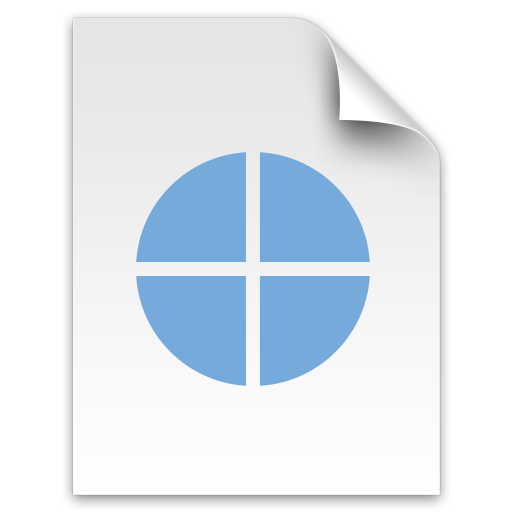

##  {.title-slide background-color="#0F2044"}

::: title-block
**Diseño de un MOOC para el desarrollo de** <br> competencias digitales académicas

Un puente entre la escuela y la universidad
:::

::: subtitle-block
GitHub · Google Colab · LaTeX · Quarto\
CONTE 2026
:::

::: author-block
Francisco Alfaro Medina · Patricio Olivares Roncagliolo\
Universidad Técnica Federico Santa María · Chile
:::

------------------------------------------------------------------------

## ¿Te ha pasado esto?

::: r-stack
<br>

{.fragment .fade-in-then-out fig-align="center" width="78%"}

{.fragment .fade-in-then-out fig-align="center"}

{.fragment fig-align="center" width="78%"}
:::

------------------------------------------------------------------------

## ¿Qué aprenderemos?

:::::: columns
:::: {.column width="40%"}
::: {style="text-align: center;"}

:::
::::

::: {.column .incremental width="60%"}
<br><br><br>

-   **Organizar el trabajo**: repositorios, versiones y documentación.
-   **Experimentar en la nube**: notebooks con código, texto y resultados.
-   **Escribir con rigor**: informes académicos reproducibles y formales.
-   **Publicar lo aprendido**: un portafolio visible y reutilizable.
-   **Usar IA con criterio**: apoyo al aprendizaje, no sustitución del trabajo.
:::
::::::

------------------------------------------------------------------------

##  {background-image="../python-datos/images/background_slides3.png" background-opacity="0.3"}

::: {style="display: flex; justify-content: center; align-items: center; height: 60vh; flex-direction: column; text-align: center;"}
[El problema]{style="font-size: 2em"}

[Prepararse para aprender en la universidad]{style="font-size: 2.5em"}
:::

------------------------------------------------------------------------

## Una brecha antes del primer año

<br>

::: {style="text-align: center;"}

:::

. . .

> La brecha digital universitaria no es solo saber usar herramientas, sino contar con un flujo de trabajo. Para evitar que habilidades como versionar, documentar, calcular, escribir y publicar se enseñen de forma aislada y tardía tras el ingreso, la propuesta adelanta estas prácticas clave en un curso propedéutico.

------------------------------------------------------------------------

## La propuesta: 20 horas, cuatro estaciones

<br> <br>

::::::::::::::: columns
::::: {.column width="25%"}
::: {style="text-align: center;"}

:::

::: {style="text-align: center;"}
**Colab**\
El laboratorio para explorar y experimentar.
:::
:::::

::::: {.column width="25%"}
::: {style="text-align: center;"}

:::

::: {style="text-align: center;"}
**GitHub**\
La memoria para organizar y versionar.
:::
:::::

::::: {.column width="25%"}
::: {style="text-align: center;"}

:::

::: {style="text-align: center;"}
**LaTeX**\
La imprenta para redactar y formatear.
:::
:::::

::::: {.column width="25%"}
::: {style="text-align: center;"}

:::

::: {style="text-align: center;"}
**Quarto**\
La vitrina para publicar y compartir.
:::
:::::
:::::::::::::::

------------------------------------------------------------------------

## GitHub

<br><br>

:::::: columns
:::: {.column width="40%"}
::: {style="text-align: center;"}

:::
::::

::: {.column .incremental width="60%"}
<br><br>

-   **Repositorio**: un espacio para guardar y compartir el proyecto.
-   **README**: explica qué contiene el trabajo y cómo usarlo.
-   **Commits**: dejan registro de cada cambio.
-   **Portafolio**: el trabajo queda visible bajo la identidad del estudiante.
:::
::::::

------------------------------------------------------------------------

## Ejemplo: GitHub como memoria

::: r-stack
{.fragment .fade-in-then-out fig-align="center" width="80%"}

{.fragment fig-align="center" width="84%"}
:::

------------------------------------------------------------------------

## Google Colab

<br><br>

:::::: columns
:::: {.column width="40%"}
::: {style="text-align: center;"}

:::
::::

::: {.column .incremental width="60%"}
<br><br>

-   **Notebook**: combina celdas de texto, código y resultados.
-   **Sin instalación**: basta un navegador y una cuenta de Google.
-   **Experimentación**: permite explorar datos y probar ideas.
-   **Compartir**: el notebook se enlaza con GitHub y Drive.
:::
::::::

------------------------------------------------------------------------

## Ejemplo: un notebook que se puede leer

::::: columns
::: {.column width="50%"}
``` python
import numpy as np
import pandas as pd
import matplotlib.pyplot as plt

# Leer datos
df = pd.read_csv("datos.csv")

# Ver primeras filas
print(df.head())

# Estadísticas de la tabla
print(df["nota"].describe())

# Histograma
plt.figure(figsize=(10, 5))
plt.hist(df["nota"], bins=10, color='steelblue', edgecolor='black')
plt.title("Distribución de Notas")
plt.xlabel("Nota")
plt.ylabel("Frecuencia")
plt.grid(alpha=0.3)
plt.show()
```
:::

::: {.column width="50%"}
{fig-align="center" width="100%" alt="Notebook de Google Colab"}
:::
:::::

::: callout-note
El notebook no solo guarda el resultado: deja visible el camino que llevó a él.
:::

------------------------------------------------------------------------

## LaTeX y Overleaf

:::::: columns
:::: {.column width="40%"}
::: {style="text-align: center;"}

:::
::::

::: {.column .incremental width="60%"}
<br><br><br>

-   **Plantillas**: comenzar con una estructura académica lista para usar.
-   **Contenido**: concentrarse en el argumento, no en ajustar márgenes.
-   **Colaboración**: editar y compilar desde el navegador.
-   **Informe**: producir un documento formal con figuras y referencias.
:::
::::::

------------------------------------------------------------------------

## Ejemplo: del código al informe

::: r-stack
{.fragment .fade-in-then-out fig-align="center" width="80%"}

{.fragment fig-align="center" width="60%"}
:::

------------------------------------------------------------------------

## Quarto

<br><br>

:::::: columns
:::: {.column width="40%"}
::: {style="text-align: center;"}

:::
::::

::: {.column .incremental width="60%"}
<br><br>

-   **Un documento, múltiples salidas**: HTML, PDF, Word, etc.
-   **Markdown + código**: texto y visualizaciones en un mismo lugar.
-   **Publicación**: Quarto Pub o GitHub Pages.
-   **Portafolio**: reúne los productos construidos en los módulos anteriores.
:::
::::::

------------------------------------------------------------------------

## Ejemplo: una fuente, varias publicaciones

<br>

::: {style="text-align: center;"}

:::


------------------------------------------------------------------------

## Cada módulo produce un artefacto

<br><br>

::::::::::: columns
:::: {.column width="25%"}
::: {style="background: #EBF4FB; border-top: 5px solid #4A9FD4; border-radius: 8px; padding: 0.8em; height: 210px;"}
**M1 · GitHub**

Repositorio con README y primer entregable.
:::
::::

:::: {.column width="25%"}
::: {style="background: #FFF7E6; border-top: 5px solid #F39C12; border-radius: 8px; padding: 0.8em; height: 210px;"}
**M2 · Colab**

Notebook guiado con análisis básico.
:::
::::

:::: {.column width="25%"}
::: {style="background: #EAF7F5; border-top: 5px solid #0F8B8D; border-radius: 8px; padding: 0.8em; height: 210px;"}
**M3 · LaTeX**

Informe académico con plantilla.
:::
::::

:::: {.column width="25%"}
::: {style="background: #EEF0FA; border-top: 5px solid #1A3A6B; border-radius: 8px; padding: 0.8em; height: 210px;"}
**M4 · Quarto**

Sitio personal con portafolio integrado.
:::
::::
:::::::::::

. . .

> El resultado final no es una tarea aislada: es una trayectoria que se puede mostrar, retomar y reutilizar.
> Además, cada módulo combina un cuestionario breve con un trabajo práctico relacionado con su objetivo.

------------------------------------------------------------------------


## IA: apoyo al aprendizaje, no sustitución

::::: columns
::: {.column width="50%"}

<br>

:::: {style="background: #EAFAF1; border-left: 5px solid #27AE60; border-radius: 8px; padding: 0.8em; margin-bottom: 1em;"}
**Aceptable**: Explicar un concepto, sugerir una pista o identificar la causa probable de un error.
::::

:::: {style="background: #dededd; border-left: 5px solid #dededd; border-radius: 8px; padding: 0.8em; margin-bottom: 1em;"}
**Zona gris**: Reescribir un párrafo propio o sugerir la estructura de un informe.
::::

:::: {style="background: #FDECEC; border-left: 5px solid #C0392B; border-radius: 8px; padding: 0.8em;"}
**Inaceptable**: Presentar como propio texto generado íntegramente o referencias no verificadas.
::::

:::

::: {.column width="50%"}
{fig-align="center"}
:::
:::::


------------------------------------------------------------------------

## Conclusiones 

<br><br>

::::: columns
::: {.column .incremental width="50%"}
### Ideas clave

-   El MOOC enseña un **flujo**, no cuatro herramientas desconectadas.
-   El diseño cloud-first reduce la barrera de instalación.
-   El portafolio hace visible el proceso de aprendizaje.
-   La propuesta está dirigida a la transición escuela–universidad.
:::

::: {.column .incremental width="50%"}
### Siguiente paso

-   Implementar el MOOC y calibrar sus 40 preguntas.
-   Medir su relación con el desempeño en primer año.
-   Comparar los contextos previos: MAT281, ICS-294 y talks.
-   Convertir el marco de IA en una rúbrica de autoevaluación.
:::
:::::


------------------------------------------------------------------------

##  {.title-slide background-color="#0F2044"}

::: title-block
**Gracias**
:::

::: subtitle-block
Francisco Alfaro Medina <br>  Patricio Olivares Roncagliolo\
CONTE 2026
:::

::: author-block
<https://fralfaro.github.io/docencia-digital/>\
<https://github.com/fralfaro/talks>
:::

```{=html}
<style>
.reveal .slides h1 {
  font-size: 2em;
}
.reveal .slides h2 {
  font-size: 1.5em;
}
.reveal .slides p {
  font-size: 1em;
}
.reveal .slides table {
  font-size: 0.9em;
  width: 90%;
  margin: 0 auto;
}
.reveal .slides ul {
  font-size: 0.9em;
}
.reveal .slide-logo {
   max-height: 2.5em !important;
}
</style>
```
