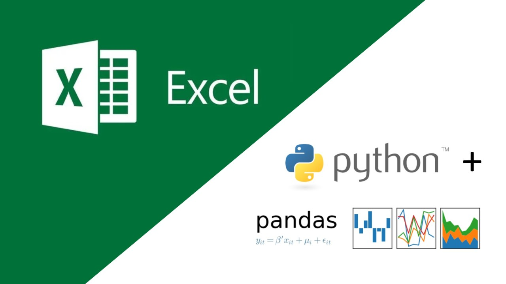
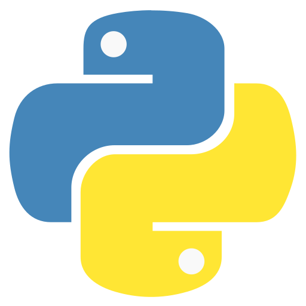
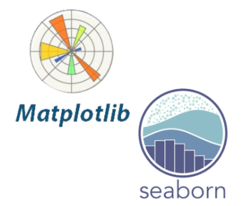

##  {.title-slide background-color="#0F2044"}

::: title-block
**Manipulación de datos con Python**

Del archivo al análisis reproducible
:::

::: subtitle-block
Python · Google Colab · GitHub\
Management Analytics
:::

::: author-block
Francisco Alfaro Medina\
Docente USM - 2026
:::

------------------------------------------------------------------------

## ¿Te ha pasado esto?

::: r-stack
<br>

{.fragment .fade-in-then-out fig-align="center" width="100%"}

{.fragment .fade-in-then-out fig-align="center" width="100%"}

{.fragment fig-align="center" width="80%"}
:::

------------------------------------------------------------------------

## ¿Qué aprenderemos?

:::::: columns
:::: {.column width="40%"}
::: {style="text-align: center;"}

:::
::::

::: {.column .incremental width="60%"}
<br>

-   **Entender el flujo de trabajo**: desde datos crudos hasta resultados comunicables.
-   **Usar notebooks**: combinar código, texto, tablas y gráficos en un solo lugar.
-   **Manipular datos**: cargar, filtrar, transformar, resumir y ordenar información.
-   **Visualizar patrones**: explorar datos con Matplotlib y Seaborn.
-   **Compartir el trabajo**: publicar notebooks y proyectos con GitHub.
:::
::::::

------------------------------------------------------------------------

##  {background-image="images/background_slides3.png" background-opacity="0.3"}

::: {style="display: flex; justify-content: center; align-items: center; height: 60vh; flex-direction: column; text-align: center;"}
[Ecosistema]{style="font-size: 2em"}

[Herramientas para trabajar con datos]{style="font-size: 2.5em"}
:::

------------------------------------------------------------------------

## Python

<br><br>

:::::: columns
:::: {.column width="40%"}
::: {style="text-align: center;"}

:::
::::

::: {.column .incremental width="60%"}
<br>

-   Lenguaje principal para automatizar, analizar y visualizar datos.
-   Sintaxis simple y legible.
-   Muy usado en ciencia de datos, automatización e IA.
-   Tiene una comunidad enorme y muchas librerías listas para usar.
:::
::::::

------------------------------------------------------------------------

## Ejemplo: Python

<br><br>

:::::: columns
::: {.column width="50%"}
``` python
precios = [1200, 1500, 1800, 2100]

promedio = sum(precios) / len(precios)
maximo = max(precios)

print(promedio)
print(maximo)
```
:::


:::: {.column width="50%"}

<br>


::: {style="background: #0F2044; color: white; border-radius: 8px; padding: 1em; font-family: Consolas, monospace; font-size: 1.2em;"}
1500.0

2100
:::
::::
::::::

------------------------------------------------------------------------

## Google Colab

<br><br>

:::::: columns
:::: {.column width="40%"}
::: {style="text-align: center;"}

:::
::::

::: {.column .incremental width="60%"}
<br>

-   **Notebook**: documento vivo con celdas de texto y código.
-   **Sin instalación**: basta una cuenta de Google y navegador.
-   **Resultados**: ideal para tareas, laboratorios e informes.
-   **Compartible**: se puede enlazar con GitHub.
:::
::::::

------------------------------------------------------------------------

## Ejemplo: Google Colab


::: {.fragment style="text-align: center;"}
{fig-align="center" width="80%"}
:::


------------------------------------------------------------------------

##  {background-image="images/background_slides3.png" background-opacity="0.3"}

::: {style="display: flex; justify-content: center; align-items: center; height: 60vh; flex-direction: column; text-align: center;"}
[Librerías]{style="font-size: 2em"}

[Herramientas de Python para datos]{style="font-size: 2.5em"}
:::

------------------------------------------------------------------------

## NumPy

<br><br>

:::::: columns
:::: {.column width="40%"}
::: {style="text-align: center;"}

:::
::::

::: {.column .incremental width="60%"}
<br><br>

-   Trabaja con arreglos y matrices.
-   Realiza operaciones matemáticas rápidas.
-   Evita escribir ciclos innecesarios.
-   Es la base de muchas librerías científicas de Python.
:::
::::::

------------------------------------------------------------------------

## Ejemplo: NumPy

<br><br>

:::::: columns
::: {.column width="50%"}
``` python
import numpy as np

ventas = np.array([120, 135, 150, 160, 210])

print(ventas.mean())
print(ventas.max())
print(ventas * 1.19)
```
:::

:::: {.column width="50%"}
::: {style="background: #F0F4F8; border-left: 5px solid #4A9FD4; border-radius: 8px; padding: 1em; font-family: Consolas, monospace; font-size: 1em;"}

<br>

155.0

210

\[142.8 160.65 178.5 190.4 249.9\]
:::
::::
::::::

------------------------------------------------------------------------

## pandas

<br><br>

:::::: columns
:::: {.column width="40%"}
::: {style="text-align: center;"}

:::
::::

::: {.column .incremental width="60%"}
<br><br>

-   Lee archivos CSV, Excel y fuentes web.
-   Organiza datos como tablas llamadas `DataFrame`.
-   Filtra, transforma, ordena y agrupa información.
-   Es la herramienta central para manipulación de datos en Python.
:::
::::::

------------------------------------------------------------------------

## Ejemplo: pandas

<br><br>


::::: columns
::: {.column width="48%"}
``` python
import pandas as pd

df = pd.read_csv("estudiantes.csv")

df.head()
```
:::

::: {.column width="52%"}
| nombre |     carrera | semestre | nota | asistencia |
|--------|------------:|---------:|-----:|-----------:|
| Ana    |       Civil |        2 |  5.8 |       0.91 |
| Bruno  | Informática |        4 |  4.6 |       0.78 |
| Carla  |  Industrial |        3 |  6.2 |       0.95 |
:::
:::::

::: callout-note
Un `DataFrame` es una tabla con filas, columnas, índices y métodos para transformarla.
:::

------------------------------------------------------------------------

## Preguntas básicas

<br><br>

::::: columns
::: {.column width="50%"}

<br>

``` python

df.shape
df.info()
df.describe()

```
:::

::: {.column .incremental width="50%"}
<br>

-   ¿Cuántas filas y columnas hay?
-   ¿Qué tipo de dato tiene cada columna?
-   ¿Hay valores faltantes?
:::
:::::

------------------------------------------------------------------------

## Seleccionar columnas y filtrar filas

<br><br>

::::: columns
::: {.column width="50%"}
``` python
columnas = ["carrera", "nota", "asistencia"]

df[columnas]
```

``` python
aprobados = df[df["nota"] >= 4.0]
alta_asistencia = df[df["asistencia"] >= 0.85]
```
:::

::: {.column .incremental width="50%"}
<br>

-   Seleccionar columnas reduce ruido.
-   Filtrar filas permite responder preguntas.
-   Cada filtro debe tener una razón analítica.
:::
:::::


------------------------------------------------------------------------

## Matplotlib + Seaborn

<br><br>

:::::: columns
:::: {.column width="40%"}
::: {style="text-align: center;"}

:::
::::

::: {.column .incremental width="60%"}
<br><br>

-   **Matplotlib**: control fino sobre figuras, ejes, títulos y estilos.
-   **Seaborn**: gráficos estadísticos con menos código.
-   Juntas permiten explorar distribuciones, grupos, relaciones y tendencias.
-   Un buen gráfico ayuda a detectar patrones antes de modelar.
:::
::::::

------------------------------------------------------------------------

## Ejemplo: Matplotlib

<br><br>

:::::::::::::: columns
::: {.column width="50%"}
``` python

import matplotlib.pyplot as plt

plt.figure(figsize=(8, 4))
plt.hist(df["nota"], bins=10, color="#0F2044", edgecolor="white")
plt.title("Distribución de notas")
plt.xlabel("Nota")
plt.ylabel("Cantidad de estudiantes")
plt.show()
```
:::

:::::::::::: {.column width="50%"}
::::::::::: {style="height: 360px; border: 2px solid #D5DCE4; border-radius: 8px; padding: 0.8em; display: flex; flex-direction: column; justify-content: center; align-items: center;"}
::: {style="font-size: 0.9em; color: #0F2044; margin-bottom: 0.6em;"}
Distribución de notas
:::

:::::::: {style="display: flex; align-items: end; gap: 12px; height: 220px; border-left: 2px solid #6B7A8D; border-bottom: 2px solid #6B7A8D; padding-left: 14px;"}
::: {style="width: 34px; height: 70px; background: #0F2044;"}
:::

::: {style="width: 34px; height: 125px; background: #0F2044;"}
:::

::: {style="width: 34px; height: 190px; background: #0F2044;"}
:::

::: {style="width: 34px; height: 145px; background: #0F2044;"}
:::

::: {style="width: 34px; height: 95px; background: #0F2044;"}
:::
::::::::

::: {style="font-size: 0.75em; color: #6B7A8D; margin-top: 0.5em;"}
Nota
:::
:::::::::::
::::::::::::
::::::::::::::

------------------------------------------------------------------------

## Ejemplo: Seaborn

<br><br>

:::::::::::: columns
::: {.column width="50%"}
``` python
import seaborn as sns

sns.set_theme(style="whitegrid")

sns.boxplot(
    data=df,
    x="carrera",
    y="nota",
    color="#4A9FD4"
)
```
:::

:::::::::: {.column width="50%"}
::::::::: {style="height: 360px; border: 2px solid #D5DCE4; border-radius: 8px; padding: 0.8em; display: flex; flex-direction: column; justify-content: center; align-items: center;"}
::: {style="font-size: 0.9em; color: #0F2044; margin-bottom: 0.6em;"}
Notas por carrera
:::

:::::: {style="display: flex; align-items: center; gap: 36px; height: 220px;"}
::: {style="width: 70px; height: 145px; border: 3px solid #4A9FD4; border-top-width: 18px; border-bottom-width: 18px;"}
:::

::: {style="width: 70px; height: 180px; border: 3px solid #4A9FD4; border-top-width: 18px; border-bottom-width: 18px;"}
:::

::: {style="width: 70px; height: 120px; border: 3px solid #4A9FD4; border-top-width: 18px; border-bottom-width: 18px;"}
:::
::::::

::: {style="font-size: 0.75em; color: #6B7A8D;"}
Civil · Informática · Industrial
:::
:::::::::
::::::::::
::::::::::::


------------------------------------------------------------------------

## Flujo recomendado

```{mermaid}
flowchart TD
  A[1. Definir pregunta] --> B[2. Cargar datos]
  B --> C[3. Explorar estructura]
  C --> D[4. Limpiar y transformar]
  D --> E[5. Resumir y visualizar]
  E --> F[6. Interpretar resultados]
  F --> G[7. Documentar y compartir]

  classDef step fill:#F0F4F8,color:#0F2044,stroke:#4A9FD4;
  class A,B,C,D,E,F,G step;
```


##  {background-image="images/background_slides3.png" background-opacity="0.3"}

::: {style="display: flex; justify-content: center; align-items: center; height: 60vh; flex-direction: column; text-align: center;"}
[Conclusiones]{style="font-size: 2em"}

[Consejos Finales]{style="font-size: 2.5em"}
:::

## Conclusiones finales

<br><br>

::::: columns
::: {.column .incremental width="50%"}
### Ideas clave

-   Python permite automatizar análisis.
-   Colab elimina la barrera de instalación.
-   NumPy y pandas resuelven la manipulación diaria.
-   Matplotlib y Seaborn ayudan a explorar patrones.
:::

::: {.column .incremental width="50%"}
### Siguiente paso

-   Elegir un conjunto de datos pequeño.
-   Formular una pregunta simple.
-   Cargar, explorar, transformar y visualizar.
-   Documentar el proceso en un notebook.
:::
:::::

::: callout-tip
La meta de esta primera clase es reconocer el ecosistema y perderle el miedo al flujo de trabajo.
:::

------------------------------------------------------------------------

## {.title-slide background-color="#0F2044"}

::: title-block
**Muchas gracias**
:::

::: subtitle-block
Python · Google Colab · GitHub
:::

::: author-block
Francisco Alfaro Medina\
Docente USM - 2026
:::


```{=html}
<style>
/* Ajusta el tamaño del título y subtítulo */


.reveal .slide-logo {
   max-height: 2.5em !important;
}


</style>
```