##  {.title-slide background-color="#0F2044"}

::: title-block
**SAT-E · Sistema de Alerta Temprana Estudiantil**

[Consolidar datos institucionales para intervenir a tiempo]{style="font-size: 0.45em; font-weight: normal; font-style: italic;"}
:::

::: subtitle-block
Descripción general del sistema: alertas, modelos y resultados\
Marzo 2026
:::

::: author-block
Francisco Alfaro Medina\
Universidad Técnica Federico Santa María
:::

::: notes
- Bienvenida. Presento el SAT-E, el Sistema de Alerta Temprana Estudiantil de la UTFSM.
- La idea en una línea: consolidar datos de distintas fuentes institucionales en modelos predictivos que generan alertas **antes** de que el daño sea irreversible.
- Voy a recorrer cuatro bloques: el problema, qué son las alertas, cómo se construye el sistema y qué muestran los resultados.
- Insistir desde el principio en el principio rector: **no es vigilancia, es apoyo**.
- Tiempo: 45 s.
:::

------------------------------------------------------------------------

## El problema: la deserción en primer año

::::: columns
:::: {.column width="42%"}
<br>

::: big-stat
1 de cada 4
:::

::: {style="text-align:center; color:#6B7A8D; font-size:0.85em;"}
estudiantes no completa\
su primer año universitario
:::

<br>

::: info-box
**Ventana crítica.** El primer semestre —y muy especialmente las primeras semanas— define la trayectoria del estudiante.
:::
::::

:::: {.column .incremental width="58%"}
-   **Magnitud** — entre **25 % y 30 %** abandona en primer año, una de las tasas más altas de la OCDE (SIES / Mineduc).
-   **Perfil de riesgo** (CRUCH) — primera generación universitaria, regiones alejadas, colegios municipales.
-   **Costo sistémico** — el estudiante abandona **con deuda** (CAE / FIES) y **sin título**; la institución pierde matrícula.
-   La consecuencia práctica: cuando la deserción se detecta en las actas de fin de año, ya es tarde para hacer algo.
::::
:::::

::: notes
- Partir por la magnitud: no es un problema marginal, es una cuarta parte de cada cohorte.
- El perfil de riesgo importa porque es justamente el estudiante que la universidad dice querer incluir. La deserción golpea de forma desigual.
- El costo es doble y asimétrico: el estudiante se queda con la deuda y sin credencial; la institución pierde matrícula. Nadie gana.
- La frase que ancla todo el resto de la charla: hay una ventana de pocas semanas. Fuera de esa ventana, el sistema no sirve de nada.
- Tiempo: 70 s.
:::

------------------------------------------------------------------------

## Contexto institucional: UTFSM

::::: columns
:::: {.column width="50%"}
### Dónde se aplica

**3 campus** — Casa Central, San Joaquín, Vitacura\
**2 sedes** — Viña del Mar y Concepción

<br>

### De dónde vienen los datos

::: {.param-card}
**SIGA** — sistema de gestión académica
:::

::: {.param-card}
**AULA** — plataforma docente (Moodle)
:::

::: {.param-card}
**Datos Mineduc** — antecedentes de admisión
:::
::::

:::: {.column width="50%"}
### Categorías de carrera modeladas

| Sigla | Programa |
|--------|------------------------------------|
| **ING6** | Ingeniería Civil (6 años) |
| **ING5** | Ingeniería de Ejecución (5 años) |
| **TU** | Técnico Universitario |
| **IBT** | Ingeniería de Base Tecnológica |

::: {.callout-note title="Por qué segmentar"}
Se modela **por categoría de carrera**, no con un único modelo global: los perfiles de ingreso, las mallas y los ramos críticos son muy distintos entre un ING6 y un TU.
:::
::::
:::::

::: notes
- El alcance es toda la universidad: cinco ubicaciones y cuatro familias de programas.
- Las tres fuentes son las que ya existen institucionalmente; el SAT-E no crea datos nuevos, los integra.
- Recalcar la segmentación: mezclar un ING6 de seis años con un TU de dos y medio produciría un modelo que no sirve para ninguno de los dos. Esta decisión vuelve a aparecer en los resultados.
- Tiempo: 60 s.
:::

------------------------------------------------------------------------

##  {background-image="../python-datos/images/background_slides3.png" background-opacity="0.3"}

::: {style="display: flex; justify-content: center; align-items: center; height: 60vh; flex-direction: column; text-align: center;"}
[Qué es el SAT-E]{style="font-size: 2em"}

[Una herramienta de priorización, no un sistema de decisión]{style="font-size: 2.5em"}
:::

------------------------------------------------------------------------

## Definición, objetivo y principio

:::::: columns
:::: {.column width="32%"}
::: {.pillar .pillar-a}
**Definición formal**

El SAT-E consolida datos de distintas fuentes institucionales en **modelos predictivos** que generan alertas actualizadas según la información disponible en cada momento del ciclo académico.
:::
::::

:::: {.column width="32%"}
::: {.pillar .pillar-b}
**Objetivo central**

Identificar estudiantes en riesgo de **reprobación de asignatura crítica** o de **deserción** antes de que el daño sea irreversible, para activar intervenciones dirigidas desde los equipos de acompañamiento y jefes de carrera.
:::
::::

:::: {.column width="32%"}
::: {.pillar .pillar-c}
**Principio clave**

**No es vigilancia, es apoyo.** El sistema **no toma decisiones automáticas** sobre ningún estudiante: es una herramienta de priorización para que los equipos humanos intervengan con criterio.
:::
::::
::::::

::: info-box
La salida del sistema no es un veredicto: es una **lista priorizada** que le dice a un equipo con tiempo limitado a quién conviene llamar primero.
:::

::: notes
- Leer el tercer pilar completo y en voz alta. Es la objeción que va a aparecer en cualquier sala, y conviene adelantarse.
- Precisión importante: el modelo entrega una probabilidad, no una etiqueta de destino. La decisión de intervenir, y cómo, es siempre humana.
- El valor real no es predecir mejor: es asignar una capacidad de acompañamiento que siempre es escasa.
- Tiempo: 65 s.
:::

------------------------------------------------------------------------

## La ventana crítica

::: {.paper-figure}
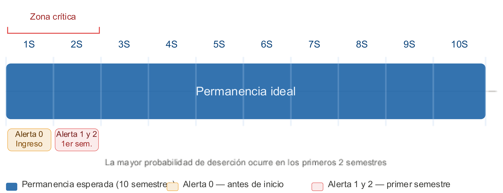{fig-align="center" width="80%"}
:::

::: caption
La mayor probabilidad de deserción ocurre en los **primeros dos semestres**. Las alertas se emiten dentro de esa ventana: Alerta 0 antes del inicio, Alertas 1 y 2 durante el primer semestre.
:::

::: notes
- La barra azul es la permanencia esperada: diez semestres hasta la titulación oportuna.
- El corchete rojo marca la zona crítica: los dos primeros semestres concentran la mayor probabilidad de abandono.
- Las dos cajitas de abajo son el punto: las alertas están deliberadamente ubicadas *dentro* de la zona crítica, no después.
- Esto explica por qué el sistema se diseñó como se diseñó. Una alerta en cuarto semestre sería correcta y también inútil.
- Tiempo: 55 s.
:::

------------------------------------------------------------------------

##  {background-image="../python-datos/images/background_slides3.png" background-opacity="0.3"}

::: {style="display: flex; justify-content: center; align-items: center; height: 60vh; flex-direction: column; text-align: center;"}
[Las alertas]{style="font-size: 2em"}

[Tres momentos, tres conjuntos de datos, dos preguntas]{style="font-size: 2.5em"}
:::

------------------------------------------------------------------------

## Las tres alertas

::: {.paper-figure}
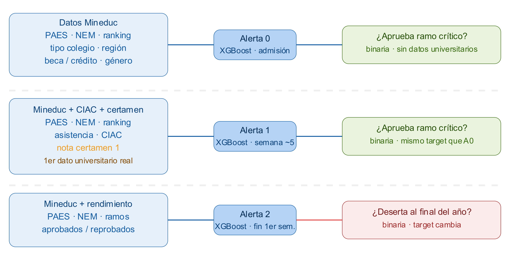{fig-align="center" width="64%"}
:::

:::::: columns
:::: {.column width="32%"}
::: {.param-card}
**Alerta 0 · admisión** — solo datos Mineduc, **sin ningún dato universitario** todavía.
:::
::::

:::: {.column width="32%"}
::: {.param-card}
**Alerta 1 · semana ~5** — incorpora asistencia, CIAC y la **nota del certamen 1**: el primer dato universitario real.
:::
::::

:::: {.column width="32%"}
::: {.param-card}
**Alerta 2 · fin de 1.<sup>er</sup> semestre** — incorpora ramos aprobados y reprobados; **cambia la pregunta**.
:::
::::
::::::

::: notes
- Recorrer la figura fila por fila: a la izquierda los datos disponibles, al centro el modelo y el momento, a la derecha el target.
- Alerta 0 y Alerta 1 responden **la misma pregunta** (¿aprueba el ramo crítico?) con distinta información. Eso las hace comparables, y por eso la matriz de transición del final tiene sentido.
- Alerta 2 **cambia el target**: ya no pregunta por el ramo crítico sino por la deserción al final del año. No es comparable con las anteriores.
- El salto de información más grande es el de A0 a A1: entra la nota de certamen 1, y eso se va a notar muchísimo en la importancia de variables.
- Tiempo: 80 s.
:::

------------------------------------------------------------------------

## Ramos críticos: dos criterios

::: {.paper-figure}
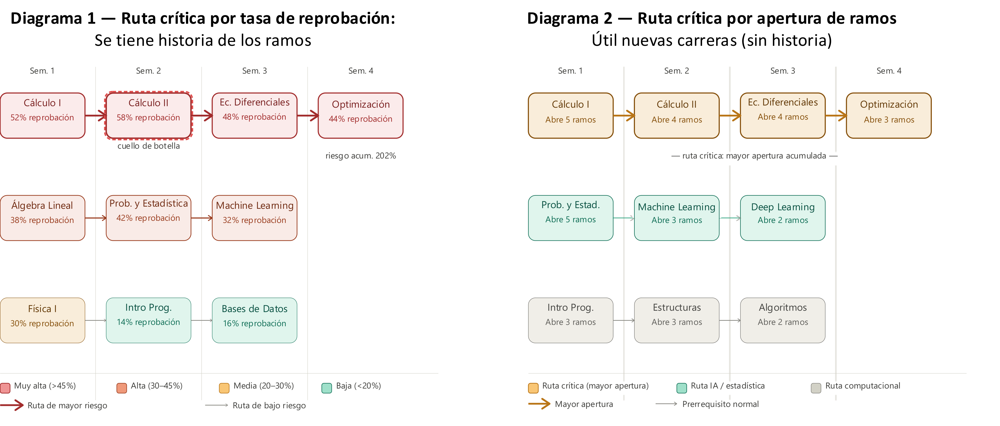{fig-align="center" width="80%"}
:::

::: {.callout-important title="El ramo crítico dejó de ser único"}
En ING5 / ING6 el ramo crítico era **MAT021**. En las nuevas mallas ese ramo se separa en **MAT060** (Álgebra Lineal) y **MAT070** (Cálculo), redistribuyendo el peso: el ramo crítico **ya no es único ni predecible**, se calcula por malla.
:::

::: notes
- Dos criterios, porque no siempre hay historia disponible.
- Diagrama 1, por tasa de reprobación: sirve cuando el ramo ya tiene historia. Cálculo II con 58 % es el cuello de botella, y la ruta acumula 202 % de riesgo.
- Diagrama 2, por apertura de ramos: sirve para carreras nuevas sin historia. La ruta crítica es la que desbloquea más asignaturas aguas abajo.
- El recuadro de abajo es la parte incómoda y conviene decirla: el cambio de malla rompió el supuesto de un único ramo crítico estable. Ahora hay que recalcularlo por malla, y eso agrega mantención.
- Tiempo: 70 s.
:::

------------------------------------------------------------------------

## Cómo se calcula la nota crítica C1

::::: columns
:::: {.column width="52%"}
::: {.paper-figure}
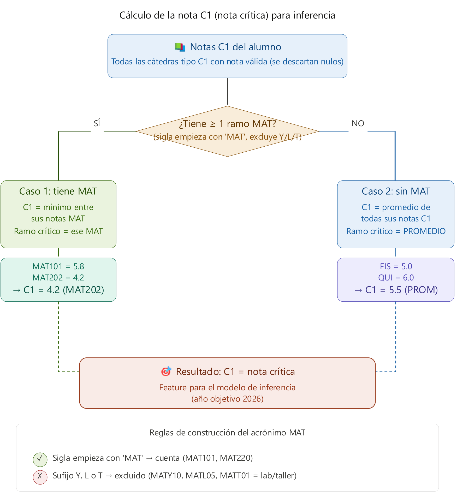{fig-align="center" width="72%"}
:::
::::

:::: {.column .incremental width="48%"}
<br>

-   Se toman **todas las cátedras tipo C1** con nota válida; se descartan los nulos.
-   **Caso 1 — tiene al menos un ramo MAT**: $C1$ es el **mínimo** entre sus notas MAT, y ese ramo pasa a ser el crítico.
-   **Caso 2 — sin ramos MAT**: $C1$ es el **promedio** de todas sus notas C1.
-   La sigla cuenta como MAT si empieza con `MAT`, pero se **excluyen** los sufijos `Y`, `L` y `T` (laboratorios y talleres).

::: {.callout-tip title="Por qué el mínimo"}
Tomar el **mínimo** y no el promedio es una decisión deliberada: en matemáticas, un solo ramo hundido es mejor predictor que un promedio que lo diluye.
:::
::::
:::::

::: notes
- Esta regla es la definición operacional de la variable más influyente de todo el sistema, así que conviene que quede clara.
- El caso 1 usa el mínimo porque el riesgo en matemáticas no se promedia: un 4.2 en Cálculo no se compensa con un 5.8 en Álgebra.
- El caso 2 es el fallback para quien no tiene ramos MAT en su malla de primer semestre.
- La exclusión de Y/L/T evita que un laboratorio o taller —con evaluación distinta— contamine la nota crítica.
- Tiempo: 70 s.
:::

------------------------------------------------------------------------

##  {background-image="../python-datos/images/background_slides3.png" background-opacity="0.3"}

::: {style="display: flex; justify-content: center; align-items: center; height: 60vh; flex-direction: column; text-align: center;"}
[Cómo se construye]{style="font-size: 2em"}

[Datos integrados, pipelines reproducibles, modelos por cohorte]{style="font-size: 2.5em"}
:::

------------------------------------------------------------------------

## Data warehouse: una sola fuente de verdad

::::: columns
:::: {.column width="62%"}
::: {.paper-figure}
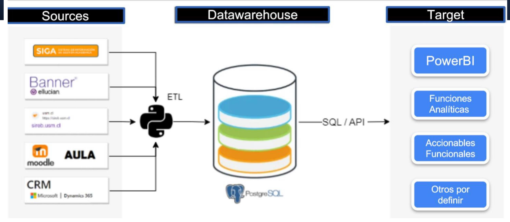{fig-align="center" width="100%"}
:::
::::

:::: {.column width="38%"}
**¿Qué es un Data Warehouse?**

Un repositorio centralizado que almacena grandes volúmenes de datos estructurados de múltiples fuentes, organizado **para análisis**, no para transacciones.

::: {.param-card}
`silver_undergraduate.new_students_features` — antecedentes de ingreso (mdt)
:::

::: {.param-card}
`registration.aux_student_grades` — notas
:::

::: {.param-card}
`studentaid.aux_attendance` — asistencia (ciac)
:::
::::
:::::

::: notes
- El punto de la figura: los sistemas de origen (SIGA, Banner, SIROB, AULA/Moodle, CRM) son transaccionales y no están hechos para analítica.
- El ETL en Python los consolida en PostgreSQL, y desde ahí salen PowerBI, las funciones analíticas y los accionables funcionales.
- Las tres tablas de la derecha son literalmente las que alimentan las alertas: antecedentes, notas y asistencia.
- Si preguntan por gobernanza: el SAT-E consume el DW, no accede directo a los sistemas de producción.
- Tiempo: 60 s.
:::

------------------------------------------------------------------------

## Kedro: de notebook a pipeline productivo

::::: columns
:::: {.column width="45%"}
<br>

**Kedro** es un framework de Python que convierte pipelines de data science en código **estructurado, reproducible y productivo**.

<br>

::: {.param-card}
**Estructurado** — nodos y catálogos de datos explícitos, en vez de celdas con estado oculto.
:::

::: {.param-card}
**Reproducible** — el mismo pipeline corre igual en el notebook del analista y en el servidor.
:::

::: {.param-card}
**Productivo** — se puede reejecutar por partes cuando llegan datos nuevos.
:::
::::

:::: {.column width="55%"}
::: {.paper-figure}
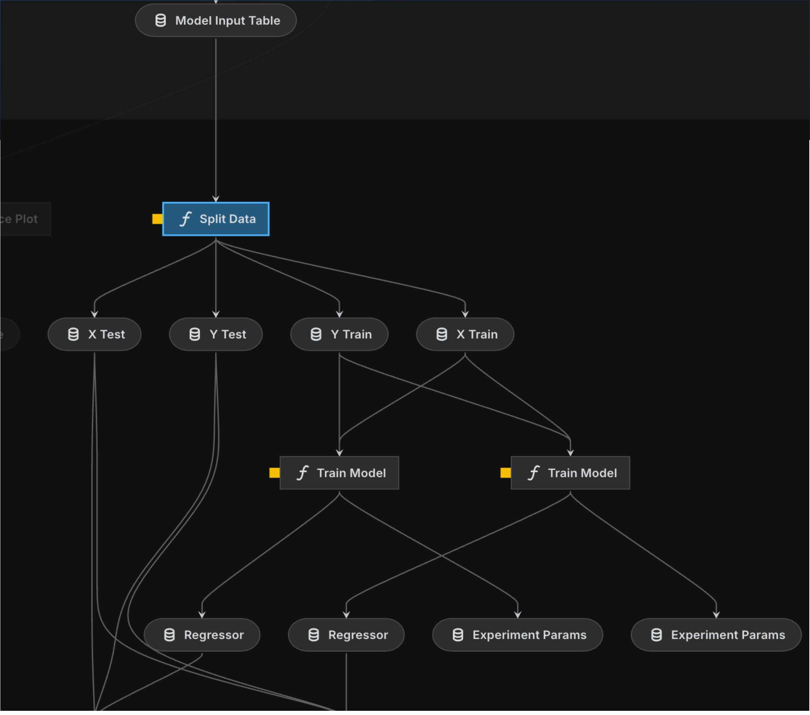{fig-align="center" width="78%"}
:::

::: caption
Grafo de dependencias del pipeline: partición de datos, entrenamiento y registro de parámetros de experimento.
:::
::::
:::::

::: notes
- El argumento acá no es tecnológico sino de mantención: un modelo que solo corre en el notebook de una persona no es un sistema institucional.
- El grafo muestra las dependencias explícitas: model input table → split → train → regresores y parámetros de experimento.
- Esto conecta directo con una de las mejoras que se plantean al cierre: un pipeline robusto para ejecutar en cualquier momento.
- Tiempo: 55 s.
:::

------------------------------------------------------------------------

## De la probabilidad al grupo de riesgo

::::: columns
:::: {.column width="50%"}
### Los modelos

- **XGBoost** — árboles de decisión ensamblados; clasifica según presencia o ausencia de alerta. Es el modelo en uso.
- **Red neuronal** — capas de neuronas interconectadas; explorada como alternativa.

### El paso a categorías

La probabilidad estimada se convierte en un **grupo de riesgo** aplicando umbrales según criterios operacionales:

::: {style="text-align:center; font-size:0.82em; margin-top:0.5em;"}
`Sin Riesgo` · `Riesgo Bajo` · `Riesgo Medio` · `Riesgo Alto`
:::
::::

:::: {.column width="50%"}
<br>

::: {.callout-important title="Advertencia metodológica"}
**Los grupos no son comparables entre años.** La distribución de probabilidades varía entre cohortes y cada modelo se entrena con datos distintos, así que un "Riesgo Alto" de 2025 y uno de 2026 no significan lo mismo.
:::

::: {.callout-note title="Cómo leer la importancia"}
**La importancia de variables no es causalidad.** Se interpreta según la utilidad de cada variable para generar divisiones (*splits*) dentro del modelo, no como una relación causal directa.
:::
::::
:::::

::: notes
- El modelo entrega una probabilidad continua; los cuatro grupos son un corte operacional, no una propiedad del estudiante.
- Los dos recuadros de la derecha son las advertencias metodológicas que hay que repetir cada vez que alguien compara cifras entre años o lee un ranking de variables como explicación causal.
- Sobre los umbrales: son criterios operacionales, o sea que responden a cuánta capacidad de acompañamiento hay disponible, no a un óptimo estadístico.
- Tiempo: 65 s.
:::

------------------------------------------------------------------------

## Cómo entrenamos: esquema expansivo

::: {.paper-figure}
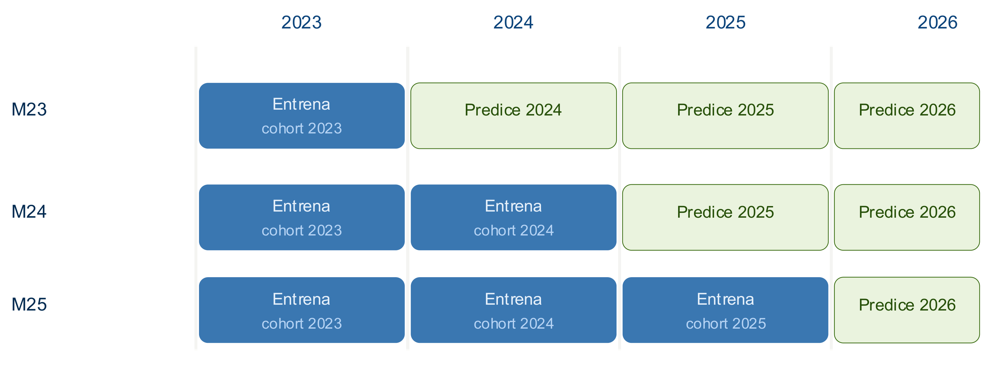{fig-align="center" width="72%"}
:::

::::: columns
:::: {.column width="50%"}
::: {.callout-tip title="Ventaja"}
Entrenar con los datos más recientes es más representativo del contexto actual: captura cambios en el perfil de ingreso y en las políticas institucionales.
:::
::::

:::: {.column width="50%"}
::: {.callout-important title="Desventaja"}
Cada modelo se entrena con datos distintos, así que **M23, M24 y M25 no son directamente comparables**: una diferencia en métricas puede deberse al cambio en los datos, no a una mejora real.
:::
::::
:::::

::: notes
- Leer la figura: M23 entrena solo con la cohorte 2023 y predice 2024, 2025 y 2026. M24 agrega 2024. M25 acumula 2023, 2024 y 2025 y predice 2026.
- El esquema es expansivo: cada modelo nuevo hereda todo lo anterior y suma la cohorte más reciente.
- La tensión es real y conviene no esconderla: ganamos representatividad y perdemos comparabilidad. Es un trade-off asumido, no un descuido.
- Esto se relaciona con el **data drift**: las distribuciones de los datos cambian con el tiempo y un modelo entrenado en el pasado pierde precisión en el presente. Hay presentaciones dedicadas a backtesting y a data drift.
- Tiempo: 70 s.
:::

------------------------------------------------------------------------

##  {background-image="../python-datos/images/background_slides3.png" background-opacity="0.3"}

::: {style="display: flex; justify-content: center; align-items: center; height: 60vh; flex-direction: column; text-align: center;"}
[Resultados]{style="font-size: 2em"}

[Qué pasa cuando entra el primer dato universitario]{style="font-size: 2.5em"}
:::

------------------------------------------------------------------------

## Alerta 0 vs Alerta 1 — cohorte 2025

::::: columns
:::: {.column width="50%"}
::: {.paper-figure}
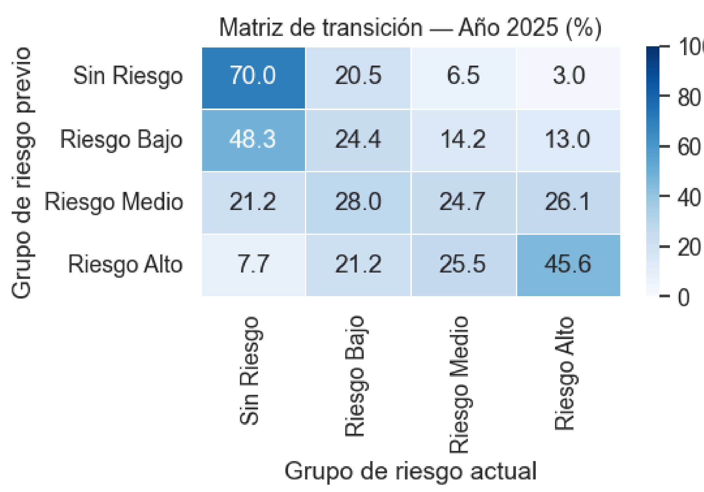{fig-align="center" width="92%"}
:::
::::

:::: {.column .incremental width="50%"}
<br>

-   **Cómo leerla**: cada fila es el grupo de riesgo previo (A0) y cada columna el actual (A1). La diagonal son los que mantienen su condición; a la izquierda bajan de riesgo, a la derecha suben.
-   **El 70 %** de los estudiantes *sin riesgo* permanece en esa condición.
-   En cambio, **Riesgo Medio y Riesgo Alto** presentan mucha más movilidad: el Riesgo Medio se reparte casi uniformemente entre las cuatro categorías (21,2 / 28,0 / 24,7 / 26,1).
-   **Conclusión**: los grupos de menor riesgo tienden a mantenerse; los de mayor riesgo requieren seguimiento y apoyo focalizado.
::::
:::::

::: notes
- Esta matriz responde una pregunta concreta: ¿cuánto cambia el diagnóstico cuando entra la nota de certamen 1?
- La lectura optimista: si el estudiante entró sin riesgo, es bastante probable que siga sin riesgo (70 %). El sistema no está generando falsas alarmas masivas.
- La lectura útil: el Riesgo Medio es prácticamente una moneda al aire. Ahí es donde la Alerta 1 aporta información nueva, y ahí es donde conviene mirar.
- El Riesgo Alto se mantiene en 45,6 %, pero eso significa que más de la mitad se movió. La alerta de admisión sola no basta.
- Tiempo: 75 s.
:::

------------------------------------------------------------------------

## Cohorte 2026: el problema de cobertura

::: {.paper-figure}
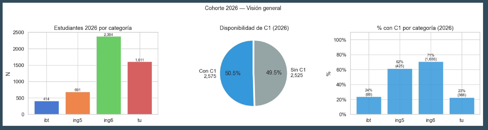{fig-align="center" width="92%"}
:::

::::: columns
:::: {.column width="50%"}
::: metric-row
[50,5 %]{.metric} [de la cohorte tiene nota C1 disponible (2.575 de 5.100)]{.metric-label}
:::
::::

:::: {.column width="50%"}
::: metric-row
[24 % / 23 %]{.metric} [cobertura de C1 en IBT y TU, contra 71 % en ING6]{.metric-label}
:::
::::
:::::

::: notes
- Esta es la diapositiva más incómoda del set, y por eso vale la pena detenerse.
- La cohorte 2026 son 5.100 estudiantes: 2.384 ING6, 1.611 TU, 691 ING5 y 414 IBT.
- Solo la mitad tiene nota C1 registrada al momento de calcular la Alerta 1. Para la otra mitad, la Alerta 1 no puede aportar nada nuevo sobre la Alerta 0.
- Y la cobertura está muy mal repartida: 71 % en ING6 y 62 % en ING5, contra 24 % en IBT y 23 % en TU.
- O sea que la alerta más informativa llega justamente menos a las carreras técnicas. Esto conecta directo con la primera dificultad del cierre: conseguir que la nota crítica se registre a tiempo.
- Tiempo: 80 s.
:::

------------------------------------------------------------------------

## Alerta 0 vs Alerta 1 — cohorte 2026

::: {.paper-figure}
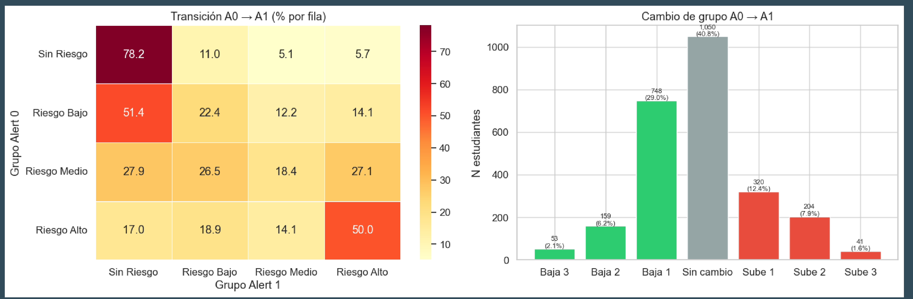{fig-align="center" width="94%"}
:::

::::: columns
:::: {.column width="50%"}
::: {.param-card}
**Se repite el patrón de 2025**: el 78,2 % de los *sin riesgo* se mantiene, mientras el Riesgo Medio sigue siendo el grupo más volátil (27,9 / 26,5 / 18,4 / 27,1).
:::
::::

:::: {.column width="50%"}
::: {.param-card}
**El 40,8 % no cambia de grupo.** De los que sí se mueven, **bajan más de los que suben**: 37,3 % baja de categoría y 21,9 % sube.
:::
::::
:::::

::: notes
- La matriz de la izquierda confirma que el patrón de 2025 no fue casualidad: los extremos son estables y el medio es volátil.
- El gráfico de la derecha es la vista agregada sobre los 2.575 estudiantes que sí tienen C1: 1.050 sin cambio, 960 bajan de grupo y 565 suben.
- Que bajen más de los que suben es una buena noticia operacional: la Alerta 0, basada solo en antecedentes de admisión, tiende a ser **conservadora** y sobreestimar el riesgo. El certamen 1 corrige hacia abajo.
- Los movimientos extremos son raros: solo 41 estudiantes suben tres categorías y 53 bajan tres.
- Recordar que todo esto aplica únicamente a la mitad de la cohorte que tiene C1.
- Tiempo: 75 s.
:::

------------------------------------------------------------------------

## Qué variables pesan

::: {.paper-figure}
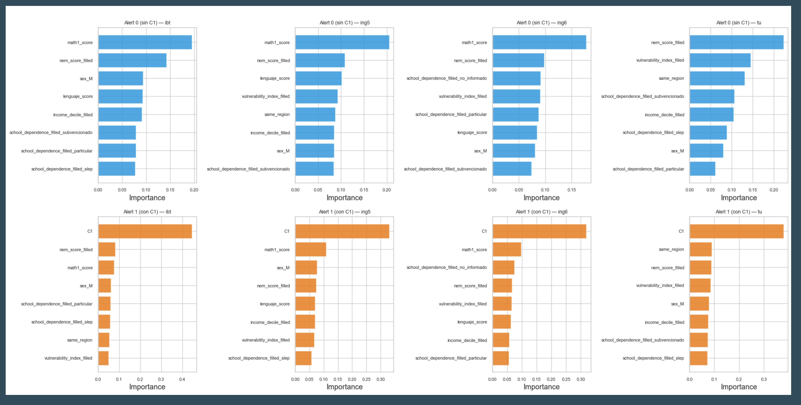{fig-align="center" width="70%"}
:::

::: info-box
**Fila superior (Alerta 0, sin C1)** — la importancia se reparte entre `math1_score`, `nem_score`, `language_score`, vulnerabilidad, dependencia del colegio y región. **Fila inferior (Alerta 1, con C1)** — `C1` domina y desplaza a todo lo demás.
:::

::: notes
- Cada columna es una categoría de carrera: IBT, ING5, ING6 y TU.
- En la Alerta 0, sin datos universitarios, el modelo se apoya en el puntaje de matemáticas y en variables socioeconómicas y de contexto escolar.
- En la Alerta 1, la nota de certamen 1 se come prácticamente toda la importancia en las cuatro categorías.
- Eso es esperable —es el primer dato de desempeño real— pero también es un riesgo de diseño: el modelo queda dependiendo de una sola variable, que además solo está disponible para la mitad de la cohorte.
- Repetir la advertencia: esto mide utilidad para generar splits, no causalidad.
- Tiempo: 70 s.
:::

------------------------------------------------------------------------

## Conclusiones

::::: columns
:::: {.column .incremental width="50%"}
### Dificultades

-   **Obtener la nota crítica a tiempo** — depende del registro oportuno por parte de los profesores, y hoy solo la mitad de la cohorte la tiene cuando se calcula la Alerta 1.
-   **Dependencia de C1** — cuando está disponible, concentra casi toda la importancia del modelo y desplaza al resto de las variables.
-   **Definir los grupos de riesgo** — los umbrales son operacionales y no comparables entre cohortes: es un problema de formulación, no de ajuste.
::::

:::: {.column .incremental width="50%"}
### Mejoras en curso

-   **Análisis exploratorio más amigable para el negocio** — que jefes de carrera y equipos de acompañamiento puedan leer las alertas sin intermediación técnica.
-   **Pipeline robusto** — poder ejecutar el sistema en cualquier momento del ciclo académico, no solo en fechas fijas.
-   Trabajo asociado en **backtesting** y **monitoreo de data drift** para vigilar la degradación de los modelos.
::::
:::::

::: info-box
El SAT-E ya funciona como herramienta de priorización. El cuello de botella hoy **no es el modelo**: es la **disponibilidad oportuna del dato** que lo alimenta.
:::

::: notes
- Cerrar con honestidad: las tres dificultades son reales y ninguna se resuelve con más modelo.
- La primera es organizacional, no técnica. Si la nota no está registrada, no hay algoritmo que la invente.
- La segunda es un riesgo de diseño que conviene vigilar: un modelo que depende de una sola variable es frágil.
- La tercera es la más sutil: no existe una definición "correcta" de riesgo alto; existe la que calza con la capacidad de acompañamiento disponible.
- El recuadro final es el mensaje que quiero que se lleven, sobre todo si en la sala hay quien pueda mover la aguja del registro oportuno de notas.
- Tiempo: 80 s.
:::

------------------------------------------------------------------------

##  {.title-slide background-color="#0F2044"}

::: title-block
**Gracias**

[¿Preguntas?]{style="font-size: 0.45em; font-weight: normal; font-style: italic;"}
:::

::: subtitle-block
SAT-E · Sistema de Alerta Temprana Estudiantil\
Presentaciones relacionadas: *SAT-E — backtesting* · *SAT-E — data drift*
:::

::: author-block
Francisco Alfaro Medina · Universidad Técnica Federico Santa María\
<https://github.com/fralfaro/talks>
:::

::: notes
- Dejar esta diapositiva durante la ronda de preguntas.
- Preguntas probables: qué pasa con los estudiantes sin C1; cómo se eligen los umbrales de riesgo; qué intervención concreta gatilla cada alerta; cómo se valida que el sistema efectivamente reduce deserción; quién puede ver las alertas y con qué resguardos.
- Sobre la última: conviene tener clara la respuesta de privacidad y de uso responsable, que es el principio del comienzo.
:::


```{=html}
<style>
.reveal .slides h2 {
  font-size: 1.3em;
}
.reveal .slides p {
  font-size: 0.95em;
}
.reveal .slides ul {
  font-size: 0.9em;
}
.reveal .slide-logo {
   max-height: 2.5em !important;
}
</style>
```
