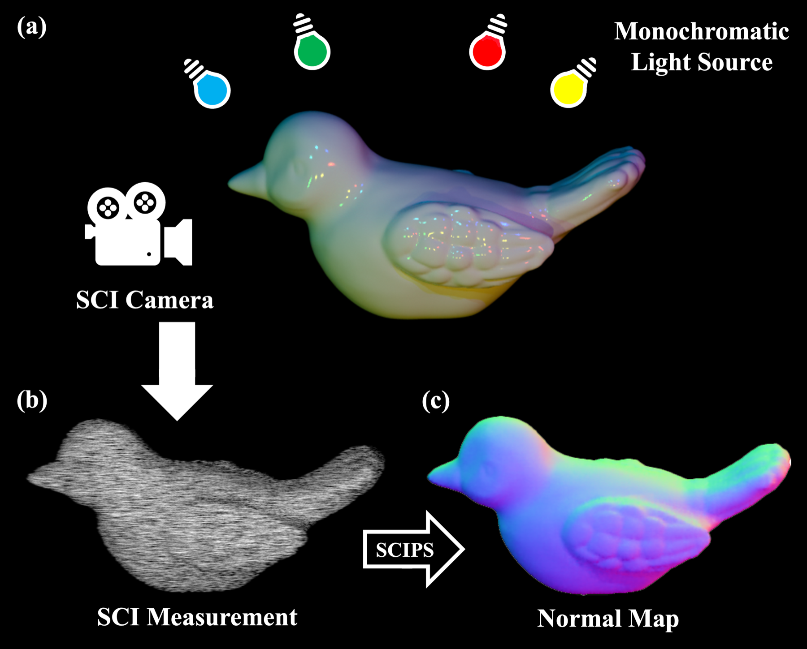
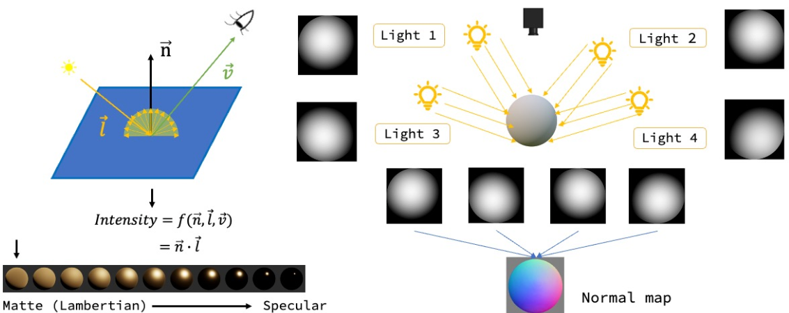
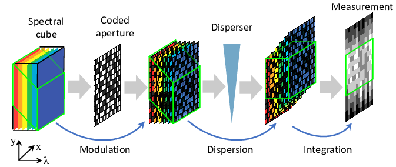
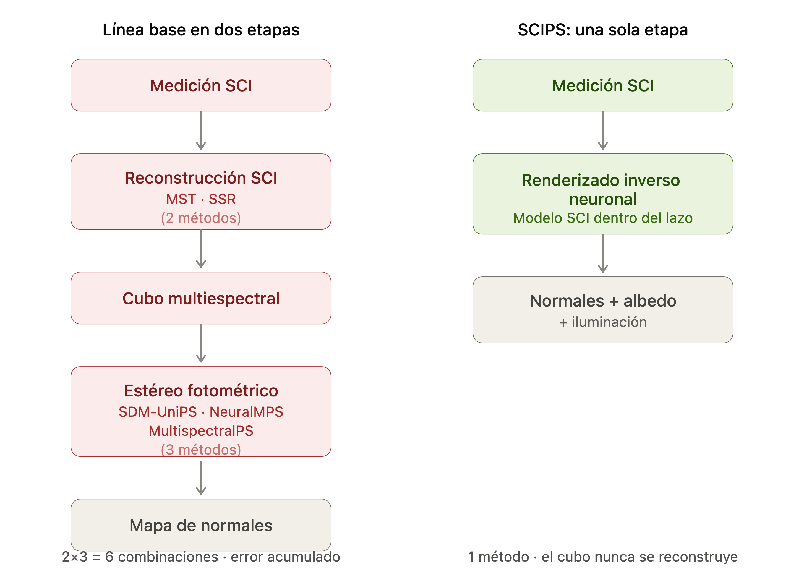
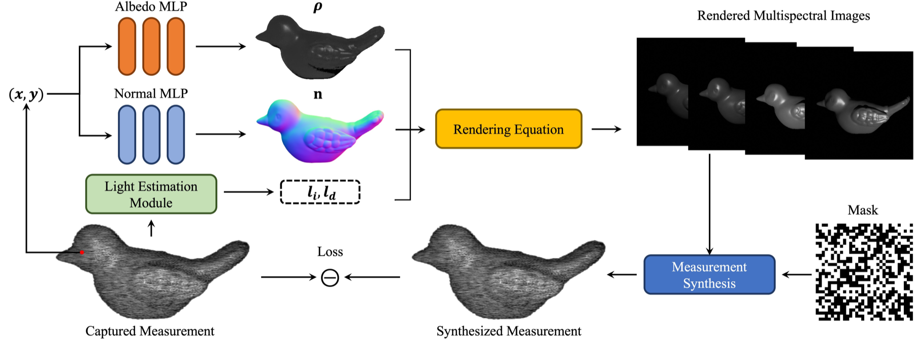
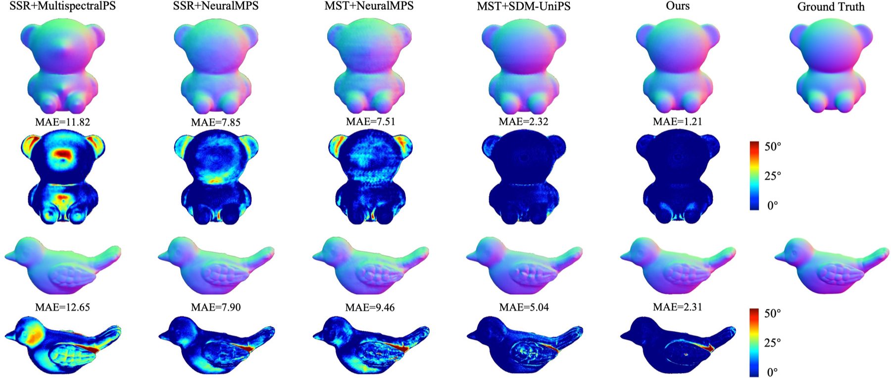
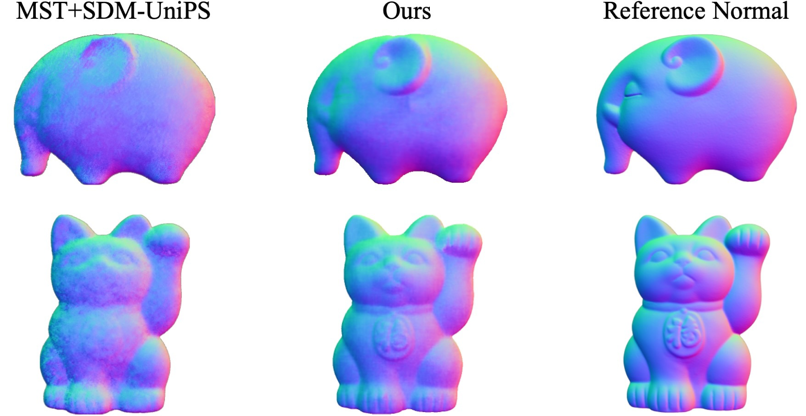
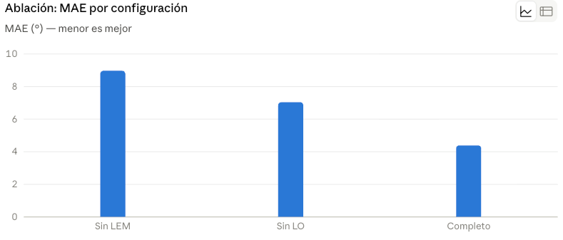

##  {.title-slide background-color="#0F2044"}

::: title-block
**SCIPS: Single-Shot Photometric Stereo from a <br> Snapshot Compressed Multispectral Image**


:::

::: subtitle-block
Yunhao Li · Yanan Hu · Xiaodong Wang · Yuze Yang · Ziyi Meng · Xin Yuan · Peidong Liu\
Zhejiang University · Westlake University · ICIP 2026
:::

::: author-block
Presentación de paper — Francisco Alfaro Medina\
Universidad Técnica Federico Santa María
:::

::: notes
- Bienvenida. Hoy presento SCIPS, publicado en ICIP 2026 por un grupo de Zhejiang y Westlake University.
- La afirmación en una línea: recuperar un mapa de normales de alta calidad desde una *única* medición 2D comprimida.
- Voy a dedicar ~4 minutos al problema, ~4 al método y ~4 a la evidencia.
- Tiempo: 45 s.
:::

------------------------------------------------------------------------

## El estéreo fotométrico funciona — pero cobra caro

::::: columns
:::: {.column .incremental width="52%"}
<br><br><br>

-   **Estéreo fotométrico** (Woodham, 1980): recupera normales de superficie a partir de imágenes bajo iluminación variable. Estándar de oro para detalle geométrico *fino*.
-   El costo es estructural: **una imagen por fuente de luz**, capturadas de forma secuencial — no hay atajo dentro de este esquema.
-   Consecuencia directa: adquisición lenta, alto costo de almacenamiento, inviable para sujetos en movimiento.
-   **La pregunta de SCIPS:** ¿se puede lograr con **una sola exposición (10–20 ms)** y **un único cuadro 2D**?
::::

:::: {.column width="48%"}

<br>
<br>

{fig-align="center" width="90%"}
::::
:::::

::: notes
- El estéreo fotométrico entrega normales por píxel, mucho más detalle que el estéreo multivista.
- Pero el montaje clásico enciende luces blancas de a una: N luces, N imágenes.
- Eso lo descarta para captura de humanos digitales o inspección industrial en línea.
- Apuntar a la figura: (a) el montaje de captura, (b) el único cuadro comprimido, (c) el mapa de normales que SCIPS recupera de él.
- Tiempo: 70 s.
:::


------------------------------------------------------------------------

## La idea correcta, atrapada por el hardware


| Enfoque | Cómo separa las luces | Cuello de botella |
|------------------|--------------------------|---------------------------|
| **PS convencional** [1,2] | Tiempo — una luz blanca por cuadro | Captura secuencial: lenta y costosa en almacenamiento |
| **PS multiespectral RGB** [3,4] | Longitud de onda — 3 canales del sensor | Solo ~3 fuentes de luz efectivas; filtros de color o luces alternadas reintroducen la secuencialidad |
| **PS hiperespectral** | Longitud de onda — muchos canales | Cámaras caras y poco prácticas de desplegar |

<br>

{fig-align="center" width="85%"}

::: notes
- El PS multiespectral es la idea clave: darle a cada luz una longitud de onda distinta, encenderlas simultáneamente y demultiplexar por espectro.
- Con un sensor RGB se obtienen tres luces. No alcanza para una estimación bien condicionada sobre superficies no lambertianas.
- El hardware hiperespectral resuelve el número de canales y crea un problema de costo.
- Entonces: necesitamos muchos canales espectrales sobre un sensor barato. Eso es exactamente lo que ofrece el sensado compresivo.
- Tiempo: 70 s.
:::

------------------------------------------------------------------------

## Comprimir el espectro en un solo cuadro — a costa de mezclarlo

::::: columns
:::: {.column width="45%"}
Un cubo multiespectral $I \in \mathbb{R}^{H\times W\times N_\lambda}$ es **codificado**, **cizallado** y **colapsado** sobre un único sensor 2D:

$$I' = I \odot M \tag{1}$$

$$I''(x,y,n_\lambda) = I'(x + d(\lambda_{n_\lambda} - \lambda_c),\, y,\, n_\lambda) \tag{2}$$

$$Y = \sum_{n_\lambda=1}^{N_\lambda} I''(:,:,n_\lambda) + Z \tag{3}$$

<br> $M$: máscara apertura codificada · $d$: paso dispersión  $Z$: ruido sensor · $Y$: único cuadro capturado
::::

:::: {.column width="55%"}
{fig-align="center" width="100%"}

::: {.fragment}
Cada canal $n_\lambda$ se desplaza $d(\lambda_{n_\lambda}-\lambda_c)$ píxeles antes de sumarse → un solo píxel de $Y$ mezcla varios canales en posiciones distintas.
:::
::::
:::::

. . .

<br> 

- Con $d=1$: la medición es $\dfrac{W \cdot N_\lambda}{W+N_\lambda-1}$ veces más eficiente en memoria que el cubo completo.
- Para $W=1024,\ N_\lambda=12$: **≈11,9× de compresión**, sobre un sensor CMOS estándar sin filtros espectrales.
- El precio: recuperar $I$ a partir de $Y$ es un problema **severamente mal planteado** — múltiples cubos distintos pueden producir la misma medición $Y$.

------------------------------------------------------------------------

## Por qué falla el pipeline 

::::: columns
:::: {.column width="55%"}
<br><br>
{fig-align="center" width="100%"}
::::

:::: {.column width="45%" .fragment }
<br><br><br><br>

- **Línea base en dos etapas**: los errores se propagan y acumulan entre etapas — cada una es una red preentrenada con su propio objetivo, y la reconstrucción es ciega a la tarea geométrica que viene después. <br><br>

- **SCIPS: una sola etapa**: el cubo nunca se reconstruye, es solo una cantidad intermedia dentro de un renderizador diferenciable optimizado por escena, guiado por un único objetivo de consistencia fotométrica.

::::
:::::


------------------------------------------------------------------------

## El framework, de punta a punta

::: {style="position: relative; width: 90%; margin: 0 auto;"}
{width="100%"}

<div class="fragment fade-in-then-out" data-fragment-index="1"
     style="position: absolute; top: 22%; left: 0%; width: 10%; height: 12%;
            border: 3px solid #E24B4A; border-radius: 8px; pointer-events: none;"></div>

<div class="fragment fade-in-then-out" data-fragment-index="2"
     style="position: absolute; top: 0%; left: 8%; width: 40%; height: 52%;
            border: 3px solid #E24B4A; border-radius: 8px; pointer-events: none;"></div>

<div class="fragment fade-in-then-out" data-fragment-index="3"
     style="position: absolute; top: 48%; left: 8%; width: 40%; height: 15%;
            border: 3px solid #E24B4A; border-radius: 8px; pointer-events: none;"></div>

<div class="fragment fade-in-then-out" data-fragment-index="4"
     style="position: absolute; top: 0%; left: 46%; width: 54%; height: 48%;
            border: 3px solid #E24B4A; border-radius: 8px; pointer-events: none;"></div>

<div class="fragment fade-in-then-out" data-fragment-index="5"
     style="position: absolute; top: 55%; left: 68%; width: 42%; height: 32%;
            border: 3px solid #E24B4A; border-radius: 8px; pointer-events: none;"></div>

<div class="fragment fade-in-then-out" data-fragment-index="6"
     style="position: absolute; top: 68%; left: 0%; width: 68%; height: 30%;
            border: 3px solid #E24B4A; border-radius: 8px; pointer-events: none;"></div>
:::

<br>

::::: {style="font-size: 0.75em;"}
::::: columns
:::: {.column width="45%"}
::: {.fragment fragment-index="1"}
**1 · Entrada:** todo parte de las coordenadas de píxel $(x,y)$.
:::
::: {.fragment fragment-index="2"}
**2 · Predicción:** dos MLP estiman albedo $\rho$ y normal $n$ en ese punto.
:::
::: {.fragment fragment-index="3"}
**3 · Luz:** un módulo CNN estima $l_i, l_d$, sin calibración previa.
:::
::::

:::: {.column width="55%"}
::: {.fragment fragment-index="4"}
**4 · Rendering:** con normal, albedo y luz se renderiza cada canal espectral.
:::
::: {.fragment fragment-index="5"}
**5 · Formación SCI:** la imagen renderizada pasa por el modelo físico real (máscara + cizalle) para sintetizar una medición.
:::
::: {.fragment fragment-index="6"}
**6 · El lazo:** se compara contra la medición real capturada — esa diferencia (Loss) guía todo el entrenamiento, y su gradiente vuelve a $(x,y)$.
:::
::::
:::::
:::::


------------------------------------------------------------------------

## Resultados  — error angular medio en grados (menor es mejor)

<br><br>

| Método | Ball | Bunny | Fish | Moai | Pumpkin | **Promedio** |
|---------------------------------|-------|-------|-------|-------|---------|-------------|
| MST [6] + MultispectralPS [4] | 2.40 | 13.76 | 18.40 | 16.45 | 9.41 | 11.63 |
| MST [6] + NeuralMPS [3] | 9.82 | 14.53 | 15.82 | 7.85 | 5.51 | 10.62 |
| MST [6] + SDM-UniPS [18] | 2.42 | 7.18 | 12.81 | 5.30 | 13.35 | 7.60 |
| SSR [7] + MultispectralPS [4] | 2.21 | 13.64 | 18.16 | 17.18 | 9.98 | 11.81 |
| SSR [7] + NeuralMPS [3] | 9.98 | 11.89 | 14.20 | 10.48 | 5.08 | 10.73 |
| SSR [7] + SDM-UniPS [18] | 2.57 | 6.97 | 13.70 | 6.18 | 12.99 | 7.90 |
| **SCIPS (propuesto)** | **0.55** | **4.96** | **9.73** | **2.54** | **1.12** | **4.39** |

<br>

:::::: columns
:::: {.column width="32%"}
::: metric-row
[4,39°]{.metric} [MAE promedio sobre los 10 objetos]{.metric-label}
:::
::::

:::: {.column width="32%"}
::: metric-row
[−42%]{.metric} [frente a la mejor línea base de dos etapas (7,60°)]{.metric-label}
:::
::::

:::: {.column width="32%"}
::: metric-row
[8,03° / 0,09]{.metric} [MAE de dirección de luz / error de intensidad]{.metric-label}
:::
::::
::::::

::: notes
- La tabla muestra 5 de los 10 objetos; la columna de promedio es sobre los diez.
- SCIPS gana en casi todos los objetos. El margen es mayor justamente donde los pipelines de dos etapas acumulan errores.
- Ser franco: Cat (5.05 contra 3.95 de MST+SDM-UniPS) es un caso donde una línea base le gana. "Consistentemente superior en casi todos los objetos" es la redacción del propio paper.
- Los números de iluminación importan porque la luz nunca fue calibrada: 8 grados de error en dirección de luz y aun así 4,4 grados de error en las normales.
- Tiempo: 90 s.
:::

------------------------------------------------------------------------

## Comparación cualitativa

<br><br>


::: r-stack
{.fragment .fade-in-then-out fig-align="center" width="84%"}

{.fragment fig-align="center" width="58%"}
:::

::: notes
- Primer clic: sintético (Fig. 4). Cinco líneas base, luego el método propuesto, luego el ground truth. Arriba el mapa de normales, abajo el mapa de error en escala jet; azul es error bajo.
- Bear, de izquierda a derecha: MAE 11.82 / 7.85 / 7.51 / 2.32, y el propuesto en 1.21. Bird: 12.65 / 7.90 / 9.46 / 5.04, y el propuesto en 2.31.
- Los mapas jet son el argumento: las líneas base se encienden justo en las orejas, el hocico y el ala — las zonas de alta curvatura donde el error de reconstrucción SCI se convierte en error de normales.
- Segundo clic: datos reales (Fig. 5), alcancía y gato de la suerte, contra MST+SDM-UniPS y una referencia escaneada. Esa referencia NO está alineada a nivel de píxel, así que esto es solo comparación visual: no se puede citar un MAE.
- Juzgar los artefactos: la línea base muestra ruido y moteado por crosstalk en las regiones planas; SCIPS es más suave y conserva el relieve fino.
- Esta es la diapositiva que responde "¿sobrevive la ventaja sintética a la óptica real?".
- Tiempo: 70 s.
:::

------------------------------------------------------------------------

## Ablación: qué aporta cada componente

<br>

{fig-align="center" width="100%"}


:::: {.incremental  style="font-size: 0.85em;"}

-   **Sin LEM**, la iluminación parte de una inicialización pobre y la optimización conjunta no tiene un punto confiable desde el cual descender.
-   **Sin LO**, la iluminación se estima una vez y se congela: los errores en $l_i, l_d$ se absorben en las normales, la falla clásica del PS no calibrado.
-   **Sin LO (7,04°) supera las líneas base de dos etapas**, LEM y LO son **complementarios** ( buena inicialización + la libertad refinarla).
:::

::: notes
- Esta es la ablación que exigiría un revisor, y es la única que trae el paper.
- Una crítica justa: no hay ablación sobre la codificación posicional, el ancho de la red ni el número de canales espectrales.
- Tiempo: 65 s.
:::

------------------------------------------------------------------------

## Conclusiones

<br><br>

::::: columns
:::: {.column width="50%" }
::: {.callout-tip title="Lo que el paper establece" .incremental style="font-size: 1.1em;"}
-   Se pueden recuperar normales de superficie desde una **única medición 2D comprimida**, sin reconstruir el cubo.
-   Poner el **modelo directo de SCI dentro** de un renderizador diferenciable supera al esquema reconstruir-y-después-estimar: **4,39°** contra **7,60°** de MAE.
-   La optimización por escena junto a la estimación conjunta de luz elimina de una vez el paso de **calibración** y la **brecha de dominio**.
-   Un prototipo funcional y dos datasets nuevos hacen que la afirmación sea verificable sobre óptica real.
:::
::::

:::: {.column width="50%"}
::: {.callout-warning title="Lo que queda abierto" .incremental style="font-size: 1.1em;"}
-   **10–15 min por objeto**: la captura es rápida, la reconstrucción no. El renderizado inverso en tiempo real es el próximo objetivo evidente.
-   **Sin evaluación cuantitativa en datos reales** — un ground truth registrado zanjaría esa afirmación.
-   Un objeto, una vista, cámara ortográfica; sin interreflexiones ni sombras proyectadas más allá del término $\max(\cdot, 0)$.
-   ¿Cuánto se degrada al bajar $N_\lambda$, o cuando la máscara se aparta de la calibrada?
:::
::::
:::::

::: notes
- La contribución que yo defendería es la descomposición, no la arquitectura. Los MLP son estándar; la idea es elegir *no* reconstruir el cubo.
- La limitación honesta: esto es reconstrucción offline a partir de una captura rápida. Para captura de humanos digitales está bien; para inspección industrial en línea todavía no.
- Invitar aquí las preguntas del comité.
- Tiempo: 75 s.
:::
------------------------------------------------------------------------

## Referencias

::::: columns
:::: {.column width="50%"}
:::: {.references style="font-size: 0.62em; line-height: 1.22;"}

**Paper presentado**<br>
Y. Li, Y. Hu, X. Wang, Y. Yang, Z. Meng, X. Yuan & P. Liu.<br>
*SCIPS: Single-Shot Photometric Stereo from a Snapshot Compressed Multispectral Image.* ICIP, 2026.<br>
[`doi:10.1109/ICIP61757.2026.11630570`](https://doi.org/10.1109/ICIP61757.2026.11630570)

**[1]** R. J. Woodham.<br>
*Photometric Method for Determining Surface Orientation from Multiple Images.* Optical Engineering, 1980.<br>
[`doi:10.1117/12.7972479`](https://doi.org/10.1117/12.7972479)

**[2]** B. Shi et al.<br>
*A Benchmark Dataset and Evaluation for Non-Lambertian and Uncalibrated Photometric Stereo.* CVPR, 2016.<br>
[`doi:10.1109/CVPR.2016.403`](https://doi.org/10.1109/CVPR.2016.403)

**[3]** J. Lv et al.<br>
*Non-Lambertian Multispectral Photometric Stereo via Spectral Reflectance Decomposition.* IJCAI, 2023.<br>
[`doi:10.24963/ijcai.2023/139`](https://doi.org/10.24963/ijcai.2023/139)

::::
::::

:::: {.column width="50%"}
:::: {.references style="font-size: 0.62em; line-height: 1.22;"}

**[4]** H. Guo et al.<br>
*Multispectral Photometric Stereo for Spatially-Varying Spectral Reflectances.* IJCV, 2022.<br>
[`doi:10.1007/s11263-022-01634-4`](https://doi.org/10.1007/s11263-022-01634-4)

**[6]** Y. Cai et al.<br>
*Mask-guided Spectral-wise Transformer for Efficient Hyperspectral Image Reconstruction.* CVPR, 2022.<br>
[`doi:10.1109/CVPR52688.2022.01698`](https://doi.org/10.1109/CVPR52688.2022.01698)

**[7]** J. Zhang et al.<br>
*Improving Spectral Snapshot Reconstruction with Spectral-Spatial Rectification.* CVPR, 2024.<br>
[`doi:10.1109/CVPR52733.2024.02439`](https://doi.org/10.1109/CVPR52733.2024.02439)

**[18]** S. Ikehata.<br>
*Scalable, Detailed and Mask-Free Universal Photometric Stereo.* CVPR, 2023.<br>
[`doi:10.1109/CVPR52729.2023.01268`](https://doi.org/10.1109/CVPR52729.2023.01268)

::::
::::
:::::

------------------------------------------------------------------------

##  {.title-slide background-color="#0F2044"}

::: title-block
**Gracias**

[¿Preguntas?]{style="font-size: 0.45em; font-weight: normal; font-style: italic;"}
:::

::: subtitle-block
SCIPS: Single-Shot Photometric Stereo from a Snapshot Compressed Multispectral Image\
Li, Hu, Wang, Yang, Meng, Yuan & Liu · ICIP 2026 · DOI 10.1109/ICIP61757.2026.11630570
:::

::: author-block
Francisco Alfaro Medina · Universidad Técnica Federico Santa María\
<https://fralfaro.github.io/talks/>
:::

::: notes
- Dejar esta diapositiva mientras dure la ronda de preguntas.
- Preguntas probables que conviene tener listas: por qué no ajustar el reconstructor SCI de punta a punta para la tarea de PS; qué tan sensible es al error de calibración de la máscara; qué pasa con menos LED.
:::


```{=html}
<style>
.reveal .slides h2 {
  font-size: 1.3em;
}
.reveal .slides p {
  font-size: 0.95em;
}
.reveal .slides ul {
  font-size: 0.9em;
}
.reveal .slide-logo {
   max-height: 2.5em !important;
}
</style>
```
