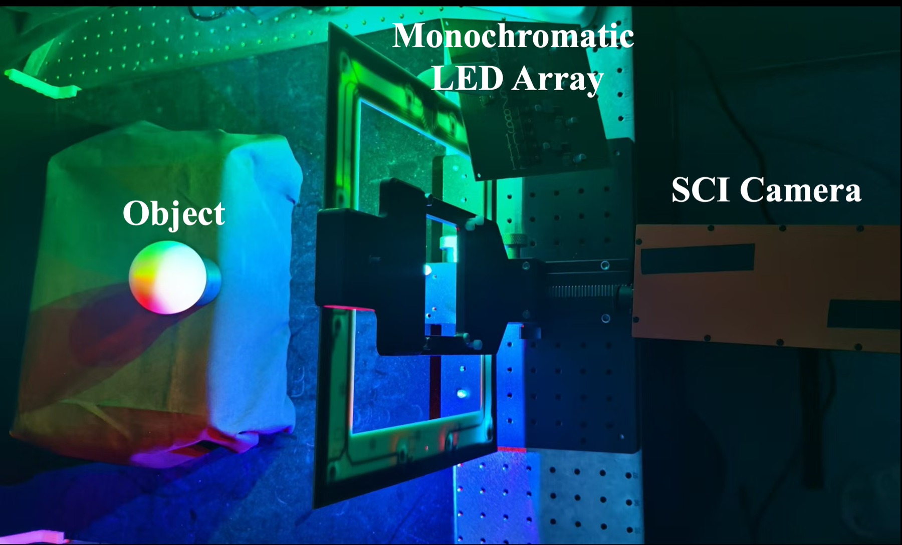

##  {.title-slide background-color="#0F2044"}

::: title-block
**SCIPS: Single-Shot Photometric Stereo from a <br> Snapshot Compressed Multispectral Image**

[Una exposición, una medición 2D, un mapa de normales]{style="font-size: 0.45em; font-weight: normal; font-style: italic;"}
:::

::: subtitle-block
Yunhao Li · Yanan Hu · Xiaodong Wang · Yuze Yang · Ziyi Meng · Xin Yuan · Peidong Liu\
Zhejiang University · Westlake University · ICIP 2026
:::

::: author-block
Presentación de paper — Francisco Alfaro Medina\
Doctorado en Ingeniería Electrónica · Universidad Técnica Federico Santa María
:::

::: notes
- Bienvenida. Hoy presento SCIPS, publicado en ICIP 2026 por un grupo de Zhejiang y Westlake University.
- La afirmación en una línea: recuperar un mapa de normales de alta calidad desde una *única* medición 2D comprimida.
- Voy a dedicar ~4 minutos al problema, ~4 al método y ~4 a la evidencia.
- Tiempo: 45 s.
:::

------------------------------------------------------------------------

## La promesa y el precio del estéreo fotométrico

::::: columns
:::: {.column .incremental width="52%"}
<br>

-   El **estéreo fotométrico** (Woodham, 1980) recupera normales de superficie a partir de imágenes bajo iluminación variable — sigue siendo el estándar de oro para el detalle geométrico *fino*.
-   El costo: **una imagen por cada fuente de luz**, capturadas de forma secuencial.
-   Adquisición lenta, mucho almacenamiento, nada de sujetos en movimiento.
-   SCIPS hace una pregunta directa: ¿se puede lograr con **una sola exposición de 10–20 ms** y **un único cuadro 2D**?
::::

:::: {.column width="48%"}
{fig-align="center" width="80%"}
::::
:::::

::: notes
- El estéreo fotométrico entrega normales por píxel, mucho más detalle que el estéreo multivista.
- Pero el montaje clásico enciende luces blancas de a una: N luces, N imágenes.
- Eso lo descarta para captura de humanos digitales o inspección industrial en línea.
- Apuntar a la figura: (a) el montaje de captura, (b) el único cuadro comprimido, (c) el mapa de normales que SCIPS recupera de él.
- Tiempo: 70 s.
:::

------------------------------------------------------------------------

##  {background-image="../python-datos/images/background_slides3.png" background-opacity="0.3"}

::: {style="display: flex; justify-content: center; align-items: center; height: 60vh; flex-direction: column; text-align: center;"}
[El problema]{style="font-size: 2em"}

[Todo camino hacia el PS de una captura tiene un cuello de botella]{style="font-size: 2.5em"}
:::

------------------------------------------------------------------------

## Tres caminos, tres cuellos de botella

| Enfoque | Cómo separa las luces | Cuello de botella |
|------------------|--------------------------|---------------------------|
| **PS convencional** [1,2] | Tiempo — una luz blanca por cuadro | Captura secuencial: lenta y costosa en almacenamiento |
| **PS multiespectral RGB** [3,4] | Longitud de onda — 3 canales del sensor | Solo ~3 fuentes de luz efectivas; los filtros de color o las luces alternadas reintroducen la captura secuencial |
| **PS hiperespectral** | Longitud de onda — muchos canales | Las cámaras hiperespectrales son caras y poco prácticas de desplegar |

. . .

::: info-box
**La brecha.** El multiplexado espectral es la idea correcta — codificar la dirección de iluminación en la longitud de onda y encender todas las luces a la vez — pero un sensor RGB estándar no tiene canales suficientes, y una cámara hiperespectral no es una respuesta práctica.
:::

::: notes
- El PS multiespectral es la idea clave: darle a cada luz una longitud de onda distinta, encenderlas simultáneamente y demultiplexar por espectro.
- Con un sensor RGB se obtienen tres luces. No alcanza para una estimación bien condicionada sobre superficies no lambertianas.
- El hardware hiperespectral resuelve el número de canales y crea un problema de costo.
- Entonces: necesitamos muchos canales espectrales sobre un sensor barato. Eso es exactamente lo que ofrece el sensado compresivo.
- Tiempo: 70 s.
:::

------------------------------------------------------------------------

## Imagen compresiva de una captura (SCI): el modelo directo

::::: columns
:::: {.column width="55%"}
Un cubo multiespectral $I \in \mathbb{R}^{H \times W \times N_\lambda}$ es **codificado**, **cizallado** y **colapsado** sobre un único sensor 2D:

::: equation-highlight
$$I' = I \odot M$$
$$I''(x, y, n_\lambda) = I'\big(x + d(\lambda_{n_\lambda} - \lambda_c),\, y,\, n_\lambda\big)$$
$$Y = \sum_{n_\lambda=1}^{N_\lambda} I''(:,:,n_\lambda) + Z$$
:::

$M$: máscara de apertura codificada · $d$: paso de dispersión · $Z$: ruido del sensor · $Y$: el único cuadro capturado
::::

:::: {.column .incremental width="45%"}
<br><br>

-   Con $d = 1$, la medición es $\dfrac{W \cdot N_\lambda}{W + N_\lambda - 1}$ veces más eficiente en memoria que el cubo.
-   Para $W = 1024$, $N_\lambda = 12$: **≈ 11,9× de compresión**, sobre un sensor CMOS estándar.
-   El precio: recuperar $I$ a partir de $Y$ es un problema **severamente mal planteado**.
::::
:::::

::: notes
- Tres operaciones físicas: una apertura codificada multiplica el cubo por una máscara binaria; un dispersor óptico desplaza cada longitud de onda a lo largo de x; el sensor integra sobre la longitud de onda.
- Ojo con esto: es un modelo directo *conocido y diferenciable*. Eso va a importar muchísimo en un momento.
- La compresión es real: doce canales al costo de aproximadamente un cuadro.
- Pero invertirlo es la parte difícil, y ahí es donde el trabajo previo tropieza.
- Tiempo: 80 s.
:::

------------------------------------------------------------------------

## Por qué falla el pipeline obvio

::::: columns
:::: {.column width="48%"}
::: {style="background: #FDECEC; border-left: 5px solid #C0392B; border-radius: 8px; padding: 0.9em; height: 430px; font-size: 0.8em;"}
**Línea base en dos etapas**

`medición SCI`\
↓ *reconstrucción SCI* (MST, SSR)\
`cubo multiespectral`\
↓ *estéreo fotométrico* (SDM-UniPS, NeuralMPS, MultispectralPS)\
`mapa de normales`

- Los errores de la etapa 1 **se propagan y se acumulan** en la etapa 2.
- Ambas etapas son redes preentrenadas → **generalización limitada**, sobre todo hacia datos SCI reales.
- La etapa 1 optimiza un objetivo *espectral*, ciego a la tarea *geométrica* que viene después.
:::
::::

:::: {.column width="48%"}
::: {style="background: #EAFAF1; border-left: 5px solid #27AE60; border-radius: 8px; padding: 0.9em; height: 430px; font-size: 0.8em;"}
**SCIPS: una sola etapa**

`medición SCI`\
↓ *renderizado inverso neuronal con el modelo SCI dentro del lazo*\
`normales + albedo + iluminación`

- El cubo **nunca se reconstruye**: es una cantidad intermedia dentro de un renderizador diferenciable.
- **Optimización por escena** en tiempo de inferencia → sin brecha de dominio entre entrenamiento y test.
- Un solo objetivo: consistencia fotométrica con la medición efectivamente capturada.
:::
::::
:::::

::: notes
- Este es el argumento central del paper, así que darle tiempo.
- La respuesta natural de ingeniería sería: reconstruir el cubo con un método SCI del estado del arte y después correr un método PS del estado del arte. El paper muestra que esa descomposición está mal.
- La red de reconstrucción SCI minimiza error espectral, no error de normales. Sus modos de falla —crosstalk, amplificación de ruido— son justamente aquellos a los que el PS es sensible.
- SCIPS mantiene el cubo implícito y deja que una sola pérdida gobierne todo.
- Tiempo: 80 s.
:::

------------------------------------------------------------------------

##  {background-image="../python-datos/images/background_slides3.png" background-opacity="0.3"}

::: {style="display: flex; justify-content: center; align-items: center; height: 60vh; flex-direction: column; text-align: center;"}
[El método]{style="font-size: 2em"}

[Meter la física de la cámara dentro de la optimización]{style="font-size: 2.5em"}
:::

------------------------------------------------------------------------

## SCIPS en tres ideas

:::::: columns
:::: {.column width="32%"}
::: {.pillar .pillar-a}
**1 · Renderizado inverso neuronal**

Dos MLP mapean coordenadas de píxel $(x,y)$ a la normal de superficie $n$ y al albedo difuso y especular $\rho_d, \rho_s$.

Sin predicción feed-forward: la representación de la escena se **optimiza por objeto**, y eso es lo que la hace robusta entre escenas.
:::
::::

:::: {.column width="32%"}
::: {.pillar .pillar-b}
**2 · Formación SCI explícita**

El cubo renderizado se hace pasar por el modelo *real* de máscara y cizalle de las Ec. (1)–(3) para sintetizar una medición.

Como ese modelo es diferenciable, la pérdida se calcula **donde realmente viven los datos**: en el espacio de medición.
:::
::::

:::: {.column width="32%"}
::: {.pillar .pillar-c}
**3 · Iluminación no calibrada**

Un módulo CNN de estimación de luz inicializa $l_i, l_d$ y se **ajusta de forma conjunta** con la geometría.

Sin paso de calibración lumínica ni direcciones de luz conocidas — un requisito práctico para un montaje desplegable.
:::
::::
::::::

::: info-box
Las tres están gobernadas por una **única pérdida fotométrica** contra un solo cuadro capturado. En todo el pipeline no hay supervisión con normales de referencia.
:::

::: notes
- Presentar estas tres como las contribuciones que reclama el paper.
- La idea 1 sigue a Taniai & Maehara y a Li & Li: MLP sobre coordenadas como representación de escena.
- La idea 2 es la parte genuinamente nueva: el operador SCI no se aprende, es la física de su propia cámara.
- La idea 3 es lo que lo hace usable: al ser no calibrado, se puede mover el montaje.
- Recalcar el último recuadro: esto es autosupervisado. La única señal es "¿mi cuadro sintetizado calza con el que capturé?".
- Tiempo: 80 s.
:::

------------------------------------------------------------------------

## El framework, de punta a punta

{fig-align="center" width="86%"}

::: notes
- Recorrer de izquierda a derecha y después seguir el lazo de vuelta.
- Abajo a la izquierda: la medición capturada alimenta el módulo de estimación de luz; las coordenadas de píxel alimentan los dos MLP.
- Al centro: normales, albedo e iluminación entran a la ecuación de rendering y producen 12 imágenes espectrales renderizadas.
- A la derecha: máscara, cizalle y suma —síntesis de medición— producen un cuadro sintetizado.
- Abajo al centro: la pérdida compara sintetizado contra capturado, y los gradientes vuelven atravesando la física hasta los pesos de los MLP.
- Tiempo: 70 s.
:::

------------------------------------------------------------------------

## Rendering: de coordenadas a imágenes espectrales

::::: columns
:::: {.column width="52%"}
Cámara ortográfica, dirección de vista fija en $v = [0,0,1]^{\top}$. Cada canal espectral ve el objeto bajo **una** luz direccional:

::: equation-highlight
$$\hat{I} = l_i\,\rho(n, l_d)\,\max(n^{\top} l_d, 0)$$
:::

La BRDF se separa en componente difusa y especular, $\rho(n, l_d) = \rho_d + \rho_s(n, l_d)$ — de modo que el modelo **no** queda restringido a superficies lambertianas:

::: equation-highlight
$$\hat{I} = l_i\big(\rho_d + \rho_s(n, l_d)\big)\max(n^{\top} l_d, 0)$$
:::
::::

:::: {.column width="48%"}
**Los dos MLP sobre coordenadas**

::: equation-highlight
$$n = \mathrm{MLP}_{\text{normal}}(x, y)$$
$$\{\rho_d, \rho_s\} = \mathrm{MLP}_{\text{albedo}}(x, y)$$
:::

- 8 capas totalmente conectadas, 256 canales cada una
- El MLP de albedo agrega una cabeza de predicción de 128 canales
- Las entradas llevan **codificación posicional** — eso es lo que permite a una red sobre coordenadas representar detalle superficial de alta frecuencia
- Módulo de luz adaptado de Li & Li [20]
::::
:::::

::: notes
- La ecuación 4 es simplemente la ecuación de rendering bajo el supuesto del PS multiespectral: el canal n_lambda equivale al objeto iluminado por la luz n_lambda.
- El término max(n·l, 0) es el manejo de sombras propias.
- Separar la BRDF importa para los objetos especulares del benchmark, sobre todo Ball y Pot.
- La codificación posicional es el truco estándar tipo NeRF; sin ella el MLP es un filtro pasabajos y se pierde justamente el detalle fino que hace valioso al PS.
- Tiempo: 75 s.
:::

------------------------------------------------------------------------

## Cerrando el lazo: la pérdida fotométrica

::: equation-highlight
$$\mathcal{L}_{\text{photo}} = \Big| \; Y - \sum_{n_\lambda=1}^{N_\lambda} T_{d(\lambda_{n_\lambda} - \lambda_c)}\big(\hat{I} \odot M\big)(:,:,n_\lambda) \; \Big|$$
:::

::::: columns
:::: {.column width="50%"}
**Qué dice la ecuación**

- Renderizar el cubo $\hat{I}$, modularlo con la **máscara real** $M$, cizallarlo con $T$ y sumar sobre la longitud de onda.
- Comparar contra el **único cuadro capturado** $Y$.
- Una sola pérdida escalar actualiza conjuntamente $n$, $\rho_d$, $\rho_s$, $l_i$ y $l_d$.
::::

:::: {.column width="50%"}
**Cuánto cuesta**

- Adam, tasa de aprendizaje inicial $5 \times 10^{-4}$
- 10K–20K iteraciones, una sola NVIDIA RTX 4090
- **10–15 minutos por objeto** (dataset sintético)
- Tiempo de captura: una sola exposición de **10–20 ms**
::::
:::::

::: info-box
La optimización en tiempo de inferencia suele ser una desventaja. Acá es justamente el punto: el modelo se ajusta a *esta* medición de *esta* cámara, así que no hay brecha de dominio entre los datos de entrenamiento y el montaje SCI real.
:::

::: notes
- Esta diapositiva es el método completo en una línea; vale la pena hacer una pausa.
- Notar que la pérdida es una L1 en el espacio de medición, no en el espacio del cubo. En ningún momento se le pide a la red producir un cubo espectral "correcto".
- Ser honesto con el trade-off: 10-15 minutos por objeto es offline. La *captura* es de 10-20 ms, que es la afirmación relevante para sujetos en movimiento y montajes con memoria limitada; la reconstrucción no es tiempo real.
- Tiempo: 75 s.
:::

------------------------------------------------------------------------

##  {background-image="../python-datos/images/background_slides3.png" background-opacity="0.3"}

::: {style="display: flex; justify-content: center; align-items: center; height: 60vh; flex-direction: column; text-align: center;"}
[La evidencia]{style="font-size: 2em"}

[Benchmarks sintéticos y un prototipo real]{style="font-size: 2.5em"}
:::

------------------------------------------------------------------------

## Datasets: sintético y un prototipo físico

::::: columns
:::: {.column width="42%"}
{fig-align="center" width="100%"}
::::

:::: {.column width="58%"}
**Sintético** — renderizado en Blender

- 10 objetos: Ball, Bear, Bird, Bunny, Cat, Cabbage, Fish, Moai, Pot, Pumpkin
- $N_\lambda$ = 12 canales, resolución $612 \times 512$
- Blender solo renderiza RGB, así que cada luz monocromática se renderiza por separado y se promedia por banda

**Real** — un sistema SCI-MPS construido para esto

- Apertura codificada + dispersor óptico + sistema de lentes + CMOS
- 12 LED de banda angosta, **460–665 nm**, resolución $1024 \times 1024$
- Geometría escaneada con un Shining3D EinScan Pro 2X Plus V2

::: {.callout-important title="Limitación del dataset real"}
La ausencia de marcadores de calibración y la adquisición por separado implican que los datos reales **no tienen ground truth alineado a nivel de píxel** — los resultados reales son solo cualitativos.
:::
::::
:::::

::: notes
- Construir el montaje es una contribución real: hay una escasez genuina de datasets SCI *reales*, y por eso los métodos SCI generalizan mal.
- Señalar la limitación con honestidad, y esperar una pregunta al respecto: la malla escaneada no está registrada con la cámara, así que no pueden reportar MAE sobre datos reales. Todo lo que afirman del mundo real es visual.
- Tiempo: 70 s.
:::

------------------------------------------------------------------------

## Resultados cuantitativos — error angular medio en grados (menor es mejor)

| Método | Ball | Bunny | Fish | Moai | Pumpkin | **Promedio** |
|---------------------------------|-------|-------|-------|-------|---------|-------------|
| MST [6] + MultispectralPS [4] | 2.40 | 13.76 | 18.40 | 16.45 | 9.41 | 11.63 |
| MST [6] + NeuralMPS [3] | 9.82 | 14.53 | 15.82 | 7.85 | 5.51 | 10.62 |
| MST [6] + SDM-UniPS [18] | 2.42 | 7.18 | 12.81 | 5.30 | 13.35 | 7.60 |
| SSR [7] + MultispectralPS [4] | 2.21 | 13.64 | 18.16 | 17.18 | 9.98 | 11.81 |
| SSR [7] + NeuralMPS [3] | 9.98 | 11.89 | 14.20 | 10.48 | 5.08 | 10.73 |
| SSR [7] + SDM-UniPS [18] | 2.57 | 6.97 | 13.70 | 6.18 | 12.99 | 7.90 |
| **SCIPS (propuesto)** | **0.55** | **4.96** | **9.73** | **2.54** | **1.12** | **4.39** |

<br>

:::::: columns
:::: {.column width="32%"}
::: metric-row
[4,39°]{.metric} [MAE promedio sobre los 10 objetos]{.metric-label}
:::
::::

:::: {.column width="32%"}
::: metric-row
[−42%]{.metric} [frente a la mejor línea base de dos etapas (7,60°)]{.metric-label}
:::
::::

:::: {.column width="32%"}
::: metric-row
[8,03° / 0,09]{.metric} [MAE de dirección de luz / error de intensidad]{.metric-label}
:::
::::
::::::

::: notes
- La tabla muestra 5 de los 10 objetos; la columna de promedio es sobre los diez.
- SCIPS gana en casi todos los objetos. El margen es mayor justamente donde los pipelines de dos etapas acumulan errores.
- Ser franco: Cat (5.05 contra 3.95 de MST+SDM-UniPS) es un caso donde una línea base le gana. "Consistentemente superior en casi todos los objetos" es la redacción del propio paper.
- Los números de iluminación importan porque la luz nunca fue calibrada: 8 grados de error en dirección de luz y aun así 4,4 grados de error en las normales.
- Tiempo: 90 s.
:::

------------------------------------------------------------------------

## Comparación cualitativa

::: r-stack
{.fragment .fade-in-then-out fig-align="center" width="84%"}

{.fragment fig-align="center" width="58%"}
:::

::: notes
- Primer clic: sintético (Fig. 4). Cinco líneas base, luego el método propuesto, luego el ground truth. Arriba el mapa de normales, abajo el mapa de error en escala jet; azul es error bajo.
- Bear, de izquierda a derecha: MAE 11.82 / 7.85 / 7.51 / 2.32, y el propuesto en 1.21. Bird: 12.65 / 7.90 / 9.46 / 5.04, y el propuesto en 2.31.
- Los mapas jet son el argumento: las líneas base se encienden justo en las orejas, el hocico y el ala — las zonas de alta curvatura donde el error de reconstrucción SCI se convierte en error de normales.
- Segundo clic: datos reales (Fig. 5), alcancía y gato de la suerte, contra MST+SDM-UniPS y una referencia escaneada. Esa referencia NO está alineada a nivel de píxel, así que esto es solo comparación visual: no se puede citar un MAE.
- Juzgar los artefactos: la línea base muestra ruido y moteado por crosstalk en las regiones planas; SCIPS es más suave y conserva el relieve fino.
- Esta es la diapositiva que responde "¿sobrevive la ventaja sintética a la óptica real?".
- Tiempo: 70 s.
:::

------------------------------------------------------------------------

## Ablación: qué aporta cada componente

::::: columns
:::: {.column width="48%"}
| Configuración | MAE ↓ |
|-------------------------------------------|-------|
| Propuesto **sin LEM** (módulo de estimación de luz) | 8.97 |
| Propuesto **sin LO** (optimización de luz) | 7.04 |
| **Propuesto (completo)** | **4.39** |

::: info-box
Quitar el módulo de estimación de luz cuesta **+4,6°**: más que duplica el error. La iluminación no es un detalle de este pipeline, es la mitad del problema.
:::
::::

:::: {.column .incremental width="52%"}
<br>

-   **Sin LEM**, la iluminación parte de una inicialización pobre y la optimización conjunta no tiene un punto confiable desde el cual descender.
-   **Sin LO**, la iluminación se estima una vez y se congela: los errores en $l_i, l_d$ se absorben en las normales, la falla clásica del PS no calibrado.
-   Ambos son **complementarios**: una buena inicialización *y* la libertad de refinarla.
-   Notar que **solo sin LO (7,04°) ya supera a todas las líneas base de dos etapas** — la formulación de una sola etapa es la ganancia, y el refinamiento de luz abre la brecha.
::::
:::::

::: notes
- Esta es la ablación que exigiría un revisor, y es la única que trae el paper.
- Una crítica justa: no hay ablación sobre la codificación posicional, el ancho de la red ni el número de canales espectrales.
- Tiempo: 65 s.
:::

------------------------------------------------------------------------

## Conclusiones

::::: columns
:::: {.column .incremental width="50%"}
### Lo que el paper establece

-   Se pueden recuperar normales de superficie desde una **única medición 2D comprimida**, sin reconstruir el cubo.
-   Poner el **modelo directo de SCI dentro** de un renderizador diferenciable supera al esquema reconstruir-y-después-estimar: **4,39°** contra **7,60°** de MAE.
-   La optimización por escena junto a la estimación conjunta de luz elimina de una vez el paso de **calibración** y la **brecha de dominio**.
-   Un prototipo funcional y dos datasets nuevos hacen que la afirmación sea verificable sobre óptica real.
::::

:::: {.column .incremental width="50%"}
### Lo que queda abierto

-   **10–15 min por objeto**: la captura es rápida, la reconstrucción no. El renderizado inverso en tiempo real es el próximo objetivo evidente.
-   **Sin evaluación cuantitativa en datos reales** — un ground truth registrado zanjaría esa afirmación.
-   Un objeto, una vista, cámara ortográfica; sin interreflexiones ni sombras proyectadas más allá del término $\max(\cdot, 0)$.
-   ¿Cuánto se degrada al bajar $N_\lambda$, o cuando la máscara se aparta de la calibrada?
::::
:::::

::: notes
- La contribución que yo defendería es la descomposición, no la arquitectura. Los MLP son estándar; la idea es elegir *no* reconstruir el cubo.
- La limitación honesta: esto es reconstrucción offline a partir de una captura rápida. Para captura de humanos digitales está bien; para inspección industrial en línea todavía no.
- Invitar aquí las preguntas del comité.
- Tiempo: 75 s.
:::

------------------------------------------------------------------------

##  {.title-slide background-color="#0F2044"}

::: title-block
**Gracias**

[¿Preguntas?]{style="font-size: 0.45em; font-weight: normal; font-style: italic;"}
:::

::: subtitle-block
SCIPS: Single-Shot Photometric Stereo from a Snapshot Compressed Multispectral Image\
Li, Hu, Wang, Yang, Meng, Yuan & Liu · ICIP 2026 · DOI 10.1109/ICIP61757.2026.11630570
:::

::: author-block
Francisco Alfaro Medina · Universidad Técnica Federico Santa María\
<https://github.com/fralfaro/talks>
:::

::: notes
- Dejar esta diapositiva mientras dure la ronda de preguntas.
- Preguntas probables que conviene tener listas: por qué no ajustar el reconstructor SCI de punta a punta para la tarea de PS; qué tan sensible es al error de calibración de la máscara; qué pasa con menos LED.
:::


```{=html}
<style>
.reveal .slides h2 {
  font-size: 1.3em;
}
.reveal .slides p {
  font-size: 0.95em;
}
.reveal .slides ul {
  font-size: 0.9em;
}
.reveal .slide-logo {
   max-height: 2.5em !important;
}
</style>
```
