## Hola mario

::: {=html}
<iframe src="demo.html" width="100%" height="768px"></iframe>
:::

## Revolución de los Datos

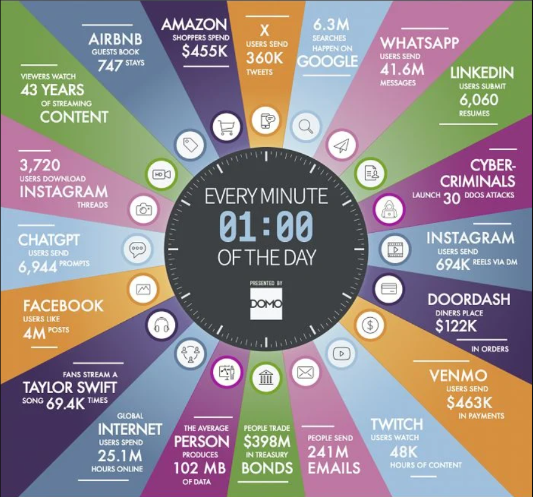{.lightbox fig-align="center" width="50%"}

::: notes
-   Hablar de los distintos tipos de Datos.
-   Todo es datos, y está lleno de ellos en Internet y el mundo.
:::

## Nace el Data Science (Ciencia de Datos)

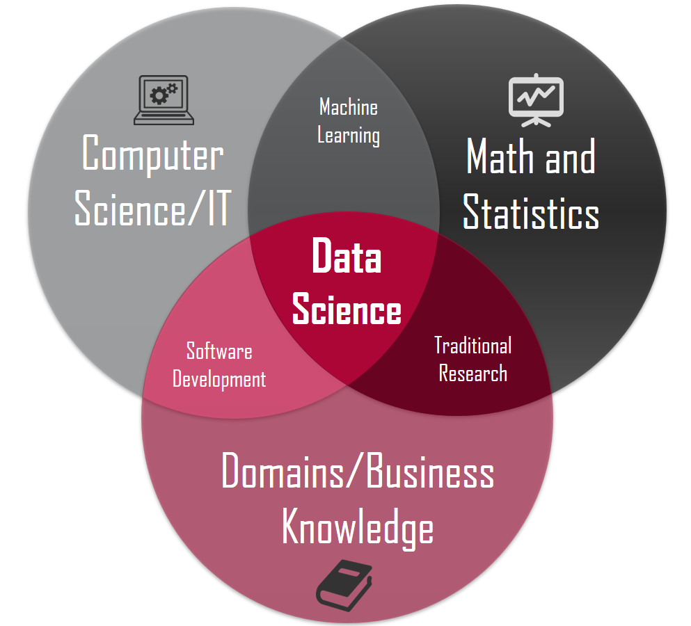{.lightbox fig-align="center" width="50%"}

::: notes
-   Explicar las distintas etapas. Qué son cada uno de ellos.
-   Explicar que no estoy de acuerdo con todas las definiciones.
:::

## ¿Cómo aprovechar la información que tenemos?

::: fragment

Data Mining (Minería de Datos)

:   "The process of identifying valid, novel, potentially useful, and ultimately understandable patterns in data." **(Fayyad, Piatetsky-Shapiro & Smith 1996)**
:::

::: fragment

Machine Learning (Aprendizaje Automático)

:   "A computer program is said to learn from experience `E` with respect to some class of tasks `T` and performance measure `P`, if its performance at tasks in `T`, as measured by `P`, improves with experience `E`." **(Mitchell, 2006)**
:::

::: notes
-   Explicar que estos son dos tipos de Approaches con el que hoy en día se enfrentan los datos.
-   El primero más enfocado en un análisis manual.
-   El segundo en un enfoque más automático.
:::

## Tipos de Datos

::: {layout="[ 40, 60 ]"}
::: {#first-column}
::: {.fragment fragment-index="1"}
### Datos Estructurados
:::
:::

::: {#second-column}
::: {.fragment fragment-index="5"}
### Datos No Estructurados
:::
:::
:::

::: {layout-ncol="6"}
::: {.fragment fragment-index="2"}

:::

::: {.fragment fragment-index="3"}

:::

::: {.fragment fragment-index="6"}

:::

::: {.fragment fragment-index="7"}

:::

::: {.fragment fragment-index="8"}

:::

::: {.fragment fragment-index="9"}

:::
:::

::: {layout="[ 40, 60 ]"}
::: {#first-column}
::: {.fragment fragment-index="4"}
{fig-align="left" width="80%"}
:::
:::

::: {#second-column}
::: {.fragment fragment-index="10"}
{fig-align="center" width="30%"}
:::
:::
:::

## Tipos de Datos: Datos Tabulares {.smaller}

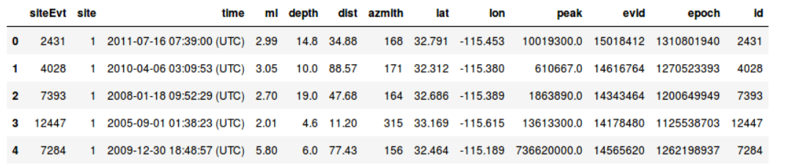{.lightbox fig-align="center"}

::: callout-tip
-   Filas: Observaciones, instancias, registros. (Normalmente independientes).
-   Columnas: Variables, Atributos, Features.
:::

::: callout-note
-   Probablemente el tipo de datos más amigable.
-   Requiere conocimiento de negocio (**Domain Knowledge**)
:::

::: callout-warning
-   Es un % bajísimo del total de datos existentes en el Mundo. También el que más disponible está en las empresas.
-   Distintos `data types`, por lo que normalmente requiere de algún tipo de **preprocesamiento**.
:::

## Tipos de Datos: Series de Tiempo {.smaller}

::: {layout-ncol="2"}
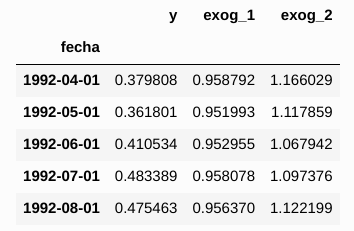{.lightbox fig-align="center" width="70%"}

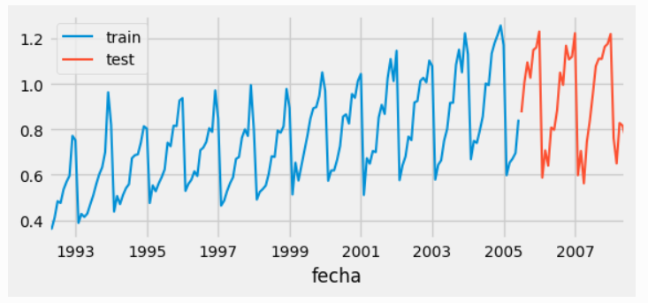{.lightbox fig-align="center" width="100%"}
:::

::: callout-tip
-   Filas: Instancias temporales (Normalmente interdependientes).
-   Columnas: Variables, Atributos, Features (Univariada o Multivariada).
:::

::: callout-warning
-   Es un % bajísimo del total de datos existentes en el Mundo.
-   Propiedad temporal requiere **preprocesamiento** y modelos especiales.
:::

## Tipos de Datos: Imágenes {.smaller}

::: columns
::: {.column width="50%"}
::: {.fragment fragment-index="1"}
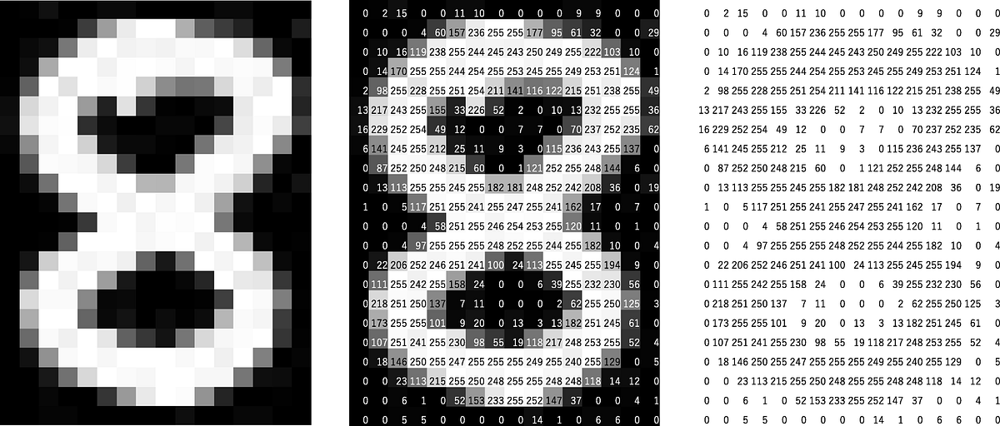{.lightbox}
:::

::: {.fragment fragment-index="3"}
::: callout-tip
-   Este es el tipo de Datos que disparó la Inteligencia Artificial.
-   [¿Cuántos computadores para identificar un Gato? 16,000](https://www.nytimes.com/2012/06/26/technology/in-a-big-network-of-computers-evidence-of-machine-learning.html)
:::
:::
:::

::: {.column width="50%"}
::: {.fragment fragment-index="2"}
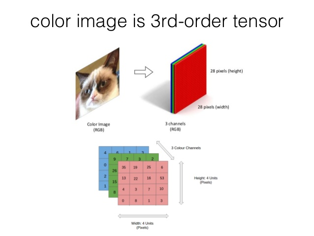{.lightbox}
:::
:::
:::

::: notes
-   Explicar el concepto de Tensor, extensión de las matrices. Diferencia entre Grayscale y RGB.
:::

## Tipos de Datos: Texto Libre {.smaller}

{.lightbox fig-align="center"}

::: callout-caution
-   Datos Masivos.
-   Dificiles de lidiar ya que deben ser llevarse a una representación numérica.
-   Alto nivel de Sesgo y Subjetividad.
:::

::: callout-tip
-   Gracias a este tipo de datos se han producido los avances más increíbles del último tiempo: [Transformers](https://arxiv.org/abs/1706.03762)
:::

## Tipos de Datos: Videos {.smaller}



::: callout-note
-   Los videos no son más que arreglos de imágenes.
-   Son un tipo de dato muy pesado y difícil de lidiar.
-   Requiere alto poder de Procesamiento.
:::


----------------------------------------------------


## EDA {.smaller}

> El `Analisis Exploratorio de Datos` (EDA, por sus siglas en inglés) es procedimiento en el cual se analiza un dataset para explorar sus características principales.

-   Su objetivo principal es poder familiarizarse con los datos además de encontrar potenciales problemas en su calidad.
-   Principalmente hace uso de técnicas de manipulación de datos y visualizaciones.

::: columns
::: column
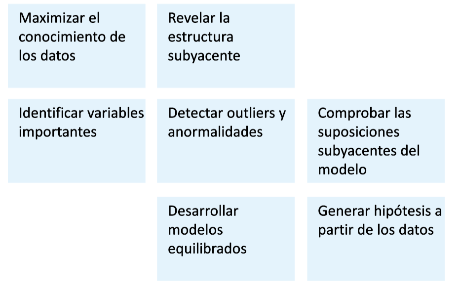{.lightbox fig-align="center" width="90%"}
:::

::: {.column .fragment}
::: callout-note
Los hallazgos importantes dentro del proceso se les denomina `insights`.
:::

::: callout-important
El uso de visualizaciones inadecuadas podría llevar a **conclusiones erróneas**.
:::

::: callout-tip
-   Summary.
-   Visualización.
:::
:::
:::


## Medidas de Tendencia Central

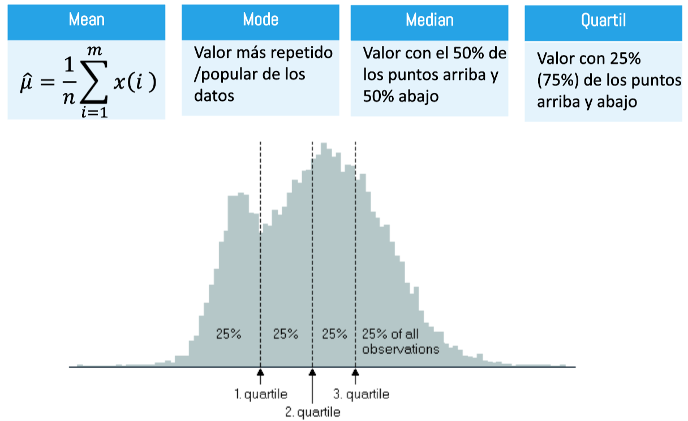{.lightbox fig-align="center" width="70%"}

## Medidas de Dispersión y Asimetría

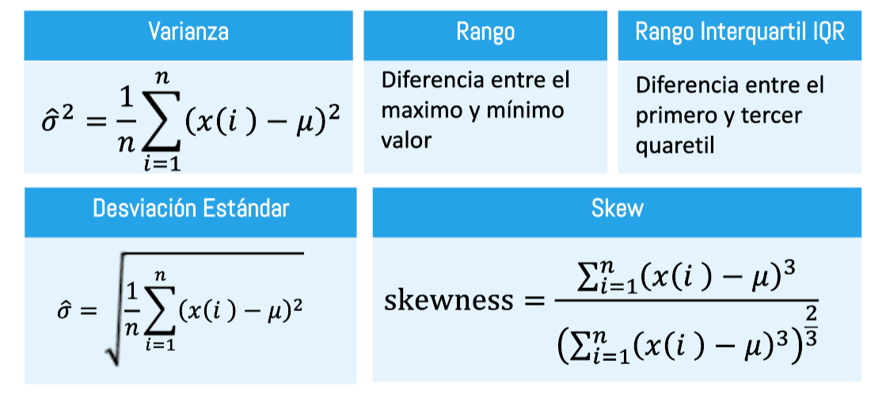{.lightbox fig-align="center" width="40%"}

::: columns
::: column
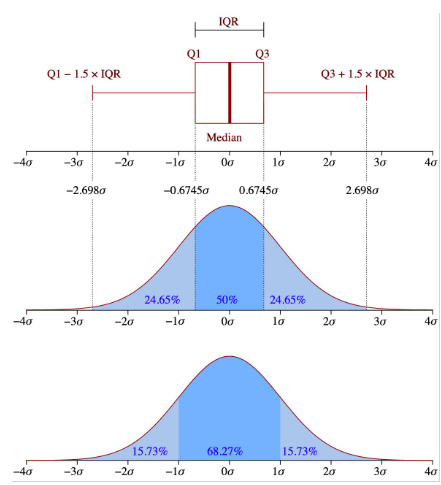{.lightbox fig-align="center" width="50%"}
:::

::: column
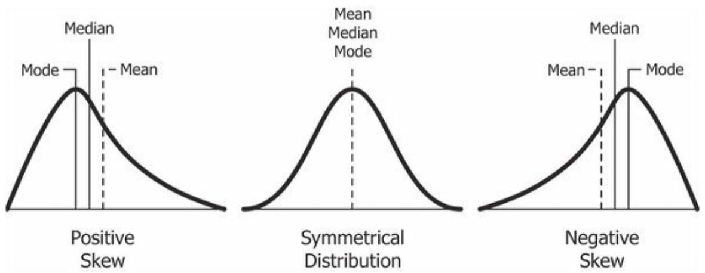{.lightbox fig-align="center" width="90%"}
:::
:::


## EDA: Visualización {.smaller}

> La visualización de datos es la presentación de datos en forma gráfica. Permite simplificar conceptos más complejos en especial a altos mandos.

> Gracias a la evolución del cerebro humano somos capaces de detectar patrones complejos en la naturaleza a partir de la `Visión`.

::: {.callout-important .fragment}
Puede ser difícil de aplicar si el tamaño de los datos es grande (sea en instancias o atributos). Por ejemplo, si los datos están en 4 dimensiones.
:::

::: {.callout-note .fragment}
-   Se suelen resumir los datos en `estadísticas simples`.
-   Graficar datos en 1D, 2D y 3D (evitar dentro de lo posible).
-   La visualización debe ser comprensible ojalá sin ninguna explicación.
:::

::: {.callout-tip .fragment}
En caso de datos de alta dimensionalidad puede ser una buena idea reducir dimensiones mediante técnicas como:

-   PCA
-   UMAP
-   etc.
:::

## Caso de Visualización

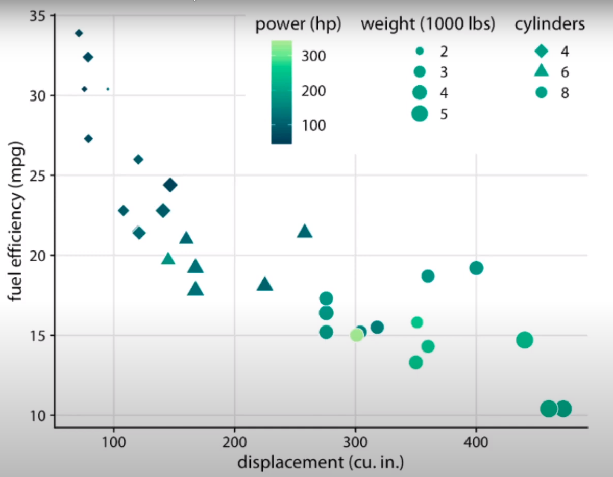{.lightbox fig-align="center" width="60%"}

::: notes
-   Figuras
-   Escala de Colores.
-   Tamaño de los puntos.
-   Demasiada información en un sólo gráfico.
-   No se entiende el mensaje.
:::

## Canales Visuales

::: columns
::: column
::: r-stack
::: {.fragment .fade-out fragment-index="2"}
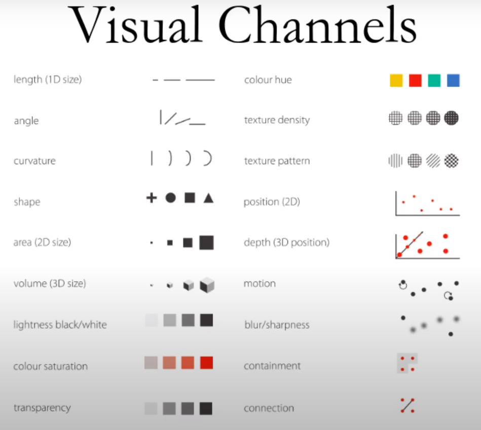{.lightbox .fragment fig-align="center" width="90%" fragment-index="1"}
:::

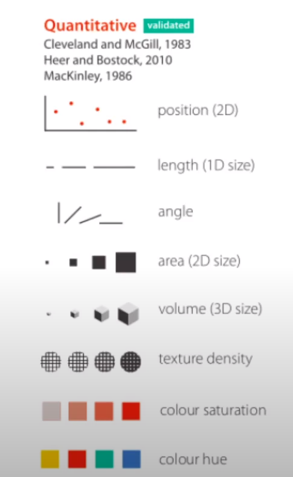{.lightbox .fragment fig-align="center" width="70%" fragment-index="2"}
:::
:::

::: {.column .fragment fragment-index="1"}
::: callout-note
-   Se les llama canales visuales a elementos visuales que pueden utilizarse para expresar información **(Clase Visualizacion Andreas Mueller)**.
-   La idea es poder mapear cada uno de estos canales a valores que queremos visualizar.
:::

::: callout-caution
-   No todos los canales son igual de útiles ni fáciles de entender.
:::
:::
:::

## Visualizaciones: Distribuciones {.smaller}

Histograma

:   El histograma permite visualizar distribuciones univariadas acumulando los datos en rangos de igual tamaño (`bins`).

-   Permite visualizar el `centro`, la `extensión`, la `asimetría` y `outliers`.

::: callout-important
-   El histograma puede ser "engañoso" para conjuntos de datos pequeños.
-   La visualización puede resultar de manera muy distintas dependiendo del número de `bins`.
:::

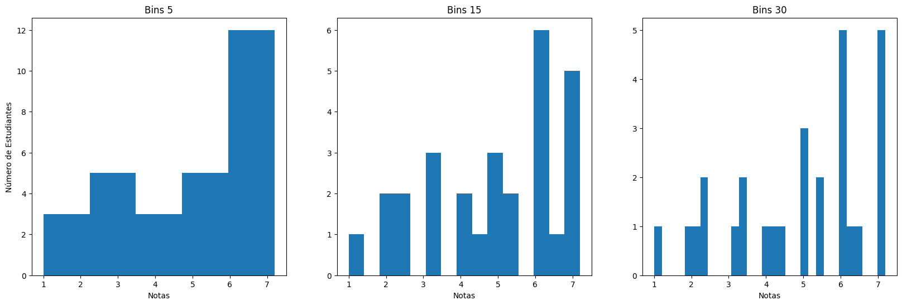{.lightbox fig-align="center" width="70%"}

## Visualizaciones: Distribuciones {.smaller}

Kernel Density

:   Corresponde a un suavizamiento de un Histograma en el cuál se usa un `Kernel` **(función no negativa que suma 1 y tiene media 0)** para agrupar los puntos vecinos.

::: columns
::: {.column width="50%"}
La función estimada es:

$$f(x) = \frac{1}{n} = \sum_{i=1}^n K \left(\frac{x - x(i)}{h}\right)$$

-   $K(u)$ es el Kernel.
-   $h$ es el ancho de banda.

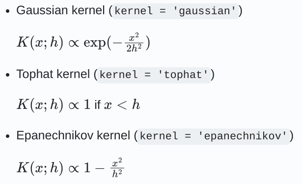{.lightbox fig-align="center" width="60%"}
:::

::: {.column width="50%"}
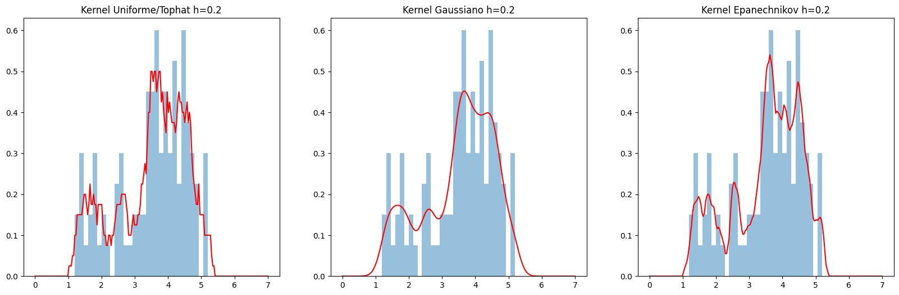{.lightbox fig-align="center" width="100%"}

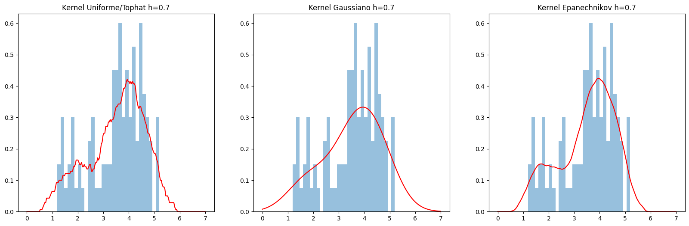{.lightbox fig-align="center" width="100%"}
:::
:::

## Visualizaciones: Distribuciones {.smaller}

Boxplot (Caja y Bigotes)

:   Es un tipo de gráfico que muestra la distribución de manera univariada.

::: columns
::: column
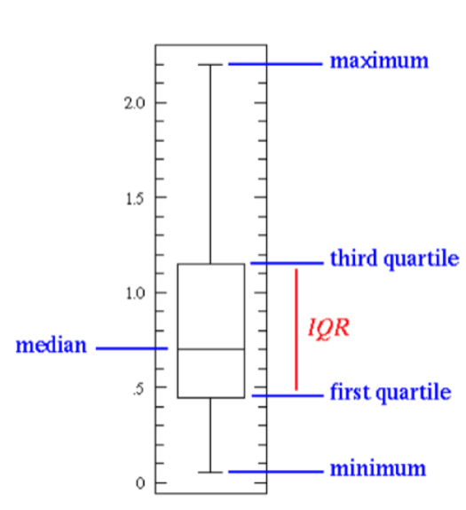{.lightbox fig-align="center" width="50%"}

::: {.callout-note style="font-size: 70%;"}
-   Tiene la capacidad de mostrar varias distribuciones a la vez.
-   Además presenta estadísticos de interés: Mediana, IQR y outliers.
-   Los puntos fuera de los bigotes son considerados Outliers.
:::

::: {.callout-tip style="font-size: 70%;"}
-   Los bigotes pueden representar:
    -   Mínimo y Máximo. (En este caso no hay outliers).
    -   $\mu \pm 3\sigma$
    -   Percentiles 5 y 95.
    -   Otros valores.
:::
:::

::: column
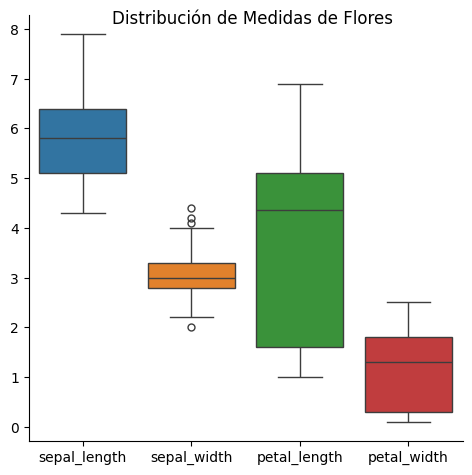{.lightbox fig-align="center"}
:::
:::

## Visualizaciones: Barras {.smaller}

Bar Plot

:   La altura de la barra (normalmente Eje y) representa una agregación asociada a una categoría (normalmente Eje x).

::: columns
::: column
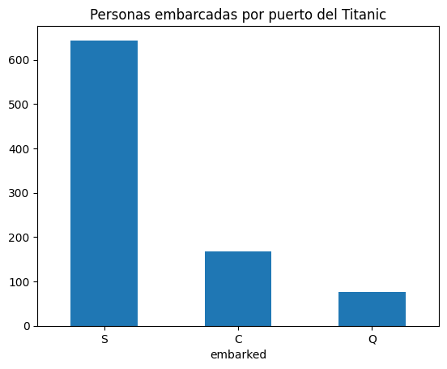{.lightbox fig-align="center" width="65%"}
:::

::: column
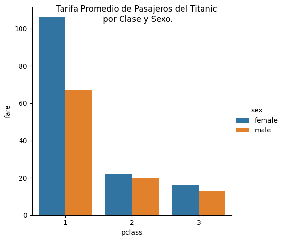{.lightbox fig-align="center" width="65%"}
:::
:::

::: {.callout-warning .fragment}
-   Otras convenciones llaman a este gráfico `Column Plot`, mientras que el `Bar Plot` tiene las barras de manera horizontal.
:::

## Visualizaciones: Puntos {.smaller}

Scatter

:   Gráfico empleado para mostrar distribución de datos bivariados

-   Muestra la relación entre una variable independiente (Eje X) y una variable dependiente (Eje Y).
-   Permite mostrar relaciones lineales o no-lineales (Correlaciones).
-   Outliers.
-   Simplemente ubicación de Puntos en el Espacio.

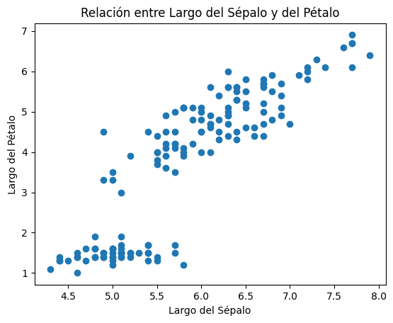{.lightbox fig-align="center" width="30%"}

## Visualizaciones: Líneas {.smaller}

Lineplot

:   Gráfico empleado para visualizar tendencias y su evolución de una medida (Eje Y) en el tiempo (Eje X).

::: columns
::: column
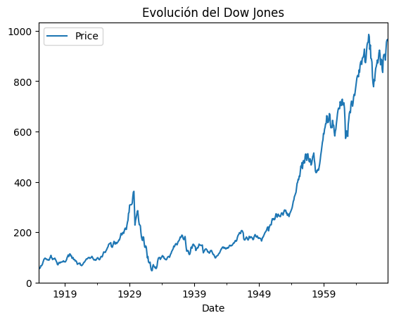{.lightbox fig-align="center" width="70%"}
:::

::: column
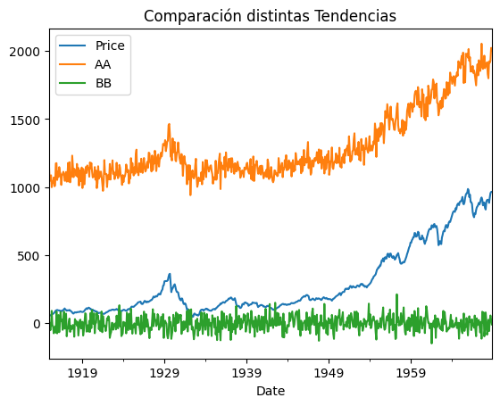{.lightbox fig-align="center" width="70%"}
:::
:::

::: {.callout-important .fragment}
-   Si bien es posible utilizarlo para gráficar dos medidas continuas, las buenas prácticas indican que el eje X siempre debería contener una componente temporal.
:::

## Estadísticos vs Visualizaciones

::: columns
::: column
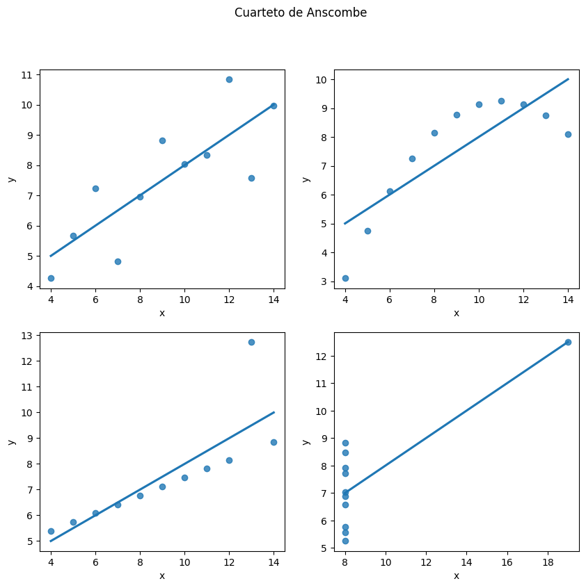{.lightbox fig-align="center" width="80%"}
:::

::: column
<br>

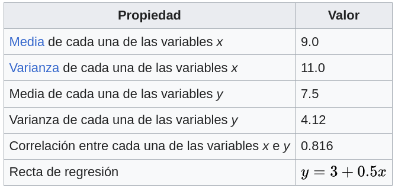{.lightbox fig-align="center" width="80%"}
:::
:::

## ¿Otras Visualizaciones?

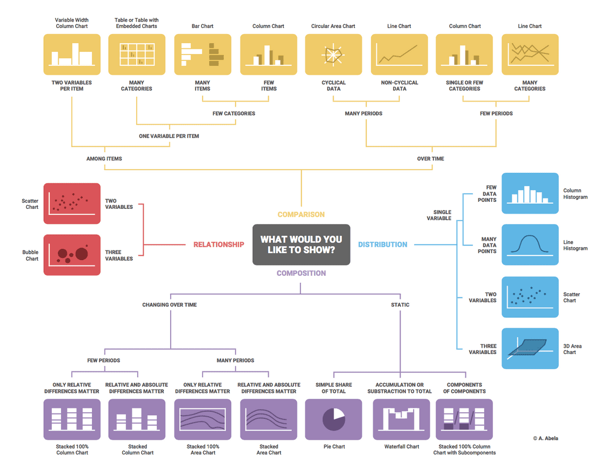{.lightbox fig-align="center" width="60%"}

## Preguntas para terminar

-   ¿Por qué usar visualizaciones? ¿Qué son los canales visuales?
-   ¿Por qué es necesario el EDA?
-   ¿Por qué es necesario utilizar tanto Estadísticos como Visualizaciones?

------------------------------------------------------------------------

## 🎉 ¡Gracias por Participar! {background-image="images/background.jpg" background-opacity="0.25"}

::: columns
::: {.column width="50%"}
<br>

❓¿Preguntas?

👏 Responder [encuesta](https://docs.google.com/forms/d/e/1FAIpQLSd2CseqhHUjdmvr46ZDb_Aa2iUYEjLAIE4MwLztled5ytRJvg/viewform?usp=dialog)

🥳 Disfrutar del Evento!
:::

::: {.column width="50%" align="center"}
{width="400"}
:::
:::

> 🔗 Nuestro Sitio Web: [sethnut.com/talks](https://sethnut.com/talks/)

```{=html}
<style>
/* Ajusta el tamaño del título y subtítulo */
.reveal .slides h1 {
  font-size: 2em; /* Tamaño más pequeño para el título */
}

.reveal .slides h2 {
  font-size: 1.5em; /* Tamaño más pequeño para el subtítulo */
}

/* Ajusta el tamaño del texto en los párrafos */
.reveal .slides p {
  font-size: 0.8em; /* Texto más pequeño */
}

/* Ajusta el tamaño de las tablas */
.reveal .slides table {
  font-size: 0.8em; /* Tamaño de fuente más pequeño en las tablas */
  width: 90%; /* Ajusta el ancho de la tabla */
  margin: 0 auto; /* Centra la tabla */
}

/* Ajusta el tamaño de los bullets */
.reveal .slides ul {
  font-size: 0.8em; /* Tamaño de fuente más pequeño en los bullets */
}

.reveal .slide-logo {
   max-height: 2em !important;
}
</style>
```