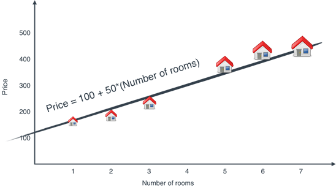
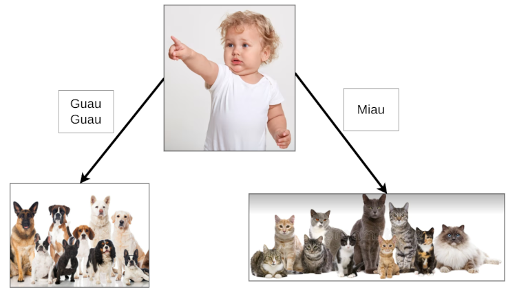
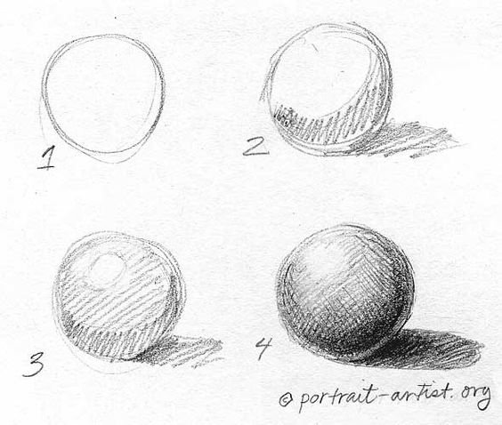
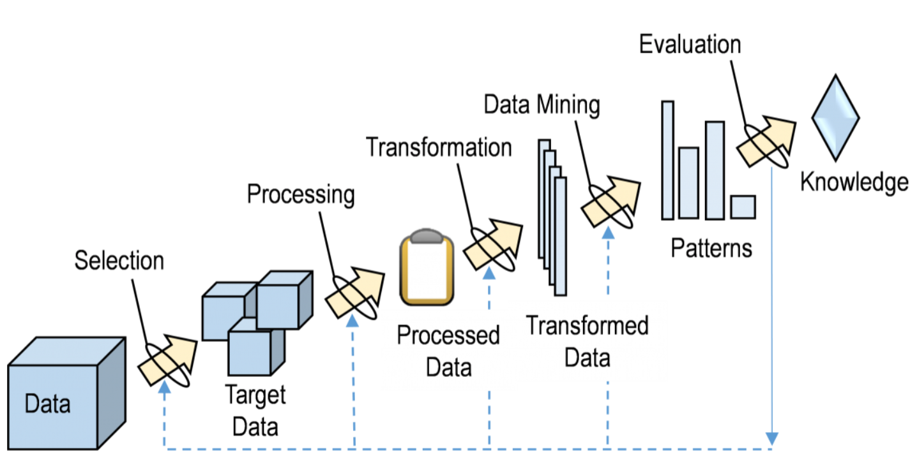
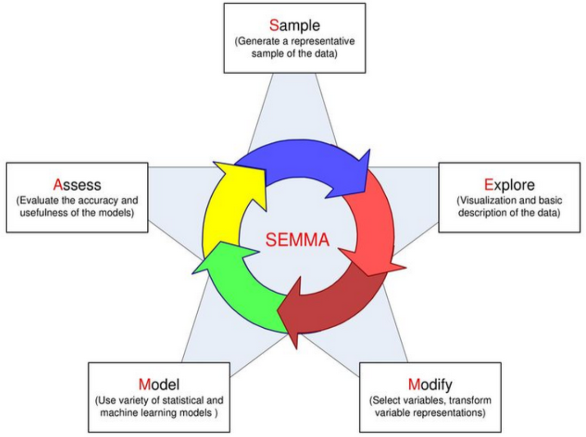
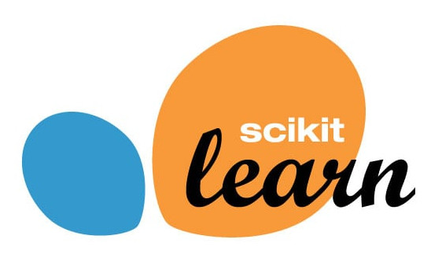
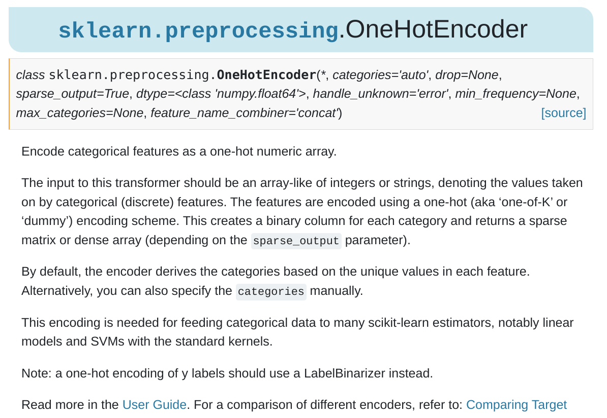

## Tipos de Aprendizaje

{.lightbox}

## Reinforcement Learning {.smaller}

::: columns
::: column
::: r-stack
{.lightbox .fragment width="50%" fig-align="center" fragment-index="1"}

{.lightbox .fragment width="50%" fig-align="center" fragment-index="2"}

{.lightbox .fragment width="50%" fig-align="center" fragment-index="3"}

{.lightbox .fragment width="50%" fig-align="center" fragment-index="4"}

{.lightbox .fragment fragment-index="5"}

{.lightbox .fragment fragment-index="6"}
:::
:::

::: column
::: {.callout-note .fragment fragment-index="1"}
En este tipo de aprendizaje se enseña por refuerzo. Es decir se da una recompensa si el sistema aprende lo que queremos.
:::

::: {.callout-tip .fragment fragment-index="2"}
Si el premio es mayor, se pueden obtener aprendizajes mayores.
:::

::: {.callout-important .fragment fragment-index="5"}
Un ejemplo de esto es **AlphaTensor** en el cual un modelo `aprendió` una nueva manera de multiplicar matrices que es más eficiente.
:::

::: {.callout-important .fragment fragment-index="6"}
Otro ejemplo es **AlphaFold** donde el modelo `aprendió/descubrió` cómo se doblan las proteínas cuando se vuelven aminoácidos.
:::
:::
:::

## Problemas Supervisados: Regresión y Clasificación {.smaller}

::: columns
::: {.column width="50%"}
{fig-align="center"}

::: {.callout-tip .fragment fragment-index="3"}
-   **Regresión**: Se busca estimar un valor continuo.
    -   `(Estimar el valor de una casa)`.
-   **Clasificación**: Se busca encontrar una categoría o un valor discreto.
    -   `(Clasificar una imagen como Perro o Gato)`.
:::

::: {.callout-important .fragment fragment-index="3"}
-   Para entrenar este tipo de modelos se necesitan `etiquetas`, es decir, la respuesta esperada del modelo.
:::
:::

::: {.column width="50%"}
{.fragment fragment-index="1" fig-align="center" width="60%"}

{.fragment fragment-index="2" fig-align="center" width="60%"}
:::
:::

::: notes
-   Ambos ejemplos se pueden realizar utilizando Largo (Eje Y) y Peso (Eje X).
:::

## Clustering {.smaller}

{.lightbox fig-align="center" width="60%"}

::: {.callout-tip .fragment}
-   **Clusters**: Una categoría en la que sus componentes son similares. Los clusters normalmente no tienen un nombre propio, sino que uno les asigna uno.
-   También se les llama segmentos. No usar la palabra `clase`.
:::

::: {.callout-caution .fragment}
-   No requiere de etiquetas, por lo tanto, no es posible evaluar su desempeño de manera 100% acertada.
:::

## Reducción de Dimensionalidad {.smaller}

{.lightbox fig-align="center" height="60%"}

::: callout-tip
-   **Reducción de la Dimensionalidad**: Eliminar complejidad sin perder información clave para poder entender su comportamiento.
:::


## Nuestro Sistema de ML {.smaller}

Creemos un Sistema de ML que sea capaz de ver una imágen y pronunciar correctamente el uso de la letra `C`.

::: callout-note
Vamos a `Entrenar` un Modelo.
:::

{.fragment .lightbox fig-align="center" width="60%"}

## Nuestro Sistema de ML: Entrenamiento {.smaller}

::: {layout-ncol="3"}
{fig-align="center" width="70%"}

{fig-align="center" width="70%"}

{fig-align="center" width="70%"}
:::

::: fragment
::: callout-important
**¿Qué patrones está aprendiendo el modelo?**
:::
:::

Entrenamiento

:   Es el proceso en el cuál se permite al modelo aprender. En este proceso se le entregan ejemplos (`Train Set`) para que el modelo de manera `autónoma` pueda aprender `patrones` que le permitan resolver la tarea dada.

## Nuestro Sistema de ML: Inferencia {.smaller}

Inferencia/Predicción

:   Se refiere al proceso en el que el modelo tiene que demostrar cuál sería su decisión de acuerdo a los patrones aprendidos en el proceso de entrenamiento. Los ejemplos en los que se prueba se le denomina `Test Set`.

::: {layout-ncol="4"}
{.fragment fig-align="center" width="50%" fragment-index="1"}

{.fragment fig-align="center" width="50%" fragment-index="3"}

{.fragment fig-align="center" width="50%" fragment-index="5"}

{.fragment fig-align="center" width="50%" fragment-index="7"}
:::

::: {layout-ncol="4"}
::: {.fragment fragment-index="2"}
`K`ollar
:::

::: {.fragment fragment-index="4"}
`K`onejo
:::

::: {.fragment fragment-index="6"}
`K`u`k`illo
:::

::: {.fragment fragment-index="8"}
Bi`k`i`k`leta
:::
:::

::: {.fragment fragment-index="11"}

Generalización

:   Se le llama generalización a la capacidad del modelo de aplicar lo aprendido de manera correcta en ejemplos no vistos.
:::

## Nuestro Sistema de ML: Nuevas instancias de Entrenamiento

::: {layout-ncol="3"}
{.fragment .fade-out fig-align="center" width="70%" fragment-index="2"}

{fig-align="center" width="70%"}

{fig-align="center" width="70%"}
:::

::: {.callout-warning .fragment fragment-index="1"}
No es bueno entrenar con las mismas instancias de de `Test`, es decir, con las cuales se evalúa el modelo. **¿Por qué?**
:::

::: notes
Mencionar el caso de error de ImageNet.
:::

## Nuestro Sistema de ML: Reevaluemos nuestro Modelo {.smaller}

::: {layout-ncol="5"}
{.fragment fig-align="center" width="50%" fragment-index="1"}

{.fragment fig-align="center" width="50%" fragment-index="3"}

{.fragment fig-align="center" width="50%" fragment-index="5"}

{.fragment fig-align="center" width="50%" fragment-index="7"}
:::

::: {layout-ncol="4"}
::: {.fragment fragment-index="2"}
`K`ollar
:::

::: {.fragment fragment-index="4"}
`K`onejo
:::

::: {.fragment fragment-index="6"}
`K`u`ch`illo
:::

::: {.fragment fragment-index="8"}
Bi`s`i`k`leta
:::
:::

::: {.fragment fragment-index="9"}

Evaluación

:   Utilizar una métrica que permita `ponerle nota` al modelo.
:::

::: {.fragment fragment-index="10"}
-   1er Modelo: 2 correctas de 4, es decir **50%**.
:::

::: {.fragment fragment-index="11"}
-   2do Modelo: 4 correctas de 4, es decir **100%**.
:::

## Problemas del Aprendizaje {.smaller}

::: {.fragment fragment-index="1"}
Supongamos que queremos utilizar nuestro modelo para pronunciar palabras en otro idioma (otro `Test Set`).

**¿Qué problemas podemos encontrar?**
:::

::: columns
::: {.column .incremental}
-   Stomach $\rightarrow$ Stoma[k]{style="color:green;"}

-   Archer $\rightarrow$ Ar[ch]{style="color:green;"}er

-   Church $\rightarrow$ [Ch]{style="color:green;"}ur`k`

    -   [Ch]{style="color:green;"}ur[ch]{style="color:green;"}.

-   Archeology $\rightarrow$ Ar`ch`eology

    -   Ar[k]{style="color:green;"}eology.

-   Chicago $\rightarrow$ `Ch`icago

    -   [Sh]{style="color:green;"}icago.

-   Muscle $\rightarrow$ Mus`k`le

    -   Mus[\_]{style="color:green;"}le.

-   Ich mag Schweinefleisch $\rightarrow$ I`ch` mag S`ch`weinefleis`k`.

    -   I[j]{style="color:green;"} mag [Sh]{style="color:green;"}vaineflai[sh]{style="color:green;"}.
:::

::: column
::: {.callout-important .fragment}
Claramente tenemos un problema. **¿A qué se debe esto?**
:::
:::
:::

## Problemas del Aprendizaje: Definiciones {.smaller}

Overfitting (Sobreajuste)

:   Se refiere a cuando un modelo no es capaz de generalizar de manera correcta, porque se ajusta `demasiado` bien (llegando a `memorizar`) a los datos de entrenamiento. **¿Cómo se puede mitigar este problema?**

::: {.callout-caution .fragment}
Se le tiende a llamar `sobreentrenamiento`, pero no es del todo correcto para el caso de modelos de Machine Learning. Lo más correcto es que el `sobreentrenamiento` provoca overfitting.
:::

::: notes
Mostrar ejemplos en Pizarra de manera gráfica. Ejemplos típicos de Excel.
:::

::: fragment

Underfitting (Subajuste)

:   Se refiere a cuando un modelo no es capaz de generalizar de manera correcta, pero a diferencia del overfitting `no se ha ajustado` correctamente a los datos. **¿Cómo se vería el underfitting en nuestro ejemplo?**
:::

## Etapas del Modelamiento: Crisp-DM

{.lightbox width="50%" fig-align="center"}

## Etapas del Modelamiento: KDD

{.lightbox width="80%" fig-align="center"}

## Etapas del Modelamiento: Semma

{.lightbox width="60%" fig-align="center"}

## Etapas del Modelamiento: Metodología Propia

{.lightbox width="50%" fig-align="center"}

## Preguntas para terminar

-   ¿Qué tipo de modelo debo implementar si quiero estimar la temperatura del día de mañana?
-   ¿Qué tipo de modelo debo implementar si es que quiero detectar barrios de acuerdo a su condición socio-economica?
-   Si mi modelo aprende a resolver ejercicios de matemática.
    -   ¿Cómo se vería el overfitting?
    -   ¿Cómo se vería el underfitting?


------------------------------------------------------------------------

## ¿Qué es Scikit-Learn? {.smaller}

::: columns
::: {.column width="30%"}

:::


::: {.column width="70%"}
-   `Scikit-Learn` (`sklearn` para los amigos) es una librería creada por David Cournapeau, como un Google Summer Code Project y luego Matthieu Brucher en su tesis.
-   En 2010 queda a cargo de [INRIA](https://www.inria.cl/es) y tiene un ciclo de actualización de 3 meses.
-   Es la librería más famosa y poderosa para hacer Machine Learning hoy en día.
-   Su API es tan famosa, que hoy se sabe que una librería es de `calidad` si sigue los estándares implementados por `Scikit-Learn`.
-   Para que un algoritmo sea parte de `Scikit-Learn` debe poseer 3 años desde su publicación y 200+ citaciones mostrando su utilidad y amplio uso (ver [acá](https://scikit-learn.org/stable/faq.html#new-algorithms-inclusion-criteria)).
-   Además es una librería que obliga a que sus algoritmos tengan la capacidad de generalizar.
:::
:::

## Diseño {.smaller}

-   `Scikit-Learn` sigue un patrón de `Programación Orientada a Objetos (POO)` basado en clases.

::: callout-note
-   En programación, una clase es un objeto que internamente contiene estados que pueden ir cambiando en el tiempo.
    -   Una clase posee:
        -   **Métodos**: Funciones que cambian el comportamiento de la clase.
        -   **Atributos**: Datos propios de la clase.
:::

::: {.incremental style="font-size: 90%;"}
`Scikit-Learn` sigue el siguiente estándar:

-   Todas las Clases se escriben en `CamelCase`: Ej: `KMeans`,`LogisticRegression`, `StandardScaler`.
-   Las clases en Scikit-Learn pueden representar algoritmos, o etapas de un preprocesamiento.
    -   Los algoritmos se denominan `Estimators`.
    -   Los preprocesamientos se denominan `Transformers`.
-   Las funciones se escriben como `snake_case` y permiten realizar algunas operaciones básicas en el proceso de modelamiento. Ej: `train_test_split()`, `cross_val_score()`.
-   Normalmente se utilizan letras mayúsculas para denotar `Matrices` o `DataFrames`, mientras que las letras minúsculas denotan `Vectores` o `Series`.
:::

## Estimadores No supervisados

``` {.python code-line-numbers="|1|2|3|5|7-8|"}
from sklearn.sub_modulo import Estimator 
model = Estimator(hp1=v1, hp2=v2,...) 
model.fit(X) 

y_pred = model.predict(X) 

## Opcionalmente se puede entrenar y predecir a la vez.
model.fit_predict(X) 
```

<br>

::: {style="font-size: 75%;"}
L1. Importar la clase a utilizar.

L2. `Instanciar` el modelo y sus `hiperparámetros`.

L3. `Entrenar` o ajustar el modelo (Requiere sólo de X).

L5. `Predecir`. Los modelos de clasificación tienen la capacidad de generar probabilidades.

L7-8. Este tipo de modelos permite entrenar y predecir en un sólo paso.
:::

## Estimadores Predictivos

``` {.python code-line-numbers="|1|2|3|5-6|8|"}
from sklearn.sub_modulo import Estimator 
model = Estimator(hp1=v1, hp2=v2,...) 
model.fit(X_train, y_train) 

y_pred = model.predict(X_test) 
y_pred_proba = model.predict_proba(X_test)

model.score(X_test,y_test) 
```

<br>

::: {style="font-size: 75%;"}
L1. Importar la clase a utilizar.

L2. `Instanciar` el modelo y sus `hiperparámetros`.

L3. `Entrenar` o ajustar el modelo (Ojo, requiere de `X` e `y`).

L5--6. `Predecir` en datos nuevos. (Algunos modelos pueden predecir probabilidades).

L8. `Evaluar` el modelo en los datos nuevos.
:::

## Output de un Modelo {.smaller}

-   Los modelos no entregan directamente un output sino que los dejan almacenados en su interior como un estado.
-   Los Estimators tienen dos estados:
    -   **Not Fitted**: Modelo antes de ser entrenado
    -   **Fitted**: Una vez que el modelo ya está entrenado. (Después de aplicar `.fit()`)

::: {.callout-tip .fragment}
Muchos modelos pueden entregar información sólo luego de ser entrenados (su atributo termina con un `_`).

Ej: `model.coef_`, `model.intercept_`.
:::

::: {.callout-note .fragment}
El modelo es una herramienta a la cual le entregamos datos (Input), y nos devuelve datos (Predicciones).
:::

## Transformers

::: {.callout-note style="font-size: 70%;"}
-   A diferencia de los `Estimators`, los `Transformers` no son modelos.
-   Su input y su output son datos.
-   Algunos `Transformers` permiten escalar los datos, transformar categorías en números, rellenar valores faltantes. (Veremos más acerca de esto en los `Preprocesamiento`).
:::

::: fragment
``` {.python code-line-numbers="|1|2|3|5|7-8|"}
from sklearn.preprocessing import Transformer 
tr = Transformer(hp1=v1, hp2=v2,...) 
tr.fit(X) 

X_new = tr.transform(X) 

## Opcionalmente
X_new = tr.fit_transform(X) 
```

::: {style="font-size: 65%;"}
L1. Importar la clase a utilizar (en este caso del submodulo `preprocessing`, aunque pueden haber otros como `impute`).

L2. `Instanciar` el Transformer y sus `hiperparámetros`.

L3. `Entrenar` o ajustar el Transformer.

L5. `Transformar` los datos.

L7-8. Adicionalmente se puede `entrenar` y `transformar` los datos en un sólo paso.
:::
:::

## Pipelines {.smaller}

-   En ocasiones un Dataset requiere más de un preprocesamiento.
-   Estas Transformaciones normalmente se hacen en serie de manera consecutiva.

{.lightbox fig-align="center"}

::: callout-tip
-   El Estimator es opcional, es decir, el Pipeline puede ser para combinar sólo `Transformers` o `Transformers + un Estimator`.
:::

::: callout-caution
Un Pipeline puede tener **sólo un Estimator**.
:::

## Pipelines: Código

``` {.python code-line-numbers="|1-2|3|5-9|11|12|14|"}
from sklearn.tree import DecisionTreeClassifier 
from sklearn.preprocessing import StandardScaler, OneHotEncoder 
from sklearn.pipeline import Pipeline 

pipe = Pipeline(steps=[ 
    ("ohe", OneHotEncoder()),
    ("sc", StandardScaler()),
    ("model", DecisionTreeClassifier())
])

pipe.fit(X_train, y_train) 
y_pred = pipe.predict(X_test) 

pipe.score(X_test, y_test) 
```

::: {style="font-size: 50%;"}
L1-2. Importo mi modelo y mis preprocesamientos

L3. Importo el `Pipeline`.

L5-9. Instancio un `Pipeline`.

L11. Entreno el `Pipeline`.

L12. Predigo utilizando el `Pipeline` entrenado.

L14. Evalúo el modelo en datos no vistos.
:::

## Documentación

> Probablemente `Scikit-Learn` tenga una de las mejores documentaciones existentes.

-   Veamos el caso de la Documentación del [One Hot Encoder](https://scikit-learn.org/stable/modules/generated/sklearn.preprocessing.OneHotEncoder.html#sklearn.preprocessing.OneHotEncoder)

{.lightbox fig-align="center"}

## Preguntas para terminar

-   ¿Cómo se importan las clases en Scikit-Learn?
-   ¿Cuál es la diferencia entre un Transformer y un Estimator?
-   ¿Cuándo es buena idea usar un Pipeline?


------------------------------------------------------------------------

## 🎉 ¡Gracias por Participar! {background-image="images/background.jpg" background-opacity="0.25"}

::: columns
::: {.column width="50%"}
<br>

❓¿Preguntas?

👏 Responder [encuesta](https://docs.google.com/forms/d/e/1FAIpQLSd2CseqhHUjdmvr46ZDb_Aa2iUYEjLAIE4MwLztled5ytRJvg/viewform?usp=dialog)

🥳 Disfrutar del Evento!
:::

::: {.column width="50%" align="center"}
{width="400"}
:::
:::

> 🔗 Nuestro Sitio Web: [sethnut.com/talks](https://sethnut.com/talks/)

```{=html}
<style>
/* Ajusta el tamaño del título y subtítulo */
.reveal .slides h1 {
  font-size: 2em; /* Tamaño más pequeño para el título */
}

.reveal .slides h2 {
  font-size: 1.5em; /* Tamaño más pequeño para el subtítulo */
}

/* Ajusta el tamaño del texto en los párrafos */
.reveal .slides p {
  font-size: 0.8em; /* Texto más pequeño */
}

/* Ajusta el tamaño de las tablas */
.reveal .slides table {
  font-size: 0.8em; /* Tamaño de fuente más pequeño en las tablas */
  width: 90%; /* Ajusta el ancho de la tabla */
  margin: 0 auto; /* Centra la tabla */
}

/* Ajusta el tamaño de los bullets */
.reveal .slides ul {
  font-size: 0.8em; /* Tamaño de fuente más pequeño en los bullets */
}

.reveal .slide-logo {
   max-height: 2em !important;
}
</style>
```